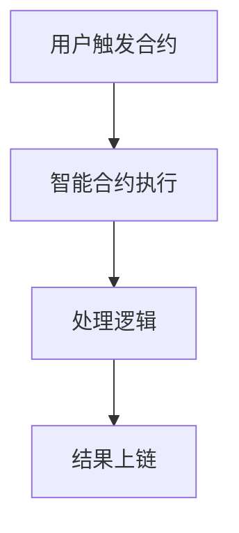
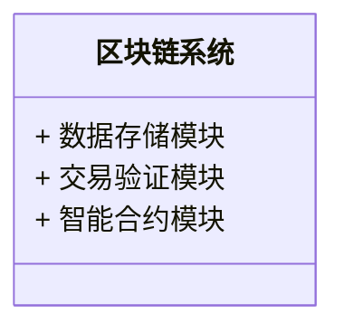
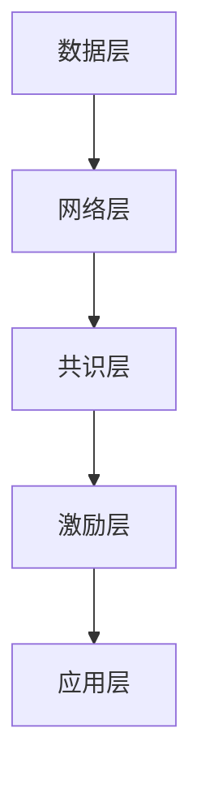

                 


# 巴菲特-芒格看区块链：技术创新与投资机会

---

## 关键词：
- 巴菲特
- 芒格
- 区块链
- 投资机会
- 技术创新
- 价值投资
- 共识机制

---

## 摘要：
本文从巴菲特和芒格的投资哲学出发，结合区块链的技术特点，深入分析区块链行业的投资机会与技术挑战。通过解析区块链的核心技术原理、经济模型和应用场景，探讨巴菲特和芒格的长期价值投资理念在区块链领域的适用性，并结合实际案例，为投资者提供科学的投资策略和风险管理建议。

---

## 第一部分：区块链的核心技术与经济模型

### 第1章：区块链的技术原理

#### 1.1 去中心化与分布式账本
区块链的核心技术之一是去中心化。通过分布式账本技术，数据不再依赖于中心化的机构进行存储和管理，而是通过多个节点共同维护。这种去中心化的设计使得数据更加安全，避免了单点故障的风险。

$$\text{去中心化特点：}$$
- 去除中心化机构的依赖
- 数据由多个节点共同维护
- 每个节点都有完整的账本副本

#### 1.2 共识机制（PoW、PoS等）
共识机制是区块链技术的核心之一。通过共识机制，网络中的节点能够达成一致，确认区块的生成和交易的有效性。

- **工作量证明（PoW）**：通过计算哈希值来确认工作量，确保每个新区块的生成需要消耗计算资源。
- **权益证明（PoS）**：通过持有代币的数量和时间来决定节点的权重，减少能源消耗。

$$\text{共识机制的比较：}$$

| 共识机制 | 特点 | 优缺点 |
|----------|------|--------|
| PoW     | 需要大量计算资源 | 安全性高，但能源消耗大 |
| PoS     | 基于代币持有量 | 能源消耗低，但存在“富者越富”的风险 |

#### 1.3 智能合约的实现原理
智能合约是区块链上的自动化程序，能够自动执行合同条款。通过区块链的去中心化特性，智能合约可以实现信任的自动化。

$$\text{智能合约的工作流程：}$$
1. 用户触发智能合约的执行。
2. 智能合约根据预设的逻辑进行处理。
3. 处理结果被记录在区块链上，并通知相关方。

---

### 第2章：区块链的经济模型

#### 2.1 通证经济的基本原理
通证经济是区块链的重要组成部分。通过代币（Token）的发行和流通，区块链能够实现价值的转移和分配。

- **代币的分类**：
  - **实用型代币（UT）**：用于特定场景下的支付和结算。
  - **证券型代币（ST）**：代表某种资产的所有权。
  - **治理型代币（Governance Token）**：用于区块链社区的治理。

#### 2.2 通证的发行与流通机制
通证的发行通常采用Initial Coin Offering（ICO）的方式，类似于首次公开发行（IPO）。通证的流通则通过区块链上的交易实现。

$$\text{ICO与IPO的比较：}$$

| 方面 | ICO | IPO |
|------|-----|-----|
| 发行主体 | 创业公司或项目方 | 传统企业 |
| 融资方式 | 发行代币 | 发行股票 |
| 监管力度 | 较低 | 较高 |

#### 2.3 区块链的激励机制设计
激励机制是区块链经济模型的核心。通过激励机制，可以吸引更多的参与者加入区块链网络，提升网络的安全性和性能。

- **激励机制的主要形式**：
  - 块奖励
  - 交易手续费
  - 治理激励

$$\text{激励机制的作用：}$$
- 增加网络参与者的积极性。
- 提升网络的安全性。
- 促进区块链生态的健康发展。

---

## 第二部分：巴菲特与芒格视角下的区块链投资机会

### 第3章：区块链行业的投资逻辑

#### 3.1 区块链行业的市场规模分析
区块链技术的应用范围广泛，包括金融、供应链、医疗等多个领域。随着技术的不断成熟，区块链行业的市场规模将快速增长。

$$\text{区块链市场规模预测：}$$
- 2023年：全球区块链市场规模约为$500亿美元。
- 2025年：预计达到$1,000亿美元。

#### 3.2 区块链企业的竞争优势分析
在区块链行业，企业的竞争优势主要体现在技术创新、应用场景和生态建设三个方面。

- **技术创新**：区块链企业的技术实力决定了其在市场中的地位。
- **应用场景**：能够找到实际应用场景的企业更具竞争优势。
- **生态建设**：构建完善的生态体系可以提升企业的竞争力。

#### 3.3 区块链行业的长期发展趋势
区块链技术的未来发展将朝着以下几个方向推进：
1. **技术融合**：区块链与人工智能、大数据等技术的结合。
2. **行业应用**：区块链技术在金融、供应链等领域的深度应用。
3. **监管完善**：各国政府对区块链行业的监管政策逐步完善。

---

### 第4章：巴菲特与芒格的区块链投资策略

#### 4.1 巴菲特的长期价值投资策略在区块链中的应用
巴菲特的价值投资理念强调长期投资和企业基本面分析。在区块链投资中，投资者需要关注企业的核心技术、市场前景和团队能力。

$$\text{巴菲特的投资原则：}$$
1. **买入并持有**：长期持有优质资产。
2. **注重基本面**：分析企业的财务状况和市场地位。
3. **避免短期波动**：关注长期价值而非短期价格波动。

#### 4.2 芒格的多元思维模型在区块链投资中的应用
芒格的多元思维模型强调跨学科的思考方式。在区块链投资中，投资者需要结合技术、经济、法律等多个领域的知识。

$$\text{芒格的思考框架：}$$
1. **跨学科分析**：综合运用多个领域的知识。
2. **逆向思维**：从反方向思考问题。
3. **避免认知偏差**：保持客观和理性的判断。

#### 4.3 区块链投资中的风险控制策略
区块链投资风险较高，投资者需要采取有效的风险控制策略。

- **分散投资**：避免将所有资金投入到单一项目中。
- **风险评估**：对投资项目进行充分的风险评估。
- **持续学习**：保持对区块链技术的持续学习和更新。

---

## 第三部分：区块链技术的数学模型与算法原理

### 第5章：区块链共识机制的数学模型

#### 5.1 工作量证明机制（PoW）
工作量证明机制通过计算哈希值来确认新区块的生成。

$$\text{哈希函数的数学模型：}$$
$$ H(x) = \text{hash}(x) $$

其中，$H(x)$表示输入$x$的哈希值。

#### 5.2 权益证明机制（PoS）
权益证明机制通过持有代币的数量和时间来决定节点的权重。

$$\text{节点权重计算公式：}$$
$$ \text{权重} = \text{代币数量} \times \text{持有时间} $$

---

### 第6章：智能合约的算法原理

#### 6.1 智能合约的执行流程
智能合约的执行流程包括以下几个步骤：
1. 用户触发智能合约的执行。
2. 智能合约根据预设的逻辑进行处理。
3. 处理结果被记录在区块链上。

$$\text{智能合约的执行流程图：}$$


---

## 第四部分：系统分析与架构设计方案

### 第7章：区块链系统的架构设计

#### 7.1 问题场景介绍
区块链系统需要解决的问题包括数据的安全性、交易的可追溯性以及系统的去中心化。

#### 7.2 系统功能设计
区块链系统的功能设计包括以下几个方面：
1. 数据存储与管理。
2. 交易验证与确认。
3. 智能合约的执行与管理。

$$\text{系统功能模块图：}$$


#### 7.3 系统架构设计
区块链系统的架构设计通常采用分层架构，包括数据层、网络层、共识层、激励层和应用层。

$$\text{系统架构图：}$$


---

## 第五部分：项目实战与投资策略

### 第8章：区块链项目实战

#### 8.1 环境安装
区块链开发需要安装以下环境：
1. **区块链开发框架**：如Ethereum、Hyperledger等。
2. **智能合约开发工具**：如Solidity、Web3.js等。

#### 8.2 核心实现源代码
以下是比特币核心代码的示例：

```python
def main():
    import sys
    from bitcoinrpc import BitcoinRpc

    rpc = BitcoinRpc()
    while True:
        command = input("请输入命令：")
        if command == 'exit':
            break
        try:
            rpc.process_command(command)
        except Exception as e:
            print(f"错误：{e}")

if __name__ == "__main__":
    main()
```

#### 8.3 实际案例分析
以比特币为例，分析其代码结构和运行机制。

$$\text{比特币核心代码结构：}$$
1. **主程序**：负责接收用户输入并调用相关函数。
2. **RPC接口**：提供远程过程调用功能，用于与其他节点通信。
3. **区块链数据结构**：包括区块头、交易列表等。

---

## 第六部分：总结与展望

### 第9章：区块链的未来发展趋势

#### 9.1 区块链技术的未来发展方向
1. **技术融合**：区块链与人工智能、大数据等技术的结合。
2. **行业应用**：区块链技术在金融、供应链等领域的深度应用。
3. **监管完善**：各国政府对区块链行业的监管政策逐步完善。

#### 9.2 巴菲特与芒格投资理念的长期价值
巴菲特和芒格的价值投资理念在区块链领域依然具有重要的指导意义。投资者需要关注企业的核心技术、市场前景和团队能力，避免短期波动，注重长期价值。

---

## 作者：
**AI天才研究院/AI Genius Institute**  
**禅与计算机程序设计艺术/Zen And The Art of Computer Programming**

