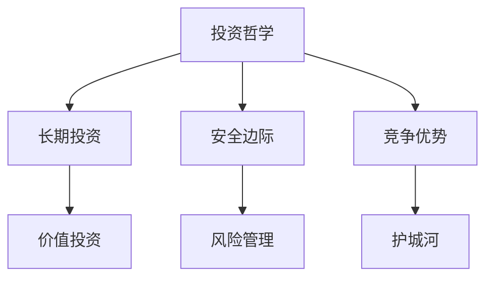
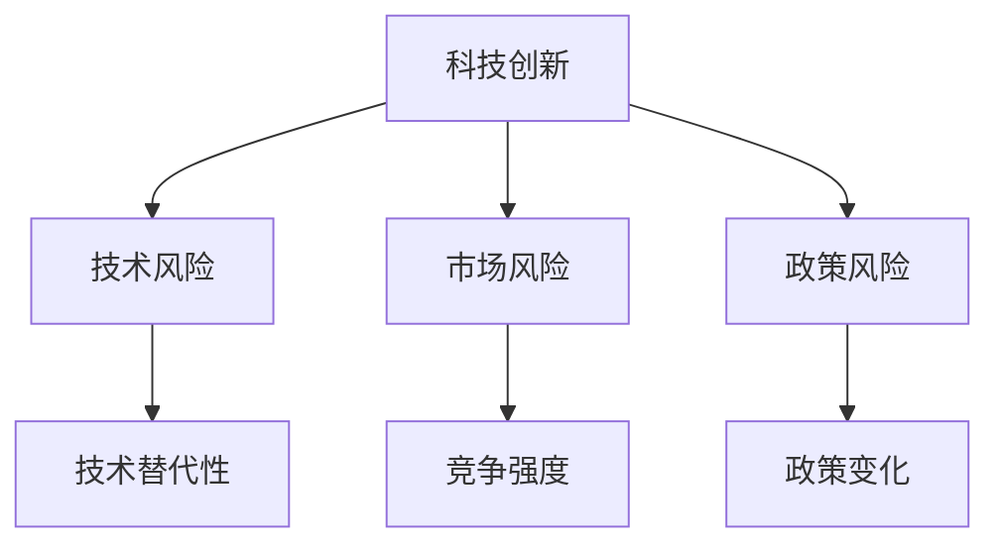
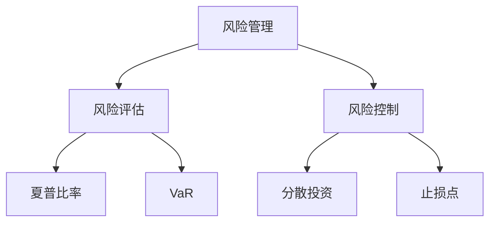

                 

# 巴菲特-芒格看待科技创新：机遇与风险的平衡

> **关键词**：巴菲特，芒格，科技创新，投资哲学，风险管理，机遇与风险平衡

> **摘要**：本文探讨了巴菲特和芒格在面对科技创新时的投资策略，分析了他们如何平衡机遇与风险。文章从投资哲学、科技创新的机遇与风险、风险管理策略、实际案例分析以及系统化的投资框架等方面展开，结合实际案例和数学模型，详细阐述了巴菲特和芒格的智慧在科技投资中的应用。

---

## 第1章：巴菲特与芒格的投资哲学

### 1.1 背景介绍

#### 1.1.1 巴菲特的投资理念与风格
巴菲特是价值投资的代表人物，他强调以合理的价格投资于具有持续竞争优势的公司。他注重公司的财务状况、管理层素质以及长期盈利能力。

#### 1.1.2 芒格的多元思维模型
芒格以其多元思维模型闻名，他主张将各个学科的基本原理整合起来，以形成全面的决策框架。他认为，只有通过跨学科的思考，才能避免单一思维的局限性。

#### 1.1.3 两人合作的黄金搭档关系
巴菲特和芒格的合作被誉为投资界的黄金搭档。巴菲特负责投资决策，而芒格则提供理性和系统的分析支持。

### 1.2 核心概念与联系

#### 1.2.1 投资哲学的核心要素
- **长期投资**：巴菲特和芒格都主张长期投资，避免短期波动的干扰。
- **安全边际**：芒格强调在投资中留有安全边际，即以低于内在价值的价格买入资产。
- **竞争优势**：巴菲特关注公司的竞争优势，认为只有具备护城河的公司才能长期盈利。

#### 1.2.2 投资哲学的联系
- **安全边际与竞争优势**：安全边际是竞争优势的保障，只有具备竞争优势的公司才能在长期中保持盈利能力。
- **多元思维模型的应用**：芒格的多元思维模型帮助巴菲特更好地识别公司的竞争优势和潜在风险。

### 1.3 核心概念的数学模型

#### 1.3.1 安全边际的计算
$$ \text{安全边际} = \text{内在价值} - \text{市场价格} $$

#### 1.3.2 竞争优势的评估
$$ \text{竞争优势} = \frac{\text{净收益}}{\text{净资产}} \times \text{资产周转率} $$

### 1.4 系统架构设计

#### 1.4.1 投资哲学的系统架构

---

## 第2章：科技创新的机遇与风险分析

### 2.1 科技创新的机遇

#### 2.1.1 数字技术与互联网的发展
数字技术的快速发展为投资带来了巨大的机遇。例如，互联网公司如亚马逊和谷歌在巴菲特和芒格的投资组合中占据了重要位置。

#### 2.1.2 人工智能与大数据的应用
人工智能和大数据的应用改变了多个行业的商业模式。例如，亚马逊通过大数据分析优化供应链，创造了巨大的价值。

#### 2.1.3 新能源与绿色科技的崛起
新能源技术的发展，如特斯拉的电动汽车，代表了未来的趋势，吸引了巴菲特和芒格的关注。

### 2.2 科技创新的风险

#### 2.2.1 技术过时的风险
科技公司的技术可能迅速过时，导致投资损失。例如，柯达在胶片技术领域的优势被数码技术取代。

#### 2.2.2 市场竞争的加剧
科技行业的竞争极其激烈，新进入者的威胁使得现有企业的利润率难以维持。

#### 2.2.3 政策监管的变化
科技公司的运营受到严格的政策监管，政策的变化可能对公司的业务产生重大影响。

### 2.3 科技创新的数学模型

#### 2.3.1 技术风险评估
$$ \text{技术风险} = \frac{\text{研发投入}}{\text{公司规模}} \times \text{技术替代性} $$

#### 2.3.2 市场风险评估
$$ \text{市场风险} = \text{市场份额} \times \text{竞争强度} $$

### 2.4 系统架构设计

#### 2.4.1 科技创新的风险管理架构

---

## 第3章：风险管理策略

### 3.1 风险管理的核心概念

#### 3.1.1 分散投资
分散投资是降低风险的重要策略。通过投资于不同行业的公司，可以减少单一投资的风险。

#### 3.1.2 风险评估指标
- **波动率**：衡量资产价格的波动程度。
- **夏普比率**：衡量资产在承担风险的前提下获得超额收益的能力。

#### 3.1.3 风险控制措施
- **设定止损点**：在投资出现亏损时及时止损。
- **定期评估投资组合**：根据市场变化调整投资策略。

### 3.2 风险管理的数学模型

#### 3.2.1 夏普比率
$$ \text{夏普比率} = \frac{\text{超额收益}}{\text{收益的标准差}} $$

#### 3.2.2 风险价值（VaR）
$$ \text{VaR} = \text{损失的金额} $$

### 3.3 系统架构设计

#### 3.3.1 风险管理的系统架构

---

## 第4章：实际案例分析

### 4.1 苹果公司的投资分析

#### 4.1.1 投资背景
苹果公司作为全球市值最高的公司之一，凭借其强大的品牌和技术优势吸引了巴菲特和芒格的关注。

#### 4.1.2 投资决策
巴菲特和芒格认为苹果公司具备强大的竞争优势，且管理层优秀，因此决定投资。

#### 4.1.3 投资结果
苹果公司的股价长期上涨，证明了巴菲特和芒格的投资决策是正确的。

### 4.2 亚马逊的投资分析

#### 4.2.1 投资背景
亚马逊作为全球最大的电商平台，凭借其强大的技术和物流体系吸引了巴菲特和芒格的投资。

#### 4.2.2 投资决策
巴菲特和芒格认为亚马逊具备强大的竞争优势，且管理层优秀，因此决定投资。

#### 4.2.3 投资结果
亚马逊的股价长期上涨，证明了巴菲特和芒格的投资决策是正确的。

### 4.3 数学模型的应用

#### 4.3.1 投资组合优化
$$ \text{投资组合优化} = \argmin_w \left( \sigma^2(w) \right) \text{ subject to } w^T \mu = \text{目标收益} $$

---

## 第5章：系统化的投资框架

### 5.1 长期投资策略

#### 5.1.1 长期投资的核心理念
长期投资的核心理念是通过时间的积累，获得复利效应，从而实现财富的增值。

#### 5.1.2 长期投资的风险控制
通过分散投资和定期评估，降低长期投资的风险。

### 5.2 创新思维的结合

#### 5.2.1 创新思维的重要性
创新思维帮助投资者发现新的投资机会，避免盲目跟风。

#### 5.2.2 创新思维的应用
通过芒格的多元思维模型，投资者可以更好地识别科技创新带来的投资机会。

### 5.3 数学模型的应用

#### 5.3.1 投资组合优化
$$ \text{投资组合优化} = \argmin_w \left( \sigma^2(w) \right) \text{ subject to } w^T \mu = \text{目标收益} $$

---

## 结论

巴菲特和芒格的智慧在科技创新投资中得到了充分体现。他们通过长期投资、安全边际和竞争优势等原则，成功地平衡了科技创新带来的机遇与风险。未来，随着科技的不断进步，巴菲特和芒格的投资哲学将继续指导投资者在科技创新中找到平衡点。

---

**作者：AI天才研究院/AI Genius Institute & 禅与计算机程序设计艺术 /Zen And The Art of Computer Programming**

