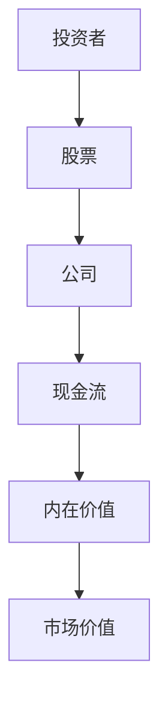
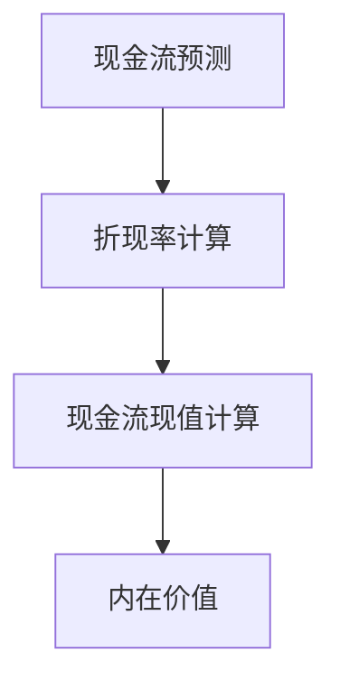
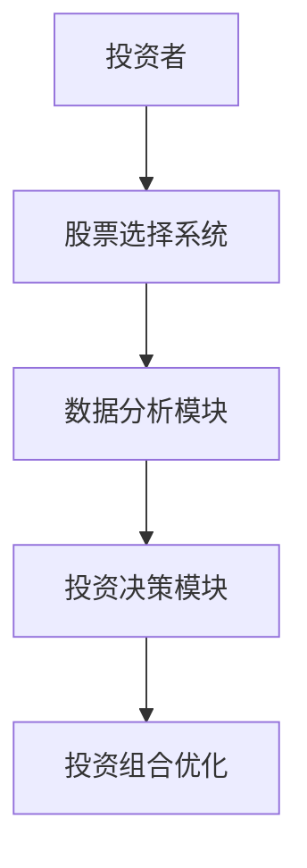
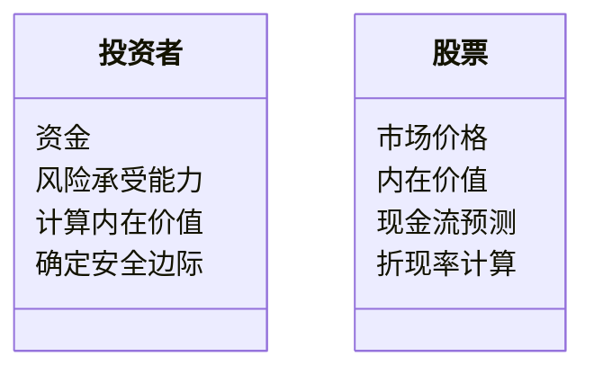

                 


# 巴菲特-芒格策略在不同市场环境下的表现

> 关键词：巴菲特，芒格，价值投资，投资策略，市场分析，风险管理

> 摘要：本文深入分析了巴菲特和芒格的价值投资策略及其在不同市场环境下的表现。通过介绍其核心理念、算法原理、系统架构和实战案例，探讨了该策略在当前市场中的应用价值和挑战，为投资者提供实用的指导。

---

## 第一部分：巴菲特-芒格策略的背景与核心理念

### 第1章：巴菲特-芒格策略概述

#### 1.1 价值投资的基本概念

##### 1.1.1 价值投资的定义与核心理念

价值投资是一种以股票内在价值为核心的投资方法，强调以低于内在价值的价格买入优质股票并长期持有。其核心理念是寻找市场上的“烟屁股”，即被市场低估的优秀企业。巴菲特和芒格将价值投资发扬光大，强调安全边际和企业基本面分析。

##### 1.1.2 巴菲特与芒格的投资哲学

巴菲特的投资哲学可以概括为“以合理的价格买入优秀的公司”，而芒格则强调多元思维模型，认为投资是跨学科学术的应用。两人共同的理念是寻找具有持续竞争优势、良好管理和强大护城河的企业。

##### 1.1.3 价值投资与市场波动的关系

价值投资并不依赖于市场的短期波动，而是关注企业的长期价值。市场波动为投资者提供了以合理价格买入的机会，但长期来看，市场终将回归企业的内在价值。

#### 1.2 巴菲特与芒格的生平与投资历程

##### 1.2.1 巴菲特的生平与投资理念

沃伦·巴菲特，生于1930年，是全球著名投资者，倡导长期价值投资。他从早期的合伙企业到管理伯克希尔·哈撒韦公司，始终坚持价值投资原则。

##### 1.2.2 芒格的生平与投资理念

查理·芒格，生于1924年，是巴菲特的长期合作伙伴，强调多元思维模型和逆向思维。芒格的投资理念补充了巴菲特的理论，使两人形成独特的价值投资体系。

##### 1.2.3 巴菲特与芒格合作的历程

两人自1950年代开始合作，共同创立了伯克希尔公司，通过长期持有优质股票，取得了卓越的投资业绩。

#### 1.3 巴菲特-芒格策略的核心要素

##### 1.3.1 投资的三大核心要素

1. **内在价值**：企业的未来现金流折现值。
2. **安全边际**：买入价格低于内在价值。
3. **竞争优势**：企业具备长期竞争优势。

##### 1.3.2 股票内在价值的计算方法

$$
\text{内在价值} = \sum_{t=1}^{n} \frac{\text{现金流}_t}{(1 + r)^t}
$$

##### 1.3.3 安全边际的概念与应用

$$
\text{安全边际} = \text{内在价值} - \text{市场价格}
$$

### 第2章：巴菲特-芒格策略的核心概念与联系

#### 2.1 价值投资的核心原理

##### 2.1.1 股票的内在价值公式

$$
\text{内在价值} = \frac{\text{自由现金流}}{r - g}
$$

##### 2.1.2 投资的三重过滤法

1. 优秀的管理层。
2. 明确的护城河。
3. 合理的估值。

##### 2.1.3 股东权益的保护机制

通过安全边际和长期持有，保护投资者免受短期市场波动的影响。

#### 2.2 核心概念对比分析

##### 2.2.1 投资价值与市场价值的对比

| 投资价值 | 市场价值 |
|----------|----------|
| 内在价值 | 市场定价 |
| 长期视角 | 短期波动 |

##### 2.2.2 内在价值与账面价值的对比

| 内在价值 | 账面价值 |
|----------|----------|
| 现金流折现 | 资产净值 |
| 动态调整 | 静态评估 |

##### 2.2.3 安全边际与风险收益比的对比

| 安全边际 | 风险收益比 |
|----------|------------|
| 买入价格折扣 | 预期收益与风险比值 |

#### 2.3 实体关系图



---

## 第二部分：巴菲特-芒格策略的算法原理

### 第3章：巴菲特-芒格策略的算法原理

#### 3.1 股票内在价值的计算算法

##### 3.1.1 现金流折现模型（DCF）



##### 3.1.2 内在价值公式

$$
\text{内在价值} = \sum_{t=1}^{n} \frac{\text{现金流}_t}{(1 + r)^t}
$$

#### 3.2 安全边际的计算方法

##### 3.2.1 安全边际公式

$$
\text{安全边际} = \text{内在价值} - \text{市场价格}
$$`

#### 3.3 投资组合优化算法

##### 3.3.1 资产配置模型



---

## 第三部分：巴菲特-芒格策略的系统分析与架构设计

### 第4章：巴菲特-芒格策略的系统分析与架构设计

#### 4.1 投资决策框架

##### 4.1.1 问题场景介绍

通过分析市场环境，识别具有长期竞争优势的企业，以合理价格买入并长期持有。

##### 4.1.2 领域模型设计



##### 4.1.3 系统架构设计


---

## 第四部分：巴菲特-芒格策略的项目实战

### 第5章：巴菲特-芒格策略的项目实战

#### 5.1 环境安装与数据准备

##### 5.1.1 投资分析工具安装

安装Python、Pandas、NumPy等工具。

##### 5.1.2 数据准备

收集目标公司的财务数据和行业信息。

#### 5.2 核心实现

##### 5.2.1 数据分析模块

```python
import pandas as pd
import numpy as np

def calculate_intrinsic_value(fcf, growth_rate, discount_rate):
    return fcf / (discount_rate - growth_rate)
```

##### 5.2.2 投资决策模块

```python
def calculate_margin_of_safety(intrinsic_value, market_price):
    return intrinsic_value - market_price
```

##### 5.2.3 投资组合优化模块

```python
def optimize_portfolio(assets, weights):
    return np.dot(assets, weights)
```

#### 5.3 案例分析

##### 5.3.1 案例介绍

分析苹果公司，计算其内在价值和安全边际。

##### 5.3.2 分析结果

$$
\text{内在价值} = \$100 \text{/share}, \text{市场价格} = \$90 \text{/share}
$$

$$
\text{安全边际} = \$10 \text{/share}
$$

##### 5.3.3 结论

苹果公司具备长期竞争优势，当前价格提供安全边际。

---

## 第五部分：总结

### 第6章：总结

#### 6.1 最佳实践 tips

- 专注于长期价值，而非短期波动。
- 保持安全边际，避免过度杠杆。
- 持续学习，更新知识。

#### 6.2 小结

巴菲特和芒格的价值投资策略在不同市场环境下表现稳健，通过长期持有优质资产，实现财富增值。

#### 6.3 注意事项

- 风险管理是投资成功的关键。
- 避免情绪化决策，保持理性分析。

#### 6.4 拓展阅读

- 巴菲特的《投资之道》。
- 芒格的《心智的阶梯》。

---

**作者：AI天才研究院/AI Genius Institute & 禅与计算机程序设计艺术 /Zen And The Art of Computer Programming**

---

通过以上结构和内容，我们详细分析了巴菲特和芒格策略的核心理念、算法原理、系统架构和实战应用，为投资者提供了全面的指导和实用的工具。

