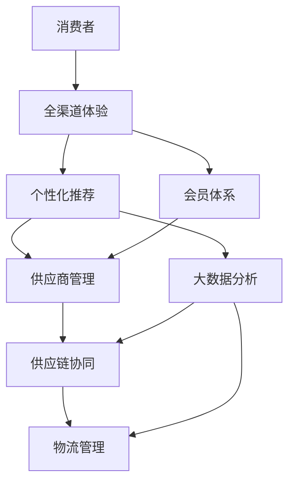

                 


# 巴菲特如何看待新零售模式的投资机会

> 关键词：巴菲特、新零售模式、投资机会、价值投资、护城河、竞争优势

> 摘要：本文从巴菲特的投资哲学出发，分析新零售模式的核心要素、竞争优势和投资机会。通过结合巴菲特的“护城河”理论和新零售模式的技术驱动，探讨新零售模式的投资价值和潜在风险。文章结合实际案例和系统架构，为投资者提供深度分析和投资建议。

---

## 第一部分：新零售模式的背景与概述

### 第1章：新零售模式的定义与特点

#### 1.1 新零售的定义与核心要素

- **1.1.1 新零售的定义与发展背景**
  - 新零售（New Retail）是指通过大数据、人工智能、物联网等技术驱动，实现线上线下深度融合，以提升消费者体验、优化供应链效率为目标的零售模式。
  - 发展背景：消费升级、技术进步和市场竞争驱动新零售模式的兴起。

- **1.1.2 新零售的核心要素与特征**
  - **技术驱动**：大数据、人工智能、物联网等技术的应用。
  - **体验优化**：全渠道整合、个性化服务、无缝体验。
  - **供应链协同**：高效物流、库存管理、供应商协作。

- **1.1.3 新零售与传统零售的区别**
  - **消费者体验**：从单一渠道到全渠道。
  - **供应链效率**：从分散到协同。
  - **技术应用**：从传统到数字化。

#### 1.2 巴菲特的投资理念概述

- **1.2.1 巴菲特的投资哲学**
  - **价值投资**：寻找具有长期竞争优势的企业。
  - **安全边际**：以低于内在价值的价格买入。
  - **长期视角**：关注企业的长期增长潜力。

- **1.2.2 巴菲特的“护城河”概念**
  - **竞争优势**：企业通过成本优势、技术壁垒、品牌影响力等建立的竞争优势。
  - **护城河的类型**：成本优势、网络效应、品牌忠诚度等。

- **1.2.3 巴菲特对市场的长期视角**
  - 避免短期波动，关注企业的长期价值。
  - 寻找具有持续竞争优势的企业。

#### 1.3 新零售模式的投资价值

- **1.3.1 新零售模式的市场潜力**
  - 随着消费者需求的升级，新零售模式具备较大的市场空间。
  - 技术驱动的创新为新零售模式提供了增长动力。

- **1.3.2 新零售模式对消费者价值的提升**
  - 提供个性化服务。
  - 提升消费体验。
  - 实现高效购物。

- **1.3.3 新零售模式对企业的竞争优势**
  - 技术驱动的效率提升。
  - 用户体验的持续优化。
  - 供应链的协同效应。

---

## 第二部分：新零售模式的核心分析框架

### 第2章：新零售模式的核心要素与分析方法

#### 2.1 新零售模式的核心要素

- **2.1.1 技术驱动：大数据、人工智能与物联网**
  - 大数据：精准分析消费者行为。
  - 人工智能：优化供应链和用户体验。
  - 物联网：实现智能化库存管理。

- **2.1.2 体验优化：线上线下融合与全渠道整合**
  - 全渠道整合：实现线上线下的无缝衔接。
  - 个性化服务：基于消费者行为数据提供定制化服务。
  - 无缝体验：从购物到配送的全程优化。

- **2.1.3 供应链优化：高效物流与库存管理**
  - 高效物流：实现快速配送。
  - 库存管理：通过数据驱动实现精准库存控制。

#### 2.2 巴菲特分析框架的核心要素

- **2.2.1 企业基本面分析**
  - 收入来源：企业的主要收入来源。
  - 盈利能力：净利率、毛利率等指标。
  - 财务健康状况：资产负债表、现金流量表等。

- **2.2.2 财务指标分析**
  - 市盈率：股价与每股收益的比率。
  - 市净率：股价与每股净资产的比率。
  - 股东权益回报率（ROE）：衡量企业盈利能力的指标。

- **2.2.3 竞争优势分析**
  - 成本优势：企业是否具备成本优势。
  - 技术壁垒：企业是否具备技术专利或壁垒。
  - 市场占有率：企业是否具备领先的市场份额。

#### 2.3 新零售模式的核心竞争力

- **2.3.1 技术驱动的效率提升**
  - 通过大数据和人工智能优化供应链和用户体验。
  - 利用物联网技术实现智能化库存管理。

- **2.3.2 用户体验的持续优化**
  - 提供个性化服务。
  - 实现线上线下融合的无缝体验。
  - 提升消费者满意度和忠诚度。

- **2.3.3 供应链的协同效应**
  - 高效物流：实现快速配送。
  - 精准库存管理：降低库存成本。
  - 供应商协作：实现供应链协同。

---

## 第三部分：新零售模式的投资机会与风险

### 第3章：新零售模式的投资机会分析

#### 3.1 新零售模式的市场潜力

- **3.1.1 消费升级趋势下的新零售机会**
  - 消费者需求从价格导向向品质导向转变。
  - 新零售模式能够满足消费者对个性化和高品质的需求。

- **3.1.2 技术驱动的新零售创新**
  - 大数据和人工智能的应用推动新零售模式的创新。
  - 物联网技术的应用实现智能化管理。

- **3.1.3 新零售模式的全球化潜力**
  - 新零售模式可以在全球范围内推广。
  - 具备技术优势的企业可以在全球市场中占据竞争优势。

#### 3.2 巴菲特视角下的新零售投资机会

- **3.2.1 长期结构性机会**
  - 新零售模式具备长期增长潜力。
  - 具备技术优势和竞争优势的企业具备投资价值。

- **3.2.2 具备“护城河”的企业**
  - 技术壁垒：具备自主研发能力和技术专利。
  - 市场占有率：具备领先的市场份额。
  - 品牌影响力：具备强大的品牌影响力。

- **3.2.3 新零售模式下的企业竞争优势**
  - 技术驱动的效率提升。
  - 用户体验的持续优化。
  - 供应链的协同效应。

#### 3.3 新零售模式的投资风险

- **3.3.1 市场竞争风险**
  - 新零售模式的竞争日益激烈。
  - 技术和模式的快速变化可能导致竞争优势丧失。

- **3.3.2 技术风险**
  - 技术创新的不确定性和失败风险。
  - 技术落后可能导致竞争优势丧失。

- **3.3.3 经济周期风险**
  - 经济波动可能影响新零售模式的市场需求。
  - 经济衰退可能导致消费者需求下降。

---

## 第四部分：新零售模式的系统架构与投资策略

### 第4章：新零售模式的系统架构分析

#### 4.1 新零售模式的系统架构

- **4.1.1 用户端：全渠道体验**
  - 线上渠道：PC端、移动端、小程序等。
  - 线下渠道：实体店、体验店等。
  - 用户体验：个性化推荐、会员体系、积分系统等。

- **4.1.2 企业端：供应链协同**
  - 供应商管理：供应商信息管理、供应商评估、供应商协作。
  - 库存管理：库存监控、库存调拨、库存预警。
  - 物流管理：物流规划、物流跟踪、物流优化。

- **4.1.3 技术端：大数据与人工智能**
  - 数据采集：消费者行为数据、供应链数据、物流数据。
  - 数据分析：消费者行为分析、供应链优化、预测性分析。
  - 人工智能应用：智能推荐、智能客服、智能物流。

#### 4.2 巴菲特视角下的系统架构

- **4.2.1 企业基本面分析**
  - 企业的收入来源和盈利模式。
  - 企业的财务健康状况和盈利能力。
  - 企业的竞争优势和市场地位。

- **4.2.2 财务指标分析**
  - 企业的市盈率、市净率、ROE等指标。
  - 企业的现金流状况和资产负债表。
  - 企业的成长性和可持续性。

- **4.2.3 竞争优势的可持续性**
  - 企业的技术壁垒和创新能力。
  - 企业的市场占有率和品牌影响力。
  - 企业的供应链协同和成本优势。

#### 4.3 新零售模式的系统架构图



---

## 第五部分：新零售模式的项目实战与案例分析

### 第5章：新零售模式的项目实战

#### 5.1 环境安装与技术选型

- **5.1.1 环境安装**
  - 操作系统：Windows 10 或更高版本，macOS 10.15 或更高版本。
  - 开发工具：PyCharm、VS Code、Jupyter Notebook。
  - 数据库：MySQL、PostgreSQL、MongoDB。
  - 人工智能框架：TensorFlow、PyTorch、Scikit-learn。

- **5.1.2 技术选型**
  - 前端框架：React、Vue.js、Angular。
  - 后端框架：Django、Flask、Spring Boot。
  - 大数据分析：Python、Pandas、NumPy。
  - 人工智能模型：监督学习、无监督学习、深度学习。

#### 5.2 系统核心实现源代码

```python
import pandas as pd
from sklearn.cluster import KMeans
from sklearn.preprocessing import StandardScaler

# 数据加载
data = pd.read_csv('consumer_behavior.csv')

# 数据预处理
scaler = StandardScaler()
scaled_data = scaler.fit_transform(data)

# K均值聚类
kmeans = KMeans(n_clusters=3, random_state=42)
kmeans.fit(scaled_data)

# 可视化
import matplotlib.pyplot as plt
plt.scatter(scaled_data[:, 0], scaled_data[:, 1], c=kmeans.labels_)
plt.xlabel('Feature 1')
plt.ylabel('Feature 2')
plt.show()
```

#### 5.3 代码应用解读与分析

- **代码功能**：上述代码实现了一个基于K均值聚类的消费者行为分析。
- **数据预处理**：使用StandardScaler对数据进行标准化处理。
- **聚类分析**：使用K均值算法将消费者行为数据分为3个簇。
- **可视化**：通过散点图展示聚类结果。

#### 5.4 实际案例分析

- **案例背景**：某新零售企业希望通过数据分析优化其供应链管理。
- **数据采集**：收集消费者行为数据、供应链数据和物流数据。
- **数据分析**：使用聚类分析识别消费者群体，优化供应链管理。
- **结果展示**：通过可视化展示数据分析结果。

#### 5.5 项目小结

- **项目总结**：通过技术手段实现新零售模式的优化。
- **经验总结**：数据驱动的决策能够显著提升企业效率。
- **未来展望**：新零售模式将继续推动技术与业务的深度融合。

---

## 第六部分：新零售模式的结论与展望

### 第6章：新零售模式的结论与展望

#### 6.1 结论

- 新零售模式具备较大的市场潜力和投资价值。
- 巴菲特的“护城河”理论为新零售模式的投资提供了重要的指导意义。
- 技术驱动和用户体验优化是新零售模式的核心竞争力。

#### 6.2 展望

- 随着技术的不断进步，新零售模式将继续推动零售行业的变革。
- 具备技术优势和竞争优势的企业将在新零售模式中占据重要地位。
- 投资者应关注新零售模式的长期结构性机会，避免短期波动的影响。

---

## 作者信息

作者：AI天才研究院/AI Genius Institute & 禅与计算机程序设计艺术 /Zen And The Art of Computer Programming

---

**注**：由于篇幅限制，本文仅为大纲和部分内容展示，完整文章可按照上述结构和内容扩展完成。

