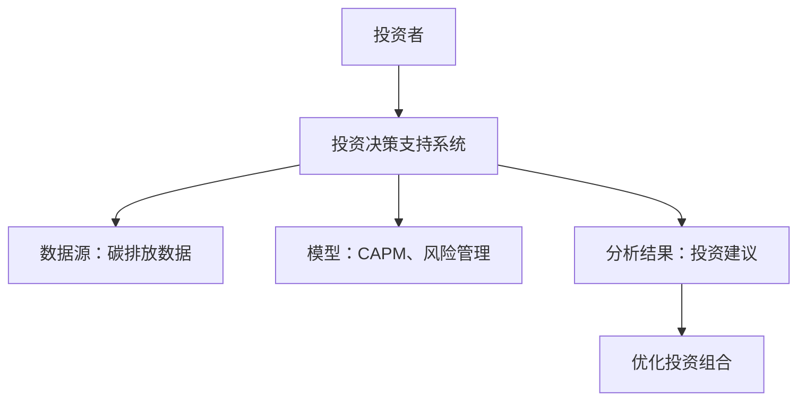

                 


# 巴菲特如何看待气候变化对投资的影响

---

## 关键词：
气候变化、投资影响、巴菲特、价值投资、风险管理

---

## 摘要：
气候变化作为全球性挑战，对经济和投资产生了深远影响。本文将从巴菲特的投资理念出发，探讨气候变化如何影响投资决策，并分析巴菲特如何在气候变化的背景下调整投资策略。文章结合技术视角，详细阐述气候变化对行业和金融市场的影响，以及投资者应采取的风险管理策略。

---

## 正文：

### 第一部分：气候变化的背景与影响

#### 第1章：气候变化的定义与现状

##### 1.1 气候变化的定义与现状

气候变化是指地球气候系统长期的变化，主要由人类活动（如化石燃料的使用、森林砍伐等）引起的温室气体排放增加所致。当前，气候变化的表现包括全球变暖、极端天气事件频发、海平面上升等。

气候变化对全球经济的影响是多方面的：
- **经济损失**：农业、能源、基础设施等行业受到直接影响。
- **市场不确定性**：政策变化（如碳税）和技术创新（如可再生能源）增加了市场的不确定性。
- **投资风险**：高碳行业的资产可能面临贬值风险。

##### 1.2 投资与气候变化的关联

投资与气候变化密切相关。投资者需要考虑气候变化带来的机会和风险：
- **机会**：可再生能源、绿色技术等领域投资潜力巨大。
- **风险**：传统化石能源行业可能面临政策风险和市场需求下降。

#### 第2章：巴菲特的投资理念

##### 2.1 巴菲特的投资策略

巴菲特是价值投资的代表人物，其核心理念包括：
1. **长期投资**：关注企业的长期价值，而非短期市场波动。
2. **安全边际**：买入价格低于内在价值的资产。
3. **优质企业**：投资于具有强大竞争优势的企业。

##### 2.2 巴菲特对气候变化的看法

巴菲特曾多次公开表示，气候变化是“真实存在的威胁”。他认为，气候变化将对企业盈利能力和资产价值产生重大影响。例如，2022年，他呼吁企业关注气候变化的长期影响，并强调“绿色能源是未来”。

---

### 第二部分：气候变化对投资的具体影响

#### 第3章：气候变化对行业的影响

##### 3.1 石油与能源行业

气候变化对能源行业的影响尤为显著：
- **化石能源行业的风险**：随着可再生能源的崛起，传统石油和煤炭企业的利润可能下降。
- **可再生能源的机会**：太阳能、风能等绿色能源的投资需求大增。

##### 3.2 制造业与建筑业

制造业和建筑业的碳排放问题：
- **碳中和目标**：企业需要减少碳排放，这可能增加成本，但也可能带来技术创新和投资机会。
- **绿色建筑**：环保建筑材料和节能技术的投资需求上升。

#### 第4章：气候变化对金融市场的冲击

##### 4.1 金融市场面临的挑战

气候变化可能引发金融市场的系统性风险：
- **资产重估**：高碳资产可能面临价值贬损。
- **政策风险**：碳税等政策可能影响企业利润。

##### 4.2 投资者如何应对

投资者需要采取以下策略：
- **多元化投资**：分散投资于传统行业和绿色产业。
- **长期视角**：关注企业的可持续发展能力。

---

### 第三部分：技术视角下的气候变化与投资

#### 第5章：投资模型与风险管理

##### 5.1 投资模型

使用CAPM（资本资产定价模型）分析气候变化对投资的影响：
$$
E_r = r_f + β(E_m - r_f)
$$
其中，$β$是资产的系统性风险系数。对于高碳企业，$β$可能较高，导致资本成本上升。

##### 5.2 风险管理模型

构建风险管理模型，评估气候变化对投资组合的影响：
1. 识别高碳资产的风险。
2. 评估政策和市场变化对企业的影响。
3. 调整投资组合以降低风险。

#### 第6章：系统架构设计

##### 6.1 系统功能设计

设计一个投资决策支持系统：
- **数据收集**：收集企业的碳排放数据和政策信息。
- **风险评估**：使用模型评估气候变化对投资的影响。
- **投资建议**：生成优化的投资组合建议。

##### 6.2 系统架构图



---

### 第四部分：项目实战

#### 第7章：实际案例分析

##### 7.1 巴菲特如何应对气候变化

以巴菲特的投资组合为例：
- **传统行业**：减少对高碳行业的投资。
- **绿色能源**：增加对可再生能源企业的关注。

##### 7.2 投资组合优化

假设当前投资组合中包含高碳资产，如何调整：
1. 减少化石能源企业的持股。
2. 增加可再生能源企业的投资。

#### 第8章：代码实现

##### 8.1 数据处理

```python
import pandas as pd

# 假设我们有一个包含企业碳排放和财务数据的DataFrame
df = pd.read_csv('data.csv')

# 计算每家企业的碳排放强度（单位收入的碳排放）
df['carbon_intensity'] = df['CO2排放'] / df['收入']
```

##### 8.2 投资组合优化

使用Python优化投资组合：
```python
import numpy as np
from scipy.optimize import minimize

# 定义优化函数：最小化投资组合的碳风险
def portfolio_risk(weights, covariance_matrix):
    return np.dot(weights.T, np.dot(covariance_matrix, weights))

# 约束条件：权重之和为1
constraints = [{'type': 'eq', 'fun': lambda w: np.sum(w) - 1}]

# 初始权重：均等分配
initial_weights = np.array([1/len(covariance_matrix)] * len(covariance_matrix))

# 优化
result = minimize(portfolio_risk, initial_weights, args=(covariance_matrix,), constraints=constraints)
```

---

### 第五部分：最佳实践与总结

#### 第9章：总结与建议

##### 9.1 关键点回顾

- 气候变化对投资的影响是多方面的。
- 巴菲特的投资理念强调长期价值和风险管理。
- 投资者应关注绿色产业，同时降低高碳资产的风险。

##### 9.2 注意事项

- 投资者需持续关注政策变化和技术创新。
- 风险管理是投资组合优化的核心。

##### 9.3 拓展阅读

- 巴菲特股东大会关于气候变化的讨论。
- 相关书籍：《投资的悖论》。

---

### 作者

作者：AI天才研究院（AI Genius Institute） & 禅与计算机程序设计艺术（Zen And The Art of Computer Programming）

--- 

以上是《巴菲特如何看待气候变化对投资的影响》的技术博客文章。

