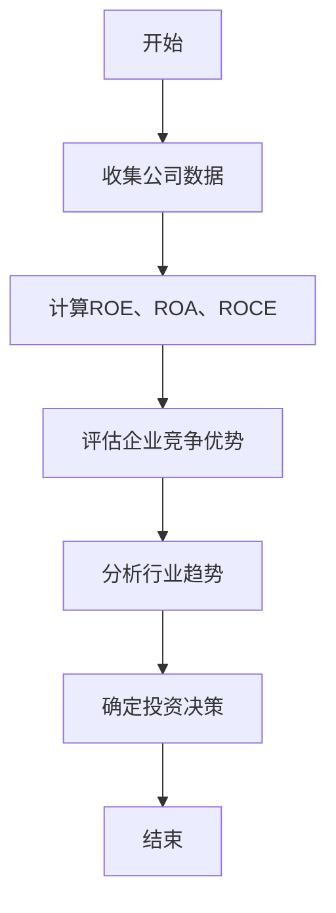
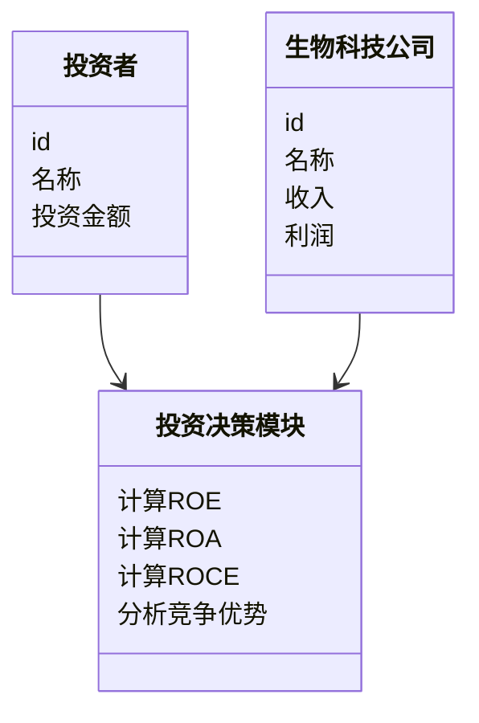
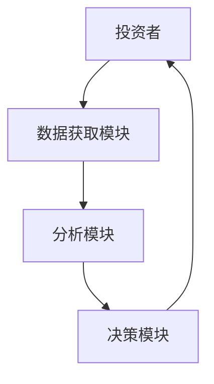

                 


# 巴菲特如何看待生物科技领域的投资机会

## 关键词：巴菲特，投资策略，生物科技，价值投资，长期回报，风险控制

## 摘要：本文深入探讨了巴菲特的价值投资理念及其在生物科技领域的应用，分析了该领域的投资机会与风险，并提供了系统的分析框架和实战案例。

---

## 第1章：背景介绍

### 1.1 巴菲特的价值投资核心

#### 1.1.1 价值投资的核心理念
价值投资强调以低于内在价值的价格买入优质资产。巴菲特认为，市场短期波动不可预测，但长期趋势由基本面决定。他关注企业的盈利能力、财务健康和竞争优势。

#### 1.1.2 巴菲特的投资策略
- **长期持有**：避免频繁交易，长期持有优质资产。
- **安全边际**：买入价格远低于内在价值，以降低风险。
- **企业分析**：关注ROE、ROA等指标，评估企业盈利能力。

#### 1.1.3 价值投资的长期视角
巴菲特的成功在于长期视角，通过持有优质企业分享其成长收益。

### 1.2 生物科技行业的特点

#### 1.2.1 生物科技行业的定义
涉及医药、医疗设备、基因编辑等领域，以技术创新为核心驱动力。

#### 1.2.2 生物科技行业的现状
近年来，生物科技行业快速发展，尤其在制药和基因技术方面取得突破。

#### 1.2.3 生物科技行业的未来趋势
随着人口老龄化和医疗需求增加，行业增长潜力巨大。

### 1.3 巴菲特与生物科技行业的关联

#### 1.3.1 巴菲特对生物科技行业的关注
近年来，巴菲特通过旗下公司投资生物科技企业，如持股辉瑞、默克等。

#### 1.3.2 巴菲特对生物科技行业的投资策略
关注具有强大研发能力和市场优势的企业，注重财务健康和可持续增长。

#### 1.3.3 巴菲特对生物科技行业的长期看法
看好行业的长期增长潜力，但强调审慎评估风险和市场定位。

---

## 第2章：核心概念与联系

### 2.1 核心概念的定义与特征

#### 2.1.1 核心概念的定义
- **ROE**：净利润/股东权益，衡量股东资金的使用效率。
- **ROA**：净利润/总资产，衡量资产的盈利能力。
- **ROCE**：息税前利润/总资本，衡量资本的回报效率。

#### 2.1.2 核心概念的属性特征对比
| 指标 | 定义 | 适用场景 |
|------|------|----------|
| ROE | 净利润/股东权益 | 评估股东资金使用效率 |
| ROA | 净利润/总资产 | 评估资产盈利能力 |
| ROCE | 息税前利润/总资本 | 评估资本回报效率 |

#### 2.1.3 核心概念的ER实体关系图
```mermaid
erDiagram
    customer[投资者] {
        id : integer
        name : string
        investment : float
    }
    company[生物科技公司] {
        id : integer
        name : string
        revenue : float
        profit : float
    }
    investment_relationship[投资关系] {
        investor_id : integer
        company_id : integer
        investment_amount : float
    }
    customer --> investment_relationship
    company --> investment_relationship
```

---

## 第3章：数学模型与算法原理

### 3.1 投资评估的数学模型

#### 3.1.1 ROE计算公式
$$ \text{ROE} = \frac{\text{净利润}}{\text{股东权益}} $$

#### 3.1.2 投资决策流程


#### 3.1.3 Python代码实现
```python
def calculate_roe(net_profit, shareholders_equity):
    return net_profit / shareholders_equity

def calculate_roa(net_profit, total_assets):
    return net_profit / total_assets

def calculate_roce(ebit, total_capital):
    return ebit / total_capital

# 示例数据
net_profit = 100
shareholders_equity = 500
total_assets = 1000
total_capital = 800
ebit = 150

# 计算指标
roe = calculate_roe(net_profit, shareholders_equity)
roa = calculate_roa(net_profit, total_assets)
roce = calculate_roce(ebit, total_capital)

print(f"ROE: {roe:.2f}, ROA: {roa:.2f}, ROCE: {roce:.2f}")
```

---

## 第4章：系统分析与架构设计

### 4.1 投资决策系统设计

#### 4.1.1 领域模型


#### 4.1.2 系统架构设计


---

## 第5章：项目实战

### 5.1 环境安装与数据获取

#### 5.1.1 环境安装
安装Python和Pandas库。

#### 5.1.2 数据获取
从公开财报获取生物科技公司数据。

### 5.2 核心代码实现

#### 5.2.1 数据处理
```python
import pandas as pd

data = pd.read_csv('biotech_companies.csv')
```

#### 5.2.2 指标计算
```python
roe = data['净利润'] / data['股东权益']
roa = data['净利润'] / data['总资产']
roce = data['息税前利润'] / data['总资本']
```

#### 5.2.3 可视化分析
```python
import matplotlib.pyplot as plt

plt.scatter(roe, roa, color='blue')
plt.xlabel('ROE')
plt.ylabel('ROA')
plt.title('ROE vs ROA Scatter Plot')
plt.show()
```

### 5.3 实际案例分析

#### 5.3.1 案例分析
以某生物科技公司为例，计算其ROE、ROA、ROCE，并评估其竞争优势。

---

## 第6章：最佳实践与小结

### 6.1 投资策略总结

#### 6.1.1 长期视角的重要性
巴菲特强调长期投资，关注企业的持续盈利能力。

#### 6.1.2 风险控制的关键性
通过安全边际和分散投资降低风险。

### 6.2 持续学习与市场观察

#### 6.2.1 行业动态关注
定期跟踪生物科技行业的发展趋势和政策变化。

#### 6.2.2 技术进步的影响
关注技术创新对企业竞争力和投资价值的影响。

### 6.3 注意事项与建议

#### 6.3.1 避免短期波动干扰
长期投资者应忽视市场的短期波动。

#### 6.3.2 保持知识更新
生物科技领域技术更新快，投资者需不断学习新知识。

---

## 结语

巴菲特的价值投资理念为生物科技领域的投资提供了宝贵的指导。通过系统化的分析框架和实战案例，投资者可以更好地识别机会，控制风险，实现长期的回报。

---

## 作者：AI天才研究院 & 禅与计算机程序设计艺术

---

