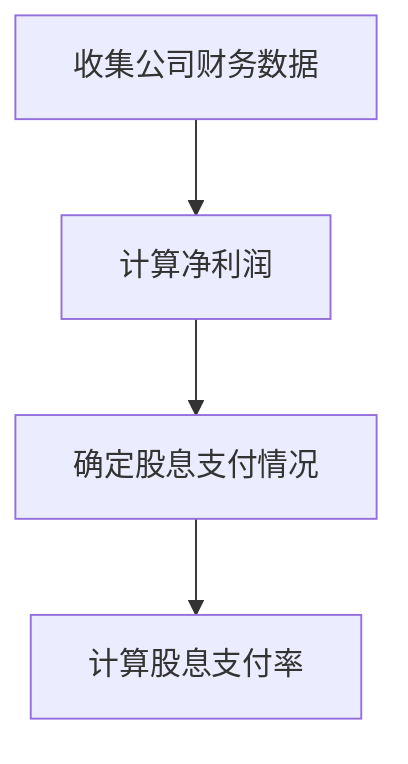

                 


# 巴菲特如何看待股息投资

## 关键词
- 巴菲特
- 股息投资
- 股息率
- 价值投资
- 股票分析

## 摘要
本文深入探讨巴菲特对股息投资的看法，分析股息投资的核心概念、数学模型、系统架构及实战案例。文章从背景介绍到项目实战，详细阐述股息投资的策略和方法，帮助读者理解如何通过股息投资实现长期收益。

---

# 目录大纲：《巴菲特如何看待股息投资》

## 第一部分：背景介绍

### 第1章：股息投资的基本概念

#### 1.1 股息投资的定义
- 股息的定义与分类
- 股息投资的优缺点
- 股息率的计算公式：$$股息率 = \frac{每股股息}{股价}$$

#### 1.2 巴菲特的投资理念
- 巴菲特的“护城河”理论
- 长期投资的重要性
- 价值投资的核心原则

## 第二部分：核心概念与联系

### 第2章：股息投资的核心原理

#### 2.1 股息支付能力的评估
- 股息支付率的计算公式：$$股息支付率 = \frac{股息}{净利润}$$
- 稳定股息支付公司的特征

#### 2.2 股息增长潜力的分析
- 如何预测股息增长
- 公司财务健康状况的影响

#### 2.3 股息率与股价的关系
- 高股息率股票的利弊分析
- 市场波动对股息率的影响

## 第三部分：算法原理与数学模型

### 第3章：股息投资的数学模型

#### 3.1 股息率的计算
- 使用LaTeX公式展示：$$股息率 = \frac{每股股息}{股价}$$

#### 3.2 股息支付率的评估
- 使用mermaid流程图展示评估步骤：


#### 3.3 股息投资的优化算法
- 使用Python代码计算股息率：
```python
def calculate_dividend_yield(dividend, price):
    return dividend / price
```

## 第四部分：系统分析与架构设计

### 第4章：股息投资的系统架构

#### 4.1 领域模型设计
- 使用mermaid类图展示公司、股息、股东的关系：
```mermaid
classDiagram
    class Company {
        name: str
        revenue: float
       净利润: float
       股息支付: bool
    }
    class Dividend {
        amount: float
        yield: float
    }
    class Investor {
        portfolio: list
        dividend_income: float
    }
    Company -> Dividend: 分配
    Dividend -> Investor: 收入
```

## 第五部分：项目实战

### 第5章：股息投资的实际应用

#### 5.1 环境安装
- 安装必要的Python库，如pandas和numpy。

#### 5.2 数据收集与处理
- 使用Python代码收集股息数据：
```python
import pandas as pd

# 假设data为包含股票数据的DataFrame
def calculate_dividend_yield(data):
    data['股息率'] = data['股息'] / data['股价']
    return data
```

#### 5.3 案例分析
- 分析某公司股息率，评估其投资价值。

## 第六部分：最佳实践

### 第6章：股息投资的小结

#### 6.1 小结
- 股息投资的关键点：选择稳定且有增长潜力的公司。

#### 6.2 注意事项
- 避免高股息陷阱，注意公司财务健康。

#### 6.3 拓展阅读
- 推荐阅读巴菲特的书籍，深入学习价值投资。

---

# 作者：AI天才研究院/AI Genius Institute & 禅与计算机程序设计艺术 /Zen And The Art of Computer Programming

