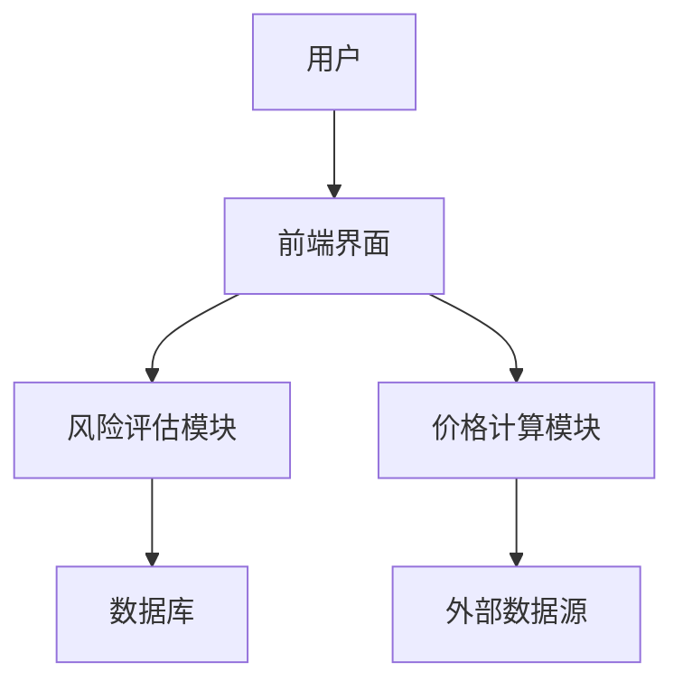
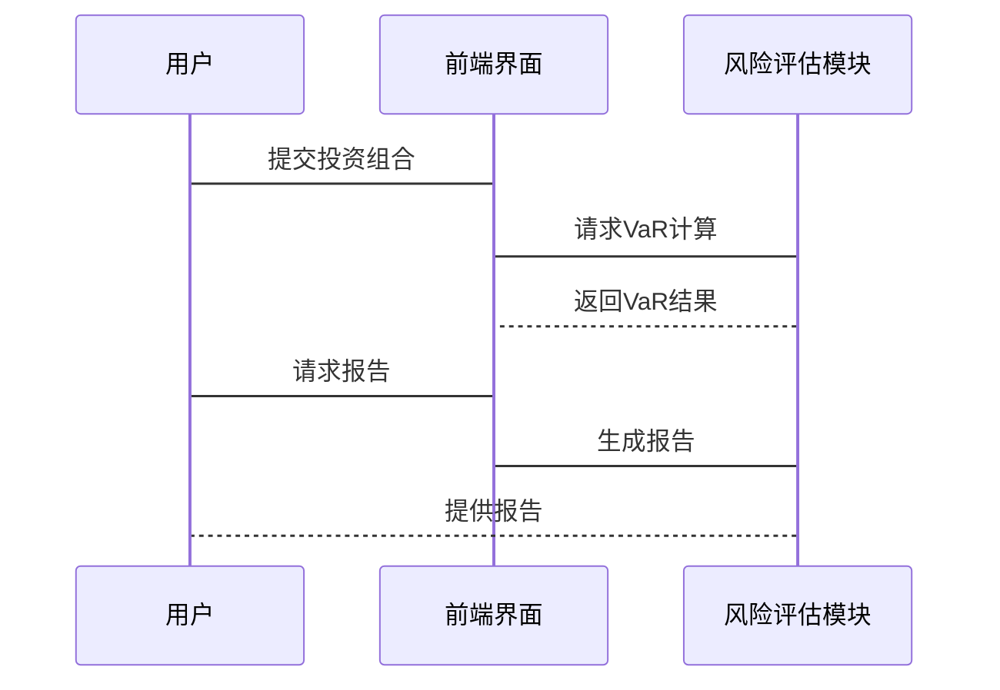

                 


# 巴菲特如何看待衍生品投资

## 关键词：巴菲特，衍生品投资，投资哲学，风险管理，价值投资

## 摘要：本文深入探讨巴菲特对衍生品投资的看法，分析他的投资哲学和策略，以及他如何通过长期价值投资避免衍生品带来的风险。文章结合衍生品的核心原理和实际案例，揭示巴菲特的成功之道，并为投资者提供实用的建议。

---

# 第1章: 衍生品投资概述

## 1.1 衍生品的基本概念

### 1.1.1 什么是衍生品
衍生品是从其他资产派生出来的金融工具，其价值依赖于基础资产的价格变动。常见的衍生品包括期权、期货、掉期和互换。

### 1.1.2 衍生品的主要类型
- 期权：买方有权在特定时间内以固定价格买入或卖出资产。
- 期货：双方约定在未来以特定价格买卖资产。
- 掉期：双方约定在未来交换资产或现金流。

### 1.1.3 衍生品的市场现状
衍生品市场庞大，涵盖股票、外汇、利率和 commodities 等多种资产类别。市场规模远超传统金融市场。

---

## 1.2 巴菲特的投资哲学

### 1.2.1 巴菲特的生平简介
沃伦·巴菲特是全球著名投资者，以价值投资闻名，强调长期持有优质资产。

### 1.2.2 巴菲特的投资理念
巴菲特认为投资应基于企业的内在价值，而非市场波动。他偏好具有持续盈利能力的企业。

### 1.2.3 巴菲特对风险的看法
巴菲特认为风险来自杠杆和短期投机，而长期投资优质资产可以降低风险。

---

# 第2章: 巴菲特与衍生品投资

## 2.1 巴菲特对衍生品的谨慎态度

### 2.1.1 巴菲特对衍生品的负面看法
巴菲特认为衍生品复杂且难以定价，容易导致杠杆过度和风险失控。

### 2.1.2 巴菲特对衍生品的潜在风险分析
衍生品可能导致资产负债表膨胀，增加企业的财务风险。

### 2.1.3 巴菲特对衍生品的长期影响评估
衍生品市场的波动性可能影响实体经济的稳定。

---

## 2.2 巴菲特的投资策略与衍生品

### 2.2.1 巴菲特的长期价值投资策略
巴菲特坚持购买具有持续盈利能力的企业，避免短期市场波动的影响。

### 2.2.2 巴菲特对衍生品的替代投资方案
通过投资优质企业股票，巴菲特间接回避了衍生品的风险。

### 2.2.3 巴菲特对衍生品市场的监管建议
巴菲特主张加强监管，减少市场的不透明性和杠杆风险。

---

# 第3章: 衍生品的核心原理

## 3.1 衍生品的定价模型

### 3.1.1 Black-Scholes公式
$$C = S_0 + \sigma S_0 \Phi(d_1) - K e^{-rT} \Phi(d_2)$$
其中，\(S_0\) 是标的资产价格，\(\sigma\) 是波动率，\(K\) 是行权价，\(r\) 是无风险利率，\(T\) 是到期时间。

### 3.1.2 期权定价的数学模型
通过概率分布（如正态分布）预测标的资产的价格波动，计算期权的内在价值。

### 3.1.3 期货与掉期的定价方法
期货价格基于远期合约的预期，掉期则基于双方约定的现金流折现。

---

## 3.2 衍生品的风险管理

### 3.2.1 衍生品的主要风险类型
- 市场风险：价格波动导致的损失。
- 信用风险：交易对手违约的风险。
- 流动性风险：无法快速变现的风险。

### 3.2.2 风险的量化与评估
使用VaR（Value at Risk）模型量化潜在损失，评估衍生品组合的风险。

### 3.2.3 风险控制的策略
通过分散投资、对冲交易和严格的止损机制降低风险。

---

# 第4章: 巴菲特投资哲学与衍生品的关联

## 4.1 巴菲特的价值投资理念

### 4.1.1 价值投资的核心要素
寻找具有持续盈利能力和低估价格的企业。

### 4.1.2 价值投资与衍生品的冲突
价值投资注重长期稳健，而衍生品交易往往涉及短期波动和杠杆。

### 4.1.3 巴菲特对衍生品的长期影响分析
巴菲特认为长期来看，衍生品可能放大市场波动，增加系统性风险。

---

## 4.2 巴菲特的案例分析

### 4.2.1 巴菲特的经典投资案例
投资可口可乐和苹果公司，长期持有优质股票，避免使用衍生品。

### 4.2.2 巴菲特如何避免衍生品风险
通过投资具有强大财务状况的企业，避免间接使用衍生品。

### 4.2.3 巴菲特对衍生品市场的看法演变
随着时间推移，巴菲特对衍生品的批评更加严厉，强调其对市场的负面影响。

---

# 第5章: 衍生品定价的数学模型

## 5.1 Black-Scholes公式的详细推导

### 5.1.1 公式的数学表达
$$C = S_0 + \sigma S_0 \Phi(d_1) - K e^{-rT} \Phi(d_2)$$
其中，\(\Phi\) 是标准正态分布的累积分布函数。

### 5.1.2 公式的应用场景
用于定价欧式期权，假设波动率和无风险利率已知。

---

## 5.2 风险中性定价方法

### 5.2.1 风险中性概率的计算
通过无风险利率和风险偏好确定风险中性概率。

### 5.2.2 在衍生品定价中的应用
计算标的资产在风险中性概率下的期望值。

---

# 第6章: 系统分析与架构设计方案

## 6.1 问题场景介绍

### 6.1.1 项目介绍
构建一个虚拟的衍生品投资分析系统，用于评估衍生品组合的风险和价值。

### 6.1.2 系统功能设计
- 风险评估模块：计算VaR和CVaR。
- 价格计算模块：应用Black-Scholes模型。
- 报告生成模块：输出风险分析报告。

---

## 6.2 系统架构设计

### 6.2.1 系统架构图


### 6.2.2 系统接口设计
- API接口：提供VaR计算、期权定价等服务。

---

## 6.3 交互流程图

### 6.3.1 交互流程图


---

# 第7章: 项目实战

## 7.1 环境安装

### 7.1.1 安装Python和相关库
安装NumPy、Pandas和Matplotlib用于数据分析和可视化。

## 7.2 系统核心实现

### 7.2.1 期权定价代码
```python
import numpy as np
from scipy.stats import norm

def black_scholes(S, K, r, sigma, T):
    d1 = (np.log(S/K) + (r + 0.5*sigma**2)*T) / (sigma*np.sqrt(T))
    d2 = d1 - sigma*np.sqrt(T)
    C = S*norm.cdf(d1) - K*np.exp(-r*T)*norm.cdf(d2)
    return C

# 示例计算
S = 100
K = 105
r = 0.05
sigma = 0.2
T = 1

print(black_scholes(S, K, r, sigma, T))
```

### 7.2.2 风险评估代码
```python
import numpy as np
import matplotlib.pyplot as plt

# 生成模拟数据
np.random.seed(42)
returns = np.random.normal(0, 0.2, 1000)
VaR = np.quantile(returns, 0.05)
print(f"VaR at 5%: {VaR}")
```

## 7.3 实际案例分析

### 7.3.1 巴菲特如何避免使用衍生品
通过投资优质企业股票，巴菲特避免了衍生品的风险，实现了长期稳健回报。

---

# 第8章: 最佳实践与总结

## 8.1 最佳实践 tips

### 8.1.1 投资者应避免过度依赖衍生品
衍生品复杂且难以定价，容易导致风险。

### 8.1.2 选择优质企业股票，避免短期波动
长期投资优质资产是降低风险的有效方法。

## 8.2 小结
巴菲特的成功证明了长期价值投资的可行性，而衍生品投资则需要谨慎对待。

## 8.3 注意事项
- 衍生品交易具有高风险，需谨慎评估。
- 长期投资优质资产是降低风险的有效策略。

## 8.4 拓展阅读
建议阅读巴菲特的《投资之道》和《证券分析》等书籍，深入理解价值投资理念。

---

# 作者：AI天才研究院 & 禅与计算机程序设计艺术

