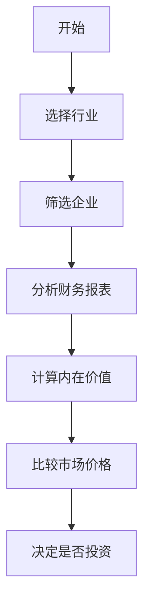
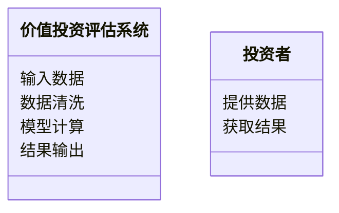
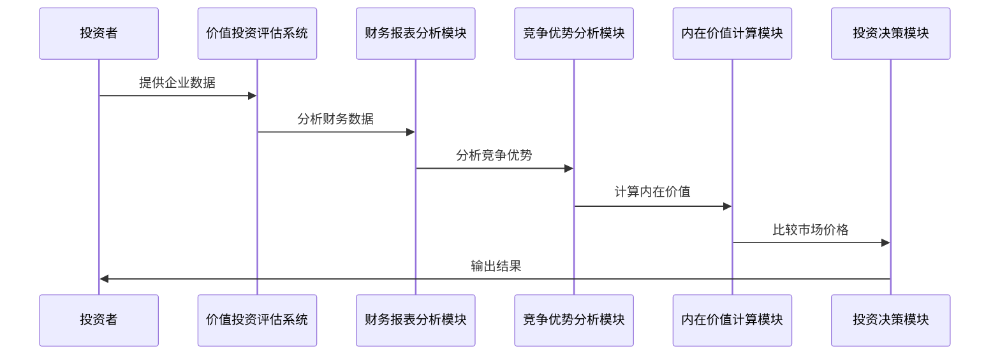

                 


# 巴菲特如何运用价值投资理念

> 关键词：巴菲特，价值投资，内在价值，安全边际，长期投资，护城河，财务报表分析

> 摘要：本文将深入分析巴菲特如何运用价值投资理念进行投资决策，从其核心理念、投资策略、量化模型到实际应用，逐步解析其成功背后的逻辑和方法。

---

## 第一部分: 价值投资的核心理念与巴菲特的投资策略

### 第1章: 价值投资的基本概念

#### 1.1 价值投资的定义与背景
价值投资是一种以低于其内在价值的价格买入优质股票的投资策略。其核心在于寻找市场中被低估的企业，并长期持有，等待其价值回归。  
巴菲特是价值投资的代表人物，他将这一理念发扬光大，并通过长期投资实现了巨大的财富增长。

#### 1.2 巴菲特的投资理念
巴菲特的投资理念可以总结为以下几点：
- **长期投资**：巴菲特坚信时间是伟大企业的朋友，长期持有优质股票是实现财富增长的关键。
- **安全边际**：买入价格低于内在价值，确保投资的安全性。
- **护城河**：选择具有强大竞争优势的企业，这些企业能够长期保持高利润率。
- **简单与理性**：投资应基于事实和逻辑，避免情绪化决策。

---

### 第2章: 价值投资的核心原则

#### 2.1 安全边际的概念
安全边际是巴菲特投资策略中的核心原则之一。它指的是买入价格与内在价值之间的差距，这个差距越大，投资的安全性越高。

#### 2.2 内在价值的评估
内在价值是企业未来现金流的现值。巴菲特通过分析企业的财务报表和行业地位，估算其内在价值，并与市场价格进行比较。

#### 2.3 投资组合的分散化
尽管巴菲特以集中投资著称，但他也强调分散化的重要性。通过投资多个优质企业，降低投资风险。

---

### 第3章: 价值投资的实践方法

#### 3.1 财务报表分析
巴菲特通过分析企业的财务报表，评估其盈利能力、财务健康状况和成长潜力。关键指标包括：
- 营业收入
- 净利润
- 净资产收益率（ROE）
- 负债水平

#### 3.2 行业分析与竞争优势
巴菲特注重选择具有强大竞争优势的企业，这些企业能够在行业中长期保持领先地位。护城河是衡量竞争优势的重要指标，常见的护城河包括：
- 技术优势
- 品牌影响力
- 成本优势
- 市场垄断

#### 3.3 长期投资策略
巴菲特的长期投资策略基于对企业基本面的深入分析和对市场波动的理性判断。他认为，短期市场波动无法预测，但长期趋势可以通过对企业价值的评估来把握。

---

## 第二部分: 价值投资的量化分析与技术应用

### 第4章: 价值投资的量化模型

#### 4.1 内在价值的计算公式
内在价值的计算可以基于 discounted cash flow（DCF）模型，公式如下：
$$
\text{内在价值} = \sum_{t=1}^{n} \frac{\text{现金流}}{(1 + r)^t} + \frac{\text{终值}}{(1 + r)^n}
$$
其中，$r$ 是折现率，$n$ 是企业的生命周期。

#### 4.2 安全边际的量化计算
安全边际可以通过以下公式计算：
$$
\text{安全边际} = \text{内在价值} - \text{市场价格}
$$
如果安全边际为正，说明企业股票被低估。

#### 4.3 价值投资的量化模型
以下是一个简单的价值投资量化模型的mermaid图：


---

### 第5章: 价值投资的技术架构

#### 5.1 系统架构设计
以下是一个价值投资评估系统的mermaid类图：


#### 5.2 系统接口设计
以下是一个价值投资评估系统的mermaid序列图：


---

## 第三部分: 项目实战与总结

### 第6章: 项目实战

#### 6.1 环境安装
- 需要安装Python和相关库（如Pandas、NumPy、Matplotlib）。

#### 6.2 核心代码实现
以下是一个计算内在价值的Python代码示例：
```python
def calculate_intrinsic_value(cash_flows, discount_rate, terminal_value):
    present_value = 0
    for cash_flow in cash_flows:
        present_value += cash_flow / (1 + discount_rate)
    present_value += terminal_value / (1 + discount_rate) ** len(cash_flows)
    return present_value

# 示例数据
cash_flows = [100, 200, 300]  # 每年的现金流
discount_rate = 0.1  # 折现率
terminal_value = 1000  # 终值

intrinsic_value = calculate_intrinsic_value(cash_flows, discount_rate, terminal_value)
print(f"内在价值为：{intrinsic_value}")
```

#### 6.3 实际案例分析
以可口可乐为例，分析其内在价值和投资价值。

---

### 第7章: 总结与展望

#### 7.1 最佳实践
- 理解企业基本面，关注财务报表和竞争优势。
- 保持长期视角，避免短期市场波动的干扰。
- 结合安全边际，选择低估的股票。

#### 7.2 小结
巴菲特的价值投资理念强调对企业基本面的深入分析和长期投资。通过量化模型和技术手段，我们可以更科学地评估股票的价值，做出更明智的投资决策。

#### 7.3 注意事项
- 投资有风险，需谨慎评估企业的财务状况和行业前景。
- 避免情绪化决策，保持理性分析。

---

作者：AI天才研究院/AI Genius Institute & 禅与计算机程序设计艺术 /Zen And The Art of Computer Programming

