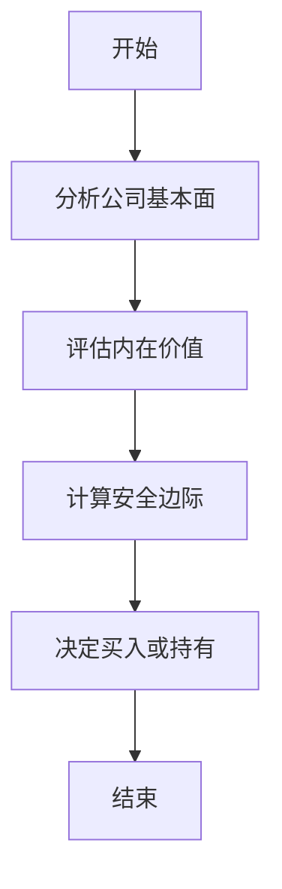
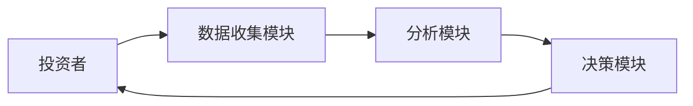

                 


# 巴菲特应对市场泡沫的策略：保持理性和耐心

## 关键词：巴菲特，市场泡沫，价值投资，安全边际，理性投资，长期持有

## 摘要：本文深入探讨巴菲特应对市场泡沫的策略，分析其核心理念和方法，包括价值投资、安全边际、长期持有的重要性，以及如何通过理性思考和耐心等待避免市场波动带来的风险。文章结合理论与实际案例，详细阐述巴菲特的投资哲学及其在现代投资环境中的应用。

---

## 第一部分：背景介绍

### 第1章：市场泡沫的定义与影响

#### 1.1 市场泡沫的定义
市场泡沫是指资产价格脱离其内在价值，由非理性需求和投机行为推动的虚假繁荣现象。泡沫通常发生在市场参与者对未来预期过度乐观时，导致资产价格短期内急剧上涨，最终破裂。

#### 1.2 投资者的行为与市场泡沫
投资者在市场泡沫中的行为往往受到从众心理和贪婪的驱动，倾向于追涨杀跌，忽视基本面分析，导致决策失误。

#### 1.3 巴菲特的投资理念
巴菲特强调价值投资，认为市场波动是机会而非风险，坚持长期持有优质资产，避免短期市场波动的影响。

---

## 第二部分：核心概念与联系

### 第2章：巴菲特投资策略的核心要素

#### 2.1 价值投资的定义与核心要素
- 价值投资：通过深入分析企业的基本面，寻找市场价格低于内在价值的投资标的。
- 内在价值：企业未来现金流的现值，是决定资产合理价格的关键因素。

#### 2.2 安全边际的概念
- 安全边际：买入价格低于内在价值的折扣部分，为投资决策提供缓冲空间，降低风险。

#### 2.3 长期持有与复利效应
- 长期持有：通过持有优质资产，享受企业成长带来的价值增长。
- 复利效应：长期持有带来的收益增长，远超过频繁交易的短期收益。

### 第3章：投资策略对比分析

#### 3.1 价值投资与其他投资策略的对比
- 对比表格：价值投资与其他策略的优缺点对比。

| 投资策略 | 优点 | 缺点 |
|----------|------|------|
| 价值投资 | 稳定收益，风险低 | 需要深入分析，周期长 |
| 技术分析 | 操作灵活 | 易受市场情绪影响 |
| 趋势投资 | 跟随市场趋势 | 风险较高 |

#### 3.2 巴菲特策略的独特性
- 独特的选股标准：关注企业的盈利能力、财务状况和竞争优势。
- 长期持有策略的优势：避免短期波动，享受长期复利增长。

---

## 第三部分：算法原理与数学模型

### 第4章：巴菲特投资策略的算法原理

#### 4.1 投资决策流程
- 流程图：从基本面分析到买入决策的步骤。



#### 4.2 内在价值计算
- 公式：内在价值 = 未来现金流的现值
- 示例：假设某公司未来现金流为100万元，贴现率为5%，则内在价值为 \( \frac{100}{0.05} = 2000 \) 万元。

### 第5章：数学模型与公式

#### 5.1 市盈率（P/E）计算
- 公式：P/E = 市场价格 / 每股收益
- 示例：某股票价格为30元，每股收益为3元，则P/E = 10，属于合理范围。

#### 5.2 安全边际计算
- 公式：安全边际 = 市场价格 / 内在价值
- 示例：内在价值为20元，市场价格为15元，则安全边际为30%，具备投资价值。

---

## 第四部分：系统分析与架构设计

### 第6章：系统分析与架构设计方案

#### 6.1 问题场景介绍
- 投资者面临市场泡沫，需制定理性投资策略。

#### 6.2 系统功能设计
- 数据收集：获取企业财务数据。
- 分析模块：评估内在价值和安全边际。
- 决策模块：基于分析结果制定投资策略。

#### 6.3 系统架构图



---

## 第五部分：项目实战

### 第7章：项目实战

#### 7.1 环境安装
- 工具：Excel或投资分析软件。

#### 7.2 核心实现源代码
- 示例代码：计算内在价值和安全边际。

```python
def calculate_intrinsic_value(cash_flows, discount_rate):
    return sum(cash_flows / (1 + discount_rate)**i for i in range(len(cash_flows)))

def calculate_margin_of_safety(current_price, intrinsic_value):
    return (intrinsic_value - current_price) / intrinsic_value
```

#### 7.3 案例分析
- 公司：某企业，预期现金流为100万元，贴现率5%，内在价值2000万元，市场价格1500万元，安全边际30%。

---

## 第六部分：最佳实践

### 第8章：最佳实践

#### 8.1 最佳实践 tips
- 保持耐心，避免短期波动影响决策。
- 定期复盘，评估投资组合。

#### 8.2 小结
巴菲特的策略强调理性、耐心和长期持有，帮助投资者在市场泡沫中保持稳健。

#### 8.3 注意事项
- 避免过度自信，定期审视投资策略。
- 保持学习，更新投资知识。

#### 8.4 拓展阅读
推荐书籍：《巴菲特致股东的信》。

---

## 作者：AI天才研究院/AI Genius Institute & 禅与计算机程序设计艺术 /Zen And The Art of Computer Programming

