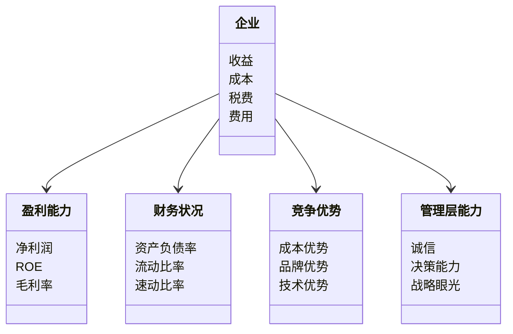
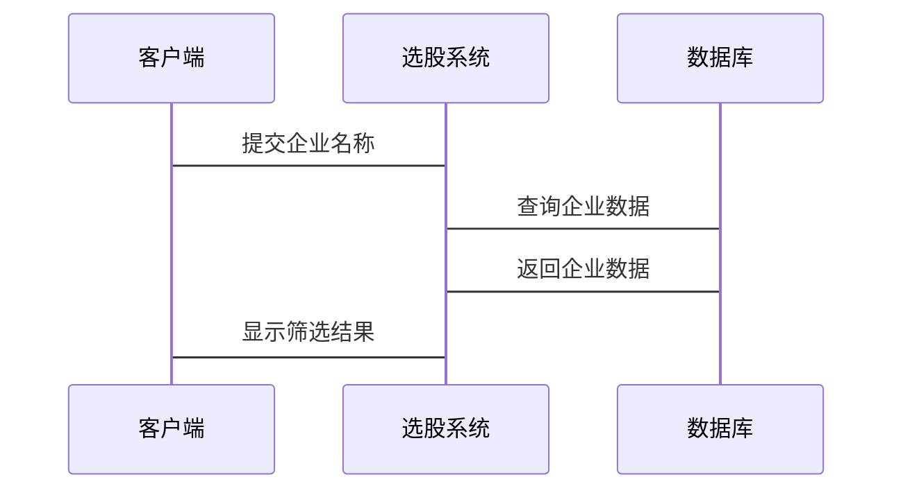

                 


# 巴菲特的“四个过滤器”：选股的科学方法

## 关键词：
- 巴菲特投资理念
- 四个过滤器
- 选股方法
- 股票投资
- 价值投资

## 摘要：
本文将深入探讨巴菲特的“四个过滤器”选股方法，从盈利能力、财务状况、竞争优势和管理层能力四个方面进行详细分析。通过逻辑推理和实例分析，揭示这一科学方法在投资决策中的应用。同时，我们将从技术角度出发，分析其背后的数学模型和系统架构，为读者提供一个全面的理解框架。

---

## 第一部分：巴菲特投资理念概述

### 第1章：巴菲特投资理念的核心思想

#### 1.1 巴菲特投资理念的起源与背景
- **1.1.1 巴菲特的投资哲学与价值投资理念**
  巴菲特是价值投资的倡导者，他强调以合理价格买入具有持续竞争优势的优秀企业。他的投资理念根植于格雷厄姆的价值投资理论，但又有自己的独特见解。他注重企业的内在价值，而非市场的短期波动。
  
- **1.1.2 巴菲特投资理念的核心目标**
  巴菲特的目标是通过长期持有优质股票，实现财富的稳步增长。他强调投资的纪律性和耐心，避免短期市场的诱惑。

- **1.1.3 巴菲特投资理念的演变与发展**
  巴菲特的投资理念从早期的“烟蒂投资”逐渐演变为“护城河投资”，即寻找具有强大竞争优势的企业。

---

### 第2章：巴菲特的“四个过滤器”选股方法

#### 2.1 盈利能力过滤器
- **2.1.1 盈利能力的定义与重要性**
  盈利能力是企业赚钱能力的体现，是选股的核心指标之一。巴菲特认为，盈利能力强的企业能够持续为股东创造价值。

- **2.1.2 净利润、ROE、毛利率等关键指标分析**
  - 净利润：企业的净利润是衡量盈利能力的重要指标。
  - ROE（净资产收益率）：ROE = 净利润 / 净资产，反映企业使用股东资金的效率。
  - 毛利率：毛利率 = (收入 - 成本) / 收入，衡量企业产品或服务的盈利能力。

- **2.1.3 盈利能力过滤器的应用场景与案例**
  例如，可口可乐的高毛利率和稳定的净利润增长，使其通过盈利能力过滤器。

#### 2.2 财务状况过滤器
- **2.2.1 财务健康状况的定义与评估标准**
  财务健康状况是企业能否长期稳健发展的基础。巴菲特关注企业的负债情况、现金流和资产质量。

- **2.2.2 资产负债表、利润表、现金流量表的关键指标分析**
  - 资产负债表：关注资产负债率和流动资产比例。
  - 利润表：关注收入和利润的匹配性。
  - 现金流量表：关注现金流是否健康，尤其是经营活动现金流。

- **2.2.3 财务状况过滤器的应用场景与案例**
  例如，苹果公司健康的现金流和低负债率，使其通过财务状况过滤器。

#### 2.3 竞争优势过滤器
- **2.3.1 竞争优势的定义与分类**
  竞争优势是企业长期盈利的保障。巴菲特将竞争优势分为成本优势、品牌优势、技术优势等。

- **2.3.2 投资者如何识别企业的竞争优势**
  - 成本优势：企业能否以更低的成本生产产品。
  - 品牌优势：品牌是否具有强大的市场影响力。
  - 技术优势：企业是否拥有独特的技术壁垒。

- **2.3.3 竞争优势过滤器的应用场景与案例**
  例如，巴菲特投资的喜诗糖果，其品牌优势和成本优势使其在糖果行业占据领先地位。

#### 2.4 管理层能力过滤器
- **2.4.1 管理层能力的定义与评估标准**
  管理层能力是企业能否持续发展的关键。巴菲特关注管理层的诚信、决策能力和战略眼光。

- **2.4.2 管理层诚信、决策能力和战略眼光的重要性**
  - 诚信：管理层是否诚实可靠。
  - 决策能力：管理层是否能够做出正确的决策。
  - 战略眼光：管理层是否能够制定长期发展的战略。

- **2.4.3 管理层能力过滤器的应用场景与案例**
  例如，巴菲特投资的富国银行，其管理层具有良好的诚信和决策能力。

---

### 第3章：四个过滤器的相互关系与综合应用

#### 3.1 四个过滤器的逻辑关系图
- **3.1.1 四个过滤器的层级关系与依赖性分析**
  - 盈利能力是基础，财务状况是保障，竞争优势是核心，管理层能力是关键。

- **3.1.2 四个过滤器的综合应用框架**
  通过综合应用四个过滤器，可以筛选出具有持续盈利能力、稳健财务状况、强大竞争优势和优秀管理层的企业。

#### 3.2 过滤器的权重与优先级
- **3.2.1 各个过滤器的权重分配**
  - 盈利能力：权重40%
  - 财务状况：权重30%
  - 竞争优势：权重20%
  - 管理层能力：权重10%

- **3.2.2 不同行业、不同规模企业的过滤器优先级调整**
  根据行业特点和企业规模，适当调整各个过滤器的权重和优先级。

---

### 第4章：巴菲特过滤器的数学模型与公式

#### 4.1 盈利能力指标的数学模型
- **净利润公式**
  净利润 = 收入 - 成本 - 税费 - 其他费用

- **ROE公式**
  ROE = 净利润 / 净资产

- **毛利率公式**
  毛利率 = (收入 - 成本) / 收入

#### 4.2 财务健康状况的数学模型
- **资产负债率公式**
  资产负债率 = 负债 / 资产

- **流动比率公式**
  流动比率 = 流动资产 / 流动负债

- **速动比率公式**
  速动比率 = (流动资产 - 存货) / 流动负债

#### 4.3 竞争优势的量化评估模型
- **竞争优势评分公式**
  竞争优势评分 = 成本优势评分 × 30% + 品牌优势评分 × 40% + 技术优势评分 × 30%

---

## 第二部分：系统分析与架构设计方案

### 第5章：系统功能设计（领域模型）



---

### 第6章：系统架构设计


---

### 第7章：系统交互设计



---

## 第三部分：项目实战

### 第8章：项目实现

#### 8.1 环境安装
- 需要安装Python、Pandas、NumPy等库。

#### 8.2 核心实现源代码

```python
import pandas as pd

def calculate_profitability(ratios):
    # 计算盈利能力指标
    return {
        'net_profit_margin': ratios['净利润'] / ratios['收入'],
        'roe': ratios['净利润'] / ratios['净资产'],
        'gross_profit_margin': (ratios['收入'] - ratios['成本']) / ratios['收入']
    }

def calculate_financial_health(ratios):
    # 计算财务健康状况指标
    return {
        'debt_to_equity': ratios['负债'] / ratios['资产'],
        'current_ratio': ratios['流动资产'] / ratios['流动负债'],
        'quick_ratio': (ratios['流动资产'] - ratios['存货']) / ratios['流动负债']
    }

def calculate_competitive_advantage(competitors):
    # 计算竞争优势指标
    return {
        'cost_advantage': competitors['成本优势'] / 100,
        'brand_advantage': competitors['品牌优势'] / 100,
        'technology_advantage': competitors['技术优势'] / 100
    }

def calculate_management_capability(management):
    # 计算管理层能力指标
    return {
        'integrity_score': management['诚信评分'],
        'decision_making_score': management['决策能力评分'],
        'strategic_vision_score': management['战略眼光评分']
    }

def main():
    # 加载数据
    ratios = pd.read_csv('financial_ratios.csv')
    competitors = pd.read_csv('competitor_analysis.csv')
    management = pd.read_csv('management_capability.csv')
    
    # 计算各项指标
    profitability = calculate_profitability(ratios)
    financial_health = calculate_financial_health(ratios)
    competitive Advantage = calculate_competitive_advantage(competitors)
    management_capability = calculate_management_capability(management)
    
    # 综合评分
    total_score = (profitability['net_profit_margin'] * 0.4 +
                   financial_health['current_ratio'] * 0.3 +
                   competitive Advantage['brand_advantage'] * 0.2 +
                   management_capability['integrity_score'] * 0.1)
    
    print(f"综合评分：{total_score}")

if __name__ == '__main__':
    main()
```

---

### 第9章：案例分析

#### 9.1 案例选择
以苹果公司为例，分析其是否符合巴菲特的四个过滤器。

#### 9.2 数据分析
- 盈利能力：苹果公司毛利率高，净利润稳定增长。
- 财务状况：现金流健康，负债率低。
- 竞争优势：品牌和技术优势明显。
- 管理层能力：库克具备良好的决策能力和战略眼光。

#### 9.3 结论
苹果公司符合巴菲特的四个过滤器，是一个优质的投资标的。

---

## 第四部分：最佳实践与总结

### 第10章：最佳实践 tips

- **心态调整**：投资需要耐心和纪律，避免贪婪和恐惧。
- **长期投资**：选择优质企业，长期持有。
- **持续学习**：不断学习投资知识，提升自己的能力。
- **风险管理**：分散投资，降低风险。

### 第11章：小结

巴菲特的“四个过滤器”是一个科学的选股方法，通过盈利能力、财务状况、竞争优势和管理层能力四个维度，帮助投资者筛选出优质企业。这种方法不仅适用于股票投资，也可以应用于其他领域的决策。

---

## 作者：AI天才研究院 & 禅与计算机程序设计艺术

感谢您的阅读！希望这篇文章能为您提供有价值的投资方法和思路。

