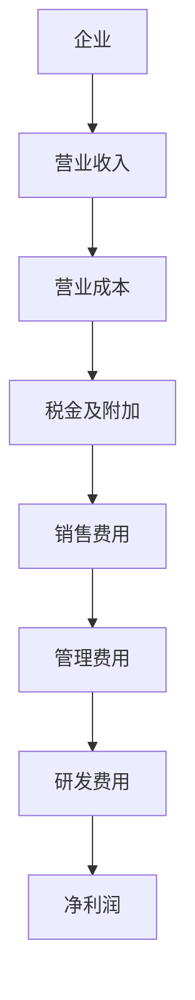

                 


# 巴菲特的'看穿'式分析：理解企业真实盈利能力

> 关键词：巴菲特，企业盈利能力，财务分析，投资策略，ROE，净利润

> 摘要：本文通过分析巴菲特独特的“看穿”式投资方法，揭示企业真实盈利能力的关键指标和分析模型，帮助投资者深入理解企业财务状况，做出更明智的投资决策。

---

## 第1章 巴菲特“看穿”式分析的背景与核心概念

### 1.1 企业盈利能力分析的背景

企业在市场中的生存和发展离不开盈利能力的支撑。传统的财务分析方法虽然提供了基础数据，但在复杂多变的市场环境中，往往难以揭示企业的实际盈利能力。投资者需要更深入的分析工具来评估企业的价值。

巴菲特的“看穿”式分析方法以其独特性著称，它不仅仅关注表面的财务数据，更注重透过数据看到企业的内在价值和长期发展潜力。

### 1.2 巴菲特“看穿”式分析的定义与特点

“看穿”式分析是指通过对企业的财务数据进行深入挖掘，揭示其真实的盈利能力。与传统分析不同，它更注重长期价值和企业核心竞争力。

### 1.3 企业盈利能力的关键指标

- **净利润**：反映企业整体盈利能力的核心指标。
- **每股收益（EPS）**：衡量每股的盈利能力，是投资者关注的重点。
- **营业利润率**：衡量企业经营效率的重要指标。
- **净资产收益率（ROE）**：衡量股东资金使用效率的关键指标。

### 1.4 核心概念的属性对比

| 指标名称 | 属性 | 特征 |
|----------|------|------|
| 净利润   | 数值型 | 反映企业实际盈利情况 |
| 每股收益 | 数值型 | 反映每股的盈利能力 |
| 营业利润率 | 比率型 | 反映企业经营效率 |
| ROE      | 比率型 | 反映股东资金的使用效率 |

---

## 第2章 巴菲特“看穿”式分析的核心模型与算法

### 2.1 核心概念的原理与数学模型

#### 净利润公式
$$ \text{净利润} = \text{营业收入} - \text{营业成本} - \text{税金及附加} - \text{销售费用} - \text{管理费用} - \text{研发费用} $$

#### 净资产收益率（ROE）公式
$$ \text{ROE} = \frac{\text{净利润}}{\text{所有者权益}} $$

### 2.2 实体关系图



---

## 第3章 系统分析与架构设计

### 3.1 系统功能设计


---

## 第4章 项目实战

### 4.1 环境安装

假设我们选择一家制造业企业作为案例，首先需要安装财务分析软件，如Excel或专业的财务分析工具。

### 4.2 核心代码实现

```python
def calculate_profitability(revenue, cost_of_goods_sold, tax_expenses, operating_expenses, net_profit):
    gross_profit = revenue - cost_of_goods_sold
    net_profit_before_tax = gross_profit - tax_expenses
    net_profit = net_profit_before_tax - operating_expenses - net_profit
    return net_profit, net_profit / (revenue - cost_of_goods_sold - operating_expenses)
```

### 4.3 案例分析

以某制造企业为例，计算其ROE和营业利润率，分析其盈利能力的变化趋势。

---

## 第5章 最佳实践与小结

### 5.1 小结

通过深入分析巴菲特的“看穿”式方法，我们学会了如何透过财务数据看企业的真实盈利能力，掌握了关键的财务指标和分析模型。

### 5.2 注意事项

在实际应用中，需结合市场环境和企业实际情况，避免单一指标误导。

### 5.3 拓展阅读

推荐阅读巴菲特的《投资的真相》和《财务报表分析》等书籍，进一步提升分析能力。

---

作者：AI天才研究院 & 禅与计算机程序设计艺术

