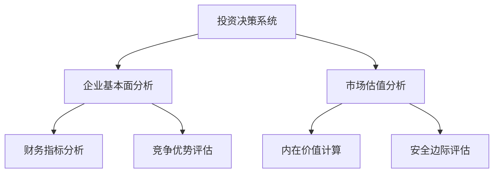

                 

# 巴菲特的“股票就是企业”理念：投资者 vs 投机者

---

## 关键词：
- 巴菲特投资理念
- 价值投资
- 投资者 vs 投 speculator
- 股票作为企业
- 内在价值
- 安全边际
- 长期投资

---

## 摘要：
本文深入探讨了巴菲特“股票就是企业”的投资理念，分析了投资者与投机者在投资行为和思维方式上的本质区别。通过结合巴菲特的核心投资原则，如价值投资、安全边际、长期持有等，本文揭示了如何通过对企业基本面的深入分析来实现稳健的投资收益。同时，文章还结合现代金融市场的特点，探讨了价值投资在实践中的应用和挑战。

---

## 第一部分：巴菲特投资理念的背景与核心观点

### 第1章：巴菲特投资理念的起源与核心观点

#### 1.1 巴菲特的生平与投资哲学
- 巴菲特的早年经历与投资启蒙
  - 1934年出生，10岁开始投资
  - 青少年时期阅读格雷厄姆的《证券分析》
- 巴菲特的核心投资理念
  - 股票是企业的一部分，投资即为购买企业
  - 买入价格是关键，安全边际的重要性
- 投资哲学
  - 长期持有，价值增长
  - 避免短期波动，关注企业内在价值

---

### 第2章：价值投资的定义与核心原则

#### 2.1 价值投资的基本概念
- 价值投资的定义
  - 价值投资是一种以低于内在价值的价格购买优质企业的投资策略
- 核心原则
  - 独立思考，避免从众
  - 风险控制，追求安全边际
  - 长期持有，耐心等待

#### 2.2 巴菲特的价值投资体系
- 内在价值的概念与计算
  - 内在价值 = 未来现金流的现值
  - 股东权益估值模型（DCF模型）
- 安全边际的重要性
  - 购买价格低于内在价值，确保安全边际
- 企业的竞争优势与护城河
  - 竞争优势：成本优势、品牌优势、技术壁垒
  - 护城河：难以被竞争对手复制的长期优势

---

### 第3章：投资者与投机者的区别

#### 3.1 投资者与投机者的定义对比
- 投资者的行为特征
  - 长期视角，关注企业基本面
  - 理性决策，基于数据和逻辑
- 投机者的行为特征
  - 短期视角，关注市场波动
  - 情感驱动，基于市场情绪
- 两者的区别与联系
  - 投资者追求长期稳健收益，投机者追求短期暴利
  - 投机行为可能导致市场的短期波动，但长期由基本面主导

#### 3.2 巴菲特对投机行为的批评
- 投机行为的危害
  - 可能导致市场的过度波动
  - 投资者可能因为贪婪而忽视风险
- 投机与长期投资的对立
  - 投机者关注短期收益，投资者关注长期价值
  - 投机行为可能导致资源的浪费和市场的扭曲

---

### 第4章：股票作为企业的投资哲学

#### 4.1 股票的多重属性
- 股票的资产属性
  - 股票是一种金融资产，代表所有权
- 股票的股权属性
  - 股票赋予持有者企业的部分所有权
- 股票的流动性与风险
  - 流动性：可以快速买卖，但市场波动带来风险

#### 4.2 企业分析的核心要素
- 企业的财务健康状况
  - 利润能力：ROE（净资产收益率）、净利润率
  - 财务杠杆：资产负债率、利息覆盖倍数
- 企业的竞争优势与市场地位
  - 市场份额：是否是行业领导者
  - 技术创新：是否有独特的技术优势
- 企业的管理层能力与决策
  - 管理层是否诚信、有能力
  - 管理层的长期愿景和战略

---

### 第5章：价值投资的实践策略

#### 5.1 投资组合的构建与管理
- 投资组合的分散化原则
  - 避免过度集中，降低风险
  - 建议配置不同行业和规模的企业
- 投资组合的定期审视与调整
  - 定期检查企业的基本面变化
  - 根据市场变化调整持仓比例
- 长期持有与耐心等待
  - 避免频繁交易，减少交易成本
  - 通过长期持有享受企业成长的红利

#### 5.2 风险管理与投资纪律
- 风险控制的重要性
  - 避免杠杆投资，控制仓位
  - 设定止损点，防止损失扩大
- 投资纪律的严格执行
  - 遵循自己的投资策略，不被市场情绪左右
  - 不盲目跟随市场热点

---

## 第二部分：价值投资的数学模型与系统架构

### 第6章：价值投资的数学模型

#### 6.1 内在价值的计算公式
$$ V = \sum_{t=1}^{n} \frac{CF_t}{(1 + r)^t} $$
其中：
- \( V \) 是内在价值
- \( CF_t \) 是第 \( t \) 年的现金流
- \( r \) 是折现率

#### 6.2 安全边际的计算方法
$$ \text{安全边际} = \text{内在价值} - \text{市场价格} $$

---

### 第7章：系统架构设计

#### 7.1 系统功能设计
- 企业基本面分析模块
  - 财务指标分析（ROE、净利润率）
  - 竞争优势评估
- 市场估值分析模块
  - 内在价值计算
  - 安全边际评估
- 投资决策模块
  - 根据分析结果生成投资建议

#### 7.2 系统架构图

---

### 第8章：项目实战与案例分析

#### 8.1 实际案例分析
- 案例：可口可乐的投资分析
  - 企业基本面：强大的品牌优势、稳定的现金流
  - 内在价值计算：使用DCF模型评估
  - 投资决策：安全边际充足，长期持有

---

## 第三部分：总结与展望

### 第9章：总结与最佳实践

#### 9.1 总结
- 巴菲特的价值投资理念强调股票作为企业的一部分，关注企业的内在价值和竞争优势
- 投资者应避免投机行为，坚持长期投资和价值导向
- 通过深入的企业分析和合理的投资策略，实现稳健的投资收益

#### 9.2 最佳实践 tips
- 独立思考，避免从众
- 长期持有，耐心等待
- 严格控制风险，遵守投资纪律

---

## 作者：AI天才研究院/AI Genius Institute & 禅与计算机程序设计艺术/Zen And The Art of Computer Programming

---

### 附录：相关书籍与进一步阅读
- 《巴菲特的选股术》
- 《价值投资入门》
- 《投资的真相》

---

通过本文的详细分析，读者可以深入了解巴菲特的“股票就是企业”的投资理念，学会如何从企业的角度看待投资，避免投机行为，从而实现稳健的投资回报。

