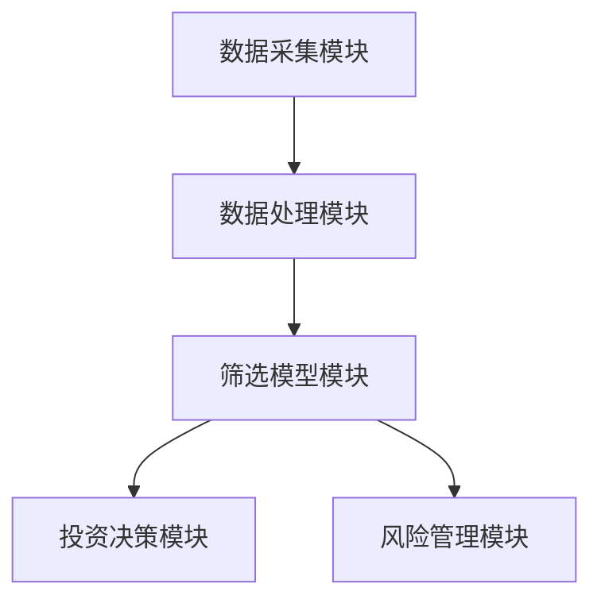

                 


# 巴菲特的20格打孔卡投资法则

> 关键词：巴菲特，价值投资，投资法则，20格打孔卡，投资筛选，风险管理

> 摘要：本文深入探讨了巴菲特的20格打孔卡投资法则，分析其背后的逻辑、方法和实际应用。通过系统的介绍，帮助读者理解如何利用这种方法进行投资决策，并结合技术手段优化投资流程。

---

## 第一部分: 投资理念与价值投资基础

### 第1章: 价值投资的核心理念

#### 1.1 价值投资的定义与特点

**1.1.1 价值投资的定义**

价值投资是一种投资策略，强调以低于内在价值的价格购买优质资产。它由本杰明·格雷厄姆和戴维·多德提出，巴菲特深受其影响。价值投资的核心在于寻找市场定价错误的机会，长期持有优质资产，获得超额收益。

**1.1.2 价值投资的核心特点**

- **安全边际**：买入价格远低于内在价值，以降低风险并确保盈利空间。
- **长期视角**：关注企业的长期价值，而非短期市场波动。
- **高质量企业**：选择具有强大竞争优势、良好管理和财务健康的公司。

**1.1.3 巴菲特的价值投资哲学**

巴菲特的价值投资哲学强调企业护城河、管理层诚信和长期盈利能力。他通过分析企业的财务状况、竞争优势和管理层质量，寻找具有持续增长潜力的企业。

---

### 第2章: 巴菲特的投资策略与成功关键

#### 2.1 巴菲特的投资策略

**2.1.1 长期投资与复利效应**

巴菲特的成功很大程度上得益于复利效应。通过长期持有优质资产，收益滚雪球式增长，避免了频繁交易带来的摩擦成本和税务负担。

**2.1.2 高质量企业的选择标准**

巴菲特选择企业时注重以下几点：

- **强大的竞争优势**：如品牌、技术壁垒、成本优势等。
- **稳定的财务状况**：低负债、高利润率、健康的现金流。
- **优秀的管理层**：诚信、果断、以股东利益为重。

**2.1.3 安全边际的概念与应用**

安全边际是投资价格低于内在价值的部分。通过预留安全边际，投资者可以避免因市场波动或估值错误带来的损失，确保投资的稳健性。

---

## 第二部分: 20格打孔卡方法论

### 第3章: 20格打孔卡的结构与原理

#### 3.1 20格打孔卡的定义与背景

**3.1.1 打孔卡的起源与演变**

打孔卡是一种投资筛选工具，最初由巴菲特及其合作伙伴Charlie Munger设计，用于系统化地评估和筛选投资标的。它通过将企业的各项指标量化，形成一个评分系统，帮助投资者快速筛选出符合投资标准的企业。

**3.1.2 巴菲特与打孔卡方法的关联**

巴菲特将打孔卡方法应用于投资决策中，通过量化分析企业质量，确保投资标的符合其价值投资理念。这种方法帮助他系统化地筛选出具有长期增长潜力的优质企业。

**3.1.3 打孔卡方法的适用场景**

打孔卡方法适用于筛选具备长期竞争优势、财务健康和管理层优秀的高质量企业。它特别适合用于分析上市公司，帮助投资者在众多企业中快速找到优质标的。

---

### 第4章: 20格打孔卡的筛选逻辑与步骤

#### 4.1 打孔卡的20个格子设计

**4.1.1 每个格子的含义与作用**

20格打孔卡的设计基于巴菲特的价值投资理念，每个格子代表一个筛选指标，用于评估企业的质量和投资价值。以下是常见的筛选指标：

1. **经济护城河**：企业是否具备强大的竞争优势。
2. **管理层诚信与能力**：管理层是否诚实可靠且有能力。
3. **财务健康状况**：企业是否有健康的财务状况，如低负债、高利润率。
4. **盈利能力**：企业是否具备持续的盈利能力。
5. **成长潜力**：企业是否具备未来增长的潜力。
6. **估值合理性**：企业当前估值是否低于其内在价值。
7. **行业地位**：企业在行业中的地位是否稳固。
8. **竞争优势**：企业是否具备独特的竞争优势。
9. **财务杠杆**：企业的财务杠杆是否合理。
10. **现金流状况**：企业是否有稳定的现金流。
11. **研发投入**：企业是否在研发方面有足够的投入。
12. **品牌影响力**：企业的品牌是否具备强大的影响力。
13. **客户黏性**：企业是否具备客户黏性。
14. **市场风险**：企业在市场中的风险程度。
15. **管理稳定性**：管理层是否稳定。
16. **企业治理**：企业的治理结构是否完善。
17. **历史表现**：企业过去的表现是否稳定且优秀。
18. **分红政策**：企业是否有稳定的分红政策。
19. **创新能力**：企业是否具备创新能力。
20. **可持续发展**：企业是否具备可持续发展的能力。

**4.1.2 格子之间的关系与权重分配**

每个格子的权重不同，关键指标（如经济护城河、管理层诚信、财务健康等）权重较高，非关键指标权重较低。通过加权评分，投资者可以更准确地评估企业的整体质量。

**4.1.3 格子的动态调整与优化**

根据市场环境和投资目标的变化，投资者可以动态调整格子的权重和筛选标准，以适应不同的投资策略。

---

### 第5章: 打孔卡方法的数学模型与算法

#### 5.1 打孔卡筛选的数学模型

**5.1.1 格子权重的计算公式**

每个格子的权重可以通过其重要性进行量化，通常采用0到1的评分标准，权重总和为1。

$$
\text{权重}_i = \frac{\text{重要性评分}_i}{\sum_{j=1}^{20} \text{重要性评分}_j}
$$

**5.1.2 企业评分的综合计算**

企业评分是通过各格子评分的加权和计算得出。

$$
\text{综合评分} = \sum_{i=1}^{20} (\text{权重}_i \times \text{格子评分}_i)
$$

**5.1.3 评分与投资决策的关系**

综合评分高于阈值（通常为70-80）的企业被视为潜在投资标的。

---

## 第三部分: 投资分析与决策框架

### 第6章: 投资组合的构建与优化

#### 6.1 投资组合的构建原则

**6.1.1 资产配置的多元化策略**

通过分散投资降低风险，通常将资金分配到不同行业、不同规模的企业中。

**6.1.2 个股权重的分配方法**

根据企业的综合评分和市场机会分配个股权重，优质企业分配更多资金。

**6.1.3 组合风险的控制措施**

定期评估投资组合的风险敞口，调整持仓结构，确保风险可控。

---

### 第7章: 风险管理与投资纪律

#### 7.1 风险管理的核心原则

**7.1.1 仓位控制与止损策略**

设定止损点，当股价下跌至止损价时立即卖出，避免更大损失。

$$
\text{止损价} = \text{买入价} \times (1 - \text{止损比例})
$$

**7.1.2 市场波动的应对措施**

保持冷静，避免情绪化决策，坚持长期投资策略。

**7.1.3 投资纪律的严格执行**

严格按照筛选标准和投资计划执行，避免随意更改策略。

---

## 第四部分: 投资系统与工具

### 第8章: 投资系统的构建与实现

#### 8.1 投资系统的功能设计

**8.1.1 数据采集与处理模块**

从财务报表、行业报告等来源获取数据，清洗和标准化后用于分析。

**8.1.2 筛选模型的实现**

基于打孔卡指标，构建筛选模型，计算企业评分。

**8.1.3 投资决策支持**

根据模型结果生成投资建议，帮助投资者做出决策。

---

### 第9章: 系统架构设计与实现

#### 9.1 系统架构设计

**9.1.1 系统功能模块**

- 数据采集模块
- 筛选模型模块
- 投资决策模块
- 风险管理模块

**9.1.2 系统架构图**



---

## 第五部分: 项目实战与案例分析

### 第10章: 项目实战

#### 10.1 实战环境安装

需要安装Python、Pandas、NumPy等库。

#### 10.2 核心代码实现

```python
import pandas as pd

# 示例数据
data = {
    '企业名称': ['企业A', '企业B', '企业C'],
    '经济护城河': [0.8, 0.6, 0.7],
    '管理层诚信': [0.9, 0.8, 0.8],
    # 其他指标...
}

df = pd.DataFrame(data)

# 计算综合评分
weights = [0.15, 0.15, 0.1, ...]  # 根据各指标权重设定
df['综合评分'] = df.iloc[:, 1:].apply(lambda x: sum(x[i] * weights[i] for i in range(len(weights))), axis=1)

print(df)
```

#### 10.3 案例分析

以某行业为例，分析三家企业，计算综合评分，选择评分最高的企业作为投资标的。

---

## 第六部分: 总结与未来展望

### 第11章: 总结

通过20格打孔卡方法，投资者可以系统化地筛选出优质企业，降低投资风险，提高投资收益。这种方法结合了巴菲特的价值投资理念和现代技术手段，为投资者提供了科学的投资工具。

### 第12章: 未来展望

随着人工智能和大数据技术的发展，打孔卡方法将更加智能化和自动化。未来，投资者可以通过AI辅助分析，实时筛选潜在投资标的，进一步优化投资决策。

---

## 作者：AI天才研究院 & 禅与计算机程序设计艺术

本文作者：AI天才研究院（AI Genius Institute）和“禅与计算机程序设计艺术”（Zen And The Art of Computer Programming）团队。我们致力于将人工智能与投资策略相结合，为投资者提供科学的决策支持。

