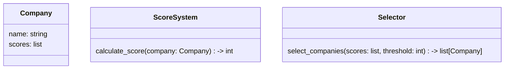

                 


# 巴菲特的20格打孔卡：集中投资的智慧

---

## 关键词：巴菲特，价值投资，20格打孔卡，投资筛选工具，集中投资

---

## 摘要：  
巴菲特的20格打孔卡是一种简单而高效的集中投资工具，通过20个核心标准筛选出优质企业，实现长期稳健的投资回报。本文从投资哲学、数学模型、系统架构等角度，深入分析20格打孔卡的原理与实践，揭示其背后的逻辑与智慧。通过案例分析和实际操作指南，帮助投资者掌握这一工具的核心价值。

---

# 第一部分：背景介绍：巴菲特的投资哲学与20格打孔卡

## 第1章：巴菲特投资哲学概述

### 1.1 价值投资的核心理念  
巴菲特的价值投资理念强调“以合理的价格买入优秀的公司”，并长期持有。这种理念的核心在于寻找具有强大竞争优势、稳定盈利能力和良好治理的企业。

### 1.2 20格打孔卡的发明背景  
20格打孔卡是巴菲特为筛选投资目标而设计的工具。它通过20个标准对企业进行评分，最终选出符合长期投资价值的企业。

### 1.3 20格打孔卡的核心框架  
20格打孔卡将企业分为20个维度，每个维度都有具体的评分标准。通过综合评分，投资者可以快速筛选出具备长期竞争优势的企业。

---

## 第2章：20格打孔卡的20个标准与筛选逻辑

### 2.1 20个标准的分类与权重  
20格打孔卡的标准分为盈利能力、财务健康、竞争优势、行业地位等类别，每个标准都有具体的权重和评分规则。

### 2.2 筛选逻辑的数学模型  
20格打孔卡的筛选逻辑可以通过数学模型表示，例如：

$$ \text{综合评分} = \sum_{i=1}^{20} (\text{标准评分}_i \times \text{权重}_i) $$

---

## 第3章：20格打孔卡的数学模型与算法

### 3.1 评分系统的设计  
20格打孔卡的评分系统通过对企业20个维度的逐一评分，最终计算综合得分。例如：

$$ \text{综合得分} = \sum_{i=1}^{20} (\text{评分}_i \times \text{权重}_i) $$

### 3.2 筛选算法的实现  
通过Python代码实现20格打孔卡的筛选算法：

```python
def score_company(company_data):
    # 公司数据：company_data 包含20个维度的评分
    weights = [0.05, 0.1, 0.05, ...]  # 权重分配
    total_score = sum(score * weight for score, weight in zip(company_data, weights))
    return total_score

# 示例应用
companies = [
    {"name": "苹果", "scores": [...]},
    {"name": "微软", "scores": [...]},
    # 更多公司数据
]
selected_companies = []
for company in companies:
    score = score_company(company["scores"])
    if score > 80:
        selected_companies.append(company)
```

---

## 第4章：20格打孔卡的系统架构与实现

### 4.1 系统功能设计  
20格打孔卡的系统架构包括数据输入、评分计算、结果展示三个核心模块。以下是系统功能的类图：



### 4.2 系统交互设计  
以下是系统交互的序列图：

```mermaid
sequenceDiagram
    用户 -> 输入数据模块: 提供公司数据
    输入数据模块 -> 评分计算模块: 请求评分
    评分计算模块 -> 数据分析模块: 分析公司数据
    数据分析模块 -> 评分计算模块: 返回评分结果
    评分计算模块 -> 结果展示模块: 显示评分结果
    用户 <- 结果展示模块: 查看筛选结果
```

---

# 第二部分：20格打孔卡的投资哲学与实践

## 第5章：投资哲学与长期策略

### 5.1 价值投资的核心要素  
价值投资强调企业的内在价值，而非市场的短期波动。20格打孔卡通过多维度筛选，帮助投资者找到具有长期竞争优势的企业。

### 5.2 集中投资的智慧  
巴菲特的集中投资理念认为，将资金集中在少数优质企业中，能够获得更高的长期收益。20格打孔卡通过筛选出少量优质企业，实现这一目标。

---

## 第6章：实际操作指南

### 6.1 筛选步骤  
1. 收集目标企业的20个维度数据
2. 根据权重计算综合评分
3. 筛选出评分高于阈值的企业
4. 进行进一步调研与验证

### 6.2 案例分析  
以苹果公司为例，假设其20个维度的评分为：
- 盈利能力：95
- 财务健康：90
- 竞争优势：95
- 行业地位：90
综合得分计算为：

$$ \text{综合得分} = 95 \times 0.2 + 90 \times 0.15 + 95 \times 0.1 + 90 \times 0.15 = 89.5 $$

---

## 第7章：进阶策略与风险管理

### 7.1 长期投资策略  
20格打孔卡的筛选结果可以作为长期投资的依据。建议投资者定期回顾企业的表现，并根据市场变化调整投资组合。

### 7.2 风险管理技巧  
在使用20格打孔卡时，投资者需要关注市场的波动和企业的基本面变化，避免单一依赖模型。

---

# 第三部分：总结与展望

## 第8章：总结与小结

### 8.1 核心内容回顾  
20格打孔卡通过多维度筛选，帮助投资者找到具有长期竞争优势的企业。其核心在于集中投资和价值投资的理念。

### 8.2 实践中的注意事项  
在实际操作中，投资者需要结合市场环境和企业动态，灵活调整筛选标准和权重。

### 8.3 未来展望  
随着人工智能和大数据技术的发展，20格打孔卡的筛选逻辑和数学模型将更加精确和高效。

---

## 作者：AI天才研究院 & 禅与计算机程序设计艺术

