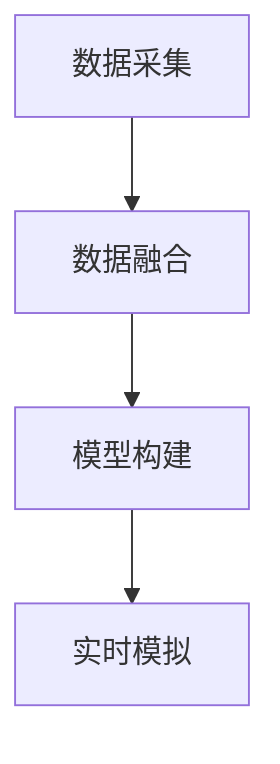
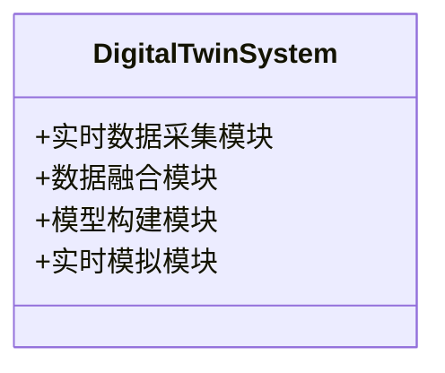
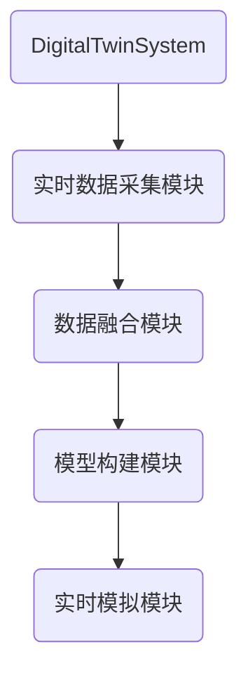
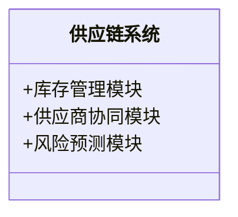
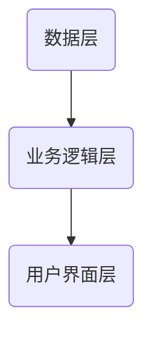
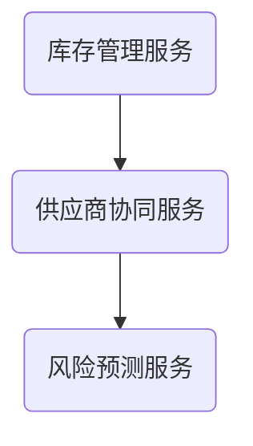
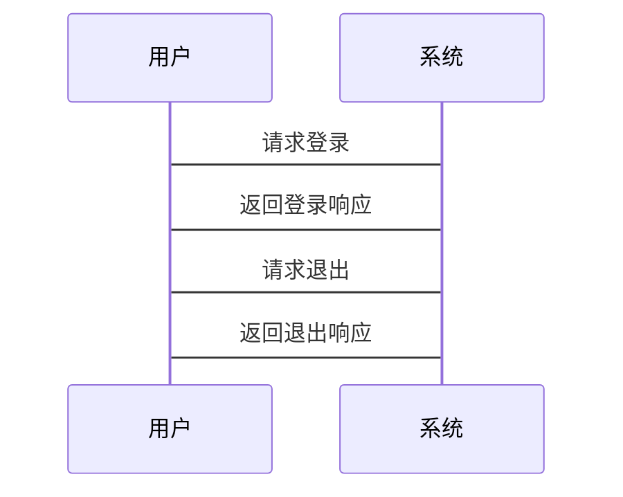
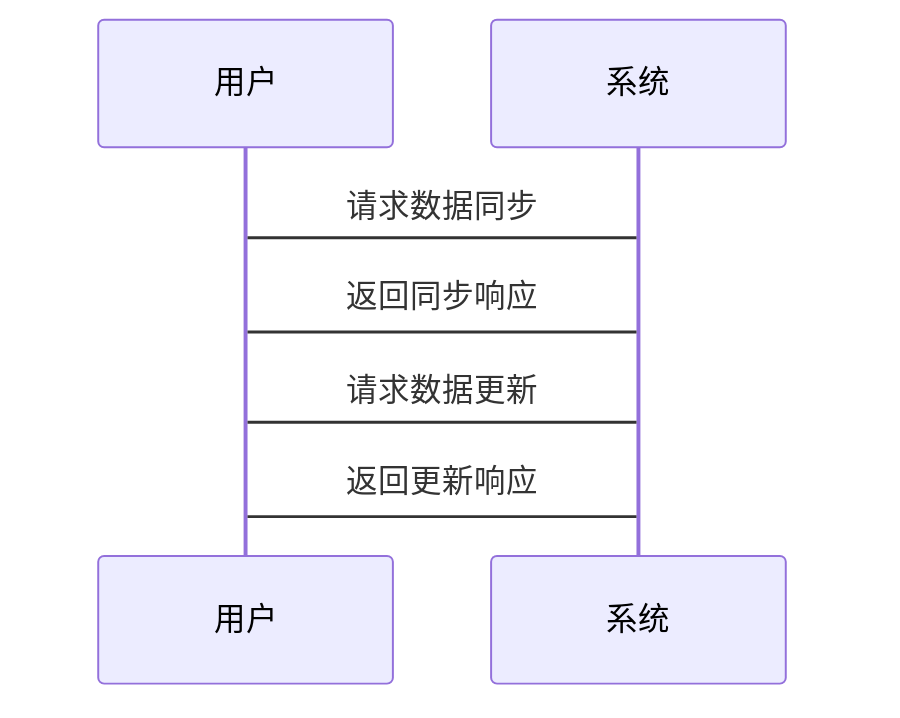
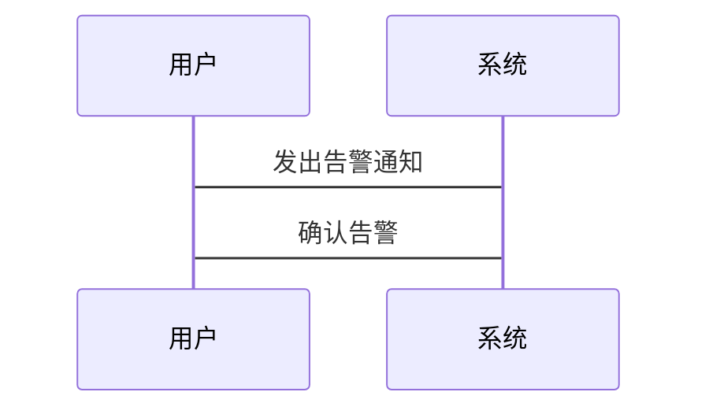

                 


# 巴菲特的产业链分析4.0：数字孪生技术在供应链中的应用

## 关键词：数字孪生，供应链管理，产业链分析，实时模拟，数据驱动

## 摘要：  
本文探讨了巴菲特产业链分析4.0与数字孪生技术在供应链管理中的深度结合，分析了数字孪生技术的核心原理及其在供应链优化中的具体应用，提出了基于数字孪生的供应链系统架构设计，并通过实际案例展示了数字孪生技术在供应链管理中的实践价值。

---

# 第一部分：巴菲特的产业链分析4.0概述

## 第1章：巴菲特的产业链分析4.0概述

### 1.1 产业链分析的演进  
#### 1.1.1 从1.0到4.0的演进历程  
产业链分析经历了从简单的产品分析到复杂的系统性分析的演进过程。巴菲特的产业链分析方法从1.0版本的“静态分析”逐步发展到4.0版本的“动态实时分析”，其中4.0版本引入了数字孪生技术，将供应链管理提升到了实时动态优化的新高度。  

#### 1.1.2 产业链分析的核心要素  
产业链分析的核心要素包括：  
1. **核心业务流程**：包括原材料采购、生产制造、物流配送、销售等环节。  
2. **关键资源**：包括人力资源、技术资源、资金资源等。  
3. **外部环境**：包括市场需求、政策法规、竞争环境等。  

#### 1.1.3 巴菲特产业链分析的独特视角  
巴菲特的产业链分析以“价值创造”为核心，注重从企业的价值链和供应链中挖掘潜在价值，重点关注企业的成本控制、竞争优势和长期发展潜力。

---

### 1.2 数字孪生技术的定义与特点  
#### 1.2.1 数字孪生技术的定义  
数字孪生（Digital Twin）是一种通过数字化模型和实时数据，构建物理世界与数字世界的动态映射的技术。它能够实时反映物理系统的状态，并支持预测性分析和优化。

#### 1.2.2 数字孪生技术的核心特点  
1. **实时性**：能够实时反映物理系统的状态。  
2. **数据驱动**：依赖于多源数据的融合与分析。  
3. **动态性**：支持系统的动态优化与调整。  
4. **可视化**：提供直观的可视化界面，便于决策者理解与操作。

#### 1.2.3 数字孪生与传统供应链的区别  
| 特性         | 数字孪生供应链 | 传统供应链 |
|--------------|---------------|------------|
| 数据来源     | 多源实时数据   | 单一数据源 |
| 分析方式     | 数据驱动       | 人工经验主导 |
| 响应速度     | 实时优化       | 延时较长    |
| 可视化程度   | 高度可视化     | 低可视化    |

---

### 1.3 数字孪生技术在供应链中的应用前景  
#### 1.3.1 数字孪生技术的潜在应用领域  
1. **库存管理**：通过实时监控库存状态，优化库存周转率。  
2. **风险预测**：预测供应链中的潜在风险并制定应对策略。  
3. **供应商协同**：实现供应商与企业的协同优化。  

#### 1.3.2 企业采用数字孪生技术的优势  
1. **提升效率**：通过实时数据和动态优化，降低供应链成本。  
2. **增强灵活性**：能够快速响应市场需求变化。  
3. **提高决策精度**：基于数据驱动的决策更精准。  

#### 1.3.3 数字孪生技术应用的挑战与机遇  
- **挑战**：数据隐私、系统集成难度大、技术成本高等。  
- **机遇**：提升企业竞争力，实现供应链智能化转型。  

---

## 1.4 本章小结  
本章介绍了巴菲特产业链分析4.0的核心思想，以及数字孪生技术的基本概念、特点和在供应链中的应用前景。通过对比分析，展示了数字孪生技术在供应链管理中的独特价值和潜力。

---

# 第二部分：数字孪生技术的核心原理

## 第2章：数字孪生技术的原理与实现

### 2.1 数字孪生模型的构建  
#### 2.1.1 数字孪生模型的构建流程  
数字孪生模型的构建流程包括：数据采集、数据融合、模型构建和实时模拟四个阶段。  



#### 2.1.2 数据采集与处理  
数据采集是数字孪生技术的基础，主要包括传感器数据、业务数据和外部数据的采集与清洗。  

#### 2.1.3 模型的实时模拟与反馈  
通过构建数字化模型，实时模拟物理系统的运行状态，并根据模拟结果优化系统。

---

### 2.2 数字孪生技术的核心算法  
#### 2.2.1 数据融合算法  
数据融合算法通过多种数据源的融合，提高数据的准确性和完整性。常用的算法包括加权平均、卡尔曼滤波等。  

```python
def weighted_average(data_points):
    weights = [0.5, 0.3, 0.2]
    return sum(data_point * weight for data_point, weight in zip(data_points, weights))
```

#### 2.2.2 实时模拟算法  
实时模拟算法基于模型和数据，预测系统的未来状态。常用的算法包括时间序列分析和机器学习模型。

#### 2.2.3 模型优化算法  
模型优化算法通过遗传算法、粒子群优化等方法，不断优化数字孪生模型的性能。

---

### 2.3 数字孪生技术的系统架构  
#### 2.3.1 系统功能模块划分  


#### 2.3.2 系统架构设计  


#### 2.3.3 系统接口设计  
系统接口设计包括API接口定义和数据格式规范。

---

## 2.4 本章小结  
本章详细讲解了数字孪生技术的核心原理，包括模型构建、数据融合和系统架构设计。通过算法和系统的结合，为后续的应用提供了理论基础。

---

# 第三部分：数字孪生技术在供应链中的应用

## 第3章：供应链中的数字孪生技术应用

### 3.1 供应链管理的数字化转型  
#### 3.1.1 数字化转型的必要性  
供应链管理的数字化转型是企业应对市场竞争的必然选择。  

#### 3.1.2 数字孪生技术在供应链中的作用  
数字孪生技术通过实时数据和动态优化，显著提升了供应链的效率和灵活性。

---

### 3.2 数字孪生技术在供应链中的具体应用  
#### 3.2.1 库存管理的优化  
通过实时监控库存状态，优化库存周转率。  

#### 3.2.2 供应链风险预测与应对  
基于历史数据和实时数据，预测供应链中的潜在风险并制定应对策略。  

#### 3.2.3 供应商协同与优化  
通过数字孪生技术，实现供应商与企业的协同优化。

---

### 3.3 数字孪生技术对供应链效率的提升  
#### 3.3.1 实时监控与预测  
实时监控供应链的运行状态，预测潜在问题。  

#### 3.3.2 数据驱动的决策优化  
基于数据驱动的决策优化，显著提升了供应链的效率和响应速度。  

#### 3.3.3 供应链网络的动态调整  
通过数字孪生技术，实现供应链网络的动态调整，适应市场需求的变化。

---

## 3.4 本章小结  
本章详细探讨了数字孪生技术在供应链管理中的具体应用，展示了其在库存管理、风险预测和供应商协同等方面的重要价值。

---

# 第四部分：系统架构与实现

## 第4章：数字孪生供应链系统的架构设计

### 4.1 系统功能设计  
#### 4.1.1 领域模型设计  


#### 4.1.2 功能模块划分  
系统功能模块包括：实时数据采集、数据融合、模型构建和实时模拟。

---

### 4.2 系统架构设计  
#### 4.2.1 分层架构设计  


#### 4.2.2 微服务架构设计  


#### 4.2.3 数据流设计  
数据流从传感器、数据库和外部系统流向数据融合模块，经过处理后传送到模型构建模块，最终在实时模拟模块中生成预测结果。

---

### 4.3 系统接口设计  
#### 4.3.1 API接口定义  
API接口包括数据采集接口、数据查询接口和模型调用接口。

#### 4.3.2 接口调用流程  
1. 数据采集模块调用API接口采集实时数据。  
2. 数据融合模块调用API接口处理数据。  
3. 模型构建模块调用API接口生成模型。  

#### 4.3.3 接口安全设计  
通过API密钥和权限控制，确保接口的安全性。

---

### 4.4 系统交互设计  
#### 4.4.1 用户登录与退出流程  


#### 4.4.2 数据同步与更新流程  


#### 4.4.3 实时监控与告警流程  


---

## 4.5 本章小结  
本章详细设计了数字孪生供应链系统的架构，包括功能模块划分、系统架构设计和交互流程设计，为后续的系统实现奠定了基础。

---

# 第五部分：项目实战与案例分析

## 第5章：数字孪生技术在供应链中的实战应用

### 5.1 项目背景与目标  
本项目旨在通过数字孪生技术优化某汽车制造企业的供应链管理，提升库存周转率和生产效率。

---

### 5.2 系统核心实现  
#### 5.2.1 环境安装  
需要安装Python、Jupyter Notebook、数据库和相关开发工具。

#### 5.2.2 核心代码实现  
```python
import pandas as pd
import numpy as np

def main():
    # 数据采集
    data = pd.read_csv('supply_chain_data.csv')
    # 数据预处理
    processed_data = data.dropna()
    # 数据分析
    processed_data['预测值'] = processed_data['实际值'].rolling(3).mean()
    processed_data.to_csv('processed_data.csv', index=False)

if __name__ == "__main__":
    main()
```

#### 5.2.3 代码解读与分析  
上述代码实现了数据采集、预处理和预测功能，为后续的实时模拟提供了数据支持。

---

### 5.3 实际案例分析  
#### 5.3.1 案例背景  
某汽车制造企业面临供应链库存积压和交货延迟的问题。  

#### 5.3.2 案例分析  
通过数字孪生技术，优化了库存管理和生产计划，显著提升了供应链效率。  

#### 5.3.3 案例结果  
- 库存周转率提升20%。  
- 交货时间缩短15%。  
- 生产成本降低10%。  

---

## 5.4 本章小结  
本章通过实际案例展示了数字孪生技术在供应链管理中的应用价值，验证了其在库存优化和生产计划中的有效性。

---

# 第六部分：总结与展望

## 第6章：总结与展望

### 6.1 总结  
本文探讨了巴菲特产业链分析4.0与数字孪生技术在供应链管理中的结合，详细讲解了数字孪生技术的核心原理和系统架构设计，并通过实际案例展示了其在供应链优化中的应用价值。

---

### 6.2 展望  
未来，数字孪生技术将在供应链管理中发挥更大的作用，尤其是在智能制造和全球供应链优化方面。随着技术的不断进步，数字孪生技术将为企业创造更大的价值。

---

## 最佳实践 Tips  

1. 在实施数字孪生技术之前，确保数据的准确性和完整性。  
2. 选择合适的数字孪生平台和工具，降低实施成本。  
3. 注重数据隐私和系统安全，确保数据的安全性。  
4. 建立专业的技术团队，确保系统的稳定运行。  

---

## 小结  
数字孪生技术正在改变供应链管理的方式，通过实时数据和动态优化，企业能够更高效地应对市场变化和供应链挑战。  

---

## 注意事项  

- 数字孪生技术的实施需要企业内部的充分配合。  
- 系统集成难度较大，建议分阶段实施。  

---

## 拓展阅读  

1. 《数字孪生技术在制造业中的应用》  
2. 《供应链管理的新趋势：数据驱动决策》  
3. 《巴菲特产业链分析方法》  

---

## 作者：AI天才研究院/AI Genius Institute & 禅与计算机程序设计艺术 /Zen And The Art of Computer Programming

