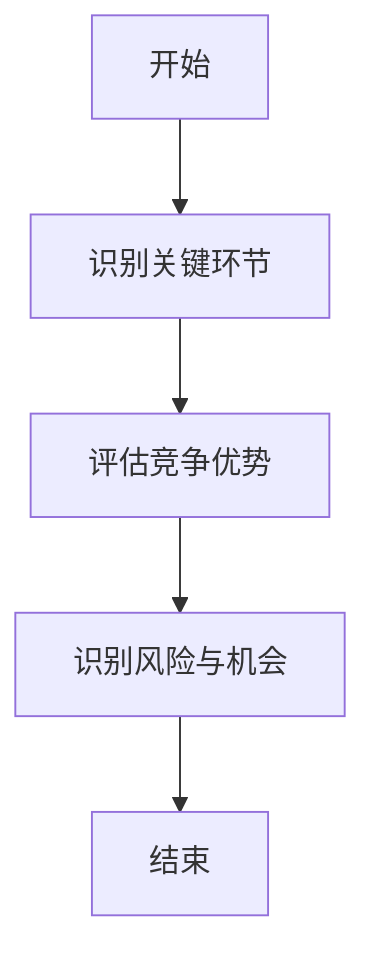

                 


# 巴菲特的产业链分析方法：全面理解公司的竞争环境

## 关键词：巴菲特，产业链分析，竞争环境，投资策略，企业分析，价值投资

## 摘要：本文将详细介绍巴菲特的产业链分析方法，探讨如何通过全面理解公司的竞争环境来做出明智的投资决策。从核心概念到实际案例，从数学模型到系统架构，本文将带领读者深入了解这一经典的投资策略。

---

# 第一部分：背景介绍

## 第1章：巴菲特投资理念与产业链分析背景

### 1.1 巴菲特投资理念的核心思想

#### 1.1.1 价值投资理念
- **核心思想**：寻找具有持续竞争优势、良好管理团队和合理估值的企业进行长期投资。
- **关键要素**：
  - **企业价值**：企业的真实内在价值。
  - **安全边际**：买入价格低于内在价值。
  - **长期视角**：关注企业的长期盈利能力。

#### 1.1.2 产业链分析的重要性
- **产业链分析**：通过对公司所在行业的产业链上下游分析，评估公司在整个产业链中的位置、竞争优势和潜在风险。
- **为什么重要**：
  - **竞争环境**：了解公司在产业链中的位置，判断其竞争优势。
  - **行业趋势**：预测行业发展趋势，评估公司的长期潜力。
  - **投资决策**：基于产业链分析做出更明智的投资决策。

#### 1.1.3 产业链分析的背景与演变
- **背景**：随着全球化和科技的发展，产业链变得复杂，企业之间的竞争不仅仅是单个企业间的竞争，而是整个产业链的竞争。
- **演变**：从传统的行业分析到现代的产业链分析，逐渐形成了系统的产业链分析方法。

---

## 第2章：产业链分析的核心框架

### 2.1 产业链分析的框架体系

#### 2.1.1 产业链的上游、中游、下游结构
- **上游**：提供原材料、零部件的企业。
- **中游**：制造、加工企业。
- **下游**：销售、分销企业。

#### 2.1.2 产业链的关键环节与节点
- **关键环节**：直接影响企业竞争力和成本的环节。
- **关键节点**：产业链中的核心企业或关键资源。

#### 2.1.3 产业链的协同效应与竞争优势
- **协同效应**：产业链上下游之间的协同合作带来的效率提升。
- **竞争优势**：企业在产业链中独特的优势，如成本优势、技术优势等。

### 2.2 产业链分析的核心要素

#### 2.2.1 企业的市场地位
- **市场份额**：企业在市场中的占有率。
- **竞争对手数量**：行业内的主要竞争对手。

#### 2.2.2 企业的竞争优势
- **成本优势**：生产成本低于竞争对手。
- **技术优势**：拥有独特的技术或专利。
- **品牌优势**：知名品牌带来的市场影响力。

#### 2.2.3 企业的财务状况
- **资产负债表**：企业的资产、负债和所有者权益。
- **利润表**：企业的收入和利润情况。
- **现金流**：企业的现金流入和流出情况。

#### 2.2.4 企业的管理能力
- **管理团队**：企业的领导者和管理团队的能力。
- **管理效率**：企业内部管理的效率和效果。

### 2.3 产业链分析的关键步骤

#### 2.3.1 识别产业链的核心环节
- **方法**：从产业链中识别出对最终产品成本或性能有重大影响的环节。

#### 2.3.2 分析企业的产业定位
- **产业定位**：企业在产业链中的具体位置和角色。

#### 2.3.3 评估企业的竞争优势
- **竞争优势评估**：分析企业在成本、技术、品牌等方面的竞争优势。

#### 2.3.4 评估企业的风险与机会
- **风险评估**：识别企业在产业链中可能面临的风险。
- **机会识别**：发现企业在产业链中可能的发展机会。

### 2.4 核心概念对比表格

| 要素         | 定义                                                                 | 属性                     | 示例                       |
|--------------|--------------------------------------------------------------------|--------------------------|---------------------------|
| 市场地位      | 企业在行业中的位置                                             | 市场份额、竞争对手数量   | 龙头企业                  |
| 竞争优势     | 企业相对于竞争对手的独特优势                                   | 成本优势、技术优势、品牌优势 | 技术专利                  |
| 财务状况     | 企业的财务健康状况                                             | 资产负债率、利润率、现金流 | 净利润增长                |
| 管理能力     | 企业的管理团队和管理效率                                       | 管理团队能力、管理效率   | 高效管理团队              |

### 2.5 本章小结

---

## 第3章：产业链分析的数学模型与算法原理

### 3.1 产业链分析的数学模型

#### 3.1.1 企业竞争优势评分模型
- **公式**：$$\text{竞争优势评分} = \frac{\text{成本优势} + \text{技术优势} + \text{品牌优势}}{3}$$
- **解释**：通过对企业的成本、技术和品牌优势进行评分，计算综合竞争优势评分。

#### 3.1.2 产业链风险评估模型
- **公式**：$$\text{风险评分} = \frac{\text{市场风险} + \text{供应链风险} + \text{政策风险}}{3}$$
- **解释**：评估企业在产业链中可能面临的风险因素。

### 3.2 产业链分析的算法原理

#### 3.2.1 识别关键环节
- **算法步骤**：
  1. 列出产业链的所有环节。
  2. 根据影响程度排序，选择影响最大的环节作为关键环节。

#### 3.2.2 评估竞争优势
- **算法步骤**：
  1. 确定竞争优势的评价指标（如成本、技术、品牌）。
  2. 对每个指标进行评分，计算综合竞争优势评分。

#### 3.2.3 识别风险与机会
- **算法步骤**：
  1. 识别可能的风险因素（如市场风险、供应链风险）。
  2. 评估每个风险的概率和影响程度。

### 3.3 算法流程图（mermaid）



### 3.4 代码实现

#### Python代码示例

```python
def calculate_competitive_edge(cost_edge, tech_edge, brand_edge):
    return (cost_edge + tech_edge + brand_edge) / 3

# 示例计算
cost_edge = 80
tech_edge = 70
brand_edge = 90

competitive_edge = calculate_competitive_edge(cost_edge, tech_edge, brand_edge)
print(f"综合竞争优势评分：{competitive_edge}")
```

---

## 第4章：系统分析与架构设计

### 4.1 问题场景介绍
- **场景**：分析某行业（如科技行业）的产业链，评估某公司的竞争优势。

### 4.2 系统功能设计
- **功能模块**：
  - 数据采集：收集产业链数据。
  - 数据分析：评估竞争优势和风险。
  - 报告生成：生成分析报告。

### 4.3 系统架构设计（mermaid）


### 4.4 系统交互设计（mermaid）

```mermaid
sequenceDiagram
    participant 用户
    participant 数据采集模块
    participant 数据分析模块
    participant 报告生成模块
    用户 -> 数据采集模块：请求数据采集
    数据采集模块 -> 数据分析模块：传递数据
    数据分析模块 -> 报告生成模块：传递分析结果
    报告生成模块 -> 用户：返回报告
```

---

## 第5章：项目实战

### 5.1 环境安装
- **工具**：Python、Pandas、Matplotlib。
- **数据源**：公开行业报告、公司财报。

### 5.2 核心实现代码

#### 代码示例

```python
import pandas as pd
import matplotlib.pyplot as plt

# 数据加载
data = pd.read_csv('industry_data.csv')

# 竞争优势计算
data['综合竞争优势'] = data.apply(lambda x: (x['成本优势'] + x['技术优势'] + x['品牌优势']) / 3, axis=1)

# 可视化
data.plot(x='公司名称', y='综合竞争优势', kind='bar')
plt.title('公司竞争优势对比')
plt.show()
```

### 5.3 案例分析
- **案例**：分析苹果公司的产业链。
- **分析步骤**：
  1. 识别产业链关键环节。
  2. 评估苹果的竞争优势。
  3. 识别潜在风险。

### 5.4 分析结果
- **结果**：苹果在技术优势和品牌优势上有明显优势，但需要关注供应链风险。

---

## 第6章：最佳实践与总结

### 6.1 小结
- **总结**：通过系统的产业链分析，投资者可以更好地理解公司的竞争环境，做出更明智的投资决策。

### 6.2 注意事项
- **数据准确性**：确保数据来源可靠。
- **模型适用性**：根据实际情况调整分析模型。

### 6.3 拓展阅读
- **推荐书籍**：《巴菲特的股票投资策略》。
- **推荐网站**：Morningstar、FactSet。

---

# 作者：AI天才研究院 & 禅与计算机程序设计艺术

