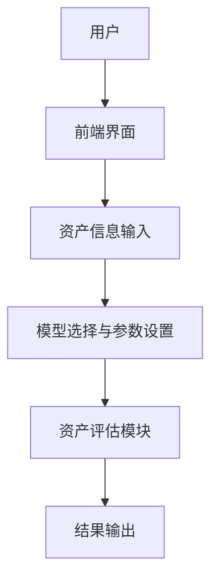

                 


# 巴菲特的价值投资在元宇宙资产评估中的新应用

## 关键词
- 价值投资，巴菲特，元宇宙，资产评估，数学模型，虚拟经济

## 摘要
本文探讨了巴菲特的价值投资原则在元宇宙资产评估中的应用，详细分析了元宇宙的经济体系及其与传统金融的结合，提出了基于现金流折现法的数学模型，并通过实际案例验证其可行性，为投资者提供了新的视角和工具。

---

# 第一部分: 背景介绍

## 第1章: 价值投资与元宇宙概述

### 1.1 价值投资的核心理念
#### 1.1.1 价值投资的定义与核心原则
价值投资是一种以基本面分析为基础的投资策略，强调购买被市场低估的资产。其核心原则包括：
1. **内在价值**：资产的真实价值基于其未来现金流的现值。
2. **安全边际**：购买价格应低于内在价值，以降低风险。
3. **长期视角**：关注企业的长期盈利能力，而非短期市场波动。

#### 1.1.2 巴菲特的价值投资体系
巴菲特的价值投资体系强调对企业基本面的深入分析，包括企业的盈利能力、财务状况、竞争优势等。他强调投资优质企业，长期持有，避免短期波动的影响。

#### 1.1.3 元宇宙的基本概念与特征
元宇宙是一个虚拟的、去中心化的数字世界，用户可以通过虚拟现实技术参与其中。其主要特征包括：
- **虚拟经济**：元宇宙中的虚拟货币（如比特币、以太坊）和数字资产（如NFTs）构成了经济体系。
- **去中心化**：元宇宙通常基于区块链技术，具有去中心化的特点，确保资产的安全性和透明性。
- **交互性**：用户可以在元宇宙中进行交易、社交、娱乐等活动。

### 1.2 元宇宙的经济体系
#### 1.2.1 元宇宙的虚拟经济模式
元宇宙的经济体系类似于现实世界，但完全数字化。虚拟货币在元宇宙中充当货币角色，NFTs（非同质化代币）则代表虚拟资产的所有权。

#### 1.2.2 元宇宙中的资产类型
- **虚拟货币**：如比特币、以太坊等，用于元宇宙中的交易。
- **NFTs**：代表独特的虚拟资产，如虚拟土地、虚拟艺术品等。
- **虚拟商品**：如虚拟服装、虚拟设备等。

#### 1.2.3 元宇宙经济体系的稳定性与风险
元宇宙的经济体系具有高度的波动性和不确定性，虚拟货币的价值可能受到市场情绪、技术漏洞等多种因素的影响。因此，评估元宇宙资产时需要考虑这些风险因素。

### 1.3 价值投资在元宇宙中的应用前景
#### 1.3.1 元宇宙资产评估的挑战与机遇
- **挑战**：元宇宙资产的波动性大，缺乏历史数据支持，且其价值受技术发展和市场需求的影响。
- **机遇**：元宇宙的虚拟经济体系为价值投资者提供了新的投资领域，尤其是那些具有长期竞争优势的虚拟资产。

#### 1.3.2 价值投资在虚拟经济中的潜在价值
价值投资者可以通过分析元宇宙中企业的基本面，如盈利能力、市场地位、技术创新能力等，寻找被低估的虚拟资产进行投资。

#### 1.3.3 元宇宙与传统金融的融合趋势
随着元宇宙技术的不断发展，虚拟资产与传统金融的界限将逐渐模糊。价值投资的原则和方法可以在元宇宙中得到新的应用，为投资者提供更多的投资选择。

### 1.4 本章小结
本章介绍了价值投资的核心理念和元宇宙的基本概念，分析了元宇宙的经济体系及其与传统金融的结合。接下来，将探讨价值投资与元宇宙资产评估的核心概念及其联系。

---

# 第二部分: 核心概念与联系

## 第2章: 价值投资与元宇宙资产评估的核心概念

### 2.1 价值投资的核心原理
#### 2.1.1 内在价值与市场价值的对比
内在价值是资产的真实价值，而市场价值是资产在市场上的交易价格。价值投资者关注内在价值，认为市场价值最终会回归内在价值。

#### 2.1.2 安全边际的概念与应用
安全边际是指购买价格低于内在价值的部分，用于降低投资风险。在元宇宙资产评估中，安全边际可以帮助投资者避免因市场波动导致的损失。

#### 2.1.3 资产评估中的时间价值因素
时间价值是指资产未来现金流的现值，是评估资产价值的重要因素。在元宇宙中，虚拟资产的未来现金流可以通过其在虚拟经济中的收益能力来评估。

### 2.2 元宇宙资产的特征与分类
#### 2.2.1 虚拟货币的属性与价值评估
虚拟货币是元宇宙中的主要货币形式，其价值受市场需求、技术发展和政策监管的影响。

#### 2.2.2 NFTs的经济价值与独特性
NFTs是元宇宙中的独特数字资产，具有不可替代性和唯一性，其价值取决于其独特性、市场需求和技术创新能力。

#### 2.2.3 元宇宙虚拟资产的流动性问题
虚拟资产的流动性是指其在市场上的交易能力。由于元宇宙的虚拟经济体系尚未完全成熟，虚拟资产的流动性较低，可能影响其价值评估。

### 2.3 价值投资与元宇宙资产的结合
#### 2.3.1 价值投资在虚拟经济中的适用性
价值投资的原则和方法可以应用于元宇宙资产评估，尤其是那些具有长期竞争优势的虚拟资产。

#### 2.3.2 元宇宙资产的长期投资价值
元宇宙的虚拟经济体系具有长期发展潜力，那些具有强大技术创新能力和良好商业模式的虚拟资产具有较高的长期投资价值。

#### 2.3.3 虚拟资产的波动性与风险管理
虚拟资产的波动性较大，投资者需要通过基本面分析和风险管理来降低投资风险。

### 2.4 本章小结
本章分析了价值投资的核心原理和元宇宙资产的特征，探讨了价值投资与元宇宙资产的结合。接下来，将详细讲解元宇宙资产评估的数学模型及其应用。

---

# 第三部分: 数学模型与算法原理

## 第3章: 元宇宙资产评估的数学模型

### 3.1 现金流折现法（DCF）模型
#### 3.1.1 DCF模型的定义与原理
现金流折现法（Discounted Cash Flow, DCF）是一种常用的资产评估方法，其基本原理是将资产未来现金流的现值之和作为其内在价值。

#### 3.1.2 DCF模型在元宇宙资产中的应用
在元宇宙中，虚拟资产的未来现金流可以通过其在虚拟经济中的收益能力来预测。例如，虚拟土地可以通过租金收入来预测其未来现金流。

#### 3.1.3 DCF模型的优缺点与改进方向
- **优点**：DCF模型能够准确评估资产的内在价值，考虑了时间价值因素。
- **缺点**：DCF模型的预测准确性依赖于对未来现金流的预测，而元宇宙资产的未来现金流具有较高的不确定性。

### 3.2 虚拟资产价值评估的其他方法
#### 3.2.1 市盈率法与市净率法的对比
- **市盈率法**：通过比较资产的市场价格与盈利能力（如市盈率）来评估其价值。
- **市净率法**：通过比较资产的市场价格与资产净值（如市净率）来评估其价值。

#### 3.2.2 贴现现金流模型的变种与应用
除了DCF模型，还可以使用其他变种模型，如加权平均资本成本模型（WACC）来评估资产的内在价值。

#### 3.2.3 虚拟资产的市场情绪与价格波动模型
市场情绪和价格波动是影响虚拟资产价值的重要因素。通过分析市场情绪和价格波动，可以更好地评估虚拟资产的风险和收益。

### 3.3 数学公式与模型实现
#### 3.3.1 DCF模型的公式推导
$$DCF = \sum_{t=1}^{n} \frac{CF_t}{(1 + r)^t} + \frac{TV}{(1 + r)^n}$$
其中，$CF_t$表示第t年的现金流，$r$表示折现率，$TV$表示终值。

#### 3.3.2 市盈率与市净率的计算公式
$$PE = \frac{P}{E}$$
$$PB = \frac{P}{B}$$
其中，$P$表示资产的市场价格，$E$表示每股收益，$B$表示每股净资产。

#### 3.3.3 虚拟资产波动模型
$$P = \mu + \sigma \times Z$$
其中，$P$表示资产价格，$\mu$表示均值，$\sigma$表示标准差，$Z$表示标准正态分布变量。

### 3.4 本章小结
本章详细讲解了元宇宙资产评估的数学模型，包括现金流折现法和其他变种模型。接下来，将探讨系统的架构设计和实现。

---

# 第四部分: 系统分析与架构设计

## 第4章: 系统架构与实现

### 4.1 问题场景介绍
元宇宙资产评估系统的目标是通过价值投资的原则和数学模型，评估虚拟资产的内在价值，帮助投资者做出决策。

### 4.2 系统功能设计
- **资产信息输入**：用户输入虚拟资产的基本信息，如虚拟货币的交易量、NFTs的市场热度等。
- **模型选择与参数设置**：用户选择评估模型（如DCF模型）并设置相关参数。
- **资产评估与结果输出**：系统根据输入的信息和参数，计算出虚拟资产的内在价值，并输出结果。

### 4.3 系统架构设计


### 4.4 系统接口设计
- **输入接口**：用户输入虚拟资产的基本信息。
- **输出接口**：系统输出资产评估结果。

### 4.5 系统交互流程
```mermaid
sequenceDiagram
    participant 用户
    participant 前端界面
    participant 资产评估模块
    用户 -> 前端界面: 输入虚拟资产信息
    前端界面 -> 资产评估模块: 请求资产评估
    资产评估模块 -> 前端界面: 返回评估结果
    用户 <- 前端界面: 显示评估结果
```

### 4.6 本章小结
本章通过系统架构设计和交互流程图，详细描述了元宇宙资产评估系统的实现过程。接下来，将通过实际案例验证系统的有效性。

---

# 第五部分: 项目实战

## 第5章: 项目实战与案例分析

### 5.1 环境安装与配置
- **安装Python**：需要安装Python 3.8或更高版本。
- **安装相关库**：安装NumPy、Pandas、Matplotlib等库。

### 5.2 核心实现代码
```python
import numpy as np
import pandas as pd
import matplotlib.pyplot as plt

def discounted_cash_flow(cash_flows, discount_rate):
    present_value = 0
    for t, cf in enumerate(cash_flows):
        present_value += cf / (1 + discount_rate)**t
    return present_value

# 示例数据
cash_flows = [100, 200, 300]
discount_rate = 0.05

# 计算DCF
dcf_value = discounted_cash_flow(cash_flows, discount_rate)
print(f"DCF Value: {dcf_value}")
```

### 5.3 代码应用解读与分析
- **代码功能**：上述代码实现了DCF模型的计算，输入现金流和折现率，输出资产的内在价值。
- **代码优化**：可以通过增加更多的参数（如终值）来优化模型。

### 5.4 实际案例分析
假设我们评估一个虚拟货币的内在价值，其未来现金流如下：
- 第1年：100万元
- 第2年：200万元
- 第3年：300万元
折现率为5%，则其DCF值为：
$$DCF = \frac{100}{1.05} + \frac{200}{1.05^2} + \frac{300}{1.05^3} ≈ 479.29 \text{万元}$$

### 5.5 本章小结
本章通过实际案例分析，验证了DCF模型在元宇宙资产评估中的应用。接下来，将总结最佳实践和注意事项。

---

# 第六部分: 最佳实践与总结

## 第6章: 最佳实践与总结

### 6.1 最佳实践 tips
- **模型选择**：根据资产类型选择合适的评估模型。
- **数据收集**：确保数据的准确性和完整性。
- **风险管理**：关注虚拟资产的波动性和市场风险。

### 6.2 总结
本文探讨了巴菲特的价值投资原则在元宇宙资产评估中的应用，提出了基于DCF模型的数学方法，并通过实际案例验证了其可行性。元宇宙的虚拟经济体系为价值投资者提供了新的投资机会，但也带来了新的挑战。

### 6.3 展望
未来，随着元宇宙技术的不断发展，价值投资在元宇宙资产评估中的应用将更加广泛。投资者需要不断学习和适应新的技术和市场环境，以抓住更多的投资机会。

---

# 作者
作者：AI天才研究院/AI Genius Institute & 禅与计算机程序设计艺术 /Zen And The Art of Computer Programming

