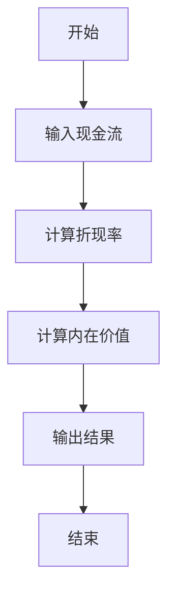
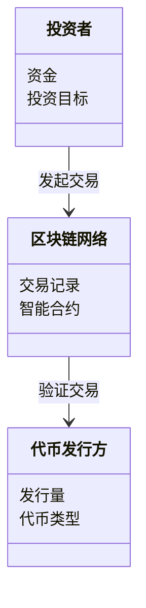
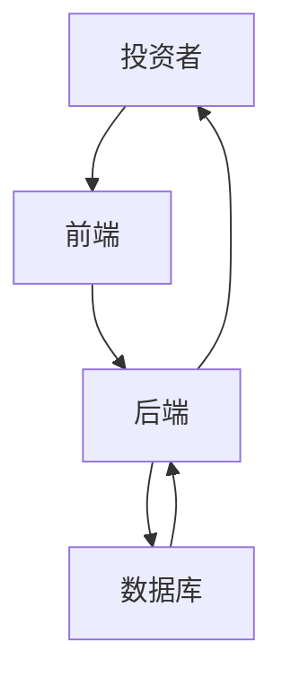

                 


# 巴菲特的价值投资在数字资产代币化中的新维度

> 关键词：数字资产、代币化、价值投资、巴菲特、DeFi、区块链

> 摘要：本文深入探讨了巴菲特的价值投资理念在数字资产代币化中的应用与创新。通过分析数字资产的代币化特点、价值评估模型、算法原理、系统架构设计以及项目实战案例，结合DeFi和区块链技术背景，提出了一种新的价值投资维度。本文旨在为投资者和技术创新者提供理论支持和实践指导，帮助他们在数字资产领域实现更精准的价值评估和投资决策。

---

# 第一部分：数字资产代币化的背景与价值投资的结合

## 第1章：数字资产代币化的背景与价值投资概述

### 1.1 数字资产的代币化与价值投资的结合

#### 1.1.1 数字资产的定义与特点
数字资产是指以区块链技术为基础，通过去中心化方式发行和交易的虚拟货币或代币。其特点包括：
- **去中心化**：不依赖任何中央机构，交易通过区块链网络进行。
- **可分割性**：数字资产可以被分割成任意小单位，便于交易和投资。
- **透明性**：所有交易记录在区块链上，公开透明，可追溯。
- **智能合约**：通过智能合约自动执行交易和协议，减少信任成本。

#### 1.1.2 代币化在数字资产中的作用
代币化是指将现实世界中的资产（如股权、债权、房地产等）或数字资产转化为区块链上的代币。其作用包括：
- **流动性提升**：将传统资产转化为数字代币，提高其流动性。
- **降低交易成本**：通过区块链技术减少中间环节，降低交易成本。
- **增强透明度**：通过区块链记录交易信息，增强信任。

#### 1.1.3 价值投资在传统金融中的应用
巴菲特的价值投资理念强调长期持有优质资产，注重企业的基本面分析，寻找具有持续竞争优势和良好管理的公司。其核心思想包括：
- **长期投资**：避免短期波动，关注长期价值。
- **安全边际**：以低于内在价值的价格买入资产。
- **竞争优势**：投资具有独特竞争优势的企业。

---

### 1.2 巴菲特价值投资理念的核心要素

#### 1.2.1 巴菲特投资理念的起源与发展
巴菲特的投资理念起源于格雷厄姆的价值投资理论，强调以合理的价格买入具有稳定现金流和高ROE（净资产收益率）的企业。其成功案例包括可口可乐、苹果等，这些企业具有强大的市场地位和持续的盈利能力。

#### 1.2.2 价值投资的核心原则
- **内在价值**：资产的真实价值是其未来现金流的现值。
- **安全边际**：买入价格低于内在价值，以确保投资的安全性。
- **竞争优势**：选择具有护城河的企业，确保其长期盈利能力。

#### 1.2.3 巴菲特成功案例分析
以可口可乐为例，巴菲特长期持有该公司股票，因为其具有强大的品牌优势和稳定的现金流。通过长期持有，巴菲特获得了可观的复利收益。

---

### 1.3 数字资产代币化与价值投资的结合

#### 1.3.1 数字资产代币化的定义与分类
数字资产代币化是指将数字资产转化为区块链上的代币，通常分为以下两类：
- **原生代币**：如比特币、以太坊，具有去中心化特性。
- **ERC-20代币**：在以太坊网络上发行的代币，具有可编程性。

#### 1.3.2 代币化如何影响数字资产的价值评估
代币化使得数字资产的价值评估更加复杂，需要考虑以下因素：
- **技术特性**：区块链的技术架构、交易速度、安全性等。
- **应用场景**：代币的用途，如支付、融资、治理等。
- **市场流动性**：代币的交易量和市场深度。

#### 1.3.3 巴菲特价值投资理念在数字资产中的应用潜力
尽管数字资产具有高度波动性，但通过代币化可以将传统资产的稳定价值与数字资产的流动性相结合。例如，将房地产或艺术品代币化，投资者可以以更低的成本投资优质资产。

---

## 1.4 本章小结
本章介绍了数字资产的代币化特点、价值投资的核心理念以及两者结合的可能性。通过对比传统价值投资与数字资产代币化的差异，提出了在数字资产领域应用巴菲特价值投资理念的新维度。

---

# 第二部分：数字资产代币化的价值投资模型

## 第2章：数字资产代币化价值投资的核心概念与联系

### 2.1 数字资产代币化价值评估模型

#### 2.1.1 代币化价值评估模型的定义
代币化价值评估模型是一种通过区块链技术对数字资产进行价值评估的数学模型，其核心在于将资产的未来现金流折现为当前价值。

#### 2.1.2 模型的核心要素与属性对比
| 比较维度 | 传统资产 | 数字资产代币化 |
|----------|----------|----------------|
| 评估对象 | 实体资产   | 数字代币       |
| 评估依据 | 财务报表   | 智能合约       |
| 评估风险 | 市场波动   | 技术风险       |

#### 2.1.3 ER实体关系图架构（使用 Mermaid 流程图）

```mermaid
erDiagram
    actor 投资者 {
        string 资金
        string 投资目标
    }
    actor 区块链网络 {
        string 交易记录
        string 智能合约
    }
    actor 代币发行方 {
        string 发行量
        string 代币类型
    }
    投资者 --> 区块链网络 : 发起交易
    区块链网络 --> 投资者 : 返回交易确认
    代币发行方 --> 区块链网络 : 发行代币
    区块链网络 --> 代币发行方 : 返回发行确认
```

---

### 2.2 数字资产代币化与传统价值投资的对比分析

#### 2.2.1 核心概念原理对比
| 对比维度 | 传统价值投资 | 数字资产代币化 |
|----------|---------------|-----------------|
| 评估依据 | 财务数据       | 智能合约       |
| 投资风险 | 市场波动       | 技术与市场双重风险 |
| 投资期限 | 长期           | 短期与长期并存   |

#### 2.2.2 代币化与传统价值投资的联系与区别
- **联系**：两者都注重资产的内在价值，通过分析基本面进行投资决策。
- **区别**：数字资产代币化具有更高的流动性和透明性，但技术风险较高。

---

## 2.3 本章小结
本章通过对比分析，提出了数字资产代币化与传统价值投资的结合点，强调了代币化在提升资产流动性、降低交易成本方面的优势。

---

# 第三部分：数字资产代币化价值投资的算法原理

## 第3章：数字资产代币化价值投资的算法原理

### 3.1 数字资产代币化价值评估的算法模型

#### 3.1.1 算法模型的数学公式
数字资产的价值评估公式如下：

$$ V = \frac{CF}{r} $$

其中：
- \( V \) 为资产的内在价值。
- \( CF \) 为资产的未来现金流。
- \( r \) 为折现率。

#### 3.1.2 算法流程图（使用 Mermaid）



#### 3.1.3 算法实现的伪代码
```python
def calculate_intrinsic_value(cash_flow, discount_rate):
    return cash_flow / discount_rate
```

---

### 3.2 算法实现与实例分析

#### 3.2.1 算法实现的详细步骤
1. 输入未来现金流。
2. 计算折现率。
3. 使用公式计算内在价值。
4. 输出结果。

#### 3.2.2 实例分析与结果解释
假设某数字资产的未来现金流为 $100，折现率为 $0.1，其内在价值为：

$$ V = \frac{100}{0.1} = 1000 $$

#### 3.2.3 算法的优缺点与改进方向
- **优点**：简单易懂，计算速度快。
- **缺点**：未考虑资产的流动性风险和技术风险。
- **改进方向**：引入更多因素，如市场波动性和技术可行性。

---

## 3.3 本章小结
本章通过数学模型和算法流程图，详细讲解了数字资产代币化价值评估的实现步骤，并通过实例分析验证了算法的可行性。

---

# 第四部分：数字资产代币化价值投资的系统架构设计

## 第4章：数字资产代币化价值投资的系统架构设计

### 4.1 系统功能设计

#### 4.1.1 系统功能模块划分
- 用户界面：投资者输入需求。
- 数据处理：计算资产价值。
- 结果展示：输出评估结果。

#### 4.1.2 功能模块的交互流程
1. 用户输入资产信息。
2. 系统计算内在价值。
3. 系统显示结果。

#### 4.1.3 领域模型类图（使用 Mermaid）



---

### 4.2 系统架构设计

#### 4.2.1 系统架构设计
- 前端：用户界面。
- 后端：计算模块。
- 数据库：存储资产信息。

#### 4.2.2 系统架构图（使用 Mermaid）



---

## 4.3 本章小结
本章通过系统架构设计，展示了数字资产代币化价值评估的实现方式，强调了各模块的交互流程和功能划分。

---

# 第五部分：数字资产代币化价值投资的项目实战

## 第5章：数字资产代币化价值投资的项目实战

### 5.1 环境安装

#### 5.1.1 安装Python
```bash
python --version
pip install --upgrade pip
```

#### 5.1.2 安装区块链开发工具
```bash
pip install web3
```

---

### 5.2 系统核心实现源代码

#### 5.2.1 计算内在价值的代码
```python
def calculate_intrinsic_value(cash_flow, discount_rate):
    return cash_flow / discount_rate

# 示例
cash_flow = 100
discount_rate = 0.1
value = calculate_intrinsic_value(cash_flow, discount_rate)
print(f"内在价值为：{value}")
```

#### 5.2.2 智能合约实现
```solidity
// SPDX-License-Identifier: MIT
pragma solidity ^0.8.0;

contract Token {
    mapping(address => uint) public balances;
    uint public totalSupply;

    function mint(address to, uint amount) public {
        balances[to] += amount;
        totalSupply += amount;
    }
}
```

---

### 5.3 实际案例分析与详细讲解

#### 5.3.1 案例分析
假设某数字资产的未来现金流为 $100，折现率为 $0.1，其内在价值为 $1000。通过智能合约实现代币化发行，投资者可以以更低的成本持有该资产。

#### 5.3.2 代码应用解读
1. 安装必要的工具。
2. 编写智能合约并部署到区块链网络。
3. 使用Python代码计算资产的内在价值。

---

## 5.4 本章小结
本章通过实际案例分析，展示了数字资产代币化价值评估的实现过程，帮助读者理解理论与实践的结合。

---

# 第六部分：最佳实践、小结、注意事项与拓展阅读

## 第6章：最佳实践、小结、注意事项与拓展阅读

### 6.1 最佳实践 tips
- **分散投资**：避免将所有资金投入到单一资产。
- **关注技术风险**：了解区块链技术的局限性。
- **长期持有**：数字资产代币化具有较高的波动性，建议长期持有。

### 6.2 小结
本文从理论到实践，详细讲解了巴菲特的价值投资理念在数字资产代币化中的应用。通过算法模型、系统架构设计和项目实战，为投资者提供了新的视角和工具。

### 6.3 注意事项
- 数字资产代币化具有较高的市场风险。
- 投资者需关注政策法规和市场动态。
- 系统实现需注意安全性，防止技术漏洞。

### 6.4 拓展阅读
- 《The Intelligent Investor》——巴菲特的经典著作。
- 区块链技术入门与应用开发。

---

# 作者：AI天才研究院/AI Genius Institute & 禅与计算机程序设计艺术 /Zen And The Art of Computer Programming

---

**全文完**

