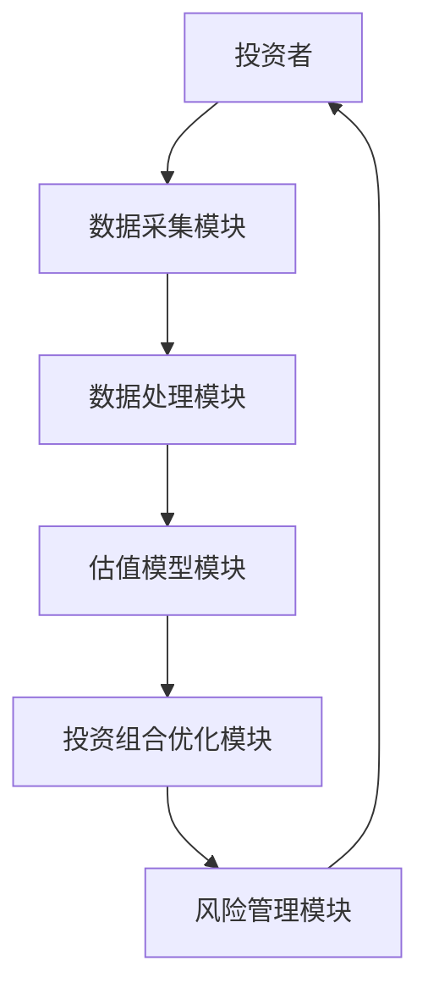
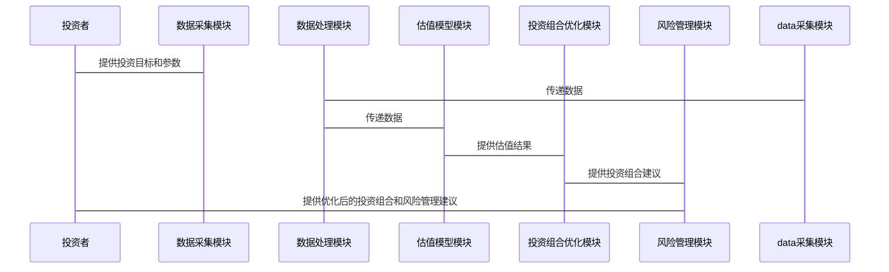

                 


```markdown
# 巴菲特的价值投资在新兴市场科技股中的调整

## 关键词：价值投资，巴菲特，新兴市场，科技股，投资策略，调整，财务分析，系统架构

## 摘要：  
本文探讨了巴菲特的经典价值投资理念在新兴市场科技股投资中的应用与调整。通过分析新兴市场的特殊环境、科技股的特点以及价值投资的核心要素，本文提出了在新兴市场科技股投资中需要进行的具体策略调整。这些调整包括对企业基本面分析、财务指标评估、投资组合构建以及风险管理等多方面的优化。通过实际案例和系统设计，本文展示了如何在新兴市场科技股中应用调整后的价值投资策略，以实现长期稳定的收益。

---

## 第0章: 引言

### 0.1 本书的目的与读者对象
本篇文章旨在探讨巴菲特的价值投资理念在新兴市场科技股投资中的应用与调整。本文适合对价值投资和科技股投资感兴趣的投资者、金融从业者以及对新兴市场有研究兴趣的学者。

### 0.2 巴菲特价值投资理念的概述
巴菲特的价值投资理念强调长期投资、安全边际和企业基本面分析。他主张投资于具有强大竞争优势、良好管理团队和合理估值的企业。

### 0.3 新兴市场科技股的特殊性
新兴市场的科技股具有高成长性、高波动性和创新性强等特点，与成熟市场的科技股存在显著差异，因此需要对投资策略进行调整。

---

## 第1章: 价值投资的基本原理

### 1.1 价值投资的核心概念
#### 1.1.1 投资的本质与长期主义
投资的本质是通过购买优质资产，实现长期稳定的收益。长期主义强调关注企业的长期价值，而非短期波动。

#### 1.1.2 股票的内在价值与市场价值
股票的内在价值是基于企业基本面的评估，而市场价值则是由市场情绪和投资者行为决定的。价值投资的核心在于寻找内在价值高于市场价值的企业。

#### 1.1.3 安全边际与风险控制
安全边际是指内在价值与市场价格之间的差距，用于控制投资风险。通过安全边际，投资者可以在市场波动中降低风险。

### 1.2 巴菲特投资策略的关键要素
#### 1.2.1 企业基本面分析
基本面分析包括对企业财务状况、盈利能力、竞争优势和管理团队的评估。

#### 1.2.2 财务报表解读与关键指标
关键财务指标包括市盈率（P/E）、市净率（P/B）、ROE（净资产收益率）等，用于评估企业的财务健康状况。

#### 1.2.3 管理层能力和企业竞争优势
管理层能力和企业竞争优势是评估企业长期发展潜力的重要因素。

---

## 第2章: 新兴市场科技股的特点与挑战

### 2.1 新兴市场的定义与特点
#### 2.1.1 新兴市场的经济环境
新兴市场通常具有较高的经济增长率和较低的市场成熟度。

#### 2.1.2 新兴市场的政策环境
新兴市场的政策环境可能不稳定，对科技股的投资产生影响。

#### 2.1.3 新兴市场的波动性
新兴市场具有较高的波动性，市场风险较大。

### 2.2 科技股的特殊性
#### 2.2.1 科技股的高成长性
科技股通常具有较高的成长性，尤其是在新兴市场中，科技行业可能处于快速发展的阶段。

#### 2.2.2 科技股的高波动性
科技股的价格波动较大，受市场情绪和技术变革的影响显著。

#### 2.2.3 科技股的创新与不确定性
科技股的创新能力强，但也伴随着较高的不确定性，企业成功与否取决于创新能力和市场环境。

---

## 第3章: 价值投资在新兴市场科技股中的调整

### 3.1 调整价值投资策略的必要性
#### 3.1.1 新兴市场的特殊性对传统策略的挑战
新兴市场的波动性、政策不确定性和市场环境与成熟市场存在显著差异，传统价值投资策略需要调整。

#### 3.1.2 科技股的高成长性与估值方法的调整
科技股的高成长性使得传统的估值方法（如市盈率）可能不再适用，需要引入其他估值方法。

### 3.2 新兴市场科技股的价值评估模型
#### 3.2.1 市盈率与市净率的适用性
市盈率适用于高成长企业，市净率适用于重资产企业。

#### 3.2.2 现金流折现法的调整
现金流折现法需要考虑新兴市场的高波动性和政策不确定性，调整折现率和未来现金流预测。

#### 3.2.3 市场增长率与企业盈利能力的综合考量
新兴市场的科技股需要综合考虑市场增长率和企业盈利能力，寻找具有高成长性和强盈利能力的企业。

---

## 第4章: 价值投资策略的具体调整措施

### 4.1 企业基本面分析的优化
#### 4.1.1 关注新兴市场的行业龙头
在新兴市场中，行业龙头通常具有更强的竞争力和更高的市场占有率。

#### 4.1.2 重视科技企业的研发能力和创新
科技企业的研发能力和创新能力是其长期竞争优势的核心。

#### 4.1.3 考虑政策环境对企业的影响
新兴市场的政策环境对科技企业的影响较大，需要密切关注政策变化。

### 4.2 财务指标的调整与权重分配
#### 4.2.1 调整市盈率与市净率的计算方法
在新兴市场中，市盈率和市净率的计算需要考虑市场波动性和企业成长性。

#### 4.2.2 引入增长
引入增长作为估值的重要因素，调整财务指标的权重。

#### 4.2.3 重点关注现金流和自由现金流
现金流和自由现金流是评估科技企业财务健康状况的重要指标。

---

## 第5章: 系统分析与架构设计

### 5.1 系统功能设计
#### 5.1.1 系统目标
设计一个能够帮助投资者在新兴市场科技股中应用调整后的价值投资策略的系统。

#### 5.1.2 系统功能模块
- 数据采集与处理
- 估值模型构建
- 投资组合优化
- 风险管理

### 5.2 系统架构设计
#### 5.2.1 系统架构图


#### 5.2.2 系统接口设计
- 数据接口：从数据源获取企业财务数据和市场数据。
- 用户接口：提供用户输入参数和结果展示。

#### 5.2.3 系统交互设计


---

## 第6章: 项目实战

### 6.1 环境安装
#### 6.1.1 安装Python和相关库
```bash
pip install numpy pandas matplotlib
```

#### 6.1.2 数据获取
使用Python的`pandas`库获取新兴市场科技股的数据。

### 6.2 核心实现
#### 6.2.1 估值模型的实现
```python
import numpy as np
import pandas as pd

def calculate_adjusted_valuation(df, growth_rate):
    df['Adjusted_P/E'] = df['P/E'] / (1 + growth_rate)
    df['Adjusted_P/B'] = df['P/B'] / (1 + growth_rate)
    return df
```

#### 6.2.2 投资组合优化
```python
import numpy as np

def optimize_portfolio(returns, weights):
    returns = np.array(returns)
    weights = np.array(weights)
    portfolio_return = np.sum(returns * weights)
    portfolio_risk = np.sqrt(np.dot(weights.T, np.dot(returns.cov(), weights)))
    return portfolio_return, portfolio_risk
```

### 6.3 案例分析
#### 6.3.1 某新兴市场科技股的案例
分析某新兴市场科技股的财务数据和市场数据，应用调整后的估值模型进行投资决策。

---

## 第7章: 总结

### 7.1 全文总结
本文探讨了巴菲特的价值投资理念在新兴市场科技股投资中的应用与调整，提出了在新兴市场中科技股投资的具体策略和方法。

### 7.2 注意事项
新兴市场科技股投资风险较高，投资者需要密切关注市场环境和政策变化。

### 7.3 拓展阅读
建议进一步阅读《巴菲特的选股术》和《新兴市场投资策略》。

---

## 作者：AI天才研究院/AI Genius Institute & 禅与计算机程序设计艺术 /Zen And The Art of Computer Programming
```

