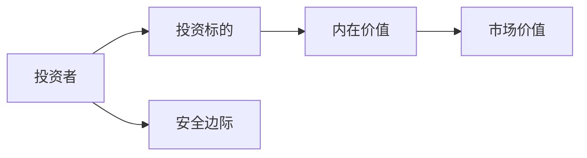
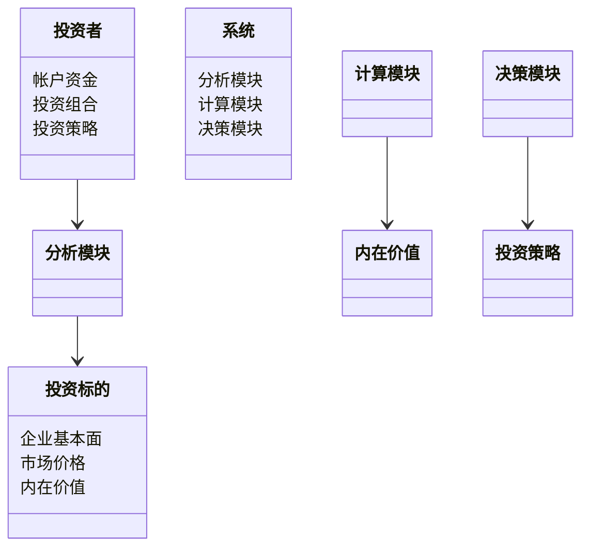
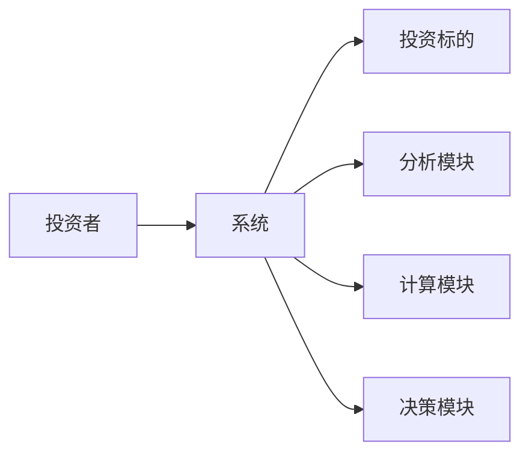

                 


# 巴菲特的价值投资实践案例分析

> 关键词：巴菲特，价值投资，内在价值，安全边际，投资策略

> 摘要：本文系统地分析了巴菲特的价值投资实践，从理论基础到实际案例，结合技术语言和逻辑推理，深入探讨了价值投资的核心概念、算法原理、系统架构以及实战应用，为投资者提供了全面的指导和启示。

---

## 第1章 价值投资的起源与发展

### 1.1 价值投资的起源

#### 1.1.1 投资学的起源与发展

投资学作为一门古老而深奥的学科，起源于人类对财富增值的永恒追求。从古代的商品交换到现代的金融市场，投资学经历了漫长的发展过程。在20世纪初，投资学逐渐从传统的经验主义转向理论化和系统化。1934年，本杰明·格雷厄姆和戴维·多德合著的《证券分析》一书的出版，标志着现代价值投资理论的诞生。

#### 1.1.2 巴菲特与价值投资的结合

沃伦·巴菲特作为价值投资的忠实信徒和实践者，将格雷厄姆的理论发扬光大。巴菲特的投资理念不仅继承了格雷厄姆的安全边际概念，还加入了对管理层质量、企业竞争优势等基本面因素的关注。他强调长期投资、分散投资和价值发现，将价值投资从一种理论推向了实践的成功典范。

#### 1.1.3 价值投资的核心理念

价值投资的核心理念是寻找市场定价低于其内在价值的证券。这种投资策略强调对企业基本面的深入分析，关注企业的盈利能力、财务状况和行业地位。巴菲特认为，市场先生是不可预测的，但企业的内在价值是可以通过基本面分析来估算的。

### 1.2 巴菲特的投资理念

#### 1.2.1 投资哲学

巴菲特的投资哲学可以用一句话概括：“价格是买进的阻力，价值是卖出的决策”。他认为，市场波动是投资的敌人，但却是价值投资者的朋友。通过在市场恐慌时买入低估资产，巴菲特成功构建了自己的投资帝国。

#### 1.2.2 价值观与投资观

巴菲特的价值观与投资观高度统一。他认为，投资不仅是对企业的财务分析，更是对管理层诚信、企业文化和竞争优势的全面考量。他偏好那些具有持续竞争优势、良好管理层和稳定财务状况的企业。

#### 1.2.3 投资策略

巴菲特的投资策略以长期持有和价值发现为核心。他强调分散投资，避免过度集中风险，同时注重安全边际。这种策略使他在市场波动中保持稳定收益。

### 1.3 价值投资的核心原则

#### 1.3.1 质、价、量的统一

价值投资强调对企业质量、市场价格和内在价值的统一。通过分析企业的盈利能力、财务状况和行业地位，投资者可以估算其内在价值，并与市场价格进行对比，寻找低估的投资机会。

#### 1.3.2 安全边际的概念

安全边际是价值投资的核心原则之一。它是内在价值与市场价格之间的差额，用以缓冲市场波动带来的风险。巴菲特认为，只有在市场价格低于内在价值时，投资才具有安全边际。

#### 1.3.3 长期投资与复利效应

长期投资是价值投资的基石。通过长期持有优质资产，投资者可以享受复利效应，实现财富的持续增长。巴菲特的成功正是源于长期投资和复利效应的结合。

---

## 第2章 价值投资的核心概念与联系

### 2.1 核心概念原理

#### 2.1.1 内在价值的计算

内在价值是企业未来现金流的现值。计算公式如下：

$$
\text{内在价值} = \sum_{t=1}^{n} \frac{\text{现金流}_t}{(1 + r)^t}
$$

其中，\( r \) 是折现率，\( n \) 是预测的年数。

#### 2.1.2 市场价值与内在价值的关系

市场价值是市场价格，与内在价值的关系可以通过以下公式表示：

$$
\text{市场价格} = \text{内在价值} \times \text{市场情绪}
$$

当市场价格低于内在价值时，投资具有安全边际。

#### 2.1.3 安全边际的数学模型

安全边际可以用以下公式计算：

$$
\text{安全边际} = \text{内在价值} - \text{市场价格}
$$

当安全边际为正时，投资具有较高的安全性和潜在的收益。

### 2.2 核心概念对比表格

| 概念       | 描述                                                                 |
|------------|----------------------------------------------------------------------|
| 内在价值   | 企业未来现金流的现值，反映其真实价值                                   |
| 市场价值   | 当前市场价格，受市场情绪和流动性影响                                   |
| 安全边际   | 内在价值与市场价格的差额，反映投资的安全性                             |

### 2.3 ER实体关系图



---

## 第3章 价值投资的数学模型与算法原理

### 3.1 内在价值的计算公式

$$
\text{内在价值} = \frac{\text{每股收益}}{\text{资本成本}}
$$

### 3.2 安全边际的计算公式

$$
\text{安全边际} = \text{内在价值} - \text{市场价格}
$$

### 3.3 价值投资的决策流程


### 3.4 价值投资的Python实现示例

```python
def calculate_intrinsic_value(eps, cost_of_capital):
    return eps / cost_of_capital

def calculate_margin_of_safety(intrinsic_value, market_price):
    return intrinsic_value - market_price

# 示例计算
eps = 10
cost_of_capital = 0.1
intrinsic_value = calculate_intrinsic_value(eps, cost_of_capital)
market_price = 50
margin_of_safety = calculate_margin_of_safety(intrinsic_value, market_price)
print(f"内在价值: {intrinsic_value}, 安全边际: {margin_of_safety}")
```

---

## 第4章 系统分析与架构设计

### 4.1 问题场景介绍

在实际投资中，投资者需要构建一个系统来分析企业的内在价值、市场价格和安全边际。该系统可以帮助投资者做出理性的投资决策。

### 4.2 系统功能设计

#### 4.2.1 领域模型



### 4.3 系统架构设计



---

## 第5章 项目实战

### 5.1 环境安装

为了实现价值投资分析系统，需要安装以下工具和库：

- Python 3.8+
- Jupyter Notebook
- Pandas
- NumPy
- Matplotlib

### 5.2 系统核心实现源代码

```python
import pandas as pd
import numpy as np
import matplotlib.pyplot as plt

def calculate_intrinsic_value(eps, cost_of_capital):
    return eps / cost_of_capital

def calculate_margin_of_safety(intrinsic_value, market_price):
    return intrinsic_value - market_price

# 示例数据
data = {
    '公司': ['公司A', '公司B', '公司C'],
    '每股收益': [10, 15, 20],
    '资本成本': [0.1, 0.12, 0.08],
    '市场价格': [50, 60, 40]
}

df = pd.DataFrame(data)

# 计算内在价值和安全边际
df['内在价值'] = df.apply(lambda x: calculate_intrinsic_value(x['每股收益'], x['资本成本']), axis=1)
df['安全边际'] = df.apply(lambda x: calculate_margin_of_safety(x['内在价值'], x['市场价格']), axis=1)

print(df)
```

### 5.3 代码应用解读与分析

通过上述代码，我们可以计算每个公司的内在价值和安全边际，从而判断投资机会。例如，公司C的内在价值为20，市场价格为40，安全边际为-20，表明市场价格高于内在价值，投资风险较大。

---

## 第6章 总结与展望

### 6.1 最佳实践 tips

- **长期投资**：坚持长期投资，避免短期波动的影响。
- **分散投资**：通过分散投资降低风险。
- **深入分析**：对企业基本面进行深入分析，计算内在价值和安全边际。

### 6.2 小结

本文系统地分析了巴菲特的价值投资实践，从理论到实际案例，结合技术语言和逻辑推理，深入探讨了价值投资的核心概念、算法原理、系统架构以及实战应用。

### 6.3 注意事项

- 投资有风险，需谨慎决策。
- 定期复盘和调整投资策略。

### 6.4 拓展阅读

- 《证券分析》——本杰明·格雷厄姆
- 《聪明的投资者》——沃伦·巴菲特

---

## 作者：AI天才研究院 & 禅与计算机程序设计艺术

感谢您的阅读！希望本文对您理解巴菲特的价值投资实践有所帮助。

