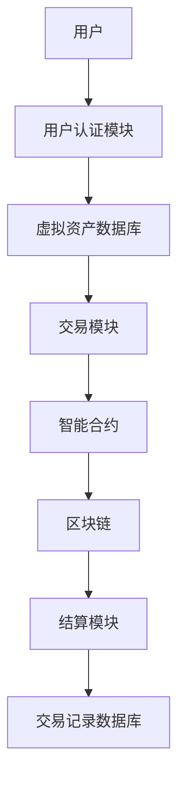

                 

# 巴菲特的价值链分析：元宇宙经济下的价值重构

---

## 关键词  
巴菲特，价值链分析，元宇宙，经济重构，虚拟资产，经济护城河，投资策略

---

## 摘要  
本文将巴菲特的价值链分析方法应用于元宇宙经济的背景下，探讨虚拟资产的价值重构和经济体系的创新。通过结合巴菲特的核心投资理念，分析元宇宙经济中的企业价值、竞争优势、商业模式和风险管理，并提出虚拟资产的估值模型和系统架构设计方案。本文旨在为投资者和企业提供一种新的视角，理解元宇宙经济下的价值重构趋势和机会。

---

## 第一部分：巴菲特的价值链分析基础

### 第1章：巴菲特的价值链分析概述

#### 1.1 巴菲特投资理念的核心要素

##### 1.1.1 巴菲特投资理念的起源与发展  
巴菲特的投资理念起源于对价值投资的深刻理解，他强调企业基本面分析、安全边际和长期投资。其核心思想是通过对企业内在价值的评估，寻找被市场低估的投资标的。

##### 1.1.2 巴菲特价值投资的核心原则  
- **安全边际**：买入价格低于内在价值，确保投资的安全性。  
- **企业护城河**：寻找具有强大竞争优势的企业，确保长期盈利能力。  
- **长期视角**：关注企业的可持续发展能力，而非短期市场波动。  

##### 1.1.3 巴菲特对企业的深度分析方法  
巴菲特通过分析企业的财务报表、行业地位、管理团队和竞争优势，评估企业的内在价值和长期发展潜力。

##### 经济护城河的分类与对比  
| 类型         | 特点                                   | 优劣势分析                           |
|--------------|--------------------------------------|------------------------------------|
| 标准化护城河  | 企业通过规模效应降低成本               | 稳定性高，但难以快速扩展             |
| 知识产权护城河 | 专利、商标等知识产权保护               | 技术壁垒高，但容易被复制             |
| 网络效应护城河 | 用户数量越多，平台价值越高             | 网络效应强，但初期用户获取成本高     |
| 品牌护城河    | 强大的品牌影响力                       | 品牌忠诚度高，但品牌建设需要时间     |

---

### 第2章：元宇宙经济的基本概念与特征

#### 2.1 元宇宙的定义与核心特征

##### 2.1.1 元宇宙的概念与技术基础  
元宇宙是一个虚拟的、去中心化的数字世界，通过区块链、AR/VR、人工智能等技术构建一个平行于现实世界的经济体系。

##### 2.1.2 元宇宙经济体系的构成要素  
- **虚拟资产**：包括虚拟货币、NFTs、虚拟物品等。  
- **交易机制**：基于区块链的去中心化交易系统。  
- **经济模型**：通过智能合约实现价值流动和分配。  

##### 2.1.3 元宇宙经济与传统经济的异同  
| 维度         | 元宇宙经济                          | 传统经济                          |
|--------------|-------------------------------------|------------------------------------|
| 资产类型     | 虚拟资产                            | 实体资产                            |
| 交易机制     | 去中心化交易                        | 中心化交易                        |
| 资产所有权   | 数字化所有权                        | 实体化所有权                        |

---

## 第二部分：巴菲特价值链分析在元宇宙经济中的应用

### 第3章：元宇宙经济中的企业价值重构

#### 3.1 企业价值评估的巴菲特视角

##### 3.1.1 企业价值的构成与影响因素  
- **内在价值**：企业未来现金流的现值。  
- **竞争优势**：企业的经济护城河宽度和深度。  
- **管理团队**：团队的执行力和战略能力。  

##### 3.1.2 巴菲特的企业价值评估框架  
巴菲特通过分析企业的财务报表、行业地位和竞争优势，评估其内在价值和成长潜力。

##### 3.1.3 元宇宙经济中企业价值重构的特殊性  
- **虚拟资产的价值评估**：虚拟资产的流动性、稀缺性和使用价值需要重新定义。  
- **经济护城河的变化**：元宇宙经济中的竞争优势可能来源于网络效应、虚拟资产的稀缺性和技术壁垒。  

---

### 第4章：元宇宙经济中的虚拟资产价值评估

#### 4.1 虚拟资产的经济属性分析

##### 4.1.1 虚拟资产的稀缺性与独特性  
虚拟资产的稀缺性通过区块链技术实现，独特的数字内容（如NFTs）赋予其更高的价值。

##### 4.1.2 虚拟资产的使用价值与交换价值  
- **使用价值**：虚拟资产在元宇宙中的功能和用途。  
- **交换价值**：市场对虚拟资产的需求和供给关系决定的价格。  

##### 4.1.3 虚拟资产的流动性与交易机制  
- **流动性**：虚拟资产在不同平台之间的转移和交易能力。  
- **交易机制**：基于区块链的去中心化交易系统确保透明性和安全性。  

---

### 第5章：元宇宙经济中的商业模式创新

#### 5.1 元宇宙经济中的商业模式分类

##### 5.1.1 虚拟商品销售模式  
- **典型案例**：游戏内虚拟道具的销售。  
- **特点**：通过虚拟商品的稀缺性和独特性吸引用户购买。  

##### 5.1.2 虚拟服务订阅模式  
- **典型案例**：虚拟社交平台的会员服务。  
- **特点**：通过订阅模式实现稳定的收入来源。  

##### 5.1.3 虚拟资产交易模式  
- **典型案例**：虚拟货币和NFTs的交易。  
- **特点**：通过智能合约实现透明的交易和价值分配。  

---

## 第三部分：项目实战与系统设计

### 第6章：虚拟资产交易平台的设计与实现

#### 6.1 项目背景与目标  
通过设计一个虚拟资产交易平台，展示如何将巴菲特的价值链分析方法应用于元宇宙经济中的虚拟资产交易。

#### 6.2 系统架构设计  

##### 6.2.1 系统功能设计  
- **用户模块**：用户注册、登录、虚拟资产持有与交易。  
- **交易模块**：虚拟资产的上架、 bidding 和成交。  
- **结算模块**：基于区块链的智能合约实现交易结算。  

##### 6.2.2 系统架构图  

---

## 第四部分：总结与展望

### 7.1 元宇宙经济中的投资机会与风险

#### 7.1.1 投资机会  
- **虚拟资产投资**：通过分析虚拟资产的稀缺性和流动性，寻找高价值的虚拟资产。  
- **元宇宙平台投资**：投资具有强大网络效应和经济护城河的元宇宙平台。  

#### 7.1.2 风险与挑战  
- **虚拟资产的波动性**：虚拟资产价格波动剧烈，投资风险较高。  
- **政策风险**：元宇宙经济的监管政策尚未完善，存在不确定性。  

---

## 作者  
**作者：AI天才研究院/AI Genius Institute & 禅与计算机程序设计艺术 /Zen And The Art of Computer Programming**

