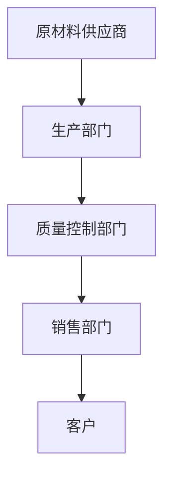
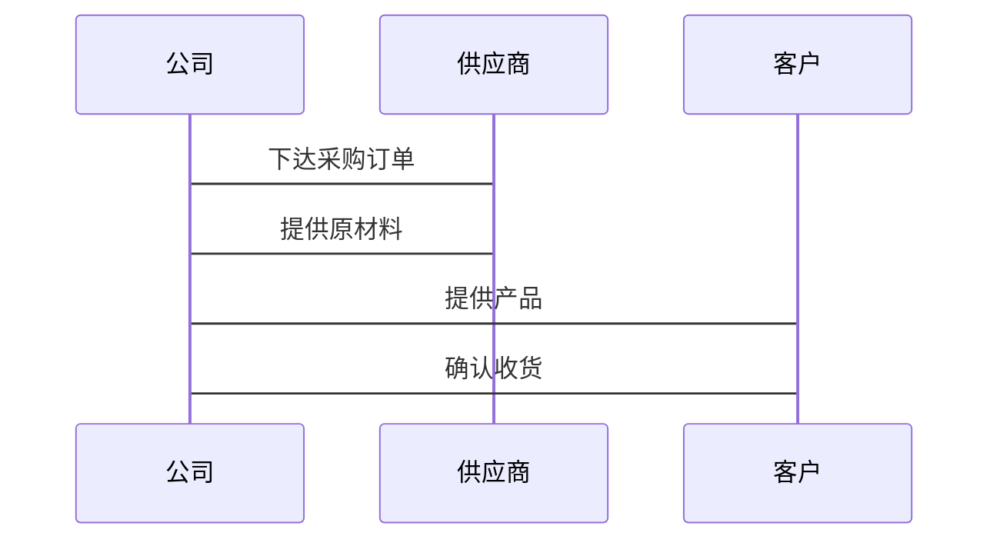

                 


# 巴菲特的价值链分析：理解公司在产业中的位置

**关键词**：巴菲特、价值链分析、企业战略、投资分析、产业位置、竞争力分析

**摘要**：本文通过分析巴菲特的价值链分析方法，详细探讨了如何理解公司在产业中的位置。从基础概念到核心要素，从算法原理到系统架构设计，结合实际案例，全面解析了巴菲特的价值链分析在企业战略中的应用，为读者提供了深入的分析和实践指导。

---

## 第一部分：巴菲特的价值链分析基础

### 第1章：巴菲特的价值链分析概述

#### 1.1 巴菲特的分析方法
##### 1.1.1 巴菲特的投资理念
巴菲特的投资理念以“长期价值投资”为核心，他注重企业的内在价值，而非市场的短期波动。他的分析方法强调企业所在行业的位置、竞争优势和财务状况。

##### 1.1.2 价值链分析的定义
价值链分析是一种通过分解企业运营的各个环节，评估其在行业中的竞争力和价值创造能力的方法。它帮助投资者识别企业的核心竞争力和潜在风险。

##### 1.1.3 价值链分析的核心要素
价值链的核心要素包括上游资源获取、生产过程、销售与客户关系管理。这些环节的效率和成本直接影响企业的盈利能力。

#### 1.2 价值链分析的历史演变
##### 1.2.1 传统价值链理论
传统价值链理论由迈克尔·波特提出，强调企业内部价值链的优化和成本控制。

##### 1.2.2 巴菲特对价值链分析的创新
巴菲特在波特的基础上，加入了对企业财务指标的关注，如ROE（净资产收益率）和ROA（资产回报率），以量化企业的价值创造能力。

##### 1.2.3 价值链分析的现代发展
现代价值链分析结合了数字化和数据驱动的方法，利用大数据和人工智能技术进一步优化分析过程。

#### 1.3 巴菲特价值链分析与企业战略
##### 1.3.1 价值链分析对企业战略的影响
价值链分析帮助企业识别核心竞争力，优化资源配置，制定更有针对性的战略。

##### 1.3.2 价值链分析在企业竞争力中的作用
通过分析价值链的各个环节，企业可以发现效率瓶颈，降低成本，提升整体竞争力。

##### 1.3.3 价值链分析与企业价值创造
巴菲特的价值链分析注重企业的价值创造能力，通过量化指标评估企业的长期盈利能力。

#### 1.4 本章小结
本章介绍了巴菲特的价值链分析方法，强调其在企业战略中的重要性，并为后续的深入分析奠定了基础。

---

## 第二部分：价值链分析的核心概念与联系

### 第2章：价值链分析的核心要素

#### 2.1 价值链的构成环节
##### 2.1.1 上游环节
上游环节包括原材料采购和供应商管理。高效的上游管理可以降低采购成本，确保原材料供应的稳定性。

##### 2.1.2 中游环节
中游环节涉及生产过程和质量管理。优化生产流程和提高产品质量是提升企业竞争力的关键。

##### 2.1.3 下游环节
下游环节包括销售、客户关系管理和售后服务。强大的销售网络和客户关系有助于提升企业的市场份额。

#### 2.2 价值链分析的核心要素对比
| 要素 | 描述 |
|------|------|
| 上游 | 原材料采购和供应商管理 |
| 中游 | 生产过程和质量管理 |
| 下游 | 销售和客户关系管理 |

#### 2.3 价值链分析的实体关系图



#### 2.4 价值链分析的流程图


---

## 第三部分：价值链分析的算法原理

### 第3章：价值链分析的数学模型

#### 3.1 企业绩效指标的计算

##### 3.1.1 净资产收益率（ROE）
ROE = 净利润 / 平均股东权益
$$ROE = \frac{\text{净利润}}{\text{平均股东权益}}$$

##### 3.1.2 资产回报率（ROA）
ROA = 净利润 / 平均资产总额
$$ROA = \frac{\text{净利润}}{\text{平均资产总额}}$$

##### 3.1.3 股东权益回报率（ROE）
ROE的计算公式如上，反映了企业的盈利能力。

#### 3.2 价值链分析的算法流程图


#### 3.3 代码实现

##### 3.3.1 数据收集与处理

```python
import pandas as pd

# 假设数据为上市公司的财务数据
data = pd.read_csv('financial_data.csv')

# 计算ROE和ROA
data['ROE'] = data['净利润'] / data['平均股东权益']
data['ROA'] = data['净利润'] / data['平均资产总额']
```

##### 3.3.2 数据可视化

```python
import matplotlib.pyplot as plt

plt.figure(figsize=(10, 6))
plt.plot(data['公司名称'], data['ROE'], 'b-', label='ROE')
plt.plot(data['公司名称'], data['ROA'], 'r-', label='ROA')
plt.title('企业绩效指标分析')
plt.xlabel('公司名称')
plt.ylabel('比率')
plt.legend()
plt.show()
```

---

## 第四部分：系统分析与架构设计方案

### 第4章：系统分析与架构设计

#### 4.1 问题场景介绍
以苹果公司为例，分析其在电子制造行业中的价值链位置。

#### 4.2 系统功能设计
##### 4.2.1 领域模型图

```mermaid
classDiagram
    class 公司 {
        原材料供应商
        生产部门
        销售部门
        客户
    }
    company -> supplier
    company -> production
    production -> quality
    company -> sales
    sales -> customer
```

#### 4.3 系统架构设计
##### 4.3.1 架构图


#### 4.4 接口设计
##### 4.4.1 输入接口
- 原材料采购订单
- 生产计划

##### 4.4.2 输出接口
- 产品交付
- 销售报告

#### 4.5 交互序列图



---

## 第五部分：项目实战

### 第5章：项目实战

#### 5.1 环境安装
安装必要的工具，如Python、Pandas、Matplotlib。

#### 5.2 核心代码实现
##### 5.2.1 数据处理

```python
import pandas as pd
import matplotlib.pyplot as plt

# 加载数据
data = pd.read_csv('financial_data.csv')

# 计算ROE和ROA
data['ROE'] = data['净利润'] / data['平均股东权益']
data['ROA'] = data['净利润'] / data['平均资产总额']

# 可视化
plt.figure(figsize=(12, 8))
plt.plot(data['公司名称'], data['ROE'], 'b-', label='ROE')
plt.plot(data['公司名称'], data['ROA'], 'r-', label='ROA')
plt.title('企业绩效指标分析')
plt.xlabel('公司名称')
plt.ylabel('比率')
plt.legend()
plt.show()
```

#### 5.3 案例分析
以苹果公司为例，分析其在电子制造行业中的价值链位置，包括上游供应链、生产流程和下游销售网络。

#### 5.4 项目总结
通过实际案例分析，验证了巴菲特价值链分析的有效性，并展示了如何通过数据分析优化企业价值。

---

## 第六部分：总结与建议

### 第6章：总结与建议

#### 6.1 本章总结
本文详细介绍了巴菲特的价值链分析方法，从理论到实践，结合实际案例，展示了如何通过分析企业的价值链位置，优化企业战略。

#### 6.2 最佳实践
- 在分析企业价值链时，结合企业的财务数据和市场环境。
- 使用数据分析工具和可视化方法，提高分析效率。
- 定期更新分析结果，以应对市场变化。

#### 6.3 注意事项
- 数据分析需要准确和全面，避免片面结论。
- 价值链分析是动态过程，需根据实际情况调整分析框架。

#### 6.4 拓展阅读
推荐阅读迈克尔·波特的《竞争优势》和巴菲特的《投资之道》。

---

**作者：AI天才研究院/AI Genius Institute & 禅与计算机程序设计艺术 /Zen And The Art of Computer Programming**

---

本文通过系统的分析和实践，深入探讨了巴菲特的价值链分析方法，为读者提供了全面的理论和实践指导。

