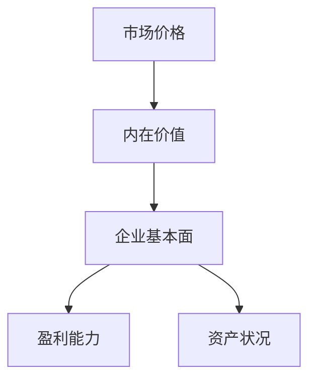
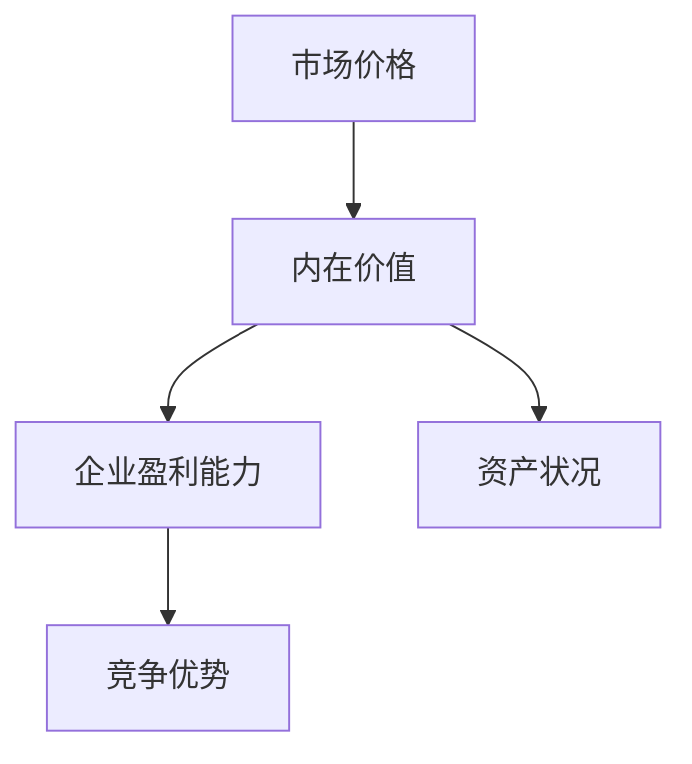
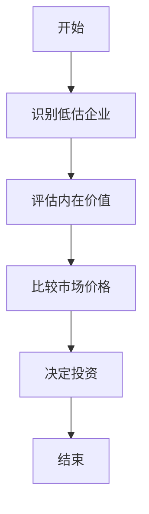
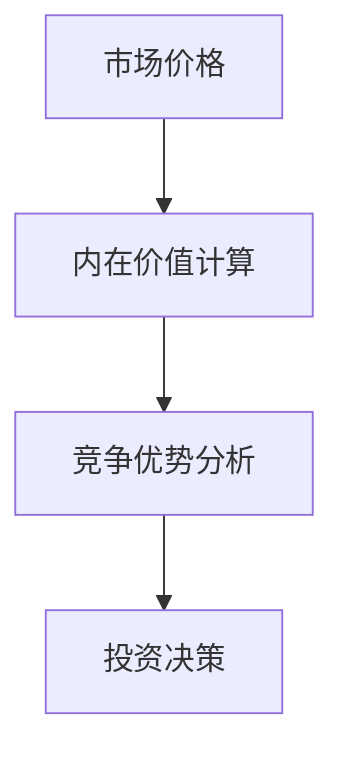
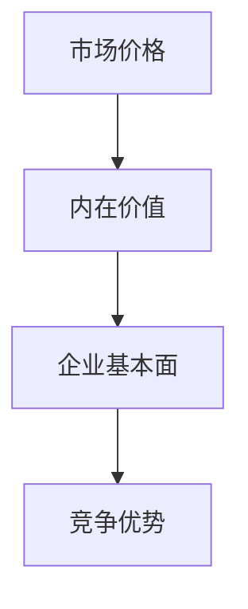

                 


# 巴菲特的价格与价值区分：投资的核心智慧

## 关键词：巴菲特，价值投资，价格与价值，投资策略，财务分析，竞争优势

## 摘要：  
本文深入探讨巴菲特的价值投资理念，特别是价格与价值的区分。通过分析巴菲特的核心思想，包括价值评估、投资策略、财务分析和竞争优势，本文旨在揭示投资成功的关键要素。结合数学模型和实际案例，文章为读者提供系统的投资方法，帮助他们在复杂市场中做出明智决策。

---

## 第一章：巴菲特投资理念的核心概念

### 1.1 巴菲特投资理念的背景与起源

#### 1.1.1 投资市场的基本问题  
投资市场的核心问题是价格波动与内在价值的差异。投资者常常陷入短期价格波动的干扰，忽视了企业的真实价值。

#### 1.1.2 巴菲特投资理念的提出背景  
巴菲特在20世纪50年代提出价值投资理念，强调通过分析企业内在价值，寻找市场价格低于内在价值的投资机会。

#### 1.1.3 价格与价值区分的核心意义  
价格是市场的反映，而价值是企业的内在质量。区分两者有助于投资者避免短期波动的影响，实现长期收益。

### 1.2 巴菲特投资理念的核心要素

#### 1.2.1 价格与价值的定义与区别  
- **价格**：市场价格，受情绪和市场波动影响。
- **价值**：内在价值，基于基本面分析。

#### 1.2.2 核心概念的数学模型  
**内在价值公式**：  
$$ \text{内在价值} = \frac{\text{现金流}}{\text{折现率}} $$

#### 1.2.3 实体关系图  


---

## 第二章：价格与价值区分的核心原理

### 2.1 价格与价值的数学模型

#### 2.1.1 价格与价值的公式推导  
$$ \text{安全边际} = \text{内在价值} - \text{市场价格} $$

#### 2.1.2 价值评估的公式与计算  
$$ \text{DCF模型} = \sum_{t=1}^{n} \frac{\text{现金流}}{(1+r)^t} + \text{终值} $$

#### 2.1.3 价格波动的数学分析  
使用随机游走模型分析价格波动：  
$$ P(t) = P(0) + \mu t + \sigma \sqrt{t} \cdot Z $$

### 2.2 价格与价值的实体关系图



---

## 第三章：巴菲特投资策略的算法原理

### 3.1 投资策略的算法流程

#### 3.1.1 算法流程图的绘制



#### 3.1.2 算法流程图的详细说明  
1. 识别低估企业：寻找市场价格低于内在价值的企业。
2. 评估内在价值：使用DCF模型计算企业价值。
3. 比较市场价格：确定是否存在安全边际。
4. 决定投资：基于安全边际和竞争优势进行投资。

### 3.2 投资策略的数学模型

#### 3.2.1 投资组合优化的数学公式  
$$ \text{收益} = \sum w_i \cdot r_i $$  
$$ \text{风险} = \sum w_i \cdot \sigma_i^2 $$  

#### 3.2.2 投资组合优化的算法实现  
使用均值-方差优化模型进行投资组合优化。

---

## 第四章：巴菲特投资理念的系统架构

### 4.1 投资系统的需求分析

#### 4.1.1 投资系统的目标  
构建一个能够评估企业内在价值、分析竞争优势的系统。

#### 4.1.2 投资系统的功能需求  
- 内在价值计算
- 市场价格分析
- 竞争优势评估

### 4.2 投资系统的架构设计

#### 4.2.1 系统架构图的绘制



#### 4.2.2 系统架构图的详细说明  
1. 市场价格输入：分析当前市场价格。
2. 内在价值计算：使用DCF模型评估企业价值。
3. 竞争优势分析：评估企业的竞争优势。
4. 投资决策：基于分析结果做出投资决策。

---

## 第五章：巴菲特投资理念的项目实战

### 5.1 项目环境的安装与配置

#### 5.1.1 系统环境的搭建  
安装Python、Pandas、NumPy等工具。

#### 5.1.2 工具的安装与配置  
使用pip安装相关库：  
```bash
pip install pandas numpy matplotlib
```

### 5.2 投资模型的核心实现

#### 5.2.1 价格与价值区分的代码实现  

```python
import pandas as pd
import numpy as np

def calculate_intrinsic_value(cash_flow, discount_rate):
    return cash_flow / (1 + discount_rate)

# 示例数据
cash_flow = 100
discount_rate = 0.05

intrinsic_value = calculate_intrinsic_value(cash_flow, discount_rate)
print(f"内在价值：{intrinsic_value}")
```

#### 5.2.2 投资组合优化的代码实现  

```python
import numpy as np

def portfolio_optimization(returns, weights):
    return np.sum(weights * returns)

# 示例数据
returns = [0.05, 0.06, 0.04]
weights = [1/3, 1/3, 1/3]

optimal_return = portfolio_optimization(returns, weights)
print(f"最优收益：{optimal_return}")
```

### 5.3 投资模型的分析与解读

#### 5.3.1 现金流折现模型的分析  
通过DCF模型评估企业的内在价值，识别市场价格低估的投资机会。

#### 5.3.2 竞争优势分析的解读  
评估企业的竞争优势，选择具有可持续竞争优势的企业进行投资。

---

## 第六章：巴菲特投资理念的最佳实践与注意事项

### 6.1 投资策略的注意事项

#### 6.1.1 投资中的常见误区  
避免短期价格波动的影响，坚持长期投资。

#### 6.1.2 投资中的风险控制  
分散投资，设置止损点，避免过度集中风险。

### 6.2 投资策略的拓展阅读

#### 6.2.1 相关书籍推荐  
- 《巴菲特致股东的信》
- 《价值投资实战策略》

#### 6.2.2 相关论文推荐  
- Graham, B. (1949). *The Intelligent Investor*

---

## 第七章：巴菲特投资理念的总结与展望

### 7.1 投资理念的总结

#### 7.1.1 核心观点的回顾  
- 价格是市场的反映，价值是企业的内在质量。
- 通过寻找市场价格低于内在价值的投资机会，实现长期收益。

#### 7.1.2 投资理念的未来发展  
结合现代金融工具和技术，进一步完善价值投资策略，应对复杂多变的市场环境。

### 7.2 投资理念的实践建议

#### 7.2.1 初学者的建议  
- 学习基本面分析，掌握DCF模型。
- 研究企业的财务报表，识别竞争优势。

#### 7.2.2 投资者的注意事项  
- 避免短期价格波动的干扰，坚持长期投资。
- 设置合理的目标，避免过度追求短期收益。

---

## 第八章：巴菲特投资理念的数学公式与图表

### 8.1 核心公式汇总

#### 8.1.1 价格与价值区分的公式  
$$ \text{内在价值} = \frac{\text{现金流}}{\text{折现率}} $$

#### 8.1.2 投资组合优化的公式  
$$ \text{收益} = \sum w_i \cdot r_i $$

### 8.2 实体关系图



---

## 作者：AI天才研究院 & 禅与计算机程序设计艺术

---

这篇文章系统地介绍了巴菲特的价值投资理念，结合数学模型、算法原理和实际案例，帮助读者深入理解价格与价值的区分，并将其应用于实际投资中。

