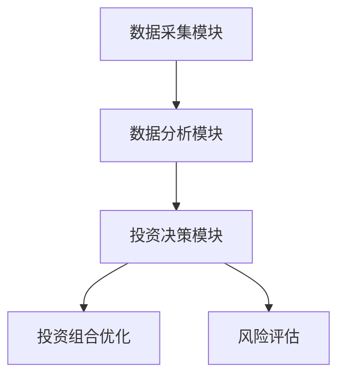

                 


# 巴菲特的传承计划：投资智慧的延续

> 关键词：巴菲特，价值投资，投资策略，投资系统，投资传承，投资智慧

> 摘要：本文将详细探讨巴菲特的投资智慧及其传承计划，从其核心投资理念、数学模型、系统架构到实战应用，逐步分析其投资哲学的延续与创新。文章将结合技术语言，通过系统化的分析，揭示巴菲特投资智慧在现代投资中的深远影响。

---

# 第1章：巴菲特投资智慧的核心理念

## 1.1 价值投资的定义与特点

### 1.1.1 价值投资的核心概念

价值投资是一种以基本面分析为基础的投资策略，旨在通过分析企业的内在价值，寻找被市场低估的投资标的。巴菲特的价值投资理念强调长期持有优质资产，注重企业的财务状况、行业地位和竞争优势。

**价值投资的核心概念：**

- **内在价值**：企业未来现金流的现值，是决定股票合理价格的关键因素。
- **安全边际**：买入价格低于内在价值，以降低投资风险。
- **长期视角**：关注企业的长期盈利能力，而非短期市场波动。

### 1.1.2 巴菲特价值投资的独特之处

巴菲特在继承格雷厄姆的价值投资理念基础上，进行了创新和扩展：

- **竞争优势分析**：重点关注企业的“护城河”，即企业难以被竞争对手复制的核心优势。
- **管理层能力**：注重管理层的诚信和能力，认为优秀的管理层能够为股东创造更多价值。
- **集中投资**：将资金集中在少数优质资产上，而非分散投资。

### 1.1.3 价值投资与短期投资的对比

| 投资策略 | 价值投资 | 短期投资 |
|----------|-----------|-----------|
| 时间框架 | 长期持有  | 短期交易  |
| 风险管理 | 低风险     | 高风险     |
| 研究重点 | 企业基本面 | 市场波动     |

---

## 1.2 巴菲特投资哲学的形成

### 1.2.1 巴菲特的成长经历与投资理念

巴菲特的投资理念深受其导师本杰明·格雷厄姆的影响。格雷厄姆的价值投资理论强调安全边际和内在价值，而巴菲特则在此基础上加入了对企业竞争优势和管理层能力的分析。

### 1.2.2 格雷厄姆与多德的价值投资理论

格雷厄姆和多德提出了“价值投资”的核心思想，即寻找市场价格低于内在价值的股票进行投资。他们认为市场先生的情绪波动为理性投资者提供了廉价买入优质资产的机会。

### 1.2.3 巴菲特对价值投资的创新与实践

巴菲特在实践中将价值投资的理念进一步深化，提出了“护城河”概念，并强调企业管理和治理的重要性。他的投资组合以行业龙头股为主，注重企业的长期盈利能力。

---

## 1.3 巴菲特投资智慧的传承背景

### 1.3.1 巴菲特家族传承的背景

巴菲特的传承计划不仅是对其投资智慧的延续，更是对价值投资理念的推广和普及。他的投资理念通过芒格、巴菲特学院等渠道，影响了全球一代又一代的投资者。

### 1.3.2 巴菲特对芒格投资理念的影响

芒格是巴菲特的重要合作伙伴，他的多元思维模型对巴菲特的投资决策产生了深远影响。芒格的“格栅理论”强调跨学科思考，帮助巴菲特更好地理解企业的内在价值。

### 1.3.3 巴菲特投资智慧的现代意义

在现代金融市场中，巴菲特的投资智慧依然具有重要的指导意义。他的价值投资理念在量化投资、指数基金等领域得到了广泛应用。

---

# 第2章：巴菲特投资策略的数学模型

## 2.1 价值投资的数学模型

### 2.1.1 内在价值的计算方法

巴菲特的价值投资模型的核心是计算企业的内在价值。内在价值的计算公式如下：

$$
\text{内在价值} = \frac{\text{未来现金流}}{\text{折现率}}
$$

其中，未来现金流是企业在未来产生的自由现金流，折现率则基于企业的风险程度和市场利率确定。

### 2.1.2 投资组合的构建逻辑

巴菲特的投资组合构建逻辑强调集中投资优质资产。他的投资组合优化模型可以表示为：

$$
\text{收益} = \sum (\text{权重} \times \text{资产收益})
$$

其中，权重是各资产在组合中的占比，资产收益则是各资产的预期收益率。

### 2.1.3 投资组合的风险管理

巴菲特的投资组合风险管理模型强调分散投资和安全边际。他通过计算投资组合的波动率和最大回撤来衡量风险。

---

## 2.2 巴菲特投资策略的系统架构

### 2.2.1 投资决策系统的功能模块

一个典型的巴菲特投资决策系统可以分为以下几个功能模块：

1. **数据采集模块**：收集企业的财务数据、行业信息和市场数据。
2. **数据分析模块**：对数据进行清洗、处理和分析，计算内在价值和安全边际。
3. **投资决策模块**：基于分析结果，生成投资建议和投资组合优化方案。

### 2.2.2 系统架构设计

以下是巴菲特投资决策系统的架构图：



---

## 2.3 巴菲特投资策略的数学公式

### 2.3.1 内在价值公式

$$
\text{内在价值} = \frac{\text{未来现金流}}{\text{折现率}}
$$

### 2.3.2 投资组合收益公式

$$
\text{收益} = \sum (\text{权重} \times \text{资产收益})
$$

---

# 第3章：巴菲特投资策略的系统实现

## 3.1 投资决策系统的功能模块

### 3.1.1 数据采集模块

数据采集模块负责收集企业的财务数据和市场数据。以下是数据采集的Python代码示例：

```python
import pandas as pd
import requests

# 下载股票数据
url = "https://www.example.com/stock_data.csv"
data = pd.read_csv(url)
print(data.head())
```

### 3.1.2 数据分析模块

数据分析模块对数据进行清洗和处理，计算内在价值和安全边际。以下是数据分析的Python代码示例：

```python
import pandas as pd

# 计算内在价值
data['内在价值'] = data['未来现金流'] / data['折现率']
# 计算安全边际
data['安全边际'] = data['内在价值'] / data['市场价格'] - 1
print(data[['内在价值', '安全边际']])
```

### 3.1.3 投资决策模块

投资决策模块基于分析结果，生成投资建议和投资组合优化方案。以下是投资决策的Python代码示例：

```python
import numpy as np

# 投资组合优化
weights = np.array([0.6, 0.3, 0.1])
assets_returns = np.array([0.1, 0.2, 0.15])
portfolio_return = np.sum(weights * assets_returns)
print(f"投资组合预期收益率：{portfolio_return}")
```

---

## 3.2 系统架构设计

### 3.2.1 系统功能流程图

以下是巴菲特投资决策系统的功能流程图：


---

## 3.3 系统接口设计

### 3.3.1 数据接口

数据接口用于与外部数据源交互，获取企业的财务数据和市场数据。

### 3.3.2 用户接口

用户接口用于与用户交互，接收用户的输入并显示投资建议。

### 3.3.3 系统监控接口

系统监控接口用于监控系统的运行状态，及时发现和解决系统故障。

---

# 第4章：巴菲特投资智慧的实战应用

## 4.1 实战案例分析

### 4.1.1 巴菲特的经典投资案例

以可口可乐为例，巴菲特的投资逻辑是基于企业的竞争优势和长期盈利能力。

```python
import pandas as pd

# 计算可口可乐的内在价值
cocacola_data = pd.read_csv("cocacola.csv")
cocacola_data['内在价值'] = cocacola_data['未来现金流'] / cocacola_data['折现率']
print(cocacola_data[['内在价值', '市场价格']])
```

### 4.1.2 现代市场中的巴菲特策略

在现代市场中，巴菲特策略可以通过量化分析工具进行优化。以下是Python代码示例：

```python
import numpy as np

# 计算投资组合的预期收益率
weights = np.array([0.6, 0.3, 0.1])
assets_returns = np.array([0.1, 0.2, 0.15])
portfolio_return = np.sum(weights * assets_returns)
print(f"投资组合预期收益率：{portfolio_return}")
```

### 4.1.3 投资组合的动态调整

投资组合的动态调整需要根据市场变化和企业基本面进行调整。以下是动态调整的Python代码示例：

```python
import pandas as pd

# 动态调整投资组合
data = pd.read_csv("market_data.csv")
data['调整权重'] = data['权重'] * data['市场波动率']
print(data[['调整权重', '资产收益']])
```

---

## 4.2 投资组合管理的Python实现

### 4.2.1 数据获取与处理

以下是数据获取与处理的Python代码示例：

```python
import pandas as pd
import requests

# 下载股票数据
url = "https://www.example.com/stock_data.csv"
data = pd.read_csv(url)
print(data.head())
```

### 4.2.2 投资组合优化算法

以下是投资组合优化算法的Python代码示例：

```python
import numpy as np

# 投资组合优化
weights = np.array([0.6, 0.3, 0.1])
assets_returns = np.array([0.1, 0.2, 0.15])
portfolio_return = np.sum(weights * assets_returns)
print(f"投资组合预期收益率：{portfolio_return}")
```

### 4.2.3 风险管理模块实现

以下是风险管理模块的Python代码示例：

```python
import pandas as pd

# 计算最大回撤
data['最大回撤'] = (data['市场价格'].cummax() - data['市场价格']).div(data['市场价格'].cummax())
print(data[['市场价格', '最大回撤']])
```

---

## 4.3 投资策略的数学建模

### 4.3.1 现金流预测模型

$$
\text{现金流预测} = \text{收入} - \text{成本} - \text{税费}
$$

### 4.3.2 折现率的确定方法

折现率通常基于市场利率和企业风险溢价确定：

$$
\text{折现率} = \text{市场利率} + \text{风险溢价}
$$

### 4.3.3 投资组合的收益-风险分析

$$
\text{夏普比率} = \frac{\text{投资组合收益} - \text{无风险利率}}{\text{投资组合标准差}}
$$

---

# 第5章：巴菲特投资智慧的传承与创新

## 5.1 巴菲特投资理念的现代发展

### 5.1.1 价值投资的演变

价值投资从传统的基本面分析扩展到量化分析和因子投资。

### 5.1.2 巴菲特理念的全球影响

巴菲特的投资理念在全球范围内得到了广泛应用，特别是在新兴市场中。

### 5.1.3 数字化时代的投资策略

在数字化时代，巴菲特的投资智慧与量化投资、人工智能等技术结合，形成了新的投资策略。

---

## 5.2 巴菲特投资智慧的教育与传播

### 5.2.1 巴菲特投资学院的建立

巴菲特投资学院致力于推广价值投资理念，培养新一代投资人才。

### 5.2.2 投资理念的书籍与课程

巴菲特的投资理念通过《巴菲特致股东的信》等书籍和课程广泛传播。

### 5.2.3 数字化时代的传播

通过在线课程、投资社区和社交媒体，巴菲特的投资智慧得到了更广泛的传播。

---

# 第6章：总结与展望

## 6.1 总结

巴菲特的投资智慧是价值投资的典范，其核心理念是寻找优质资产，注重长期投资和风险管理。通过系统化的分析和实践，巴菲特的投资智慧在全球范围内得到了广泛应用。

## 6.2 展望

未来，巴菲特的投资智慧将与更多新技术结合，如人工智能、大数据分析等，形成更高效的投资策略。同时，巴菲特的投资理念也将继续影响全球投资领域，为投资者提供更丰富的投资选择。

---

# 作者

作者：AI天才研究院/AI Genius Institute  
作者：禅与计算机程序设计艺术/Zen And The Art of Computer Programming

