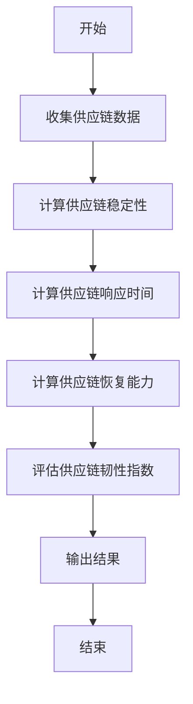

                 


# 巴菲特的供应链韧性分析：全球化时代的重要考量

> 关键词：供应链韧性，巴菲特，投资分析，全球化，系统架构，风险评估，企业竞争力

> 摘要：本文探讨了供应链韧性在全球化时代的重要性，分析了巴菲特的投资分析框架，详细讲解了供应链韧性分析的核心概念、数学模型和算法原理，结合系统架构设计和实际案例，展示了如何通过供应链韧性分析评估企业的竞争力，并提出了最佳实践和未来研究方向。

---

# 正文

## 第1章: 供应链韧性与全球化背景

### 1.1 供应链韧性的概念与重要性

供应链韧性是指在面对外部干扰和内部变化时，企业供应链维持稳定性和持续性的能力。在全球化背景下，供应链韧性已成为企业竞争力的关键因素。供应链韧性涉及多个维度，包括稳定性、响应性和恢复能力。

### 1.2 巴菲特投资分析框架概述

巴菲特的投资理念强调长期价值和企业基本面分析。他认为企业的供应链韧性是评估企业竞争力的重要因素。通过分析企业的供应链结构、供应商稳定性以及应对市场波动的能力，巴菲特能够识别出具有长期竞争优势的企业。

### 1.3 供应链韧性与企业竞争力

供应链韧性直接影响企业的运营效率和成本控制。在全球化背景下，供应链韧性能够帮助企业更好地应对市场波动和供应链中断的风险。巴菲特通过分析供应链韧性，能够评估企业在不同市场环境下的适应能力和盈利能力。

---

## 第2章: 供应链韧性分析的核心概念

### 2.1 核心概念与属性

供应链韧性分析涉及多个核心概念，包括供应链稳定性、响应时间和恢复能力。这些概念的属性特征可以通过对比表格来展示，如下：

| 概念         | 属性特征                      |
|--------------|------------------------------|
| 稳定性       | 供应链在正常情况下的表现    |
| 响应时间     | 供应链对需求变化的反应速度  |
| 恢复能力     | 供应链在中断后的恢复能力    |

### 2.2 供应链韧性分析的ER实体关系图

通过ER图展示供应链韧性分析的核心实体及其关系：

```mermaid
er
  entity: 供应链韧性评估指标
  entity: 企业供应链数据
  entity: 全球化市场环境
  relation: 供应链韧性评估指标与企业供应链数据: 关联关系
  relation: 企业供应链数据与全球化市场环境: 关联关系
```

### 2.3 供应链韧性指数计算公式

供应链韧性指数计算公式为：

$$ R = \frac{S}{T} $$

其中，$S$ 表示供应链的稳定性，$T$ 表示供应链的响应时间。

---

## 第3章: 供应链韧性分析的算法原理

### 3.1 算法原理概述

供应链韧性分析的算法旨在通过数学模型评估企业的供应链韧性。核心思想是通过权重分配和风险评估，量化供应链的稳定性、响应时间和恢复能力。

### 3.2 供应链风险评估模型

供应链风险评估模型如下：

$$ Risk = \sum_{i=1}^{n} (w_i \times r_i) $$

其中，$w_i$ 表示第 $i$ 个风险因素的权重，$r_i$ 表示第 $i$ 个风险因素的风险值。

### 3.3 供应链韧性分析算法的流程图



---

## 第4章: 供应链韧性分析的系统架构设计

### 4.1 系统功能设计

供应链韧性分析系统功能模块包括数据采集、数据分析、风险评估和结果展示。

### 4.2 系统架构图


### 4.3 系统接口设计

供应链韧性分析系统的接口设计包括数据输入接口、模型调用接口和结果输出接口。

### 4.4 系统交互流程图

```mermaid
sequence
    用户 -> 数据采集模块: 提供供应链数据
    数据采集模块 -> 数据分析模块: 传输数据
    数据分析模块 -> 风险评估模块: 调用风险评估模型
    风险评估模块 -> 结果展示模块: 输出评估结果
    用户 <- 结果展示模块: 显示评估结果
```

---

## 第5章: 供应链韧性分析的项目实战

### 5.1 实战环境安装

供应链韧性分析系统需要安装Python、数据处理库（如Pandas）和可视化库（如Matplotlib）。

### 5.2 核心代码实现

供应链韧性指数计算代码如下：

```python
def calculate_supply_chain_resilience(stability, response_time):
    return stability / response_time

# 示例数据
stability = 0.8
response_time = 2
resilience = calculate_supply_chain_resilience(stability, response_time)
print("供应链韧性指数:", resilience)
```

### 5.3 案例分析

以某企业为例，分析其供应链韧性。通过计算得出供应链韧性指数为0.4，表明企业供应链在当前环境下具有一定的韧性，但仍需优化响应时间。

### 5.4 代码应用解读

代码实现展示了如何将供应链韧性指数计算公式应用于实际数据，帮助投资者快速评估企业的供应链韧性。

---

## 第6章: 总结与最佳实践

### 6.1 总结

供应链韧性在全球化时代的重要性不言而喻。通过巴菲特的投资分析框架，我们可以更深入地理解供应链韧性对企业竞争力的影响。

### 6.2 最佳实践

- 定期评估供应链韧性指数
- 优化供应链结构，提高响应能力
- 建立风险评估机制，降低供应链中断风险

### 6.3 小结

供应链韧性分析是全球化时代企业竞争力的重要考量。通过本文的分析，读者可以更好地理解供应链韧性的重要性，并能够实际应用相关方法评估企业的供应链韧性。

### 6.4 注意事项

在实际应用中，需结合企业具体情况调整供应链韧性分析模型的参数，确保评估结果的准确性。

### 6.5 拓展阅读

建议进一步阅读供应链管理领域的经典著作，深入了解供应链韧性分析的最新研究和实践。

---

## 作者

作者：AI天才研究院/AI Genius Institute  
禅与计算机程序设计艺术/Zen And The Art of Computer Programming

