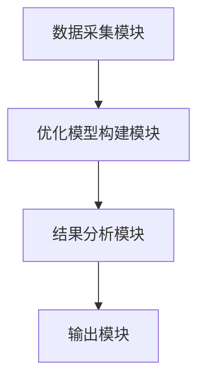

                 

# 巴菲特的供应链韧性分析：量子优化在全球物流网络中的应用

---

## 关键词

- 供应链韧性
- 量子优化
- 物流网络
- 巴菲特投资理念
- 量子计算

---

## 摘要

本文探讨了巴菲特的供应链韧性分析方法，并结合量子优化技术在物流网络中的应用，提出了一种提升供应链韧性的新思路。通过分析量子优化的核心原理及其在物流网络中的应用场景，展示了如何利用量子优化技术优化供应链结构，降低运营成本，提升企业应对供应链中断的能力。文章还结合实际案例，详细讲解了量子优化算法的实现过程，并提出了系统的架构设计和最佳实践建议。

---

## 第一部分: 巴菲特的供应链韧性分析与量子优化概述

### 第1章: 供应链韧性与量子优化的背景介绍

#### 1.1 供应链韧性的概念与重要性

供应链韧性是指在面对突发事件或供应链中断时，企业能够快速恢复并维持业务运作的能力。在全球化和疫情时代，供应链韧性成为企业竞争力的重要组成部分。供应链韧性涉及供应链的结构、复杂性、风险来源和评估指标等多个方面。

供应链韧性的重要性体现在以下几个方面：
- **降低风险**：通过增强供应链的弹性，企业能够更好地应对供应链中断的风险。
- **提高效率**：优化的供应链结构能够提升整体运营效率，降低成本。
- **增强竞争力**：具备强大供应链韧性的企业能够在市场中更具竞争力。

#### 1.2 量子优化的基本原理

量子优化是一种利用量子计算技术解决复杂优化问题的方法。与传统优化算法相比，量子优化算法在处理大规模复杂问题时具有显著优势，尤其是在处理组合优化问题时，量子优化能够更快地找到最优解。

量子优化的核心概念包括：
- **量子退火**：一种量子优化算法，通过降低量子系统能量来找到问题的最优解。
- **量子模拟退火**：结合量子退火和模拟退火的优化算法，能够在复杂问题中找到更好的解。

量子优化的优势在于：
- **高效性**：在处理大规模优化问题时，量子优化算法能够显著减少计算时间。
- **全局优化**：量子优化算法能够在全局范围内寻找最优解，避免陷入局部最优。

---

### 第2章: 巴菲特的供应链韧性分析方法

#### 2.1 巴菲特投资理念与供应链管理

巴菲特以价值投资闻名，他注重企业的基本面分析，关注企业的盈利能力和竞争优势。在供应链管理方面，巴菲特关注企业的供应链结构、供应商稳定性、成本控制和运营效率。

#### 2.2 供应链韧性分析的核心要素

供应链韧性分析的核心要素包括：
- **供应链结构**：供应链的复杂性、供应商分布、生产流程等。
- **风险来源**：供应链中断的风险来源，如自然灾害、疫情、政策变化等。
- **评估指标**：供应链韧性评估的关键指标，如响应时间、恢复能力、成本弹性等。

#### 2.3 巴菲特对供应链韧性的关注点

巴菲特关注供应链的以下几个方面：
- **供应商稳定性**：供应商的可靠性和稳定性对供应链韧性至关重要。
- **成本控制**：通过优化供应链结构降低成本，提升企业的竞争力。
- **风险应对能力**：企业是否有足够的应对供应链中断的能力。

---

### 第3章: 量子优化在物流网络中的应用

#### 3.1 量子优化的核心算法

量子优化的核心算法包括量子退火和量子模拟退火。量子退火是一种通过降低系统能量来寻找最优解的算法，而量子模拟退火则结合了退火和量子计算的优势。

量子优化算法的实现步骤如下：
1. 初始化量子系统。
2. 计算系统能量。
3. 降低系统能量。
4. 检查是否达到最优解。
5. 输出最优解。

#### 3.2 量子优化与物流网络的关系

物流网络的复杂性要求企业能够高效地优化物流路径、资源分配和成本控制。量子优化算法能够在大规模物流网络中快速找到最优解，提升物流效率。

量子优化在物流网络中的应用场景包括：
- **路径优化**：优化物流路径，减少运输时间和成本。
- **资源分配**：优化资源分配，提高物流效率。
- **成本控制**：通过优化算法降低物流成本。

---

### 第4章: 巴菲特供应链韧性分析与量子优化的结合

#### 4.1 巴菲特供应链韧性分析的量子视角

通过构建量子模型，企业能够更准确地分析供应链的韧性。量子模型可以帮助企业识别供应链中的潜在风险，并提供最优的应对策略。

量子优化在供应链韧性分析中的应用包括：
- **风险评估**：通过量子优化算法评估供应链中的潜在风险。
- **优化策略**：提供优化的供应链结构和应对策略，提升供应链韧性。

#### 4.2 巴菲特供应链韧性分析的案例研究

以某企业为例，展示量子优化算法在供应链韧性分析中的实际应用。通过案例分析，展示了量子优化如何帮助企业优化供应链结构，降低运营成本，并提高供应链的韧性。

---

## 第二部分: 量子优化算法的数学模型与实现

### 第5章: 量子优化算法的数学模型与实现

#### 5.1 量子优化算法的数学模型

量子优化算法的数学模型包括量子系统的能量函数和优化目标函数。能量函数用于描述系统的状态，而优化目标函数则用于寻找最优解。

数学模型示例如下：
$$ E = \sum_{i=1}^{n} w_i x_i $$
其中，$w_i$ 是权重，$x_i$ 是变量。

#### 5.2 量子优化算法的实现步骤

量子优化算法的实现步骤如下：
1. 初始化量子系统。
2. 计算系统能量。
3. 降低系统能量。
4. 检查是否达到最优解。
5. 输出最优解。

---

## 第三部分: 供应链韧性分析的系统架构与设计

### 第6章: 供应链韧性分析的系统架构与设计

#### 6.1 供应链韧性分析系统的总体架构

供应链韧性分析系统的总体架构包括数据采集模块、优化模型构建模块、结果分析模块等。系统架构图如下：

---

### 第7章: 量子优化在物流网络中的实际应用与案例分析

#### 7.1 量子优化在物流网络中的实际应用

量子优化在物流网络中的实际应用包括路径优化、资源分配和成本控制。通过量子优化算法，企业能够显著提高物流效率。

#### 7.2 量子优化在物流网络中的案例分析

以某物流企业为例，展示量子优化算法在物流网络中的实际应用。通过案例分析，展示了量子优化如何帮助企业优化物流路径，降低运输成本，并提高客户满意度。

---

## 结语

本文通过分析巴菲特的供应链韧性分析方法，结合量子优化技术在物流网络中的应用，提出了一种提升供应链韧性的新思路。通过量子优化算法，企业能够更高效地优化供应链结构，降低运营成本，并提高应对供应链中断的能力。未来，随着量子计算技术的不断发展，量子优化在供应链管理中的应用前景将更加广阔。

---

## 作者信息

作者：AI天才研究院/AI Genius Institute & 禅与计算机程序设计艺术 /Zen And The Art of Computer Programming

