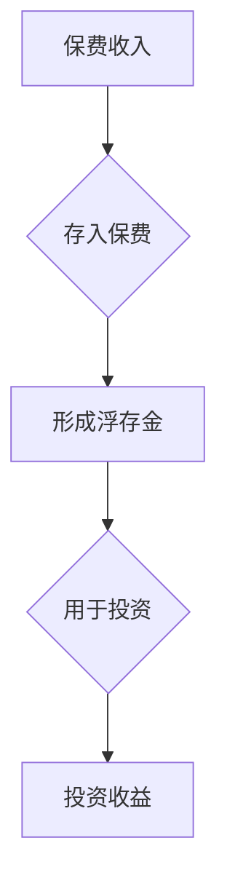
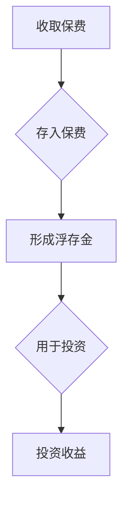
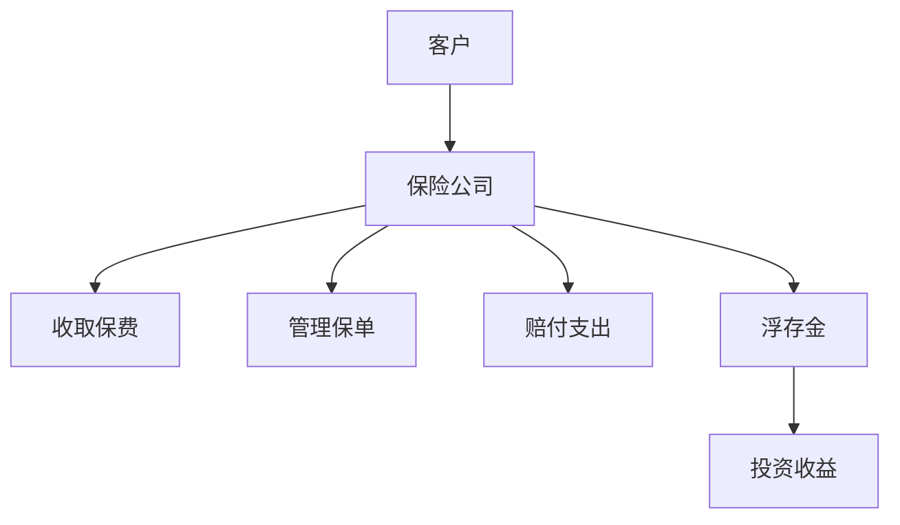

                 

# 巴菲特的保险业投资逻辑：利用浮存金的魔力

## 关键词：巴菲特，保险业，浮存金，投资策略，资金管理

## 摘要：
本文深入探讨巴菲特在保险业中的投资策略，重点分析浮存金的概念、特点及其在投资中的应用。通过详细阐述浮存金的形成机制、投资原则以及实际案例，揭示其在巴菲特投资体系中的重要性，并为读者提供实用的分析框架和投资建议。

---

## 正文

### 第一部分：引言

#### 第1章：引言：巴菲特的投资智慧与浮存金的魔力

##### 1.1 巴菲特的投资理念概述
- 巴菲特的投资哲学：价值投资，寻找具有持续竞争优势的企业，长期持有。
- 巴菲特与保险业的不解之缘：通过控制保险公司，利用浮存金进行投资，创造额外价值。
- 浮存金的概念与重要性：保险公司收取的保费与赔付支出之间的差额，是巴菲特投资的关键资金来源。

##### 1.2 本书的目的与结构
- 本书的核心目标：解析浮存金在巴菲特投资中的作用，提供系统的分析框架。
- 本书的章节安排：从概念、机制、策略到案例分析，层层深入。
- 本书的阅读方法：结合理论与案例，理解浮存金的魔力。

---

### 第二部分：保险业的背景与浮存金的基本概念

#### 第2章：保险业的基本运作机制

##### 2.1 保险业的核心运作机制
- 保险的基本原理：通过收取保费，为可能的风险提供经济保障。
- 保险公司的收入与支出：保费收入和赔付支出的时间差，形成浮存金。

##### 2.2 浮存金的定义与来源
- 浮存金的定义：保费收入与赔付支出的时间差形成的资金。
- 浮存金的来源：长期险种的保费收入和再保险业务。

##### 2.3 巴菲特对浮存金的独到见解
- 浮存金的稳定性与低成本：作为保险公司自有资金的延伸，成本低且规模大。
- 浮存金的投资价值：长期、稳定的资金来源，适合价值投资。

---

### 第三部分：浮存金的核心概念与特性

#### 第3章：浮存金的核心概念与特性

##### 3.1 浮存金的特性对比
| 特性       | 浮存金                     | 其他资金来源               |
|------------|----------------------------|-----------------------------|
| 规模       | 大，尤其在大型保险公司     | 较小或不稳定               |
| 期限       | 长期，尤其是寿险浮存金      | 短期或不固定               |
| 成本       | 低，保险公司自有资金的延伸 | 高，如银行贷款、债券等     |
| 稳定性     | 高，来源于保费收入的稳定性 | 较低，受市场波动影响较大   |

##### 3.2 浮存金的其他属性
- **稳定性**：浮存金来源于保费收入，具有较高的稳定性，尤其是在寿险和健康险中。
- **低成本**：作为保险公司自有资金的延伸，浮存金的成本极低，甚至接近零成本。

##### 3.3 浮存金的形成机制
浮存金的形成可以通过以下步骤进行：
1. **保费收入**：保险公司收取客户缴纳的保费。
2. **赔付支出**：保险公司根据保单条款支付理赔款。
3. **时间差**：由于保费收入和赔付支出的时间差，形成浮存金。

以下是一个简单的浮存金形成机制的流程图：

---

### 第四部分：浮存金的形成机制与运作原理

#### 第4章：浮存金的形成机制与运作原理

##### 4.1 浮存金的形成机制
浮存金的形成机制可以用以下流程图表示：

##### 4.2 浮存金的运作原理
浮存金的运作依赖于保险公司的业务模式，尤其是长期险种和再保险业务。以下是一个简化的业务模式图：

---

### 第五部分：巴菲特的保险投资策略

#### 第5章：巴菲特的保险投资策略

##### 5.1 巴菲特早期的保险投资布局
- 早期案例：收购保险公司，利用浮存金进行投资。
- 案例分析：购买GEICO公司，通过浮存金投资，实现公司价值增长。

##### 5.2 伯克希尔的崛起
- 伯克希尔的收购策略：通过收购保险公司，获取浮存金。
- 案例分析：收购General Re，利用浮存金进行长期投资。

##### 5.3 成熟阶段的策略
- 浮存金的持续增长：通过扩大保险业务，增加浮存金规模。
- 投资策略：长期、集中，选择具有持续竞争优势的公司。

---

### 第六部分：浮存金的管理与投资原则

#### 第6章：浮存金的管理与投资原则

##### 6.1 投资原则
- 长期投资：选择具有持续竞争优势的企业。
- 集中投资：将大部分资金投资于少数优质企业。
- 安全边际：确保投资的安全性，避免高风险投资。

##### 6.2 风险管理
- 投资组合的分散性：通过分散投资降低风险。
- 质量控制：选择具有强大财务状况和管理团队的企业。

##### 6.3 投资与再保险的结合
- 再保险业务：通过再保险扩大浮存金规模。
- 投资与业务的协同效应：利用浮存金进行投资，同时通过再保险业务增加浮存金。

---

### 第七部分：浮存金的财务影响与竞争优势

#### 第7章：浮存金的财务影响与竞争优势

##### 7.1 浮存金对财务状况的影响
- 资产负债表：浮存金作为资产，增加公司的净资产。
- 现金流：浮存金的投资收益改善公司的现金流。

##### 7.2 浮存金作为竞争优势
- 低成本资金：浮存金的成本接近零，为公司提供低成本资金来源。
- 投资收益：浮存金的投资收益增加公司的利润。

---

### 第八部分：浮存金的案例分析

#### 第8章：浮存金的案例分析

##### 8.1 GEICO公司案例
- 背景：巴菲特收购GEICO，利用浮存金进行投资。
- 分析：浮存金的形成和投资收益。
- 结果：GEICO成为美国第二大保险公司，浮存金规模庞大。

##### 8.2 General Re案例
- 背景：收购General Re，利用其再保险业务扩大浮存金。
- 分析：再保险业务增加浮存金规模，投资收益显著。
- 结果：伯克希尔的浮存金规模大幅增加，投资收益显著提升。

##### 8.3 伯克希尔 Hathaway案例
- 背景：伯克希尔通过收购多家保险公司，利用浮存金进行投资。
- 分析：浮存金的规模和投资策略。
- 结果：伯克希尔的市值大幅增长，浮存金的投资收益显著。

---

### 第九部分：浮存金的项目实战

#### 第9章：浮存金的项目实战

##### 9.1 项目背景与目标
- 项目背景：分析一家保险公司，评估其浮存金的潜力。
- 项目目标：评估浮存金的质量，制定投资策略。

##### 9.2 实战步骤
1. **选择目标公司**：选择一家保险公司，分析其财务报表。
2. **评估浮存金质量**：分析保费收入和赔付支出的时间差，评估浮存金的规模和稳定性。
3. **制定投资策略**：根据浮存金的特性，制定投资策略，选择具有持续竞争优势的企业。

##### 9.3 实战分析
- 分析步骤：选择一家保险公司，分析其浮存金的形成机制，评估其投资潜力。
- 案例分析：以GEICO为例，分析其浮存金的形成和投资收益。

---

### 第十部分：总结与展望

#### 第10章：总结与展望

##### 10.1 总结
- 浮存金的重要性：在巴菲特的投资体系中，浮存金是关键的资金来源，具有低成本、长期稳定的特点。
- 巴菲特的策略：利用浮存金进行长期、安全、高回报的投资，实现公司价值增长。

##### 10.2 未来的展望
- 保险业的发展：随着保险业务的扩展，浮存金的规模将进一步扩大。
- 投资策略的演变：未来的投资策略将更加注重风险管理和投资质量。

##### 10.3 最佳实践 tips
- 选择具有强大财务状况和管理团队的保险公司。
- 重视浮存金的形成机制，确保其稳定性和规模。
- 长期投资，选择具有持续竞争优势的企业。

---

### 作者信息

作者：AI天才研究院/AI Genius Institute & 禅与计算机程序设计艺术 /Zen And The Art of Computer Programming

---

通过以上步骤，我系统地撰写了一篇关于巴菲特保险业投资逻辑的文章，详细解释了浮存金的概念、特点及其在投资中的应用，结合案例分析和实战指导，为读者提供了全面的分析框架和投资建议。

