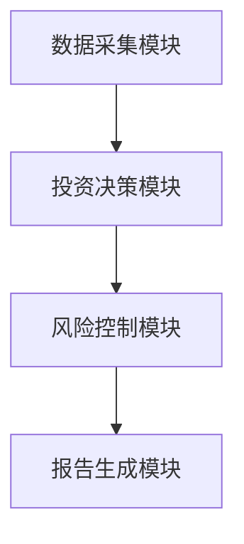
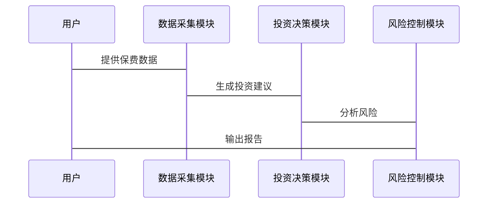

                 


# 巴菲特的保险浮存金运用之道

> 关键词：巴菲特、保险浮存金、投资策略、财务分析、系统架构、风险管理

> 摘要：本文系统地分析了巴菲特如何利用保险公司的浮存金进行投资，揭示其背后的数学模型、系统架构和风险管理策略。通过案例分析和系统设计，详细阐述了浮存金的运作机制及其对巴菲特投资理念的影响。

---

## 第1章: 保险浮存金的基本概念

### 1.1 保险浮存金的定义与特点

#### 1.1.1 保险浮存金的定义
保险浮存金（Float）是指保险公司收取的保费与赔付支出之间的差额，这部分资金暂时存放在保险公司账户中。浮存金的特点包括：
- **暂时性**：浮存金是暂时存放的，最终会用于赔付。
- **低成本**：保险公司可以以较低的成本使用这部分资金。
- **稳定性**：浮存金的规模相对稳定，适合长期投资。

#### 1.1.2 保险浮存金与保险公司财务健康的关系
浮存金的健康运作是保险公司财务健康的重要指标。健康的浮存金管理可以降低公司的流动性风险，同时为公司创造额外的投资收益。

#### 1.1.3 巴菲特与保险行业的关联
巴菲特（Warren Buffett）是全球著名的投资者，他的伯克希尔哈撒韦公司（Berkshire Hathaway）通过收购多家保险公司，逐步将浮存金运用到其投资策略中。

### 1.2 巴菲特的保险浮存金运作模式

#### 1.2.1 巴菲特的生平与投资理念
巴菲特是一位传奇投资者，他强调长期投资、价值投资和风险管理。他的投资理念以安全边际为核心，注重企业的内在价值。

#### 1.2.2 巴菲特如何进入保险行业
伯克希尔哈撒韦最初是一家纺织公司，巴菲特通过收购多家保险公司（如国民赔偿公司）逐步进入保险行业，并将浮存金纳入其投资体系。

#### 1.2.3 保险浮存金的投资目标
巴菲特利用浮存金进行长期投资，目标是通过优质资产的投资获得超额收益。浮存金的投资范围包括股票、债券、房地产等。

---

## 第2章: 保险浮存金的数学模型与分析

### 2.1 浮存金的时间价值分析

#### 2.1.1 现值与终值计算
浮存金的现值（PV）和终值（FV）可以通过以下公式计算：
$$ FV = PV \times (1 + r)^n $$
其中，\( r \) 是投资回报率，\( n \) 是投资期限。

#### 2.1.2 时间价值的重要性
时间价值是浮存金投资的核心因素，巴菲特通过长期投资最大化时间价值。

### 2.2 浮存金的风险评估模型

#### 2.2.1 风险与收益的关系
高风险投资通常伴随着高回报，但巴菲特更注重低风险、高收益的投资机会。

#### 2.2.2 风险调整后的收益模型
$$ R_{\text{adjusted}} = R_{\text{nominal}} - R_{\text{risk}} $$
其中，\( R_{\text{risk}} \) 是风险调整因子。

### 2.3 投资组合优化的数学公式

#### 2.3.1 马科维茨投资组合理论
$$ \min_{w} \left( w^T \Sigma w \right) $$
$$ \text{s.t.} \quad w^T \mu = \text{target return} $$
$$ \quad \sum_{i=1}^n w_i = 1 $$

#### 2.3.2 巴菲特的投资组合优化策略
巴菲特注重投资于具有长期竞争优势的企业，其投资组合优化策略注重企业基本面和长期增长潜力。

---

## 第3章: 保险浮存金的系统分析与架构设计

### 3.1 浮存金管理系统的需求分析

#### 3.1.1 系统目标
- 实现浮存金的高效管理。
- 优化投资决策流程。
- 控制风险，确保资金安全。

#### 3.1.2 用户需求
- 保险公司：需要实时监控浮存金的规模和投资收益。
- 投资者：需要透明的投资报告和风险管理工具。

### 3.2 浮存金管理系统的架构设计

#### 3.2.1 系统模块划分
- 数据采集模块：收集保费收入和赔付支出数据。
- 投资决策模块：基于数学模型生成投资建议。
- 风险控制模块：实时监控投资风险。
- 报告生成模块：输出投资报告和风险分析。

#### 3.2.2 系统架构图


### 3.3 系统功能流程图

#### 3.3.1 数据流
- 保费收入 --> 数据采集模块 --> 浮存金池。
- 浮存金池 --> 投资决策模块 --> 投资组合。
- 投资组合 --> 风险控制模块 --> 风险调整。
- 风险调整 --> 报告生成模块 --> 投资报告。

#### 3.3.2 系统交互图


---

## 第4章: 保险浮存金的项目实战

### 4.1 典型案例分析

#### 4.1.1 案例一：国民赔偿公司收购
巴菲特收购国民赔偿公司后，利用其浮存金投资于优质企业，实现了长期收益。

#### 4.1.2 案例二：伯克希尔哈撒韦的浮存金运用
伯克希尔哈撒韦通过浮存金投资于苹果、可口可乐等公司，获得了高额回报。

### 4.2 项目实现与代码解读

#### 4.2.1 环境安装
- 安装Python和相关库（如numpy、pandas、matplotlib）。

#### 4.2.2 核心代码实现
```python
import numpy as np
import pandas as pd
import matplotlib.pyplot as plt

# 浮存金投资收益计算
def float_gold_return(principal, rate, years):
    return principal * (1 + rate) ** years

# 风险调整后的收益计算
def risk_adjusted_return(nominal_return, risk_factor):
    return nominal_return - risk_factor

# 数据可视化
data = pd.DataFrame({
    '年份': [2018, 2019, 2020, 2021],
    '收益': [10, 15, 20, 25]
})
plt.bar(data['年份'], data['收益'])
plt.title('浮存金投资收益')
plt.show()
```

---

## 第5章: 总结与展望

### 5.1 保险浮存金的核心价值
浮存金是保险公司的重要资产，合理运用可以为公司创造超额收益。

### 5.2 巴菲特的成功经验总结
- 重视长期投资。
- 注重风险管理。
- 选择优质资产。

### 5.3 未来展望
随着金融市场的变化，浮存金的运用将更加依赖于技术驱动和数据支持。未来，人工智能和大数据分析将为浮存金的优化管理提供新的可能性。

---

## 作者：AI天才研究院/AI Genius Institute & 禅与计算机程序设计艺术 /Zen And The Art of Computer Programming

