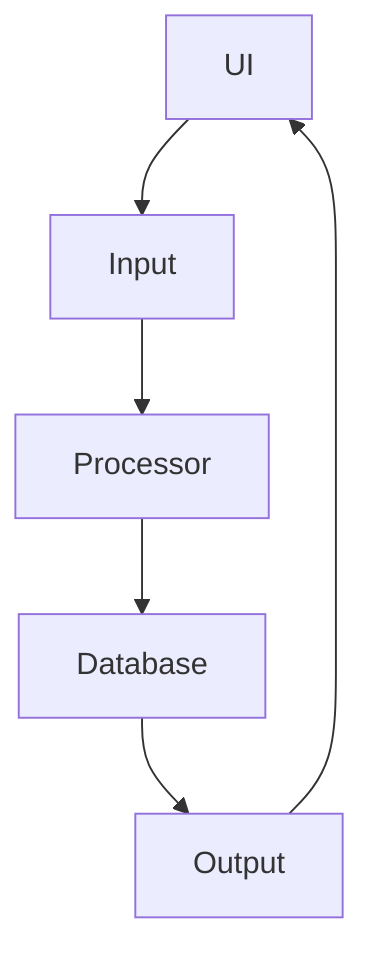

                 


# 巴菲特的公司收购哲学：寻找优质企业

> 关键词：巴菲特，公司收购，价值投资，护城河，财务指标，长期视角

> 摘要：本文深入探讨了巴菲特的公司收购哲学，从他的投资理念到具体的选股标准，再到数学模型的构建，详细分析了如何通过护城河、管理层评估和财务指标分析等方法寻找优质企业。文章还结合实际案例，展示了如何将巴菲特的哲学应用于实践，并提供了系统化的架构设计方案。

---

## 第1章: 巴菲特的背景与投资理念

### 1.1 巴菲特的生平简介

沃伦·巴菲特（Warren Buffett）是全球最著名的投资者之一，被誉为“股神”。他出生于1930年，毕业于哥伦比亚大学，师从本杰明·格雷厄姆（Benjamin Graham），创立了伯克希尔·哈撒韦公司（Berkshire Hathaway），并将其打造成一个投资帝国。

### 1.2 巴菲特的价值投资理念

巴菲特的价值投资理念源于他的导师格雷厄姆，但经过多年的实践，他形成了自己独特的投资哲学：

- **安全边际**：巴菲特强调在投资时要留有安全边际，即以低于内在价值的价格买入优质资产。
- **长期视角**：巴菲特认为投资应该着眼于长期，避免短期波动的干扰。
- **护城河**：他特别重视企业的竞争优势，即企业的护城河，这包括专利、品牌、成本优势等因素。

### 1.3 巴菲特的收购哲学

巴菲特的收购哲学可以总结为“寻找优质企业，以合理的价格买入，并长期持有”。他认为，企业是价值的载体，而市场波动只是短期现象。以下是巴菲特收购的核心原则：

- **企业质量**：选择具有强大护城河的企业，确保其长期竞争优势。
- **价格合理**：以低于企业内在价值的价格进行收购。
- **管理层**：信任且有能力的管理层是企业成功的关键。

---

## 第2章: 价值投资的起源与发展

### 2.1 价值投资的基本概念

价值投资是一种投资策略，强调以低于市场价的价格买入被低估的资产。其核心思想是寻找市场价格与内在价值存在显著差距的投资机会。

### 2.2 巴菲特的收购哲学与价值投资的关系

巴菲特将价值投资的理念融入到公司收购中，强调通过深入分析企业的基本面，找到那些具有强大竞争优势且被市场低估的企业。他的收购哲学不仅是一种投资策略，更是一种长期的、稳健的财富管理方法。

---

## 第3章: 巴菲特的收购标准

### 3.1 护城河分析

#### 3.1.1 护城河的定义与分类

护城河是企业在市场上竞争的核心优势，可以是技术专利、品牌影响力、成本优势或网络效应等。以下是几种常见的护城河类型：

- **技术专利**：拥有独特的技术或专利，形成技术壁垒。
- **品牌影响力**：强大的品牌可以吸引更多的客户。
- **成本优势**：通过规模效应或成本控制，降低成本。
- **网络效应**：用户越多，企业价值越大，例如社交平台。

#### 3.1.2 护城河评估模型

我们可以将护城河的评估转化为一个数学模型。假设企业的护城河分为四个维度：技术优势、品牌影响力、成本控制和网络效应，每个维度的权重分别为0.3、0.3、0.2和0.2。护城河的综合评分公式如下：

$$
\text{护城河评分} = 0.3 \times T + 0.3 \times B + 0.2 \times C + 0.2 \times N
$$

其中，$T$、$B$、$C$、$N$分别代表技术优势、品牌影响力、成本控制和网络效应的评分（范围为1-5）。

### 3.2 管理层评估

#### 3.2.1 管理层的素质与风格

一个优秀的管理层应该具备以下几个特点：

- **诚信**：管理层必须诚实可靠，避免短期利益的诱惑。
- **能力**：具备丰富的行业经验和管理能力。
- **决策风格**：注重长期发展，避免短期波动。

### 3.3 财务指标分析

#### 3.3.1 财务健康状况的评估标准

以下是评估企业财务健康状况的关键指标：

- **盈利能力**：净利润率、ROE（净资产收益率）。
- **成长能力**：收入增长率、净利润增长率。
- **财务杠杆**：资产负债率、利息覆盖倍数。
- **现金流**：自由现金流。

---

## 第4章: 巴菲特的收购策略

### 4.1 安全边际的概念

#### 4.1.1 安全边际的定义

安全边际是指买入价格与企业内在价值之间的差距。巴菲特认为，安全边际越大，投资风险越小。

#### 4.1.2 安全边际计算公式

假设某企业的内在价值为$V$，买入价格为$P$，安全边际为$S$，则：

$$
S = V - P
$$

如果$S > 0$，则买入价格合理；反之，则不建议买入。

### 4.2 长期视角的重要性

#### 4.2.1 长期视角的定义

长期视角是指在投资决策中，关注企业的长期价值，而不是短期市场波动。

---

## 第5章: 巴菲特收购哲学的数学模型

### 5.1 护城河评估模型

通过护城河评估模型，我们可以量化企业的竞争优势。例如，假设某企业各维度评分为：

- 技术优势（T）= 4
- 品牌影响力（B）= 5
- 成本控制（C）= 3
- 网络效应（N）= 2

则护城河评分为：

$$
\text{护城河评分} = 0.3 \times 4 + 0.3 \times 5 + 0.2 \times 3 + 0.2 \times 2 = 1.2 + 1.5 + 0.6 + 0.4 = 3.7
$$

---

## 第6章: 系统分析与架构设计方案

### 6.1 问题场景介绍

为了帮助投资者更好地应用巴菲特的收购哲学，我们可以构建一个基于护城河分析的企业评估系统。

### 6.2 系统功能设计

- **用户输入**：输入企业的各项指标。
- **护城河评分**：计算企业的护城河评分。
- **安全边际计算**：评估买入价格的安全边际。
- **决策建议**：根据评分和安全边际，给出投资建议。

### 6.3 系统架构设计



### 6.4 项目实战

#### 6.4.1 环境安装

需要安装Python和相关库（如numpy、pandas）。

#### 6.4.2 核心代码实现

```python
def calculate_h Competitive Advantage Score(T, B, C, N):
    return 0.3*T + 0.3*B + 0.2*C + 0.2*N

def calculate_margin_value(V, P):
    return V - P
```

---

## 第7章: 最佳实践与小结

### 7.1 最佳实践

- **持续学习**：不断更新知识，了解最新的投资理念。
- **风险控制**：合理分散投资，避免过度集中。
- **长期持有**：耐心持有优质资产，避免频繁交易。

### 7.2 小结

通过巴菲特的收购哲学，我们可以更好地识别优质企业，制定合理的投资策略。关键在于深入分析企业的护城河、管理层和财务指标，并结合安全边际进行决策。

---

作者：AI天才研究院/AI Genius Institute & 禅与计算机程序设计艺术 /Zen And The Art of Computer Programming

