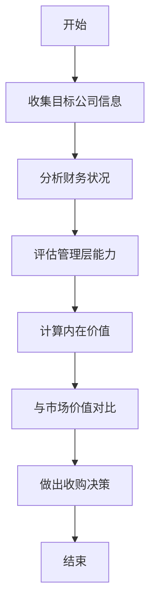

                 


# 巴菲特的公司收购策略分析

## 关键词
- 巴菲特，公司收购，价值投资，数学模型，系统分析

## 摘要
本文详细分析了巴菲特的公司收购策略，从其投资哲学到具体的收购方法，结合数学模型和系统分析，深入探讨了其成功背后的逻辑。文章通过实际案例、数学模型和系统架构，揭示了巴菲特如何通过基本面分析、管理层评估和财务状况分析来做出明智的收购决策。

---

## 第1章：巴菲特的背景与投资理念

### 1.1 巴菲特的生平简介

#### 1.1.1 巴菲特的早年经历
沃伦·巴菲特（Warren Buffett）出生于1930年，美国堪萨斯州。他在童年时期就展现出了对投资和金融的浓厚兴趣。15岁时，巴菲特开始研究股票市场，并在高中时期通过股票投资赚取了第一桶金。这段经历奠定了他未来投资事业的基础。

#### 1.1.2 成为投资大师的历程
巴菲特进入哥伦比亚大学后，师从本杰明·格雷厄姆（Benjamin Graham），学习价值投资理论。毕业后，他开始了自己的投资生涯，逐步积累了大量的投资经验，并在20世纪60年代初开始管理合伙公司，逐步成长为全球最著名的价值投资者之一。

#### 1.1.3 巴菲特的核心价值观
巴菲特的投资哲学强调长期、价值导向，注重企业的内在价值和安全边际。他倡导以合理的价格投资于具备持续竞争优势的企业，并长期持有这些投资，避免频繁交易和短期波动的影响。

### 1.2 巴菲特的投资哲学

#### 1.2.1 价值投资的定义
价值投资是一种投资策略，强调以低于其内在价值的价格购买优质资产。巴菲特的导师格雷厄姆曾说：“市场先生是一个 manic depressive（情绪化的）。”因此，价值投资者应该在市场恐慌时买入，在市场狂热时卖出。

#### 1.2.2 长期投资的重要性
巴菲特认为，长期投资是成功的基石。他选择那些具备持续竞争优势、稳定的管理层和良好财务状况的企业，并长期持有这些股票。这种投资策略能够帮助投资者避免短期市场的波动，专注于企业的长期增长。

#### 1.2.3 股东权益最大化的原则
巴菲特认为，企业的目标是为股东创造最大的价值。他通过持有优质企业的股份，长期分享这些企业的成长收益。这种投资策略不仅关注企业的当前价值，还关注其未来的增长潜力。

---

## 第2章：巴菲特的收购策略概述

### 2.1 公司收购的基本概念

#### 2.1.1 公司收购的定义
公司收购是指一家公司通过购买另一家公司的股权或资产，以获得对该公司控制权的行为。巴菲特的收购策略注重企业的内在价值，而非市场短期波动。

#### 2.1.2 并购的类型与特点
巴菲特的并购策略主要分为两类：一类是全资收购，另一类是部分股权收购。他更倾向于全资收购，以确保对收购公司的完全控制。此外，巴菲特的并购策略注重企业的可持续发展，而非短期收益。

#### 2.1.3 巴菲特收购策略的独特性
与传统的并购策略不同，巴菲特的收购策略注重企业的内在价值，而非市场估值。他更倾向于投资那些具备持续竞争优势、稳定的管理层和良好财务状况的企业。此外，巴菲特还注重企业的定价，确保以合理的价格收购这些企业。

### 2.2 巴菲特收购的核心要素

#### 2.2.1 企业基本面分析
巴菲特在收购前会对目标公司的基本面进行详细分析，包括收入、利润、负债和现金流等方面。他更倾向于选择那些具备稳定收入来源和良好盈利能力的企业。

#### 2.2.2 管理层的质量与稳定性
巴菲特认为，企业的管理层是决定企业长期成功的关键因素。他倾向于投资那些由有能力、诚信且稳定的管理层领导的企业。管理层的决策能力和长期规划能力直接影响企业的价值。

#### 2.2.3 财务状况的评估
巴菲特在收购前会对目标公司的财务状况进行详细评估，包括资产负债表、利润表和现金流量表等方面。他更倾向于选择那些具备良好财务健康状况、低债务水平和高现金流的企业。

---

## 第3章：数学模型与企业价值评估

### 3.1 基本面分析的数学模型

#### 3.1.1 市盈率模型
市盈率（P/E）是衡量企业估值的重要指标之一，公式为：
$$ P/E = \frac{股票价格}{每股净利润} $$
巴菲特认为，市盈率可以用来评估企业的相对估值。如果市盈率低于行业平均水平，说明企业可能被低估。

#### 3.1.2 市净率模型
市净率（P/B）是另一个常用的估值指标，公式为：
$$ P/B = \frac{股票价格}{每股净资产} $$
巴菲特认为，市净率可以帮助评估企业的资产价值。如果市净率低于1，说明企业的股价可能低于其资产价值。

#### 3.1.3 股息率分析
股息率是衡量企业分红能力的重要指标，公式为：
$$ 股息率 = \frac{每股股息}{股票价格} $$
巴菲特认为，股息率高的企业通常具有稳定的收益能力。然而，他更倾向于投资于具备长期增长潜力的企业，而非仅仅依赖股息收入。

### 3.2 企业价值的评估公式

#### 3.2.1 企业价值计算公式
企业价值（EV）是衡量企业整体价值的重要指标，公式为：
$$ EV = 企业价值 = EBITDA \times (1 - 税率) $$
其中，EBITDA是息税折旧及摊销前利润。巴菲特认为，企业价值可以帮助评估企业的实际盈利能力。

#### 3.2.2 现金流折现模型
现金流折现模型（DCF）是另一种常用的估值方法，公式为：
$$ NPV = \sum_{t=1}^{n} \frac{CF_t}{(1 + r)^t} $$
其中，CF_t是第t年的现金流，r是折现率。巴菲特认为，DCF模型可以帮助评估企业的未来现金流，从而确定其内在价值。

#### 3.2.3 市场价值与内在价值的对比
市场价值是市场参与者对企业的估值，而内在价值是基于企业基本面的评估。巴菲特认为，内在价值是企业的实际价值，而市场价值可能会偏离内在价值。因此，他在收购时更关注企业的内在价值。

---

## 第4章：系统分析与收购决策流程

### 4.1 系统架构设计

#### 4.1.1 系统组成部分
收购决策系统包括以下几个部分：
1. 数据收集模块：收集目标公司的财务数据、行业信息等。
2. 基本面分析模块：对目标公司的收入、利润、负债等进行分析。
3. 管理层评估模块：评估目标公司的管理层能力和稳定性。
4. 财务评估模块：评估目标公司的财务状况，包括资产负债表、利润表等。

#### 4.1.2 各部分之间的关系
数据收集模块为基本面分析、管理层评估和财务评估模块提供基础数据。基本面分析模块和管理层评估模块为财务评估模块提供支持，最终帮助决策者做出收购决策。

#### 4.1.3 系统的输入输出
- 输入：目标公司的财务数据、行业信息、管理层信息等。
- 输出：收购建议、估值报告、风险分析等。

### 4.2 决策流程的Mermaid图



---

## 第5章：项目实战

### 5.1 环境安装

#### 5.1.1 安装Python
需要安装Python 3.8及以上版本。安装命令：
```bash
python --version
```

#### 5.1.2 安装必要的库
安装pandas、numpy和matplotlib库：
```bash
pip install pandas numpy matplotlib
```

### 5.2 核心实现源代码

#### 5.2.1 数据收集与处理
```python
import pandas as pd
import numpy as np

# 假设我们有目标公司的财务数据
data = {
    '收入': [100, 200, 300],
    '利润': [20, 40, 60],
    '负债': [50, 100, 150]
}
df = pd.DataFrame(data)
print(df)
```

#### 5.2.2 基本面分析
```python
def compute_ev(revenue, profit, debt):
    ev = revenue * (1 - tax_rate) + profit - debt
    return ev

tax_rate = 0.2
ev = compute_ev(300, 60, 150)
print(f"企业价值：{ev}")
```

#### 5.2.3 管理层评估
```python
def assess_management(stability, capability):
    score = stability * 0.4 + capability * 0.6
    if score >= 0.8:
        return "优秀"
    elif score >= 0.6:
        return "良好"
    else:
        return "一般"

management_score = assess_management(0.8, 0.7)
print(f"管理层评估：{management_score}")
```

#### 5.2.4 财务评估
```python
def compute_net Worth/assets, liabilities):
    net_worth = assets - liabilities
    return net_worth

assets = 500
liabilities = 300
net_worth = compute_net_worth(assets, liabilities)
print(f"净资产：{net_worth}")
```

### 5.3 实际案例分析

#### 5.3.1 案例选择
以巴菲特收购的可口可乐公司为例。在收购过程中，巴菲特对可口可乐的财务状况、管理层能力和市场地位进行了全面分析。

#### 5.3.2 数据分析
- 收入：可口可乐的收入稳定增长，具备良好的市场地位。
- 利润：可口可乐的利润较高，具备较强的盈利能力。
- 负债：可口可乐的负债水平较低，财务状况健康。

#### 5.3.3 决策过程
- 数据收集与处理：收集可口可乐的财务数据、行业信息和管理层信息。
- 基本面分析：分析可口可乐的收入、利润和负债情况。
- 管理层评估：评估可口可乐管理层的能力和稳定性。
- 财务评估：评估可口可乐的净资产和市场价值。

#### 5.3.4 结果分析
通过分析，巴菲特认为可口可乐具备良好的财务状况和稳定的管理层，最终决定收购该公司。

### 5.4 项目小结

#### 5.4.1 项目总结
通过该项目，我们了解了巴菲特的收购策略，并通过实际案例分析了其在实际操作中的应用。

#### 5.4.2 最佳实践 tips
- 在收购前，进行全面的财务分析和管理层评估。
- 选择具备持续竞争优势和良好财务状况的企业。
- 避免短期波动，关注企业的长期增长潜力。

---

## 第6章：总结与展望

### 6.1 总结

#### 6.1.1 核心内容回顾
本文详细分析了巴菲特的公司收购策略，从其投资哲学到具体的收购方法，结合数学模型和系统分析，深入探讨了其成功背后的逻辑。

#### 6.1.2 收购策略的系统分析
通过系统分析和实际案例分析，我们了解了巴菲特的收购策略在实际操作中的应用。

### 6.2 展望

#### 6.2.1 未来的发展趋势
随着市场的变化和技术的进步，巴菲特的收购策略可能会进一步优化和调整。未来，投资者需要更加关注企业的创新能力和应对市场变化的能力。

#### 6.2.2 对投资者的建议
投资者应该学习巴菲特的投资哲学，注重企业的内在价值和长期增长潜力，避免短期波动的影响。

### 6.3 最佳实践 tips

#### 6.3.1 长期投资的重要性
长期投资是成功的基石，投资者应该选择具备持续竞争优势的企业，并长期持有这些投资。

#### 6.3.2 避免短期波动的影响
市场波动是不可避免的，投资者应该避免被短期波动影响，专注于企业的长期增长。

#### 6.3.3 关注企业的管理层
管理层是决定企业长期成功的关键因素，投资者应该关注企业的管理层能力和稳定性。

---

## 作者：AI天才研究院/AI Genius Institute & 禅与计算机程序设计艺术 /Zen And The Art of Computer Programming

