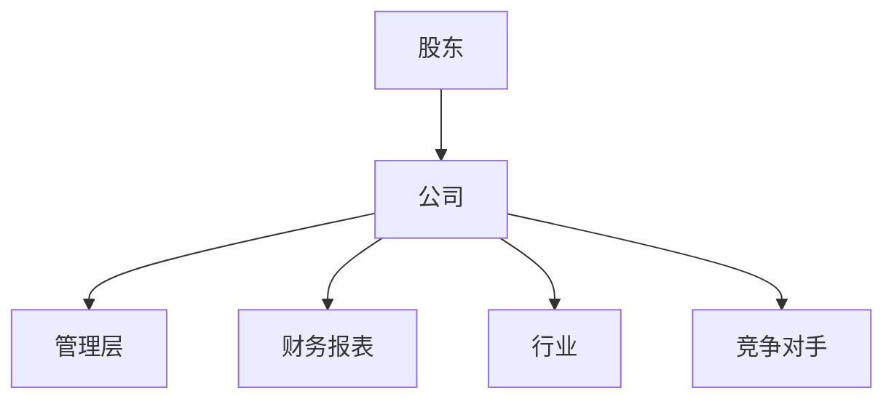

                 

# 巴菲特的公司收购策略：从股东到所有者的转变

## 关键词：巴菲特，公司收购，投资策略，股东，所有者，价值评估，财务分析

## 摘要：本文深入分析了巴菲特的公司收购策略，探讨了从股东到所有者的转变过程。通过系统分析和架构设计，结合具体案例，详细阐述了巴菲特的投资哲学、收购策略的核心要素、数学模型以及系统架构。文章最后给出了实际操作中的注意事项和最佳实践建议。

---

# 第一部分: 巴菲特的公司收购策略基础

## 第1章: 巴菲特投资哲学与收购策略概述

### 1.1 巴菲特的投资理念

#### 1.1.1 巴菲特的生平简介

沃伦·巴菲特（Warren Buffett）是世界上最著名的投资者之一，被誉为“股神”。他出生于1930年，早年通过股票投资积累了巨额财富，并在1971年创立了伯克希尔·哈撒韦公司（Berkshire Hathaway）。巴菲特的投资哲学以长期价值投资为核心，强调寻找具有持续竞争优势和良好管理的公司进行投资。

#### 1.1.2 巴菲特的投资哲学

巴菲特的投资哲学可以概括为以下几点：

1. **价值投资**：寻找那些被市场低估的公司，关注其内在价值，而非短期市场波动。
2. **长期持有**：巴菲喜欢长期持有优质股票，避免频繁交易。
3. **安全边际**：在投资时留有安全边际，即买入价格低于内在价值，以降低风险。
4. **竞争优势**：寻找具有强大竞争优势的公司，这些公司能够在长期中保持高回报。

#### 1.1.3 巴菲特收购策略的核心思想

巴菲特的收购策略核心在于寻找那些具有强大竞争优势、良好财务状况和优秀管理团队的公司。他倾向于投资那些能够持续创造股东价值的企业，而不是仅仅追求短期收益。

---

### 1.2 巴菲特收购策略的演变

#### 1.2.1 早期投资风格

巴菲特早期的投资风格主要集中在股票市场，他通过分析公司的财务报表和竞争优势来寻找低估的股票。他的投资风格深受本杰明·格雷厄姆（Benjamin Graham）的影响，注重安全边际和价值评估。

#### 1.2.2 收购策略的成熟与完善

随着伯克希尔·哈撒韦公司的发展，巴菲特逐渐转向收购 entire companies 而不仅仅是投资股票。他开始关注那些具有强大竞争优势、良好管理团队和稳定现金流的公司。通过收购这些公司，巴菲特能够实现对整个企业的控制，从而更好地管理风险和创造价值。

#### 1.2.3 巴菲特收购策略的特点

1. **注重公司基本面**：巴菲特在收购前会对公司的财务状况、管理团队和行业地位进行详细分析。
2. **长期投资**：他倾向于长期持有被收购的公司，避免频繁的买卖操作。
3. **注重股东价值**：巴菲特的目标是通过收购和管理，实现股东价值的最大化。

---

### 1.3 巴菲特收购策略的核心要素

#### 1.3.1 企业价值评估

企业价值评估是巴菲特收购策略的核心部分。他通常使用企业价值（EV）和股权价值（EQ）的公式来进行评估：

$$ EV = 债务 + 股权价值 $$

$$ EQ = EV - 债务 $$

巴菲认为，企业价值是公司整体价值的体现，而股权价值则是股东所拥有的部分。

#### 1.3.2 财务健康状况

巴菲特非常注重公司的财务健康状况。他关注以下几个方面：

1. **盈利能力**：通过净利润率、ROE（净资产收益率）等指标评估公司的盈利能力。
2. **现金流**：充足的现金流是公司健康运作的基石。
3. **负债情况**：低负债率是巴菲特选股的重要标准。

#### 1.3.3 管理团队能力

巴菲认为，优秀的管理团队是公司成功的关键。他倾向于投资那些由有能力、有诚信的管理团队领导的公司。

#### 1.3.4 行业地位与竞争优势

巴菲注重公司所在行业的地位和竞争优势。他倾向于投资那些在行业内具有领先地位、具有强大竞争优势的公司。

---

### 1.4 巴菲特收购策略的哲学意义

#### 1.4.1 从股东到所有者的转变

巴菲通过收购公司，从单纯的股东转变为公司的所有者。这种转变使他能够对公司的管理、运营和战略决策拥有更大的控制权，从而实现对公司的长期价值管理。

#### 1.4.2 巴菲特的长期投资理念

巴菲的长期投资理念强调持有优质资产，避免短期市场波动的干扰。他认为，长期持有优质股票或公司，能够实现财富的稳步增长。

#### 1.4.3 巴菲特收购策略的可持续性

巴菲的收购策略注重公司的可持续发展能力。他倾向于投资那些能够在长期中保持竞争优势和盈利能力的公司。

---

## 第2章: 巴菲特收购策略的核心概念

### 2.1 巴菲特收购策略的背景

#### 2.1.1 公司收购的定义与分类

公司收购是指一个公司通过购买另一个公司的股权或资产，以实现对该公司控制的行为。公司收购可以分为敌意收购和友好收购，前者是指收购方在未经目标公司同意的情况下进行收购，后者则是双方协商一致的收购。

#### 2.1.2 巴菲特收购策略的适用场景

巴菲的收购策略适用于那些具有强大竞争优势、良好财务状况和优秀管理团队的公司。他倾向于收购那些能够在长期中保持稳定增长的公司。

#### 2.1.3 巴菲特收购策略的局限性

尽管巴菲的收购策略在长期中表现出色，但在某些情况下，他的策略可能面临挑战。例如，当市场出现剧烈波动或经济危机时，巴菲的策略可能会受到冲击。

---

### 2.2 巴菲特收购策略的核心概念

#### 2.2.1 企业价值评估模型

企业价值评估模型是巴菲收购策略的核心工具之一。他通常使用以下公式来评估企业的价值：

$$ EV = 债务 + 股权价值 $$

$$ EQ = EV - 债务 $$

通过对企业价值的评估，巴菲能够确定公司是否被市场低估。

#### 2.2.2 股东价值创造

股东价值创造是巴菲收购策略的最终目标。他通过收购和管理公司，实现股东价值的最大化。

#### 2.2.3 收购整合的复杂性

收购整合是巴菲收购策略中的一个重要环节。他需要将被收购的公司与伯克希尔·哈撒韦公司进行整合，确保公司在管理和战略上的一致性。

---

### 2.3 巴菲特收购策略的数学模型

#### 2.3.1 股权价值计算公式

$$ 股权价值 = \frac{未来现金流的现值}{股权资本成本} $$

#### 2.3.2 投资回报率分析

$$ ROI = \frac{净利润}{投资成本} \times 100\% $$

#### 2.3.3 财务杠杆与资本结构

$$ 财务杠杆 = \frac{总债务}{股东权益} $$

---

### 2.4 巴菲特收购策略的ER实体关系图

---

## 第3章: 巴菲特收购策略的系统分析与架构设计

### 3.1 系统分析

#### 3.1.1 收购目标识别

收购目标识别是巴菲收购策略的第一步。他需要通过市场调研、财务分析和行业研究等手段，识别出具有潜力的公司。

#### 3.1.2 财务状况评估

财务状况评估是收购过程中的关键环节。巴菲需要对目标公司的财务报表进行详细分析，评估其盈利能力、现金流和负债情况。

#### 3.1.3 管理团队评估

管理团队评估是确保公司长期成功的重要因素。巴菲需要评估目标公司的管理团队的能力、诚信和战略眼光。

#### 3.1.4 竞争环境分析

竞争环境分析是评估公司市场地位的重要手段。巴菲需要分析目标公司所在行业的竞争格局、市场趋势和竞争对手的情况。

---

### 3.2 系统架构设计

#### 3.2.1 股权价值评估模块

股权价值评估模块是系统的核心部分，负责计算目标公司的股权价值。

#### 3.2.2 财务健康度分析模块

财务健康度分析模块用于评估目标公司的财务状况，包括盈利能力、现金流和负债情况。

#### 3.2.3 管理团队能力评估模块

管理团队能力评估模块用于评估目标公司的管理团队的能力和素质。

#### 3.2.4 竞争优势分析模块

竞争优势分析模块用于分析目标公司在行业中的竞争优势和市场地位。

---

### 3.3 系统接口设计

#### 3.3.1 数据输入接口

数据输入接口用于接收目标公司的财务数据、管理团队信息和行业分析报告。

#### 3.3.2 数据处理接口

数据处理接口负责对输入的数据进行处理和分析，计算目标公司的股权价值、财务健康度和竞争优势。

---

### 3.4 系统交互设计

#### 3.4.1 收购目标识别流程

1. 用户输入目标公司的基本信息。
2. 系统对目标公司的财务数据进行分析。
3. 系统对目标公司的管理团队进行评估。
4. 系统输出目标公司的股权价值和竞争优势。

---

## 第4章: 巴菲特收购策略的实战案例

### 4.1 案例分析：可口可乐的收购

#### 4.1.1 案例背景

1988年，巴菲开始投资可口可乐公司，最终成为其最大的股东。他看中了可口可乐强大的品牌价值和稳定的现金流。

#### 4.1.2 收购过程

1. **财务分析**：巴菲对可口可乐的财务报表进行了详细分析，发现其具有强大的盈利能力和稳定的现金流。
2. **管理团队评估**：他认为可口可乐的管理团队具有强大的执行力和战略眼光。
3. **竞争优势分析**：可口可乐在饮料行业具有强大的竞争优势和品牌影响力。

#### 4.1.3 收购结果

通过收购可口可乐，巴菲实现了对公司的长期投资，获得了稳定的股息收益和资本增值。

---

### 4.2 案例分析：喜诗糖果的收购

#### 4.2.1 案例背景

1971年，巴菲收购了喜诗糖果公司，这是他职业生涯中第一次收购 entire company。

#### 4.2.2 收购过程

1. **财务分析**：喜诗糖果具有稳定的现金流和良好的财务状况。
2. **管理团队评估**：公司管理团队具有丰富的经验和良好的声誉。
3. **竞争优势分析**：喜诗糖果在糖果行业具有强大的品牌影响力和市场地位。

#### 4.2.3 收购结果

通过收购喜诗糖果，巴菲实现了对公司的长期管理，获得了稳定的收益。

---

## 第5章: 巴菲特收购策略的风险管理与最佳实践

### 5.1 风险管理

#### 5.1.1 风险识别

在收购过程中，风险识别是至关重要的。常见的风险包括财务风险、市场风险和管理风险。

#### 5.1.2 风险评估

通过对风险的评估，可以制定相应的风险管理策略，降低收购过程中的不确定性。

#### 5.1.3 风险控制

通过制定详细的风险管理计划，可以有效控制收购过程中的各种风险。

---

### 5.2 最佳实践

#### 5.2.1 详细分析目标公司

在收购前，应对目标公司进行全面的分析，包括财务状况、管理团队和行业地位。

#### 5.2.2 确保安全边际

在收购时，应确保买入价格低于目标公司的内在价值，以留有安全边际。

#### 5.2.3 长期持有

巴菲的成功在于长期持有优质资产，避免频繁交易。

---

## 第6章: 巴菲特收购策略的总结与展望

### 6.1 总结

巴菲特的收购策略以价值投资为核心，注重企业基本面、财务健康状况和管理团队能力。他的策略强调长期持有和安全边际，能够在市场波动中实现稳定的收益。

### 6.2 未来展望

随着市场的变化和经济的发展，巴菲的收购策略也在不断进化。未来的投资者需要更加注重企业的可持续发展能力和竞争优势，以应对更加复杂的市场环境。

---

## 作者：AI天才研究院/AI Genius Institute & 禅与计算机程序设计艺术 /Zen And The Art of Computer Programming

