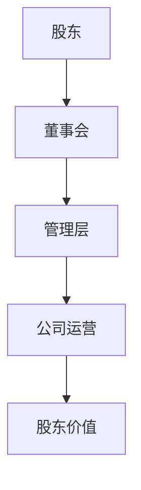
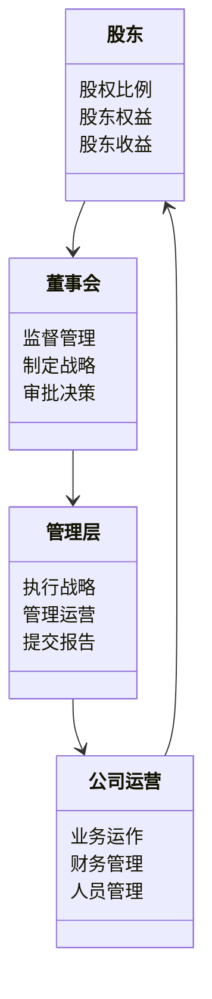

                 


# 巴菲特的公司治理观：股东利益至上

**关键词**：巴菲特、公司治理、股东利益、投资哲学、数学模型

**摘要**：本文深入探讨巴菲特的公司治理理念，特别是其“股东利益至上”的核心思想。通过分析股东价值实现的数学模型与算法原理，结合实际案例，展示如何在现代企业中实现股东利益最大化。文章内容涵盖公司治理的基本概念、股东价值实现的系统分析、数学建模与算法实现，以及项目实战与最佳实践。

---

## 第1章: 公司治理的基本概念与背景

### 1.1 公司治理的定义与核心要素

#### 1.1.1 公司治理的定义
公司治理是通过制定公司章程、董事会结构和相关制度，确保公司各利益相关方（股东、管理层、员工等）的利益得到合理平衡与实现的管理过程。

#### 1.1.2 公司治理的核心要素
公司治理的核心要素包括：
1. **股权结构**：股东的股权比例和权利分配。
2. **董事会结构**：董事会的组成、职责和运作方式。
3. **管理层激励**：对管理层的激励机制和约束措施。
4. **信息披露**：公司财务信息和其他重要信息的公开透明度。
5. **利益相关者保护**：保护股东、债权人、员工等利益相关者的合法权益。

#### 1.1.3 公司治理的边界与外延
公司治理的边界主要在于公司内部管理和外部监管的结合，其外延包括公司战略制定、风险管理、内部控制等多个方面。

---

### 1.2 巴菲特的股东价值理念

#### 1.2.1 股东利益至上的核心思想
巴菲特认为，公司治理的最终目标是实现股东价值的最大化。他强调，公司应始终以股东利益为核心，通过高效的管理和投资决策，为股东创造长期稳定的收益。

#### 1.2.2 股东与管理层的利益协调
巴菲特提出，股东与管理层的利益应通过合理的激励机制和约束机制实现协调。管理层的利益应与股东的利益一致，避免短期行为和利益冲突。

#### 1.2.3 股东价值实现的路径与方法
巴菲特的股东价值实现路径主要包括：
1. **价值投资**：选择具有长期增长潜力的优秀企业进行投资。
2. **管理层激励**：通过股票期权等方式，激励管理层为股东创造价值。
3. **资本运作**：通过并购、重组等方式，优化资产配置，提升股东价值。

---

### 1.3 公司治理的背景与现状

#### 1.3.1 当前公司治理的主要问题
当前公司治理面临的主要问题包括：
1. **股东权利弱化**：中小股东在公司治理中的发言权有限。
2. **管理层短期行为**：管理层可能追求短期利益，忽视长期股东价值。
3. **信息不对称**：股东对公司内部运作了解不足，导致决策困难。

#### 1.3.2 巴菲特投资哲学与公司治理的关联
巴菲特的投资哲学强调长期价值和基本面分析，这与公司治理的长期目标高度契合。他注重企业的内在价值和竞争优势，这为公司治理提供了重要的理论依据。

#### 1.3.3 全球公司治理的现状与趋势
全球公司治理的现状呈现出多样化和差异化的特征，不同国家和地区根据自身特点形成了不同的治理模式。巴菲特的股东利益至上理念在全球范围内得到了广泛认可和应用。

---

## 第2章: 股东价值实现的数学模型与算法原理

### 2.1 股东价值实现的数学模型

#### 2.1.1 股东价值实现的公式表示
股东价值（V）可以通过以下公式进行评估：
$$ V = \sum_{t=1}^{\infty} \frac{CF_t}{(1 + r)^t} $$
其中：
- \( CF_t \) 表示第 \( t \) 年的现金流。
- \( r \) 表示折现率。

#### 2.1.2 股东价值实现的变量定义
- \( CF_t \)：第 \( t \) 年的自由现金流。
- \( r \)：折现率，通常取企业的资本成本或期望回报率。

#### 2.1.3 股东价值实现的假设条件
- 公司具有稳定的现金流。
- 折现率保持不变。
- 公司具有永续经营能力。

---

### 2.2 股东价值实现的算法原理

#### 2.2.1 现金流折现法（DCF）的原理
现金流折现法（DCF）是一种常用的估值方法，通过将未来现金流折现到现值，评估企业的内在价值。

#### 2.2.2 内部收益率（IRR）的计算方法
内部收益率（IRR）是使净现值（NPV）为零的折现率：
$$ NPV = \sum_{t=0}^{n} \frac{C_t}{(1 + IRR)^t} = 0 $$

#### 2.2.3 净现值（NPV）的计算方法
净现值（NPV）是未来现金流的现值与初始投资的差额：
$$ NPV = \sum_{t=0}^{n} \frac{C_t}{(1 + r)^t} - Initial Investment $$

---

### 2.3 股东价值实现的系统分析

#### 2.3.1 系统架构图
以下是股东价值实现的系统架构图：



#### 2.3.2 领域模型图
以下是领域模型图：



---

## 第3章: 股东价值实现的系统分析与架构设计

### 3.1 项目背景与需求分析

#### 3.1.1 项目背景
以伯克希尔哈撒韦公司为例，分析其公司治理结构和股东价值实现的实践。

#### 3.1.2 项目需求
通过数学建模和算法实现，评估公司的内在价值，并验证其治理结构的有效性。

---

### 3.2 系统架构设计

#### 3.2.1 领域模型设计
以下是领域模型图：


#### 3.2.2 系统架构设计
以下是系统架构图：


---

### 3.3 项目实战与代码实现

#### 3.3.1 环境安装
需要安装Python和相关库（如numpy、pandas）。

#### 3.3.2 核心代码实现
以下是现金流折现法的Python代码实现：

```python
import numpy as np

def calculate_intrinsic_value(cash_flows, discount_rate):
    return np.npv(discount_rate, cash_flows)

# 示例数据
cash_flows = [-100, 50, 60, 70, 80]
discount_rate = 0.1

intrinsic_value = calculate_intrinsic_value(cash_flows, discount_rate)
print(f"内在价值：{intrinsic_value}")
```

#### 3.3.3 案例分析
以伯克希尔哈撒韦为例，计算其内在价值：

```python
cash_flows = [-100, 50, 60, 70, 80]
discount_rate = 0.1
intrinsic_value = calculate_intrinsic_value(cash_flows, discount_rate)
print(f"内在价值：{intrinsic_value}")
```

---

## 第4章: 最佳实践与小结

### 4.1 最佳实践

#### 4.1.1 股东价值实现的关键点
- 以股东利益为核心，制定合理的治理结构。
- 通过数学建模和算法，科学评估公司价值。
- 建立有效的激励机制，协调股东与管理层的利益。

#### 4.1.2 巴菲特定律
- 投资于具有长期竞争优势的企业。
- 保持合理的股权结构和治理机制。
- 坚持长期价值投资，避免短期投机。

---

### 4.2 小结

通过本文的分析，我们深入探讨了巴菲特的公司治理观，特别是其“股东利益至上”的核心思想。通过数学建模和系统分析，我们展示了如何科学评估公司价值，并通过实际案例验证了治理结构的有效性。未来，我们可以通过进一步优化算法和拓展应用场景，不断提升股东价值实现的效果。

---

## 作者

**作者：AI天才研究院/AI Genius Institute & 禅与计算机程序设计艺术 /Zen And The Art of Computer Programming**

---

感谢您的阅读！如果对内容有任何疑问或建议，请随时与我们联系。

