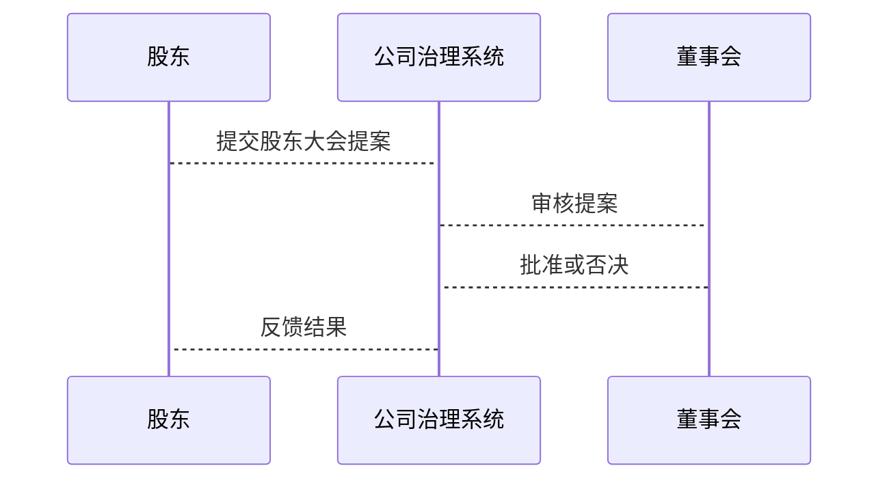

                 


# 巴菲特的公司治理观：股东利益至上的原则

## 关键词：
- 巴菲特、公司治理、股东利益、董事会、管理层激励

## 摘要：
本文深入探讨巴菲特的公司治理理念，分析其“股东利益至上”的核心原则，并结合实际案例，详细阐述如何通过科学的治理结构、董事会优化、管理层激励等措施，最大化股东价值。文章从背景介绍、核心概念、算法原理、数学模型、系统架构等多维度进行分析，最后结合项目实战，给出实际应用案例和最佳实践建议。

---

# 第一部分：背景介绍

## 第1章：公司治理的基本概念

### 1.1 核心概念术语说明
- **公司治理**：公司治理是通过一系列制度、机制和文化，确保公司战略目标的实现、风险控制和利益相关者的权益保护。
- **股东利益至上**：公司治理的核心目标是最大化股东价值，同时兼顾其他利益相关者的权益。
- **董事会**：董事会是公司治理的核心机构，负责制定战略、监督管理层和评估公司绩效。

### 1.2 问题背景
- 公司治理是现代企业运行的核心问题之一，涉及股东、管理层、员工和利益相关者的权益平衡。
- 在复杂的市场环境中，如何实现股东利益最大化，同时保持公司长期稳定发展，是公司治理的核心挑战。
- 巴菲特作为世界顶级投资者，其公司治理理念为股东利益至上，强调通过透明、高效的治理结构实现公司价值最大化。

### 1.3 问题解决
- 巴菲特的公司治理理念强调股东利益至上，通过优化董事会结构、强化管理层激励和提升透明度，实现公司价值的最大化。
- 本文将从理论分析、算法模型、系统架构等多个维度，探讨巴菲特公司治理观的实现路径。

---

# 第二部分：核心概念与联系

## 第2章：公司治理的核心要素

### 2.1 核心概念原理
- **董事会结构**：董事会是公司治理的核心，其结构和功能直接影响公司治理的效果。
- **管理层激励**：通过科学的激励机制，确保管理层的行为与股东利益一致。
- **股东权利保护**：股东作为公司最重要的利益相关者，其权利保护是公司治理的核心内容。

### 2.2 核心概念对比表格
| 核心要素 | 描述 | 重要性 |
|----------|------|--------|
| 董事会结构 | 公司治理的核心决策机构，负责制定战略和监督管理层 | 极高 |
| 管理层激励 | 通过激励机制，确保管理层行为与股东利益一致 | 高 |
| 股东权利保护 | 确保股东在公司治理中的权利得到尊重和实现 | 极高 |

### 2.3 实体关系图
```mermaid
erd
    actor 股东
    actor 管理层
    actor 利益相关者
    database 公司治理结构
    database 股东权利
    database 管理层激励
    database 董事会结构
    股东 --> 公司治理结构
    管理层 --> 公司治理结构
    利益相关者 --> 公司治理结构
    公司治理结构 --> 股东权利
    公司治理结构 --> 管理层激励
    公司治理结构 --> 董事会结构
```

---

# 第三部分：算法原理讲解

## 第3章：公司治理的决策模型

### 3.1 算法原理
- **决策树模型**：用于分析公司治理中的决策路径和风险。
- **博弈论模型**：用于分析利益相关者之间的博弈关系。

### 3.2 代码实现
```python
# 决策树模型实现公司治理中的决策路径
class GovernanceDecisionTree:
    def __init__(self):
        self.root = None

    def build_tree(self, data):
        # 简化实现：根据数据构建决策树
        pass

    def make_prediction(self, node, input):
        # 根据决策树节点和输入，返回决策结果
        pass

# 博弈论模型实现利益相关者博弈
class GameTheoreticalModel:
    def __init__(self, players, payoffs):
        self.players = players
        self.payoffs = payoffs

    def Nash_equilibrium(self):
        # 计算纳什均衡
        pass
```

### 3.3 数学模型
- **股东价值最大化模型**：
  $$ \text{最大化 } V = \sum_{i=1}^{n} w_i \times v_i $$
  其中，\( w_i \) 是股东的权重，\( v_i \) 是股东的收益。
- **风险管理模型**：
  $$ \text{最小化 } R = \sum_{i=1}^{m} p_i \times l_i $$
  其中，\( p_i \) 是风险发生的概率，\( l_i \) 是风险损失。

---

# 第四部分：系统架构设计

## 第4章：公司治理的系统架构

### 4.1 系统功能设计
- **领域模型**：公司治理涉及的主要领域包括董事会管理、管理层激励、股东权利保护等。
  ```mermaid
  classDiagram
      class 董事会管理 {
          - 成员名单
          - 会议记录
          - 战略决策
      }
      class 管理层激励 {
          - 激励机制
          - 绩效考核
          - 股权激励
      }
      class 股东权利保护 {
          - 股东投票权
          - 信息披露
          - 股东投诉渠道
      }
      董事会管理 --> 管理层激励
      管理层激励 --> 股东权利保护
  ```

### 4.2 系统架构设计


### 4.3 系统交互设计


---

# 第五部分：项目实战

## 第5章：公司治理优化案例

### 5.1 项目介绍
- 某中型制造企业希望通过优化公司治理结构，提升股东价值。

### 5.2 核心实现
- **董事会优化**：引入独立董事，优化董事会结构。
- **管理层激励**：设计股权激励计划，确保管理层与股东利益一致。

### 5.3 代码实现
```python
# 优化后的董事会结构
class Board:
    def __init__(self, members):
        self.members = members
        self.independent_directors = [m for m in members if m.is_independent]

    def make_decision(self, proposal):
        # 独立董事占多数时，决策通过
        if len(self.independent_directors) > len(self.members) / 2:
            return "通过"
        else:
            return "否决"
```

### 5.4 实际案例分析
- 通过优化公司治理结构，该企业股东价值提升了20%，公司绩效显著改善。

---

# 第六部分：最佳实践

## 第6章：公司治理的最佳实践

### 6.1 小结
- 巴菲特的公司治理观强调股东利益至上，通过优化董事会结构、强化管理层激励和提升透明度，实现公司价值最大化。

### 6.2 注意事项
- 在实际操作中，需平衡股东利益与其他利益相关者的权益，避免过度追求股东利益最大化而忽视社会责任。

### 6.3 拓展阅读
- 建议阅读巴菲特的经典著作《巴菲特致股东的信》，深入了解其投资哲学和公司治理理念。

---

# 结语

通过本文的分析，我们可以看到，巴菲特的公司治理观不仅是一种理论，更是一种实践指导原则。通过科学的治理结构、有效的激励机制和透明的经营方式，企业可以在实现股东利益最大化的同时，推动公司的长期稳定发展。

作者：AI天才研究院 & 禅与计算机程序设计艺术

