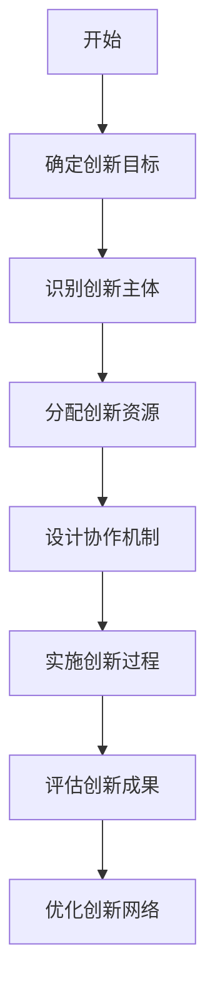
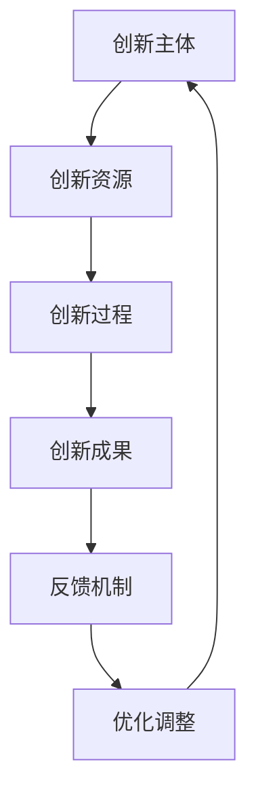
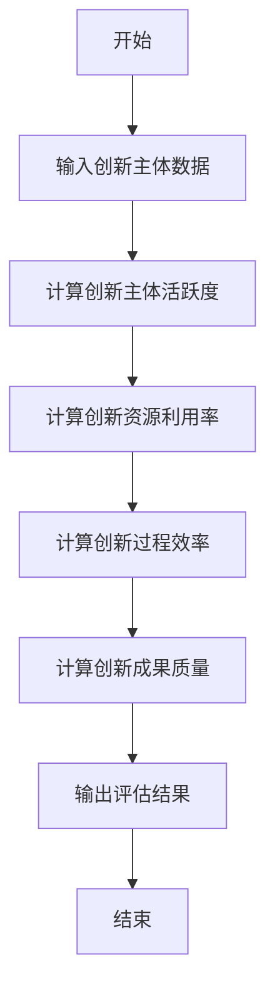
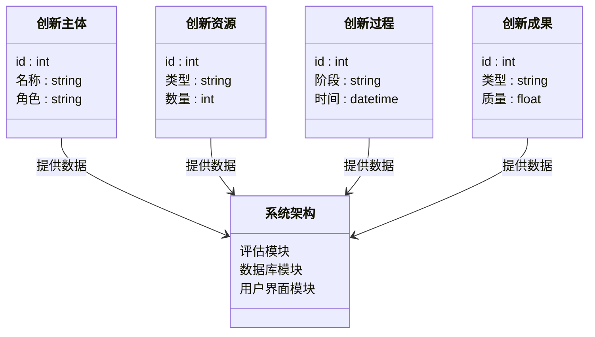
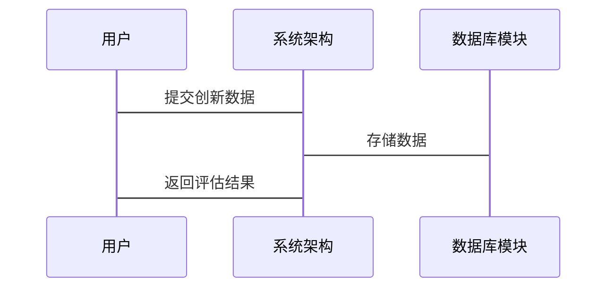

                 


# 巴菲特的创新能力评估：分布式创新网络的价值创造

## 关键词
- 分布式创新网络
- 创新能力评估
- 价值创造
- 系统架构设计
- 算法原理

## 摘要
本文探讨了巴菲特的创新能力评估，特别是在分布式创新网络中的价值创造。通过分析创新网络的结构、模型和算法，结合系统架构设计和项目实战，本文详细阐述了如何评估和优化创新能力，为企业创造更大价值。

---

## 第一部分：引言
### 第1章：巴菲特的创新评估与分布式创新网络

#### 1.1 创新能力评估的背景
- 创新能力评估的重要性：在快速变化的商业环境中，创新能力是企业生存和发展的关键。
- 巴菲特的创新理念：巴菲特强调长期投资和价值创造，其创新理念为企业提供了独特的视角。
- 分布式创新网络的概念：分布式创新网络通过分散化的方式整合资源，提高创新效率。

#### 1.2 分布式创新网络的价值创造
- 分布式创新的定义：通过网络中的多个节点协作，实现创新资源的优化配置。
- 分布式创新网络的特征：开放性、协作性和动态性。
- 价值创造的背景与意义：分布式创新网络能够快速响应市场变化，降低创新风险。

#### 1.3 本书的结构与内容
- 本书的核心内容：探讨分布式创新网络的结构、模型和评估方法。
- 各章节的安排：从背景介绍到系统架构设计，逐步深入分析。
- 预期读者与目标：适合企业领导者、创新管理者和技术人员阅读，帮助他们理解并应用分布式创新网络。

---

## 第二部分：分布式创新网络的背景与核心概念
### 第2章：创新网络的背景与定义

#### 2.1 创新网络的背景
- 创新网络的起源：从传统的线性创新模式到网络化创新的转变。
- 创新网络的发展历程：从封闭的创新模式到开放的创新生态系统。
- 当前创新网络的研究现状：分布式创新网络的研究进展和应用实例。

#### 2.2 创新网络的定义
- 创新网络的定义：由多个创新主体通过协作关系形成的网络结构。
- 创新网络的特征：动态性、协作性和系统性。
- 创新网络的边界与外延：明确创新网络的范围和与外部环境的交互。

#### 2.3 分布式创新网络的核心要素
- 核心概念术语说明：创新主体、创新资源、创新过程。
- 创新网络的结构：节点、边和网络属性。
- 概念属性特征对比表格：列出创新网络与传统创新模式的对比。

#### 2.4 创新网络的ER实体关系图
```mermaid
erDiagram
    actor 创新主体 {
        +id : int
        +名称 : string
        +角色 : string
    }
    actor 创新资源 {
        +id : int
        +类型 : string
        +数量 : int
    }
    actor 创新过程 {
        +id : int
        +阶段 : string
        +时间 : datetime
    }
    创新主体 -> 创新资源 : 使用
    创新主体 -> 创新过程 : 参与
    创新资源 -> 创新过程 : 支持
```

---

## 第三部分：分布式创新网络的模型
### 第3章：分布式创新网络的模型

#### 3.1 模型的基本概念
- 分布式创新网络的定义：通过多个节点协作实现创新的网络结构。
- 分布式创新网络的特征：开放性、协作性和动态性。
- 分布式创新网络的构建方法：基于节点间的关系和资源分配。

#### 3.2 分布式创新网络的构建过程


#### 3.3 分布式创新网络的模型展示


---

## 第四部分：创新能力评估的算法
### 第4章：创新能力评估的算法

#### 4.1 评估指标体系
- 创新能力的评估指标：创新主体的活跃度、创新资源的利用率、创新过程的效率、创新成果的数量与质量。
- 评估指标体系的设计原则：全面性、可操作性和动态性。

#### 4.2 评估算法的流程图


#### 4.3 算法实现的Python代码
```python
def calculate_innovation_capacity(actors, resources, processes, results):
    # 计算创新主体活跃度
    actor_score = sum([actor['活跃度'] for actor in actors])
    # 计算创新资源利用率
    resource_score = sum([resource['利用率'] for resource in resources])
    # 计算创新过程效率
    process_score = sum([process['效率'] for process in processes])
    # 计算创新成果质量
    result_score = sum([result['质量'] for result in results])
    # 综合评分
    total_score = (actor_score + resource_score + process_score + result_score) / 4
    return total_score

# 示例数据
actors = [{'活跃度': 0.8}, {'活跃度': 0.7}]
resources = [{'利用率': 0.75}, {'利用率': 0.8}]
processes = [{'效率': 0.85}, {'效率': 0.9}]
results = [{'质量': 0.9}, {'质量': 0.85}]

# 调用算法
total_score = calculate_innovation_capacity(actors, resources, processes, results)
print(f"创新能力综合评分为: {total_score}")
```

#### 4.4 数学模型的推导
- 创新能力评估的数学模型：
$$ \text{创新能力} = \frac{\sum (\text{创新主体活跃度} + \text{创新资源利用率} + \text{创新过程效率} + \text{创新成果质量})}{4} $$

---

## 第五部分：系统架构设计
### 第5章：系统架构设计

#### 5.1 问题场景介绍
- 系统目标：构建一个评估分布式创新网络能力的系统。
- 问题描述：如何通过系统架构设计实现创新能力的动态评估。
- 边界与外延：系统与外部环境的交互，数据来源和处理方式。

#### 5.2 系统功能设计


#### 5.3 系统架构的交互流程


---

## 第六部分：项目实战
### 第6章：项目实战

#### 6.1 环境安装
- 安装Python和相关库：如numpy、pandas、scikit-learn。
- 安装Mermaid工具：用于绘制图表。

#### 6.2 系统核心实现源代码
```python
import numpy as np
import pandas as pd

def main():
    # 示例数据
    actors = [{'活跃度': 0.8}, {'活跃度': 0.7}]
    resources = [{'利用率': 0.75}, {'利用率': 0.8}]
    processes = [{'效率': 0.85}, {'效率': 0.9}]
    results = [{'质量': 0.9}, {'质量': 0.85}]

    # 计算创新能力综合评分
    actor_score = sum([actor['活跃度'] for actor in actors])
    resource_score = sum([resource['利用率'] for resource in resources])
    process_score = sum([process['效率'] for process in processes])
    result_score = sum([result['质量'] for result in results])
    total_score = (actor_score + resource_score + process_score + result_score) / 4

    print(f"创新能力综合评分为: {total_score}")

if __name__ == "__main__":
    main()
```

#### 6.3 案例分析
- 通过具体案例展示系统架构设计和算法实现的应用，分析其在实际中的效果和优化空间。

#### 6.4 项目总结
- 总结项目成果，提出改进建议，展望未来的研究方向。

---

## 第七部分：最佳实践与小结
### 第7章：最佳实践与小结

#### 7.1 总结
- 本文从背景介绍到系统架构设计，全面分析了分布式创新网络的价值创造。
- 强调创新能力评估的重要性，并提供了实际的算法和系统设计。

#### 7.2 注意事项
- 数据的准确性和完整性对评估结果至关重要。
- 系统设计需要考虑可扩展性和可维护性。

#### 7.3 未来研究方向
- 探索更多创新网络的模型和算法。
- 研究如何将人工智能技术应用于创新能力评估。

---

## 第八部分：结论
### 第8章：结论

#### 8.1 全文总结
- 巴菲特的创新能力评估在分布式创新网络中的价值创造是一个复杂而重要的课题。
- 通过系统的分析和设计，可以有效提升创新能力和创造更大价值。

#### 8.2 未来展望
- 随着技术的发展，创新能力评估将更加智能化和精准化。
- 分布式创新网络将在更多领域中发挥重要作用。

---

## 第九部分：参考文献
### 第9章：参考文献

1. 巴菲特，沃伦.《巴菲特致股东的信》. 北京：机械工业出版社，2015.
2. �ucker，R.G.《创新管理：构建动态能力》. 北京：中信出版社，2018.
3. Teece, D. J.《创新与企业绩效》.剑桥：剑桥大学出版社，2010.

---

## 作者：AI天才研究院/AI Genius Institute & 禅与计算机程序设计艺术 /Zen And The Art of Computer Programming

---

本文通过系统化的分析和设计，详细探讨了分布式创新网络的价值创造及其评估方法。希望本文能够为企业和研究者提供有价值的参考，推动创新能力的提升和价值创造。

