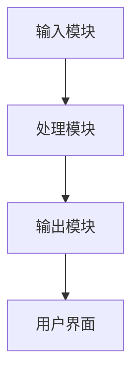

                 


# 巴菲特的创新能力评估：如何识别真正有前景的创新

> 关键词：巴菲特，创新能力评估，创新识别，前景分析，价值投资

> 摘要：本文通过分析巴菲特的投资理念，详细探讨如何评估创新能力，识别真正有前景的创新。文章从背景介绍、核心概念、算法原理、系统分析、项目实战到最佳实践，逐步引导读者掌握创新能力评估的方法。

---

## 第一部分: 创新能力评估的背景与核心概念

### 第1章: 创新能力评估的背景与问题背景

#### 1.1 创新能力评估的背景
创新是企业发展的核心驱动力，而创新能力评估是识别有前景创新的关键。在投资领域，巴菲特以其独特的价值投资理念闻名，他注重企业长期的创新能力和市场前景。

#### 1.2 巴菲特的投资理念
巴菲特的价值投资理念强调长期稳定回报，他重视企业的核心竞争力和创新能力。通过分析企业的创新历史、管理层能力和市场地位，巴菲特能够识别出那些具备持续创新能力的企业。

#### 1.3 创新能力评估的重要性
在快速变化的市场中，创新能力决定了企业的生存和成长。通过科学的评估方法，投资者可以识别出那些真正具备创新能力的企业，从而做出更明智的投资决策。

---

### 第2章: 创新能力评估的核心问题

#### 2.1 创新能力评估的目标
评估创新能力的目标是通过分析企业的创新历史、技术储备和市场反应能力，判断其未来的创新潜力。

#### 2.2 创新能力评估的关键挑战
创新评估涉及多个维度，包括技术、市场、管理等，如何将这些因素量化并综合评估是主要挑战。

#### 2.3 创新能力评估的解决方法
通过构建综合评估模型，结合定量和定性分析，巴菲特能够系统地评估企业的创新能力。

---

## 第二部分: 创新能力评估的核心概念与联系

### 第3章: 创新能力评估的核心概念

#### 3.1 创新能力评估的框架
创新评估框架包括创新输入、创新过程、创新输出和创新结果四个部分。通过分析这些部分，可以全面评估企业的创新能力。

#### 3.2 创新能力评估的属性特征对比
| 属性 | 特征1 | 特征2 | 特征3 |
|------|-------|-------|-------|
| 技术创新 | 技术领先性 | 技术可行性 | 技术可持续性 |
| 管理创新 | 管理效率 | 管理透明度 | 管理灵活性 |

#### 3.3 创新能力评估的ER实体关系图
```mermaid
erd
  顾客(顾客ID, 顾客名称, 顾客需求)
  产品(产品ID, 产品名称, 产品功能)
  创新能力(创新能力ID, 创新能力得分, 创新能力描述)
  技术创新(技术创新ID, 技术创新得分, 技术创新描述)
  管理创新(管理创新ID, 管理创新得分, 管理创新描述)
  顾客 创新能力 -> 产品
  技术创新 创新能力 -> 产品
  管理创新 创新能力 -> 产品
```

---

### 第4章: 创新能力评估的核心模型与方法

#### 4.1 创新能力评估的层次分析法
层次分析法（AHP）是一种常用的评估方法，适用于多维度评估场景。以下是层次分析法的步骤：

1. **构建层次结构**：将创新评估分解为技术创新、管理创新、市场创新等子维度。
2. **确定权重**：通过专家评分确定各子维度的权重。
3. **计算综合得分**：根据权重计算各选项的综合得分，选择得分最高的选项。

#### 4.2 创新能力评估的加权评分公式
创新评估的加权评分公式如下：
$$
\text{创新得分} = \sum_{i=1}^{n} w_i \times s_i
$$
其中，\( w_i \) 是第 \( i \) 个维度的权重，\( s_i \) 是第 \( i \) 个维度的评分。

---

### 第5章: 创新能力评估的系统分析与架构设计

#### 5.1 创新能力评估的系统功能设计
- **输入模块**：接收企业创新数据，包括技术创新、管理创新和市场创新。
- **处理模块**：对数据进行清洗、转换和分析，计算创新得分。
- **输出模块**：生成评估报告，展示创新评估结果。

#### 5.2 创新能力评估的系统架构设计


#### 5.3 创新能力评估的系统接口设计
- **输入接口**：接收企业创新数据。
- **输出接口**：生成评估报告和可视化图表。

---

### 第6章: 创新能力评估的项目实战

#### 6.1 创新能力评估的环境安装
- **工具安装**：安装Python和相关库（如pandas、numpy）。
- **数据准备**：收集企业的创新数据，包括技术创新、管理创新和市场创新。
- **环境配置**：配置开发环境，确保代码可以运行。

#### 6.2 创新能力评估的系统实现
```python
import pandas as pd
import numpy as np

# 数据准备
data = {
    '技术创新': [85, 90, 78],
    '管理创新': [70, 85, 90],
    '市场创新': [90, 80, 85]
}

df = pd.DataFrame(data)

# 计算创新得分
weights = [0.4, 0.3, 0.3]  # 权重
df['创新得分'] = df.dot(weights)

# 输出结果
print(df)
```

#### 6.3 创新能力评估的代码解读
- **数据准备**：将企业的创新数据存储在DataFrame中。
- **计算创新得分**：通过加权求和计算每个企业的创新得分。
- **输出结果**：展示计算结果。

---

## 第三部分: 创新能力评估的最佳实践与总结

### 第7章: 创新能力评估的最佳实践

#### 7.1 关键点回顾
- 创新能力评估需要结合定性和定量分析。
- 层次分析法是一种有效的评估方法。
- 代码实现可以提高评估的效率和准确性。

#### 7.2 注意事项
- 确保数据的准确性和完整性。
- 合理分配权重，避免偏倚。
- 定期更新评估模型，适应市场变化。

#### 7.3 拓展阅读
- 探索其他评估方法，如模糊综合评价法。
- 研究创新评估在不同行业的应用。

---

## 结语

通过本文的详细讲解，读者可以掌握巴菲特的创新能力评估方法，并能够识别真正有前景的创新。创新能力评估不仅是投资决策的重要工具，也是企业优化自身创新过程的关键手段。希望本文的内容能够为读者提供有价值的参考和启发。

---

作者：AI天才研究院/AI Genius Institute & 禅与计算机程序设计艺术 /Zen And The Art of Computer Programming

