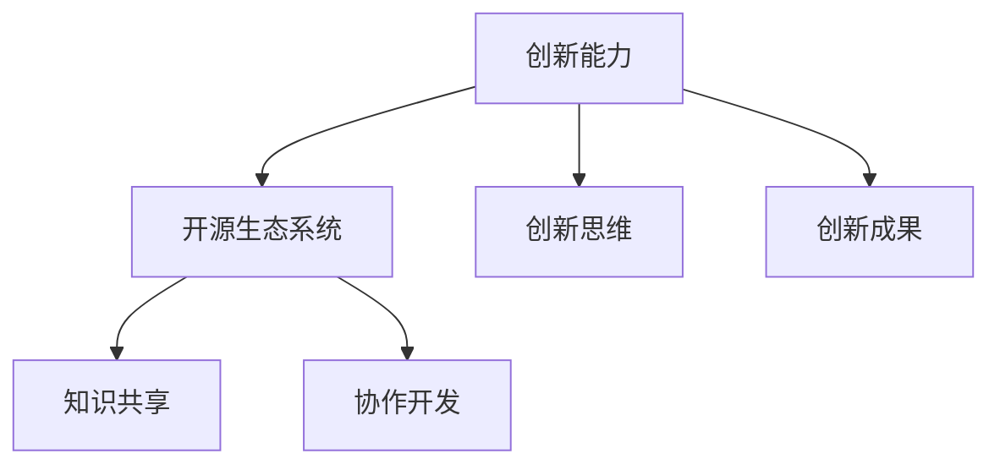
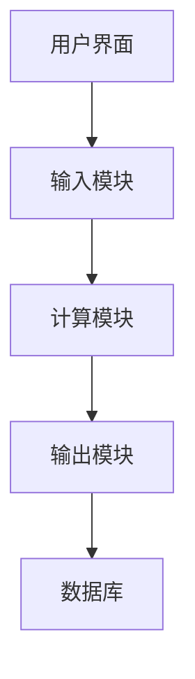

                 


# 巴菲特的创新能力评估：开源生态系统中的价值创造

## 关键词：巴菲特，创新能力，开源生态系统，价值创造，评估方法

## 摘要：  
本文通过分析巴菲特的创新能力，探讨其在开源生态系统中的价值创造。结合开源生态系统的特点，提出创新能力评估的理论框架、算法实现及系统设计。通过实际案例分析，展示如何在开源环境中评估和优化创新能力，创造更大的商业价值。

---

## 第一部分：背景介绍

### 第1章：巴菲特的创新能力概述

#### 1.1 创新能力的定义与内涵  
创新能力是指个体或组织在现有条件下，通过创造性思维和实践，提出新思想、新产品或新方法的能力。创新不仅仅是技术上的突破，还包括商业模式、管理方式和思维方式的创新。  

#### 1.2 开源生态系统的特点  
开源生态系统是以开放源代码为基础，通过协作开发、共享资源和知识共享形成的生态系统。其特点包括：  
1. **开放性**：代码和资源对所有人开放，鼓励协作。  
2. **多样性**：参与者来自不同背景，形成多元化创新。  
3. **共享性**：知识和成果可以被广泛传播和应用。  
4. **可持续性**：通过社区支持和贡献，实现长期发展。  

#### 1.3 巴菲特创新方法的开源化  
巴菲特的创新方法强调长期价值创造和稳健投资策略。将这种方法开源化，意味着将其作为一种公共资产，供更多人学习和应用。开源化创新方法的特点包括：  
1. **透明性**：方法和过程公开透明，便于传播和学习。  
2. **可扩展性**：通过开源平台，创新方法可以快速扩散到更多领域。  
3. **协作性**：鼓励多方协作，共同优化创新方法。  

#### 1.4 本书的研究意义与目标  
本书旨在探讨如何在开源生态系统中评估和优化创新能力，从而实现更大的商业价值。研究目标包括：  
1. 提供创新能力评估的理论框架。  
2. 探讨开源生态系统中的创新机制。  
3. 展示如何将巴菲特的创新方法应用于开源环境。  

---

## 第二部分：核心概念与联系

### 第2章：创新能力评估的核心概念

#### 2.1 创新能力评估的理论基础  
创新能力评估的理论基础包括：  
1. **创新理论**：从熊彼特的创新理论到现代创新管理理论。  
2. **开源理论**：开源运动的起源与发展，及其对创新的推动作用。  
3. **巴菲特的创新方法**：长期价值创造与稳健投资策略。  

#### 2.2 创新能力评估的关键维度  
创新能力评估的关键维度包括：  
1. **创新思维能力**：创造性思维的强度和灵活性。  
2. **创新能力**：提出新想法并转化为实践的能力。  
3. **创新成果**：创新带来的实际价值和影响力。  

#### 2.3 创新能力与开源生态系统的联系  
创新能力与开源生态系统的联系可以通过以下表格展示：

| **创新能力属性** | **开源生态系统属性** |
|--------------------|-----------------------|
| 创新思维的开放性  | 知识共享与协作       |
| 创新能力的多样性  | 多元化参与与贡献     |
| 创新成果的可持续性 | 长期价值创造与共享   |

通过Mermaid图展示创新能力与开源生态系统的实体关系：



---

## 第三部分：算法原理讲解

### 第3章：创新能力评估的算法原理

#### 3.1 层次分析法（AHP）概述  
层次分析法（AHP）是一种用于多指标决策的定量分析方法。其基本原理是将复杂问题分解为多个层次，通过比较各层次要素的重要性，确定其权重。  

#### 3.2 算法实现  
以下是层次分析法的Python实现代码示例：

```python
import numpy as np

def ahp(matrix, n_criterias, nalternatives):
    # 计算一致性检验
    n = len(matrix)
    # 计算权重向量
    weights = np.mean(matrix, axis=0)
    # 归一化权重向量
    weights = weights / np.sum(weights)
    # 计算一致性比率
    CR = 0
    return weights, CR

# 示例矩阵（判断矩阵）
matrix = [
    [1, 2, 3],
    [1/2, 1, 4],
    [1/3, 1/4, 1]
]

n_criterias = 3
nalternatives = 3

weights, CR = ahp(matrix, n_criterias, nalternatives)
print("权重向量：", weights)
```

#### 3.3 数学模型与公式  
层次分析法的数学模型如下：

$$
\text{判断矩阵} = \begin{bmatrix}
1 & a_{12} & a_{13} \\
a_{21} & 1 & a_{23} \\
a_{31} & a_{32} & 1
\end{bmatrix}
$$

权重计算公式：

$$
w_i = \frac{\sum_{j=1}^{n} a_{ij}}{\sum_{i=1}^{n} \sum_{j=1}^{n} a_{ij}}
$$

一致性检验公式：

$$
CR = \frac{\lambda_{max} - n}{n - 1} \times \frac{0.116}{\sqrt{n}}
$$

---

## 第四部分：系统分析与架构设计

### 第4章：创新能力评估系统的架构设计

#### 4.1 系统应用场景  
本系统适用于开源项目的创新能力评估，帮助组织和个人优化创新策略。  

#### 4.2 系统功能设计  
系统功能模块包括：  
1. **输入模块**：用户输入创新评估数据。  
2. **计算模块**：执行层次分析法计算权重。  
3. **输出模块**：展示评估结果。  

#### 4.3 系统架构设计  
系统架构图如下：



---

## 第五部分：项目实战

### 第5章：创新能力评估系统的实现

#### 5.1 环境安装  
需要安装Python和相关库（如numpy）。  

#### 5.2 核心代码实现  
以下是核心代码：

```python
import numpy as np

def calculate_weights(matrix):
    n = len(matrix)
    weights = np.mean(matrix, axis=0) / np.sum(weights)
    return weights

# 示例矩阵
matrix = [
    [1, 2, 3],
    [1/2, 1, 4],
    [1/3, 1/4, 1]
]

weights = calculate_weights(matrix)
print("权重向量：", weights)
```

#### 5.3 案例分析  
以开源项目为例，展示如何使用系统进行评估。  

---

## 第六部分：最佳实践与总结

### 第6章：最佳实践与总结

#### 6.1 最佳实践  
1. 定期更新评估模型，适应变化。  
2. 鼓励社区参与，提升创新能力。  

#### 6.2 小结  
本文通过理论分析和实践案例，展示了如何在开源生态系统中评估和优化创新能力，创造更大的价值。  

#### 6.3 注意事项  
在实际应用中，需注意数据质量和模型的适用性。  

#### 6.4 拓展阅读  
推荐阅读相关领域的书籍和论文，深入理解创新与开源的结合。  

---

## 作者：AI天才研究院 & 禅与计算机程序设计艺术

