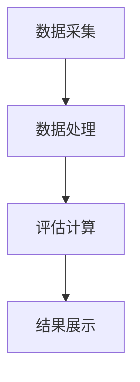

                 


# 巴菲特的创新能力评估：量子创业生态系统的价值创造

> 关键词：巴菲特，创新能力评估，量子创业生态系统，价值创造，系统架构设计，算法原理

> 摘要：本文深入探讨巴菲特创新能力评估在量子创业生态系统中的应用，分析其价值创造机制，并结合实际案例展示系统的构建与实现。通过详细的技术分析，揭示如何利用创新评估模型优化量子创业生态系统的运作，提升企业竞争力。

---

## 第一部分: 背景介绍与核心概念

### 第1章: 巴菲特的创新能力评估

#### 1.1 巴菲特的生平与投资理念
- 巴菲特作为投资界的传奇，其成功依赖于对创新能力和企业潜力的精准评估。
- 其投资理念强调长期价值创造，而非短期收益。

#### 1.2 创新能力评估的背景与意义
- 创新能力是企业核心竞争力的关键，特别是在快速变化的技术环境中。
- 评估创新能力有助于识别高潜力项目和企业，优化投资决策。

#### 1.3 巴菲特创新能力评估的核心要素
- **创新性**：技术独特性和市场差异化。
- **可行性**：技术实现难度和商业模式可行性。
- **可持续性**：长期竞争优势和盈利能力。

---

### 第2章: 量子创业生态系统概述

#### 2.1 量子创业生态系统的定义与特点
- 量子创业生态系统整合量子计算、人工智能、大数据等技术，形成高效协同的创新环境。
- 其特点包括：技术创新、资源聚合、生态协同、价值倍增。

#### 2.2 量子创业生态系统的核心要素
- **技术平台**：提供量子计算、AI等技术支持。
- **资源网络**：整合资金、人才、市场等资源。
- **协同机制**：促进企业间合作与知识共享。

---

## 第二部分: 创新能力评估的理论框架

### 第3章: 创新能力评估的理论基础

#### 3.1 创新能力评估的定义与范围
- 创新能力评估是对企业在技术创新、商业模式创新等方面的能力进行全面评价。

#### 3.2 创新能力评估的关键指标
| 指标类别 | 指标名称 | 描述 |
|----------|----------|------|
| 技术创新 | 技术独特性 | 企业的技术与竞争对手的差异程度 |
| 可行性   | 商业模式可行性 | 企业的商业模式能否实现盈利 |
| 可持续性 | 市场地位 | 企业在市场中的竞争地位 |

---

## 第三部分: 创新能力评估的数学模型与算法

### 第4章: 创新能力评估的数学模型

#### 4.1 层次分析法（AHP）
- **步骤**：
  1. 构建决策层次结构。
  2. 确定各层次权重。
  3. 计算综合评分。
- **公式**：
  $$ A = \lambda_{max} \cdot W $$
  其中，A为最终评分，W为权重矩阵，λ_max为特征向量。

#### 4.2 加权平均法
- **公式**：
  $$ S = \sum_{i=1}^{n} w_i \cdot s_i $$
  其中，S为综合评分，w_i为各指标权重，s_i为指标评分。

---

## 第四部分: 量子创业生态系统中的创新能力评估

### 第5章: 系统架构设计

#### 5.1 系统功能模块
- 数据采集模块：收集企业数据。
- 评估计算模块：应用算法进行评估。
- 结果展示模块：可视化评估结果。

#### 5.2 系统架构图


---

## 第五部分: 项目实战与案例分析

### 第6章: 量子创业生态系统项目实战

#### 6.1 环境安装与数据准备
- 安装必要的开发工具和依赖。
- 收集企业的技术创新、商业模式等数据。

#### 6.2 核心代码实现
```python
def calculate创新能力评估(数据):
    # 加权计算
    评估结果 = sum(权重[i] * 数据[i] for i in range(len(数据)))
    return 评估结果
```

#### 6.3 案例分析
- 分析一家量子计算初创公司的创新能力，应用上述模型进行评估，并展示结果。

---

## 第六部分: 总结与展望

### 第7章: 总结与最佳实践

#### 7.1 总结
- 创新能力评估是量子创业生态系统中价值创造的关键。
- 结合数学模型和系统架构设计，可以有效优化企业评估流程。

#### 7.2 小结与注意事项
- 注重数据质量，确保评估结果准确。
- 定期更新评估模型，适应市场变化。

#### 7.3 拓展阅读与研究方向
- 探索更多评估模型，如机器学习算法的应用。
- 研究量子计算在其他领域的应用潜力。

---

## 作者信息

作者：AI天才研究院/AI Genius Institute & 禅与计算机程序设计艺术/Zen And The Art of Computer Programming

