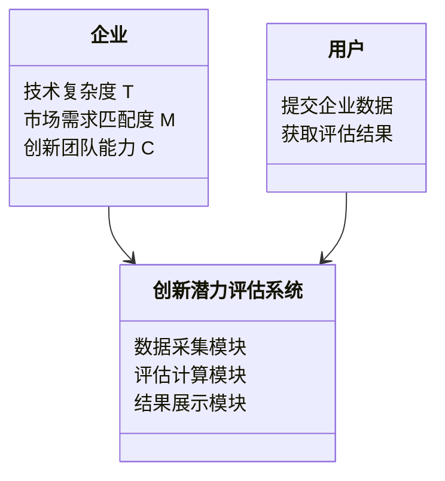
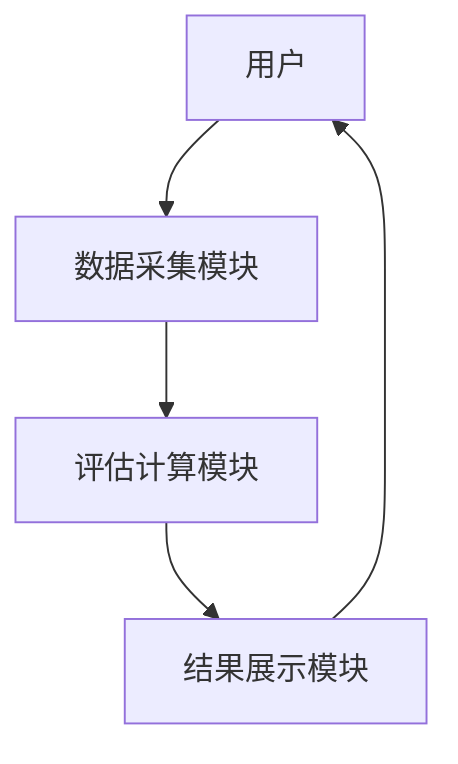

                 


# 《巴菲特的创新能力评估：量子初创企业的价值创造潜力分析》

---

## 关键词：  
巴菲特，创新能力评估，量子初创企业，价值创造潜力，数学模型，系统架构设计

---

## 摘要：  
本文深入分析了巴菲特的价值投资理念与创新能力评估的结合，特别是在量子初创企业的价值创造潜力分析中的应用。通过构建创新能力评估模型，结合系统架构设计和实际案例分析，展示了如何量化和评估量子初创企业的创新能力，从而为投资者提供科学的决策依据。

---

## 第1章: 巴菲特的价值投资理念概述

### 1.1 价值投资的核心理念  
巴菲特的价值投资理念强调企业内在价值的重要性，主张通过分析企业的财务状况、市场地位和竞争优势来判断其长期投资价值。  

#### 核心概念  
- **内在价值**：企业未来现金流的现值，是决定企业价值的核心因素。  
- **安全边际**：买入价格低于内在价值，以降低投资风险。  

### 1.2 创新能力评估的重要性  
创新能力是企业长期竞争优势的源泉。对于量子初创企业而言，创新能力不仅体现在技术创新上，还体现在商业模式和市场扩展能力上。  

### 1.3 量子初创企业的特点  
量子初创企业通常专注于前沿技术领域（如量子计算、人工智能等），具有高成长性和高风险性。  

---

## 第2章: 量子初创企业的创新评估模型

### 2.1 创新能力评估的核心要素  
- **技术创新性**：技术的原创性和先进性。  
- **商业模式创新性**：商业模式的独特性和可扩展性。  
- **市场潜力**：目标市场的规模和增长潜力。  

### 2.2 创新能力评估的数学模型  
构建一个综合评估模型，量化企业的创新能力对价值创造的贡献。  

#### 公式推导  
创新潜力指数（IP）公式：  
$$IP = w_1 \cdot T + w_2 \cdot M + w_3 \cdot C$$  
其中：  
- $T$ 为技术复杂度（0-10分）  
- $M$ 为市场需求匹配度（0-10分）  
- $C$ 为创新团队能力（0-10分）  
- $w_1, w_2, w_3$ 为权重系数（总和为1）  

#### 实际案例  
假设一家量子初创企业的技术复杂度为8，市场需求匹配度为7，创新团队能力为9，权重系数分别为0.4、0.3、0.3。  
$$IP = 0.4 \cdot 8 + 0.3 \cdot 7 + 0.3 \cdot 9 = 3.2 + 2.1 + 2.7 = 8.0$$  
创新潜力指数为8.0，属于高潜力企业。  

---

## 第3章: 创新能力评估的系统架构设计

### 3.1 系统功能模块  
- **数据采集模块**：收集企业的技术、市场和团队数据。  
- **评估计算模块**：基于数学模型计算创新潜力指数。  
- **结果展示模块**：以可视化形式呈现评估结果。  

### 3.2 系统架构设计  

#### 领域模型（Mermaid 类图）  


#### 系统架构（Mermaid 架构图）  


---

## 第4章: 项目实战

### 4.1 环境安装  
- Python 3.8+  
- numpy、pandas、matplotlib库  

### 4.2 核心代码实现  

#### 创新潜力评估函数  
```python
def calculate_innovation_potential(T, M, C, w1, w2, w3):
    IP = w1 * T + w2 * M + w3 * C
    return IP

# 示例调用
T = 8
M = 7
C = 9
w1 = 0.4
w2 = 0.3
w3 = 0.3

IP = calculate_innovation_potential(T, M, C, w1, w2, w3)
print(f"创新潜力指数：{IP}")
```

#### 结果展示  
```python
import matplotlib.pyplot as plt

categories = ['技术复杂度', '市场需求匹配度', '创新团队能力']
values = [T, M, C]

plt.bar(categories, values)
plt.title('创新潜力评估指标')
plt.ylabel('得分')
plt.show()
```

### 4.3 案例分析  
以某量子计算初创企业为例，评估其创新潜力指数为8.0，属于高潜力企业。  

---

## 第5章: 结论与展望

### 5.1 结论  
- 创新能力评估模型能够有效量化量子初创企业的价值潜力。  
- 系统架构设计为投资者提供了直观的决策工具。  

### 5.2 未来研究方向  
- 进一步优化数学模型，引入更多评估维度。  
- 开发在线评估工具，方便投资者快速获取结果。  

---

## 作者：  
AI天才研究院/AI Genius Institute  
禅与计算机程序设计艺术/Zen And The Art of Computer Programming  

---

以上是《巴菲特的创新能力评估：量子初创企业的价值创造潜力分析》的技术博客文章内容，希望对您有所帮助！

