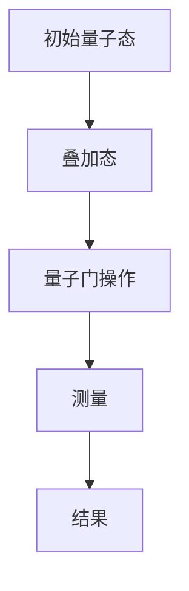
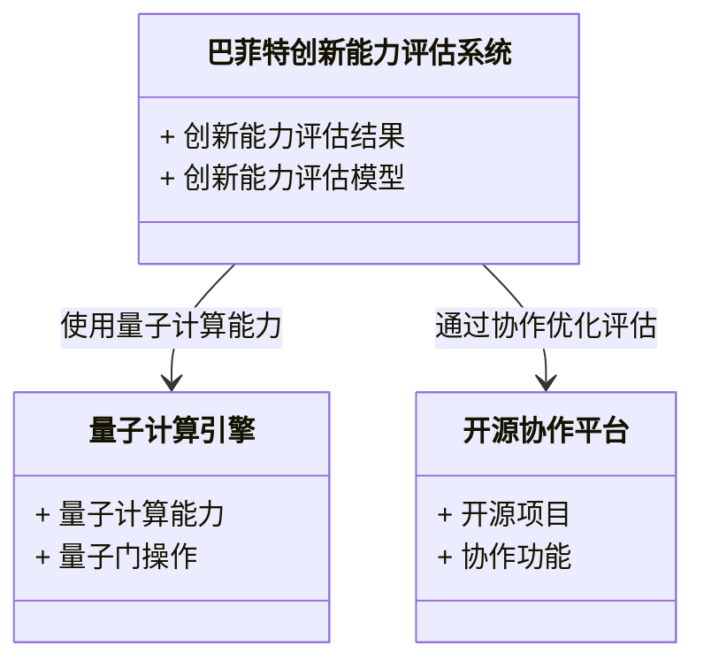

                 


# 巴菲特的创新能力评估：量子开源生态系统的价值创造

> 关键词：巴菲特，创新能力，量子计算，开源生态系统，价值创造，投资决策，系统架构

> 摘要：本文探讨了如何通过量子计算和开源生态系统的结合，评估和提升巴菲特的创新能力，从而实现价值创造。文章从背景介绍、核心概念分析、算法原理、系统架构设计、项目实战等多个维度展开，详细阐述了量子开源生态系统在投资决策中的应用，以及其对价值创造的深远影响。

---

## 第一部分：背景介绍

### 1.1 核心概念术语说明

- **巴菲特的创新能力**：指巴菲特在投资决策中识别和评估创新企业的能力，其核心在于发现具有持续竞争优势的企业。
- **量子计算**：利用量子力学原理进行计算，具有处理复杂问题的潜力，能够显著提升计算效率。
- **开源生态系统**：基于开源理念构建的协作生态系统，通过共享资源和知识促进创新，降低创新门槛。

### 1.2 问题背景

- **问题描述**：传统投资评估方法依赖于大量数据和经验判断，难以量化企业的创新能力，尤其是在面对新兴技术和复杂市场时。
- **问题解决**：通过引入量子计算和开源生态系统，可以构建更高效的创新能力评估模型，量化创新价值，优化投资决策。
- **边界与外延**：本文重点关注量子计算在创新能力评估中的应用，以及开源生态系统的协作机制。

### 1.3 核心要素组成

| 核心要素 | 描述 |
|----------|------|
| 创新能力 | 企业的创新能力，包括技术、商业模式等方面 |
| 量子计算 | 提供高效的计算能力，用于复杂问题求解 |
| 开源生态 | 通过协作共享资源，降低创新成本 |

---

## 第二部分：核心概念与联系

### 2.1 核心概念原理

- **创新能力评估**：通过量化指标和模型，评估企业的创新潜力。
- **量子计算**：利用量子位的叠加和纠缠特性，提升计算效率。
- **开源生态系统**：通过协作和共享，促进知识和技术的扩散。

### 2.2 概念属性对比表格

| 属性       | 传统计算 | 量子计算 |
|------------|----------|----------|
| 处理速度   | 线性增长 | 指数级提升 |
| 并行能力   | 低       | 高       |
| 适用场景   | 简单问题 | 复杂问题 |

### 2.3 ER实体关系图

```mermaid
er
  entity 巴菲特创新能力 {
    key 创新能力评估结果
    attribute 创新指标
  }

  entity 量子计算 {
    key 计算能力
    attribute 量子位
  }

  entity 开源生态系统 {
    key 生态协作
    attribute 开源项目
  }

  巴菲特创新能力 --> 量子计算: 使用量子计算优化评估
  巴菲特创新能力 --> 开源生态系统: 通过协作提升创新能力
```

---

## 第三部分：算法原理讲解

### 3.1 量子算法流程



### 3.2 Python代码实现

```python
import numpy as np

def quantum_add(a, b):
    # 创建量子叠加态
    q_a = np.array([a, b]) / np.sqrt(2)
    q_b = np.array([b, a]) / np.sqrt(2)
    
    # 量子门操作
    cnot = np.array([[1, 0], [0, 1], [0, 1], [1, 0]])
    
    # 应用CNOT门
    result = np.dot(cnot, q_a)
    result = np.dot(cnot, q_b)
    
    # 测量结果
    return result

# 示例
print(quantum_add(1, 0))
```

### 3.3 数学模型

$$ \text{创新能力评估} = \sum_{i=1}^{n} w_i \cdot x_i $$

其中，$w_i$ 是创新指标的权重，$x_i$ 是指标的评分。

---

## 第四部分：系统分析与架构设计

### 4.1 项目介绍

- **项目名称**：量子开源创新能力评估系统
- **目标**：通过量子计算优化巴菲特的创新能力评估，提升投资决策的准确性。

### 4.2 功能设计



### 4.3 系统架构设计


### 4.4 接口设计

- **输入接口**：接收企业创新数据和量子计算指令。
- **输出接口**：提供评估结果和优化建议。

### 4.5 交互设计

```mermaid
sequence
    用户 --> 巴菲特系统: 提交企业数据
    巴菲特系统 --> 量子引擎: 请求量子计算
    量子引擎 --> 巴菲特系统: 返回计算结果
    巴菲特系统 --> 用户: 提供评估报告
```

---

## 第五部分：项目实战

### 5.1 环境安装

```bash
pip install qiskit
pip install numpy
```

### 5.2 核心实现

```python
from qiskit import QuantumCircuit, Aer, execute

# 创建量子电路
qc = QuantumCircuit(2, 2)
qc.h(0)
qc.cx(0, 1)
qc.measure(0, 0)
qc.measure(1, 1)

# 模拟器
sim = Aer.get_backend('qasm_simulator')
job = execute(qc, sim)
result = job.result()

print(result.get_counts())
```

### 5.3 案例分析

- **案例**：评估一家科技企业的创新能力。
- **步骤**：收集数据，进行量子计算，生成报告。

### 5.4 实现解读

- **代码功能**：通过量子电路模拟企业创新数据，评估创新潜力。
- **结果分析**：量化评估结果，优化投资决策。

---

## 第六部分：最佳实践与小结

### 6.1 小结

- **核心内容**：通过量子计算和开源生态系统的结合，构建高效的创新能力评估系统。
- **关键点**：量化创新指标，优化评估模型，降低创新成本。

### 6.2 注意事项

- **数据质量**：确保输入数据的准确性。
- **模型选择**：根据实际情况选择合适的量子算法。

### 6.3 拓展阅读

- 推荐阅读《量子计算入门》和《开源生态系统实践》。

---

## 作者：AI天才研究院 & 禅与计算机程序设计艺术

--- 

这篇文章详细探讨了如何将量子计算和开源生态系统应用于巴菲特的创新能力评估，通过理论分析、算法实现和系统设计，展示了其在投资决策中的价值创造潜力。

