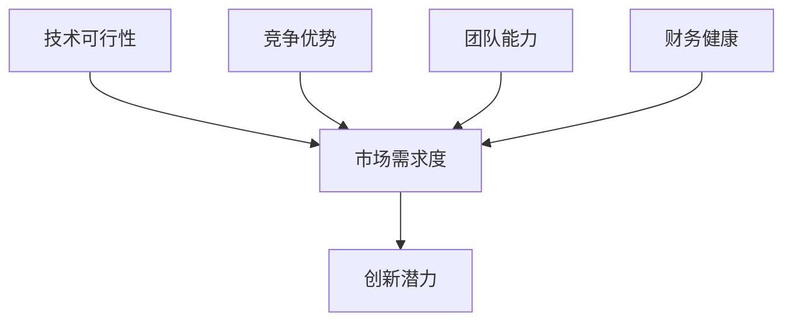

                 


# 巴菲特创新能力评估：颠覆性技术的识别与投资

## 关键词：巴菲特，创新能力评估，颠覆性技术，技术识别，投资策略

## 摘要

本文探讨了巴菲特的投资理念与颠覆性技术识别的结合，详细介绍了创新能力评估模型的构建、颠覆性技术的识别方法以及相应的投资策略。通过实际案例分析和系统架构设计，帮助投资者更好地进行技术评估和投资决策。

---

## 第一部分：背景介绍

### 第1章：巴菲特的投资理念与颠覆性技术

#### 1.1 巴菲特的投资理念

巴非特的投资理念以价值投资为核心，强调长期投资和基本面分析。他注重企业的内在价值，寻找那些具有强大竞争优势和良好管理的公司。这种理念与颠覆性技术的识别相结合，可以帮助投资者在技术驱动的市场中找到潜在的高增长机会。

#### 1.2 颠覆性技术的定义与特征

颠覆性技术是指那些能够从根本上改变行业格局，创造新的市场需求或替代现有技术的新技术。其特征包括技术可行性高、市场需求强烈、竞争优势明显等。与渐进式创新不同，颠覆性技术往往会对现有市场和商业模式造成巨大冲击。

#### 1.3 技术创新与投资的关系

技术创新直接影响企业的市场地位和盈利能力，而投资则需要在技术创新的基础上，评估其商业潜力和可行性。通过技术创新评估，投资者可以更准确地识别高潜力的技术，从而制定有效的投资策略。

---

## 第二部分：创新能力评估模型

### 第2章：创新能力评估模型构建

#### 2.1 创新能力评估的核心要素

创新能力评估模型的核心要素包括技术可行性、市场需求度、竞争优势、团队能力和财务健康状况。这些要素共同决定了技术的商业潜力和投资价值。

#### 2.2 创新能力评估模型的构建

模型构建基于五要素分析，通过权重分配和综合评分，评估技术的整体创新潜力。模型结构如下：



#### 2.3 创新能力评估指标的权重分配

指标权重基于其对投资的影响程度确定，例如市场需求度权重最高，其次是竞争优势和技术可行性。

---

## 第三部分：颠覆性技术的识别方法

### 第3章：颠覆性技术的识别与分析

#### 3.1 技术趋势分析

技术趋势分析包括技术发展周期分析、成熟度评估和趋势预测。通过分析技术生命周期，识别处于成长期的技术，预测其市场潜力。

#### 3.2 市场需求分析

市场需求分析包括市场容量估算和竞争格局分析。通过了解市场规模和竞争情况，评估技术的市场需求度。

#### 3.3 技术可行性分析

技术可行性分析包括技术实现评估和专利分析。评估技术实现的可能性，并通过专利分析了解技术的保护情况和竞争态势。

---

## 第四部分：投资策略与风险管理

### 第4章：颠覆性技术的投资策略

#### 4.1 投资策略的制定

制定投资策略时，需考虑分散投资、风险控制和动态调整。通过分散投资降低风险，定期评估技术发展和市场变化，及时调整投资组合。

#### 4.2 投资风险管理

风险管理包括风险识别、量化和应对措施。通过情景分析和压力测试，评估潜在风险，并制定应对策略。

---

## 项目实战：创新能力评估模型的实现

### 4.5 环境安装与核心代码实现

以下代码实现创新能力评估模型：

```python
def calculate_innovation_potential(tech_feasibility, market_demand, competitive_advantage, team_capability, financial_health):
    # 定义权重
    weights = {
        'tech_feasibility': 0.2,
        'market_demand': 0.3,
        'competitive_advantage': 0.3,
        'team_capability': 0.1,
        'financial_health': 0.1
    }
    
    # 计算加权得分
    score = (tech_feasibility * weights['tech_feasibility'] +
             market_demand * weights['market_demand'] +
             competitive_advantage * weights['competitive_advantage'] +
             team_capability * weights['team_capability'] +
             financial_health * weights['financial_health'])
    
    return score

# 示例数据
tech_feasibility = 0.8
market_demand = 0.9
competitive_advantage = 0.7
team_capability = 0.6
financial_health = 0.8

# 计算创新潜力
ip_score = calculate_innovation_potential(tech_feasibility, market_demand, competitive_advantage, team_capability, financial_health)

print(f"创新潜力得分为：{ip_score}")
```

---

## 总结与展望

### 5.1 总结

本文详细介绍了巴菲特创新能力评估模型的构建和应用，探讨了颠覆性技术的识别方法和投资策略。通过实际案例分析和系统设计，帮助投资者更好地进行技术评估和投资决策。

### 5.2 未来展望

未来，随着技术的不断进步和市场的变化，创新能力评估模型需要不断优化和更新。同时，结合人工智能和大数据分析，可以进一步提升技术识别和投资决策的准确性。

---

## 作者

作者：AI天才研究院/AI Genius Institute  
禅与计算机程序设计艺术/Zen And The Art of Computer Programming

---

以上就是《巴菲特创新能力评估：颠覆性技术的识别与投资》的完整内容，希望对您有所帮助！

