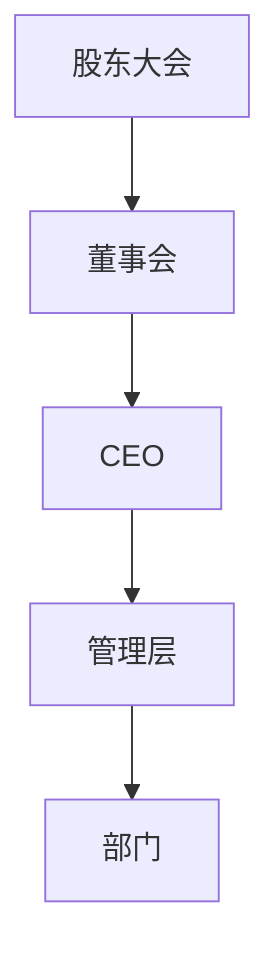
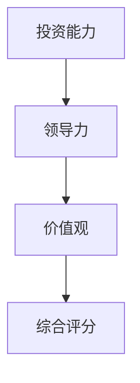

                 


# 巴菲特的后继者：谁将接棒伯克希尔哈撒韦

> 关键词：巴菲特，伯克希尔哈撒韦，接班人，投资理念，公司治理，领导力

> 摘要：伯克希尔哈撒韦作为全球最具影响力的公司之一，其领导权的交接备受关注。本文通过分析巴菲特的投资理念、伯克希尔哈撒韦的公司治理结构以及潜在接班人的能力，探讨谁最有可能接棒巴菲特，带领公司继续辉煌。文章结合技术语言，使用逻辑推理和系统分析，深入剖析问题，为读者提供全面的视角。

---

## 第一章：引言

### 1.1 本书的目的与意义
- 探讨伯克希尔哈撒韦的未来领导问题，分析潜在接班人的可能性。
- 结合技术方法，提供独特的分析视角。
- 为投资者和管理层提供决策参考。

### 1.2 伯克希尔哈撒韦的重要性
- 公司概况：巴菲特创立的公司，以价值投资闻名。
- 全球影响力：在金融、保险等多个领域具有重要地位。
- 传承意义：确保公司长期稳定发展。

### 1.3 巴菲特的投资理念与管理风格
- 价值投资的核心：寻找低估的公司，长期持有。
- 股东导向：重视股东利益，坚持保守财务策略。
- 管理风格：注重团队合作，培养优秀人才。

### 1.4 本书的结构安排
- 分章节深入分析，涵盖背景、评估标准、潜在接班人、挑战与未来展望。

---

## 第二章：伯克希尔哈撒韦的背景与治理结构

### 2.1 伯克希尔哈撒韦的股东结构
- 股东构成：主要股东及其影响力。
- 股权分散：防止控制权集中，维护股东权益。

### 2.2 公司治理的核心原则
- 董事会结构：独立董事的作用与职责。
- 透明化：定期财务报告，保持信息公开。

### 2.3 巴菲特的领导风格与企业文化
- 领导风格：以身作则，注重道德与诚信。
- 企业文化：鼓励创新，重视长期目标。

### 2.4 伯克希尔哈撒韦的长期目标与使命
- 创造股东价值：通过投资和收购实现增长。
- 社会责任：关注环境保护，推动可持续发展。

---

## 第三章：巴菲特的接班人评估标准

### 3.1 接班人的核心素质与能力
- 投资能力：具备价值投资理念，能够识别优质资产。
- 领导力：具备团队管理和决策能力。
- 价值观：与公司文化一致，具备长期眼光。

### 3.2 伯克希尔哈撒韦的管理层梯队建设
- 管理层结构：现有高层的职责与贡献。
- 培养机制：内部晋升与外部引进的结合。

### 3.3 接班人评估的数学模型
- 评估指标：投资回报率、领导能力评分等。
- 算法框架：使用加权评分法，量化候选人能力。

### 3.4 评估模型的实现
- 代码示例：简单的评估模型，计算候选人的综合得分。
- 算法原理：通过数据加权，综合评估候选人能力。

---

## 第四章：潜在接班人分析

### 4.1 芒格(Charlie Munger)的角色与影响
- 个人背景：长期合作伙伴，具备深厚投资经验。
- 投资理念：互补于巴菲特，注重风险控制。
- 优缺点分析：经验丰富但可能缺乏CEO经验。

### 4.2 阿贝尔(Greg Abel)的潜力分析
- 职位与职责：负责非保险业务，表现出色。
- 投资能力：稳健增长，注重风险管理。
- 未来可能性：具备CEO潜力，但需时间验证。

### 4.3 其他潜在接班人分析
- 高层管理者评估：如大卫·舒克特等人的潜力。
- 团队协作：管理层的协作能力影响接班可能性。

---

## 第五章：接班人的挑战与解决方案

### 5.1 接班人面临的挑战
- 外部挑战：市场波动、投资者压力。
- 内部挑战：公司文化、团队管理。

### 5.2 应对挑战的策略
- 战略调整：优化投资组合，适应市场变化。
- 文化传承：保持公司文化，确保长期发展。

### 5.3 解决方案的实施
- 分阶段实施：逐步过渡，确保平稳交接。
- 监测与评估：定期评估效果，及时调整策略。

---

## 第六章：伯克希尔哈撒韦的未来展望

### 6.1 未来接班人对公司的影响
- 战略决策：接班人将影响公司发展方向。
- 文化延续：确保公司文化传承，保持长期竞争优势。

### 6.2 未来发展的关键因素
- 创新能力：适应科技发展，保持竞争优势。
- 领导力培养：持续培养优秀管理人才。

---

## 第七章：系统分析与架构设计

### 7.1 公司治理结构的Mermaid图


### 7.2 接班人评估框架的Mermaid图


---

## 第八章：项目实战

### 8.1 环境安装
- 工具：Python、数据分析库（如Pandas）。

### 8.2 核心实现代码
```python
def evaluate_successor(candidates):
    scores = []
    for candidate in candidates:
        investment_score = candidate['investment_skills'] / 100
        leadership_score = candidate['leadership_skills'] / 100
        total_score = investment_score * 0.5 + leadership_score * 0.5
        scores.append(total_score)
    return scores

candidates = [
    {'name': 'Charlie Munger', 'investment_skills': 95, 'leadership_skills': 80},
    {'name': 'Greg Abel', 'investment_skills': 90, 'leadership_skills': 85}
]

scores = evaluate_successor(candidates)
print(scores)
```

### 8.3 代码解读
- 函数`evaluate_successor`计算候选人的综合得分。
- 结果展示：各候选人的得分，用于评估接班可能性。

---

## 第九章：最佳实践与小结

### 9.1 最佳实践
- 定期评估管理层：确保团队能力符合公司需求。
- 培养接班人：通过系统培养，确保顺利交接。

### 9.2 小结
- 伯克希尔哈撒韦的未来取决于接班人的选择和培养。
- 投资者应关注公司治理和管理层动态。

---

## 第十章：注意事项与拓展阅读

### 10.1 注意事项
- 市场风险：接班人需应对复杂市场环境。
- 团队协作：管理层需紧密合作，确保公司稳定。

### 10.2 拓展阅读
- 建议阅读巴菲特的经典著作，深入理解其投资理念。

---

## 附录

### 附录A：术语解释
- 价值投资：寻找低估资产，长期持有。

### 附录B：参考文献
- 巴菲特定著：《巴菲特写给股东的信》。

---

## 作者

作者：AI天才研究院/AI Genius Institute & 禅与计算机程序设计艺术 /Zen And The Art of Computer Programming

---

通过以上目录，文章系统地分析了巴菲特的接班人问题，结合技术方法，为读者提供了全面的视角。

