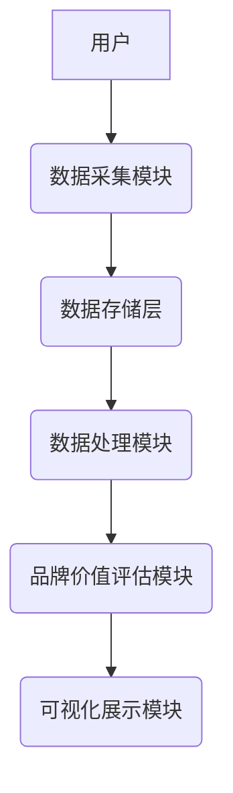
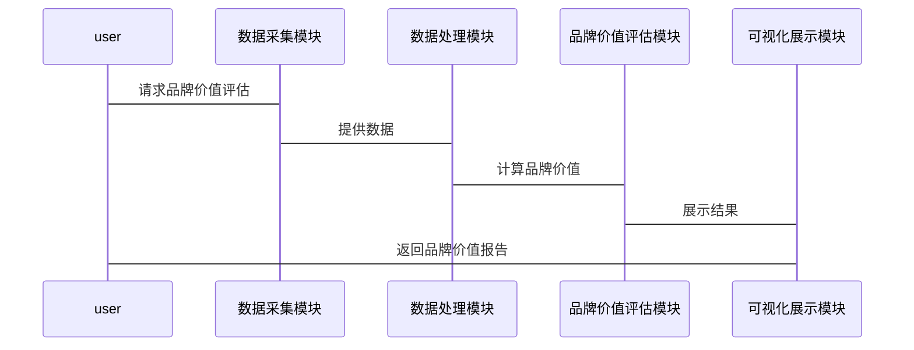

                 


# 巴菲特的品牌价值理论：在数字经济中的新解读

---

## 关键词：品牌价值，数字经济，巴菲特，价值投资，数据驱动

---

## 摘要

本文深入探讨了巴菲特品牌价值理论在数字经济时代的新解读。通过分析品牌价值的多维度特征、构建量化模型，并结合实际案例，展示了如何在数字时代重新评估和提升品牌价值。文章从理论到实践，结合技术方法，为读者提供了全面的视角。

---

## 第1章：数字经济时代的品牌价值新维度

### 1.1 从传统到数字：品牌价值的演变

#### 1.1.1 传统品牌价值的定义与评估方法

品牌价值传统上通过市场地位、客户忠诚度和品牌认知度来评估。常用的方法包括溢价法、市场价值法和经济增加值法。例如，可口可乐的全球品牌价值高达数千亿美元，主要得益于其强大的品牌认知度和客户忠诚度。

#### 1.1.2 数字经济时代品牌价值的核心变化

数字技术的崛起改变了品牌价值的评估维度。数据驱动的决策、社交媒体影响力和客户参与度成为关键因素。例如，社交媒体上的高互动率可以显著提升品牌价值。

#### 1.1.3 巴菲特品牌价值理论的现代意义

巴菲特强调长期投资和品牌忠诚度。在数字经济时代，这些原则依然适用，但需要结合数据和技术进行动态调整。

---

## 第2章：品牌价值的多维度分析

### 2.1 品牌资产的构成模型

#### 2.1.1 品牌资产的定义与分类

品牌资产包括有形资产（如商标）和无形资产（如品牌声誉）。例如，苹果品牌的价值主要来自其强大的品牌声誉和客户忠诚度。

#### 2.1.2 品牌资产的评估维度

- **品牌强度**：品牌的市场地位和竞争力。
- **客户忠诚度**：客户对品牌的粘性和重复购买意愿。
- **市场地位**：品牌在市场中的影响力和份额。

#### 2.1.3 品牌资产与企业价值的关系

品牌资产是企业价值的重要组成部分，直接影响企业的市场估值和盈利能力。

### 2.2 数字经济时代品牌价值的新特征

#### 2.2.1 数据驱动的品牌价值评估

数据驱动的方法利用大数据和人工智能技术，通过分析客户行为和市场趋势来评估品牌价值。例如，通过社交媒体数据可以实时监测品牌声誉的变化。

#### 2.2.2 社交媒体与用户生成内容的影响

社交媒体上的用户评论和点赞量直接影响品牌价值。例如，负面评论可能导致品牌价值下降，而积极评论则会提升品牌声誉。

#### 2.2.3 品牌生态系统与合作伙伴关系

数字经济时代，品牌价值不仅取决于自身表现，还依赖于合作伙伴和生态系统。例如，苹果与多家供应商和合作伙伴构建了强大的生态系统，显著提升了品牌价值。

### 2.3 品牌价值与企业长期发展的关联

#### 2.3.1 品牌价值对企业盈利能力的影响

强大的品牌价值可以带来更高的定价能力和客户忠诚度，从而提升盈利能力。例如，高端品牌可以通过溢价定价显著提高利润。

#### 2.3.2 品牌价值与企业市场地位的关系

品牌价值高的企业在市场中更具竞争力，能够快速抢占市场份额。例如，特斯拉的品牌价值不仅反映了其市场地位，还体现了其技术创新和未来愿景。

---

## 第3章：品牌价值量化模型构建与算法实现

### 3.1 品牌价值量化模型的设计思路

量化模型需要结合品牌资产、客户忠诚度和市场地位等多个维度。例如，使用因子分析方法，将品牌价值分解为多个因子，如品牌认知度、客户满意度和市场影响力。

### 3.2 品牌价值量化模型的数学表达

量化模型可以通过回归分析或主成分分析构建。例如，使用以下公式计算品牌价值：

$$
\text{品牌价值} = \beta_0 + \beta_1 \times \text{品牌认知度} + \beta_2 \times \text{客户忠诚度} + \epsilon
$$

其中，$\beta_1$和$\beta_2$是回归系数，$\epsilon$是误差项。

### 3.3 数据驱动的品牌价值评估算法

数据驱动的品牌价值评估算法可以使用机器学习方法，如随机森林或神经网络。例如，使用Python代码实现一个简单的线性回归模型：

```python
import pandas as pd
from sklearn.linear_model import LinearRegression

# 加载数据
data = pd.read_csv('brand_value_dataset.csv')

# 定义特征和目标变量
X = data[['品牌认知度', '客户忠诚度', '市场地位']]
y = data['品牌价值']

# 训练模型
model = LinearRegression()
model.fit(X, y)

# 预测品牌价值
predicted_value = model.predict(X)
```

### 3.4 算法实现的优缺点分析

- **优点**：数据驱动的算法可以提供实时和动态的品牌价值评估，捕捉市场变化。
- **缺点**：需要大量高质量的数据，并且模型可能受到数据偏差的影响。

---

## 第4章：系统架构与实现

### 4.1 系统功能设计

系统功能包括数据采集、品牌价值评估和可视化展示。例如，数据采集模块可以从社交媒体和市场报告中获取数据，评估模块使用机器学习算法计算品牌价值，可视化模块展示结果。

### 4.2 系统架构设计

系统架构采用分层设计，包括数据层、业务逻辑层和表示层。例如，使用以下mermaid图展示系统架构：



### 4.3 系统接口设计

系统接口包括数据接口和用户接口。数据接口用于与其他系统交换数据，用户接口提供友好的交互界面。

### 4.4 系统交互设计

系统交互流程包括用户请求、数据处理和结果展示。例如，使用以下mermaid图展示交互流程：



---

## 第5章：项目实战：数字经济时代品牌价值评估案例

### 5.1 项目背景与目标

以一家互联网公司为例，分析其品牌价值。目标是通过量化模型评估其品牌价值，并提出改进建议。

### 5.2 数据采集与处理

从社交媒体和市场报告中获取数据，清洗和预处理数据，确保数据质量。

### 5.3 品牌价值评估与分析

使用机器学习算法计算品牌价值，并分析结果。例如，发现该公司的品牌认知度较高，但客户忠诚度较低，建议通过改进客户体验提升品牌价值。

### 5.4 实施与优化建议

建议该公司通过优化客户体验和加强社交媒体营销，提升品牌忠诚度和市场地位。

---

## 第6章：总结与展望

### 6.1 本书总结

总结了巴菲特品牌价值理论在数字经济中的新解读，强调数据驱动和客户参与的重要性。

### 6.2 未来展望

展望了品牌价值评估的未来趋势，包括更多数据驱动的方法和人工智能技术的应用。

### 6.3 最佳实践 tips

- 定期评估品牌价值，保持数据更新。
- 加强客户互动，提升品牌忠诚度。
- 结合合作伙伴构建品牌生态系统。

---

## 作者：AI天才研究院/AI Genius Institute & 禅与计算机程序设计艺术 /Zen And The Art of Computer Programming

