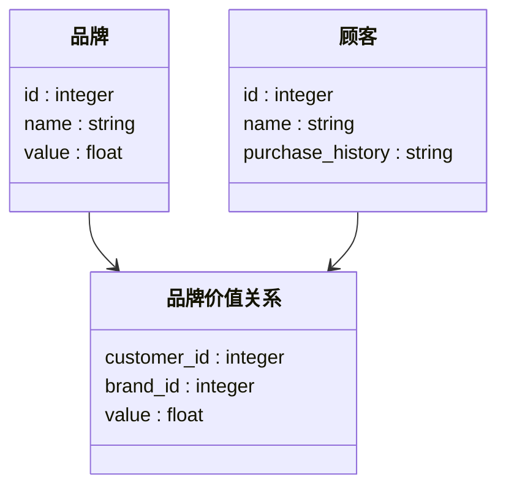

                 


# 巴菲特的品牌价值理论：无形资产的重要性

> 关键词：品牌价值，巴菲特，无形资产，企业价值，品牌战略

> 摘要：本文深入探讨了巴菲特的品牌价值理论，分析了品牌作为无形资产在企业中的重要性。通过详细阐述品牌价值的核心概念、评估方法和实际应用，本文揭示了品牌如何影响企业的长期竞争优势和财务表现。结合实际案例和系统设计，本文为读者提供了全面理解品牌价值的视角。

---

## 第1章: 品牌价值的核心概念与背景

### 1.1 品牌价值的定义与重要性

#### 1.1.1 品牌的定义与内涵
品牌是企业与其客户之间建立的一种长期关系，它包含了企业所提供的产品或服务的核心价值和形象。品牌不仅仅是名字或标志，更是一种信任和承诺的象征。

#### 1.1.2 品牌价值的构成要素
品牌价值由以下几个核心要素构成：
- **品牌知名度**：品牌在市场中的可见性和被认知的程度。
- **品牌忠诚度**：客户对品牌产品的偏好和持续购买行为。
- **品牌认知度**：客户对品牌及其产品的理解和记忆程度。
- **品牌联想**：客户在提到品牌时脑海中浮现的联想和情感。

#### 1.1.3 品牌价值与企业财务表现的关系
品牌价值直接影响企业的市场地位、客户忠诚度和盈利能力。强大的品牌能够为企业带来更高的定价权、更低的营销成本和更大的市场份额。

---

### 1.2 巴菲特品牌价值理论的背景

#### 1.2.1 巴菲特投资理念的演变
巴菲特的投资理念从早期的低市盈率投资逐渐转向注重企业的长期竞争优势和品牌价值。他认为，品牌不仅是企业的一部分资产，更是企业长期盈利能力的关键因素。

#### 1.2.2 无形资产在企业价值中的地位
在巴菲特看来，无形资产（如品牌、专利、商誉等）是企业价值的重要组成部分。品牌作为一种无形资产，能够在长期为企业创造价值，尤其是在竞争激烈的市场环境中。

#### 1.2.3 品牌价值与企业长期竞争优势
品牌价值是企业长期竞争优势的核心。强大的品牌能够吸引和保留客户，抵御竞争对手的挑战，并在市场中保持领先地位。

---

### 1.3 品牌价值的核心要素分析

#### 1.3.1 品牌知名度
品牌知名度是品牌价值的基础。一个知名的品牌更容易被客户认知和选择，从而为企业带来更多的市场份额和收入。

#### 1.3.2 品牌忠诚度
品牌忠诚度是客户对企业品牌的情感依赖和持续购买行为的体现。高品牌忠诚度的客户更愿意为品牌支付溢价，并在市场竞争中为企业提供支持。

#### 1.3.3 品牌认知度
品牌认知度反映了客户对品牌的理解和记忆程度。高品牌认知度的品牌更容易在市场中建立信任和权威性。

#### 1.3.4 品牌联想与品牌资产
品牌联想是客户在提到品牌时所产生的各种联想和情感。积极的品牌联想能够增强品牌资产，从而提升品牌价值。

---

## 第2章: 品牌价值的核心概念与联系

### 2.1 品牌价值的核心概念原理

#### 2.1.1 品牌价值的多层次分析
品牌价值可以从多个层次进行分析，包括品牌知名度、品牌忠诚度、品牌认知度等。不同层次的价值共同构成了品牌整体价值。

#### 2.1.2 品牌价值的动态性与稳定性
品牌价值是一个动态的概念，它会随着市场环境、客户需求和竞争格局的变化而变化。然而，品牌价值也具有一定的稳定性，长期的品牌建设能够为企业提供持续的价值。

#### 2.1.3 品牌价值的可测量性
品牌价值可以通过多种方法进行测量，包括市场评估法、成本法和收益法等。这些方法能够帮助企业量化品牌价值，并制定有效的品牌战略。

---

### 2.2 品牌价值与相关概念的对比

#### 2.2.1 品牌价值与企业有形资产的对比
| 资产类型 | 定义 | 特性 | 测量方式 |
|----------|------|------|----------|
| 品牌价值 | 无形资产，反映品牌在市场中的价值 | 动态、依赖于客户认知 | 市场评估法、收益法 |
| 有形资产 | 可以用货币衡量的实物资产 | 静态、可直接测量 | 成本法、市场法 |

#### 2.2.2 品牌价值与企业无形资产的对比
| 资产类型 | 定义 | 特性 | 测量方式 |
|----------|------|------|----------|
| 品牌价值 | 无形资产，反映品牌在市场中的价值 | 动态、依赖于客户认知 | 市场评估法、收益法 |
| 无形资产 | 无法用货币直接衡量的资产，如专利、版权等 | 静态、可间接测量 | 成本法、市场法 |

#### 2.2.3 品牌价值与企业商誉的对比
| 资产类型 | 定义 | 特性 | 测量方式 |
|----------|------|------|----------|
| 品牌价值 | 无形资产，反映品牌在市场中的价值 | 动态、依赖于客户认知 | 市场评估法、收益法 |
| 商誉 | 企业整体价值超过其有形资产的部分 | 静态、可间接测量 | 成本法、市场法 |

---

### 2.3 品牌价值的ER实体关系图

```mermaid
erDiagram
    customer[顾客] {
        id : integer
        name : string
        purchase_history : string
    }
    brand[品牌] {
        id : integer
        name : string
        value : float
    }
    relationship[品牌价值关系] {
        customer_id : integer
        brand_id : integer
        value : float
    }
    customer -| relationship
    brand -| relationship
```

---

## 第3章: 品牌价值的数学模型与公式

### 3.1 品牌价值的评估模型

#### 3.1.1 品牌价值的量化方法
品牌价值可以通过多种方法进行量化，包括市场评估法、成本法和收益法等。其中，收益法是常用的品牌价值评估方法之一。

#### 3.1.2 品牌价值与企业收入的关系
品牌价值与企业收入之间存在密切关系。强大的品牌能够为企业带来更高的收入和利润率。

#### 3.1.3 品牌价值与企业成本的关系
品牌价值的提升通常伴随着企业营销成本的增加，但长期来看，品牌价值能够为企业带来更大的收益。

---

### 3.2 品牌价值的数学公式

#### 3.2.1 品牌价值的计算公式
$$品牌价值 = \text{品牌知名度} \times \text{品牌忠诚度} \times \text{品牌认知度}$$

#### 3.2.2 品牌价值与未来现金流的关系
$$\text{品牌价值} = \sum_{t=1}^{n} \frac{\text{未来现金流}}{(1 + r)^t}$$
其中，$r$ 是贴现率，$n$ 是现金流的时间跨度。

---

## 第4章: 品牌价值的系统分析与架构设计

### 4.1 系统功能设计

#### 4.1.1 领域模型


#### 4.1.2 系统架构


---

## 第5章: 品牌价值的项目实战

### 5.1 项目介绍
本项目旨在通过实际案例分析，展示如何应用前面的模型和方法进行品牌价值评估。我们以一家知名的消费品公司为例，分析其品牌价值。

---

### 5.2 环境安装
为了进行品牌价值评估，我们需要安装以下工具：
- 数据分析工具：Python、R
- 数据可视化工具：Matplotlib、Tableau
- 数据处理工具：Pandas、NumPy

---

### 5.3 核心实现

#### 5.3.1 数据收集
我们需要收集以下数据：
- 品牌知名度数据
- 品牌忠诚度数据
- 品牌认知度数据
- 市场份额数据
- 财务数据

#### 5.3.2 数据分析与建模
使用Python代码进行数据分析和建模，计算品牌价值。

```python
import pandas as pd
import numpy as np

# 数据加载
data = pd.read_csv('brand_value.csv')

# 品牌价值计算
brand_value = data['品牌知名度'] * data['品牌忠诚度'] * data['品牌认知度']

# 结果输出
print('品牌价值:', brand_value)
```

---

### 5.4 结果解读与分析
通过上述代码，我们可以计算出每个品牌的理论价值，并与实际市场价值进行对比，验证模型的准确性。

---

## 第6章: 总结与最佳实践

### 6.1 总结
本文深入探讨了巴菲特的品牌价值理论，分析了品牌作为无形资产在企业中的重要性。通过理论分析和实际案例，我们展示了如何量化品牌价值，并为企业制定有效的品牌战略提供指导。

### 6.2 最佳实践 tips
- **品牌建设**：企业应注重品牌建设，提升品牌知名度和忠诚度。
- **品牌评估**：定期进行品牌价值评估，了解品牌资产的变化。
- **品牌管理**：制定有效的品牌管理策略，维护品牌形象和客户关系。

### 6.3 注意事项
- 品牌价值评估需要结合企业的实际情况，避免过于理论化。
- 品牌价值是动态的，需要定期更新和调整。

### 6.4 拓展阅读
- 巴菲特的其他投资理论
- 品牌管理的经典案例分析
- 无形资产评估的最新方法

---

## 作者：AI天才研究院/AI Genius Institute & 禅与计算机程序设计艺术 /Zen And The Art of Computer Programming

---

以上是《巴菲特的品牌价值理论：无形资产的重要性》的目录结构和内容框架。接下来，您可以根据这个大纲撰写完整的技术博客文章。

