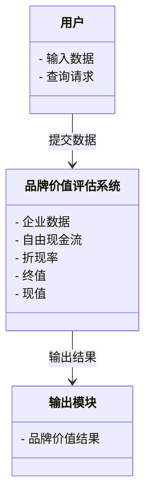
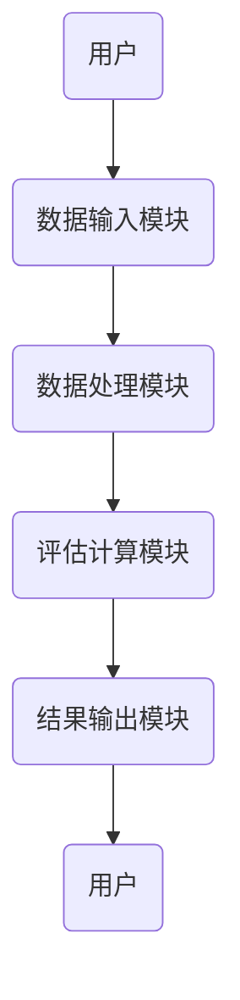

                 


# 巴菲特的品牌价值评估方法

> 关键词：巴菲特，品牌价值，价值投资，品牌评估，财务分析

> 摘要：本文深入探讨了巴菲特的品牌价值评估方法，分析了其核心概念、评估框架、数学模型及实际应用。通过系统分析和案例研究，揭示了品牌价值评估的关键步骤和注意事项，为读者提供了全面的视角和实用的工具。

---

## 第一部分: 巴菲特的品牌价值评估方法概述

### 第1章: 品牌价值评估的核心概念

#### 1.1 品牌价值评估的背景与意义

品牌价值是企业在市场中核心竞争力的体现，是企业长期发展的重要驱动力。巴菲特作为价值投资的鼻祖，将品牌价值评估视为投资决策的关键因素之一。品牌不仅代表企业的形象，更反映了其市场地位和客户忠诚度。通过品牌价值评估，投资者可以更准确地判断企业的长期发展潜力。

#### 1.2 巴菲特投资理念与品牌价值

巴菲特的价值投资理念强调企业内在价值的挖掘。他认为，品牌是企业抵御市场风险的重要屏障。品牌价值的评估需要从多个维度入手，包括品牌认知度、市场地位、财务表现等。通过分析这些因素，巴菲特能够识别出那些具备持久竞争优势的企业，从而做出明智的投资决策。

#### 1.3 品牌价值评估的框架与方法

品牌价值评估需要综合考虑多个维度，包括品牌强度、市场地位和财务表现。巴菲特的评估框架强调了护城河的重要性，即企业在市场中的竞争优势。他通过分析企业的护城河，判断其品牌价值是否能够长期维持或增长。

### 第2章: 巴菲特品牌价值评估的核心要素

#### 2.1 品牌认知度与客户忠诚度

品牌认知度是衡量品牌影响力的重要指标，而客户忠诚度则反映了品牌与客户之间的情感纽带。巴菲特认为，高品牌认知度和客户忠诚度的企业具备更强的市场竞争力。他通过分析企业的市场地位和客户关系，评估其品牌价值。

#### 2.2 市场地位与竞争优势

企业的市场地位决定了其品牌价值的上限。巴菲特注重分析企业的竞争优势，包括成本优势、技术优势和品牌优势。他通过评估这些竞争优势，判断企业是否具备长期的市场竞争力。

#### 2.3 财务表现与成长潜力

财务表现是品牌价值评估的重要组成部分。巴菲特通过分析企业的财务报表，评估其盈利能力、成长潜力和财务健康状况。他注重企业的现金流和ROE（净资产收益率）等指标，认为这些指标能够反映企业的实际价值。

---

## 第二部分: 巴菲特品牌价值评估的数学模型与算法

### 第3章: 品牌价值评估的数学模型

#### 3.1 品牌价值评估的基本公式

品牌价值的评估可以采用多种方法，其中一种常见的方法是基于DCF模型（ discounted cash flow model）。以下是品牌价值的计算公式：

$$
\text{品牌价值} = \sum_{t=1}^{n} \frac{\text{自由现金流}}{(1 + r)^t} + \frac{\text{终值}}{(1 + r)^n}
$$

其中，\( r \) 是折现率，\( n \) 是预测期数。

#### 3.2 巴菲特品牌价值评估的算法

以下是基于DCF模型的品牌价值评估算法的步骤：

```mermaid
graph TD
    A[开始] -> B[输入企业数据]
    B -> C[计算自由现金流]
    C -> D[确定折现率]
    D -> E[计算终值]
    E -> F[计算现值]
    F -> G[输出品牌价值]
    G -> 结束
```

### 第4章: 品牌价值评估的系统分析与架构设计

#### 4.1 系统功能设计

以下是品牌价值评估系统的功能模块设计：



#### 4.2 系统架构设计

以下是品牌价值评估系统的架构图：



---

## 第三部分: 项目实战与案例分析

### 第5章: 项目实战

#### 5.1 环境安装与数据准备

为了进行品牌价值评估，我们需要安装以下工具：

1. Python编程环境（如Anaconda）
2. 数据分析库（如Pandas、NumPy）
3. 可视化工具（如Matplotlib或Seaborn）

#### 5.2 核心实现代码

以下是基于DCF模型的品牌价值评估代码示例：

```python
import pandas as pd
import numpy as np

def calculate_brand_value(free_cash_flow, discount_rate, terminal_value, n):
    """
    计算品牌价值
    Parameters:
        free_cash_flow (list): 自由现金流（单位：万元）
        discount_rate (float): 折现率
        terminal_value (float): 终值
        n (int): 预测期数
    Returns:
        float: 品牌价值
    """
    # 计算现值
    pv = 0
    for t in range(n):
        if t < len(free_cash_flow):
            cash_flow = free_cash_flow[t]
        else:
            cash_flow = terminal_value / (1 + discount_rate)**(n - t)
        pv += cash_flow / (1 + discount_rate)**(t + 1)
    return pv

# 示例数据
free_cash_flow = [1000, 1200, 1400, 1600]
discount_rate = 0.1
terminal_value = 10000
n = 4

# 计算品牌价值
brand_value = calculate_brand_value(free_cash_flow, discount_rate, terminal_value, n)
print(f"品牌价值：{brand_value:.2f} 万元")
```

#### 5.3 实际案例分析

以可口可乐为例，我们可以通过以下步骤进行品牌价值评估：

1. **收集数据**：包括可口可乐的自由现金流、折现率和终值。
2. **计算现值**：使用DCF模型计算品牌价值的现值。
3. **结果分析**：根据计算结果，评估可口可乐的品牌价值。

---

## 第四部分: 总结与最佳实践

### 第6章: 总结

品牌价值评估是巴菲特投资决策中的重要环节。通过本文的分析，我们可以看到，品牌价值不仅取决于企业的市场地位和客户忠诚度，还与其财务表现密切相关。巴菲特的品牌价值评估方法为我们提供了一个全面的视角，帮助我们更准确地判断企业的长期发展潜力。

### 6.1 最佳实践

1. **多维度分析**：在评估品牌价值时，应综合考虑品牌认知度、市场地位、财务表现等多个维度。
2. **长期视角**：关注企业的长期发展潜力，而不仅仅是短期财务数据。
3. **持续学习**：品牌价值评估需要不断学习和更新，以适应市场变化。

### 6.2 注意事项

- 在进行品牌价值评估时，应确保数据的准确性和完整性。
- 注意模型的适用性，根据企业的实际情况选择合适的评估方法。
- 避免过于依赖单一指标，进行全面分析。

---

## 作者信息

作者：AI天才研究院/AI Genius Institute  
联系邮箱：contact@aising genius.com  
GitHub：https://github.com/aising genius

