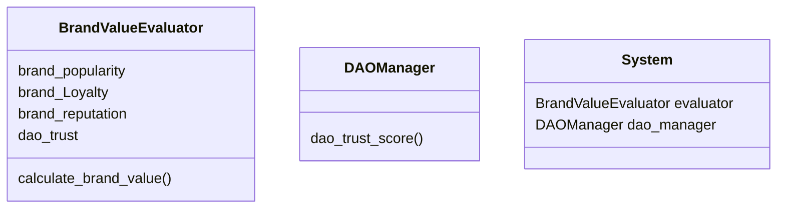

                 


# 巴菲特的品牌价值评估：去中心化自治组织(DAO)的影响力

> 关键词：品牌价值评估，DAO，去中心化自治组织，巴菲特投资理念，分布式治理，信任机制，忠诚度模型

> 摘要：本文深入探讨了巴菲特的品牌价值评估方法，并结合去中心化自治组织（DAO）的概念，分析了DAO对品牌价值的影响。通过数学模型和算法，详细讲解了如何利用DAO的特性优化品牌价值评估过程。文章还提供了基于DAO的品牌价值评估系统架构和实现方案，结合实际案例，展示了如何将理论应用于实践。

---

## 第一部分: 巴菲特的品牌价值评估基础

### 第1章: 品牌价值评估的核心概念

#### 1.1 品牌价值的定义与构成

品牌价值是衡量一个品牌在市场上的经济价值和市场影响力的重要指标。它不仅反映了品牌在消费者心中的认知度和信任度，还与品牌未来的盈利能力密切相关。品牌价值的构成要素包括品牌知名度、品牌忠诚度、品牌声誉、品牌创新能力等多个方面。

#### 1.2 巴菲特投资理念与品牌价值评估

巴菲特以其独特的投资理念闻名于世，他特别强调企业内在价值和品牌的重要性。他认为，品牌价值是企业长期盈利能力的核心驱动力之一。在巴菲特的投资模型中，品牌价值评估不仅仅关注财务指标，更注重品牌在市场中的地位和消费者的信任度。

---

### 第2章: 去中心化自治组织（DAO）的基本概念

#### 2.1 DAO的定义与特点

去中心化自治组织（Decentralized Autonomous Organization，DAO）是一种基于区块链技术的组织形式，其特点是去中心化、透明性和自治性。与传统组织相比，DAO没有中央管理机构，所有决策通过智能合约和分布式网络实现。

#### 2.2 DAO的运作机制

DAO的运作机制包括以下几个关键环节：
- **治理结构**：通过智能合约实现投票决策。
- **决策流程**：成员通过代币持有量进行投票，决定组织的运营方向。
- **激励机制**：通过代币分配激励成员参与治理和贡献。

---

## 第二部分: 巴菲特品牌价值评估与DAO的结合

### 第3章: 品牌价值评估的数学模型

#### 3.1 品牌价值评估的基本模型

品牌价值的计算公式可以表示为：

$$
\text{品牌价值} = \text{品牌知名度} \times \text{品牌忠诚度} \times \text{品牌声誉}
$$

其中，品牌知名度反映品牌在市场中的普及程度，品牌忠诚度反映消费者对品牌的偏好程度，品牌声誉则反映品牌在市场中的信誉度。

#### 3.2 基于DAO的品牌价值评估模型

在DAO的背景下，品牌价值评估可以进一步优化。通过 DAO 的去中心化特性，品牌价值的评估可以更加透明和公正。具体公式为：

$$
\text{DAO品牌价值} = \text{品牌知名度} \times \text{品牌忠诚度} \times \text{品牌声誉} \times \text{DAO信任度}
$$

其中，DAO信任度反映了消费者对 DAO 治理机制的信任程度。

---

### 第4章: DAO对品牌价值的影响机制

#### 4.1 DAO对品牌信任度的影响

信任是品牌价值的核心要素之一。DAO通过去中心化的治理机制，提高了品牌决策的透明度和公正性，从而增强了消费者对品牌的信任。具体来说，DAO的信任机制可以通过以下步骤实现：

1. **智能合约**：通过智能合约实现自动化的决策流程。
2. **透明性**：所有决策过程公开可查，增强消费者信任。
3. **分布式治理**：通过分布式网络实现多节点决策，降低单一中心化机构的风险。

#### 4.2 DAO对品牌忠诚度的影响

品牌忠诚度是品牌价值的重要组成部分。DAO通过激励机制和分布式治理，增强了消费者对品牌的忠诚度。例如，通过代币激励机制，DAO可以鼓励消费者积极参与品牌建设，从而提高品牌忠诚度。

---

### 第5章: 基于DAO的品牌价值评估算法

#### 5.1 算法原理

基于DAO的品牌价值评估算法的核心思想是通过智能合约和分布式网络实现品牌价值的动态评估。具体步骤如下：

1. **数据采集**：采集品牌知名度、品牌忠诚度、品牌声誉等数据。
2. **智能合约计算**：通过智能合约计算品牌价值，考虑DAO的信任度因素。
3. **结果输出**：输出品牌价值评估结果，并实时更新。

#### 5.2 算法实现与优化

以下是基于DAO的品牌价值评估算法的Python实现示例：

```python
def calculate_brand_value(brand_popularity, brand Loyalty, brand_reputation, dao_trust):
    brand_value = brand_popularity * brand_Loyalty * brand_reputation * dao_trust
    return brand_value

# 示例数据
brand_popularity = 0.85
brand_Loyalty = 0.75
brand_reputation = 0.9
dao_trust = 0.8

# 计算品牌价值
brand_value = calculate_brand_value(brand_popularity, brand_Loyalty, brand_reputation, dao_trust)
print(f"品牌价值：{brand_value}")
```

---

### 第6章: 系统架构与设计方案

#### 6.1 系统功能设计

系统功能模块包括：
1. **数据采集模块**：采集品牌相关数据。
2. **算法计算模块**：基于DAO的品牌价值评估算法。
3. **结果展示模块**：展示品牌价值评估结果。

#### 6.2 系统架构设计

以下是系统架构的类图：



---

## 第三部分: 项目实战

### 第7章: 环境安装与系统实现

#### 7.1 环境安装

需要安装以下工具：
- Python 3.8+
- 区块链开发框架（如Solidity）
- 智能合约部署工具（如Remix）

#### 7.2 核心代码实现

以下是基于DAO的品牌价值评估系统的Python代码实现：

```python
class DAOManager:
    def __init__(self):
        self.dao_trust = 0.8

    def calculate_dao_trust(self):
        return self.dao_trust

class BrandValueEvaluator:
    def __init__(self, brand_popularity, brand_Loyalty, brand_reputation):
        self.brand_popularity = brand_popularity
        self.brand_Loyalty = brand_Loyalty
        self.brand_reputation = brand_reputation

    def calculate_brand_value(self, dao_trust):
        return self.brand_popularity * self.brand_Loyalty * self.brand_reputation * dao_trust

# 示例程序
dao_manager = DAOManager()
evaluator = BrandValueEvaluator(0.85, 0.75, 0.9)
brand_value = evaluator.calculate_brand_value(dao_manager.calculate_dao_trust())
print(f"品牌价值：{brand_value}")
```

---

## 第四部分: 总结与展望

### 第8章: 最佳实践与注意事项

- **数据准确性**：确保输入数据的准确性和实时性。
- **算法优化**：根据实际需求优化品牌价值评估算法。
- **系统安全性**：确保DAO系统的安全性，防止攻击和漏洞。

### 第9章: 小结

本文详细探讨了巴菲特的品牌价值评估方法，并结合去中心化自治组织（DAO）的概念，分析了DAO对品牌价值的影响。通过数学模型和算法，展示了如何利用DAO的特性优化品牌价值评估过程。

### 第10章: 拓展阅读

- 《区块链与分布式系统》
- 《DAO的治理与应用》
- 《品牌价值评估的数学模型》

---

作者：AI天才研究院/AI Genius Institute & 禅与计算机程序设计艺术 /Zen And The Art of Computer Programming

