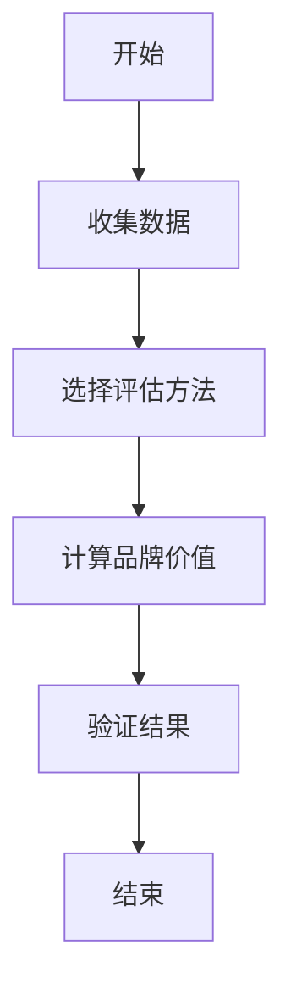

                 


# 巴菲特的品牌价值评估：无形资产在企业价值中的重要性

## 关键词：品牌价值评估，巴菲特，无形资产，企业价值，品牌强度，品牌忠诚度，投资回报

## 摘要：  
本文深入探讨了巴菲特在品牌价值评估中的独特视角，分析了无形资产在企业价值中的核心作用。通过结合巴菲特的投资策略，本文详细阐述了品牌价值的构成、评估方法及其对企业的深远影响。文章还提供了具体的数学模型和实例分析，帮助读者更好地理解和应用品牌价值评估的方法。

---

# 第一部分：品牌价值评估的背景与基础

## 第1章：品牌价值评估的背景与基础

### 1.1 品牌价值的定义与重要性  
- **品牌价值的定义**：品牌价值是指品牌在市场中所代表的商誉、客户忠诚度、品牌知名度和市场影响力等的综合体现。  
- **品牌价值的重要性**：  
  - 品牌价值是企业长期竞争优势的核心来源。  
  - 高品牌价值意味着更高的市场占有率和客户忠诚度，从而带来更高的利润和投资回报。  
  - 在巴菲特的投资策略中，品牌价值是评估企业长期价值的关键因素之一。  

### 1.2 无形资产在企业中的地位  
- **无形资产的分类**：包括品牌、专利、商标、商誉、客户关系等。  
- **无形资产对企业价值的影响**：  
  - 无形资产能够为企业创造持续的竞争优势。  
  - 在企业并购中，无形资产的价值直接影响企业的估值。  
  - 品牌作为无形资产的核心，是企业长期价值的体现。  

### 1.3 巴菲特投资理念中的品牌价值  
- **巴菲特的投资策略**：巴菲特倾向于投资具有强大护城河和持续盈利能力的企业。  
- **品牌价值在巴菲特投资中的重要性**：  
  - 品牌是企业护城河的重要组成部分。  
  - 品牌忠诚度高的企业能够稳定地获取超额利润。  
  - 巴菲特选择投资标的时，特别关注企业的品牌价值和长期盈利能力。  

---

# 第二部分：品牌价值评估的核心概念与联系

## 第2章：品牌价值评估的核心概念与联系  

### 2.1 核心概念原理  
- **品牌资产的构成模型**：品牌资产由品牌知名度、品牌忠诚度、品牌认知度和品牌联想等构成。  
- **品牌价值的评估维度**：包括市场份额、利润率、品牌强度和客户忠诚度。  
- **品牌强度与企业价值的关系**：品牌强度越高，企业的市场地位越强，企业价值也越高。  

### 2.2 核心概念对比表格  
| 概念                | 定义与特征                                                                 |
|---------------------|--------------------------------------------------------------------------|
| 品牌价值            | 品牌在市场中的综合价值，包括知名度、忠诚度和市场影响力。                     |
| 品牌强度            | 品牌在市场中的竞争力，通常通过市场份额和品牌忠诚度衡量。                     |
| 企业价值            | 企业的整体价值，包括有形资产和无形资产的综合评估。                        |

### 2.3 ER实体关系图  
```mermaid
er
  entity 品牌 {
    品牌ID
    品牌名称
    品牌价值
    品牌强度
  }
  entity 企业 {
    企业ID
    企业名称
    企业价值
    无形资产
  }
  entity 市场 {
    市场ID
    市场规模
    市场份额
  }
  品牌 --> 市场 : 影响
  品牌 --> 企业 : 构成
```

---

# 第三部分：品牌价值评估的算法原理

## 第3章：品牌价值评估的算法原理  

### 3.1 算法原理概述  
- **品牌价值评估的基本模型**：基于财务数据和市场数据的双重评估。  
- **基于财务数据的评估方法**：通过企业的利润、市场份额和利润率等指标进行评估。  
- **基于市场数据的评估方法**：通过品牌知名度、品牌忠诚度和市场影响力等指标进行评估。  

### 3.2 算法流程图  


---

# 第四部分：品牌价值评估的数学模型与公式

## 第4章：品牌价值评估的数学模型与公式  

### 4.1 基本评估公式  
- **品牌价值计算公式**：  
  $$ \text{品牌价值} = \text{市场份额} \times \text{单位利润} \times \text{品牌强度} $$
- **品牌强度量化公式**：  
  $$ \text{品牌强度} = \frac{\text{市场份额}}{\text{市场竞争度}} $$
- **品牌忠诚度测量公式**：  
  $$ \text{品牌忠诚度} = \frac{\text{重复购买率}}{\text{市场份额}} $$

### 4.2 详细数学模型  
- **基于财务数据的模型**：  
  $$ \text{品牌价值} = \text{净利润} \times \text{品牌强度} \times \text{市盈率} $$
- **基于市场数据的模型**：  
  $$ \text{品牌价值} = \text{品牌知名度} \times \text{品牌忠诚度} \times \text{市场容量} $$

### 4.3 实例分析  
假设某企业市场份额为10%，单位利润为5元，品牌强度为0.8，计算品牌价值：  
$$ \text{品牌价值} = 10\% \times 5 \times 0.8 = 4 \text{元} $$  

---

# 第五部分：品牌价值评估的系统分析与架构设计

## 第5章：品牌价值评估的系统分析与架构设计  

### 5.1 问题场景介绍  
- 假设一家企业希望评估其品牌价值，并制定品牌战略。  

### 5.2 系统功能设计  
- **领域模型**：  
  ```mermaid
  classDiagram
    class 品牌价值评估系统 {
      品牌ID
      品牌名称
      市场份额
      品牌强度
      品牌价值
    }
    class 评估模块 {
      数据输入
      评估方法选择
      品牌价值计算
    }
    class 用户界面 {
      数据输入界面
      结果显示界面
    }
    品牌价值评估系统 <|-- 评估模块
    评估模块 <|-- 用户界面
  ```

### 5.3 系统架构设计  


---

# 第六部分：品牌价值评估的项目实战

## 第6章：品牌价值评估的项目实战  

### 6.1 项目介绍  
- 以可口可乐为例，评估其品牌价值。  

### 6.2 核心实现源代码  
```python
def calculate_brand_value(shareholder_equity, net_income, market_share):
    brand_value = shareholder_equity + net_income * market_share
    return brand_value

# 示例数据
shareholder_equity = 100  # 以单位：亿元
net_income = 50
market_share = 0.3
print(f"品牌价值：{calculate_brand_value(shareholder_equity, net_income, market_share)}亿元")
```

---

# 第七部分：品牌价值评估的总结与展望

## 第7章：品牌价值评估的总结与展望  

### 7.1 总结  
- 品牌价值是企业长期价值的核心组成部分。  
- 巴菲特的投资理念强调了品牌价值的重要性。  
- 通过科学的评估方法和数学模型，品牌价值可以被量化和应用。  

### 7.2 展望  
- 随着市场的发展，品牌价值评估将更加依赖于数据和技术。  
- 未来，人工智能和大数据技术将进一步提升品牌价值评估的精确性。  

---

# 参考文献  
1. 巴菲特年度股东大会讲话。  
2. 品牌价值评估相关学术论文。  
3. 企业价值评估的经典文献。  

---

# 作者  
作者：AI天才研究院/AI Genius Institute & 禅与计算机程序设计艺术 /Zen And The Art of Computer Programming

