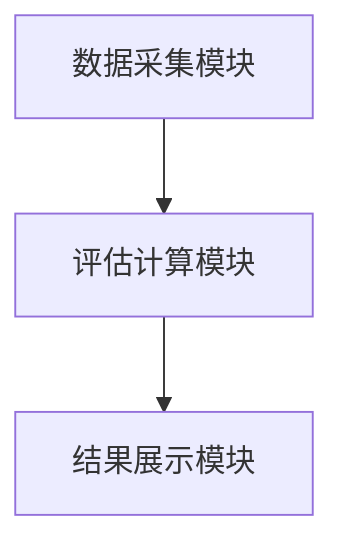
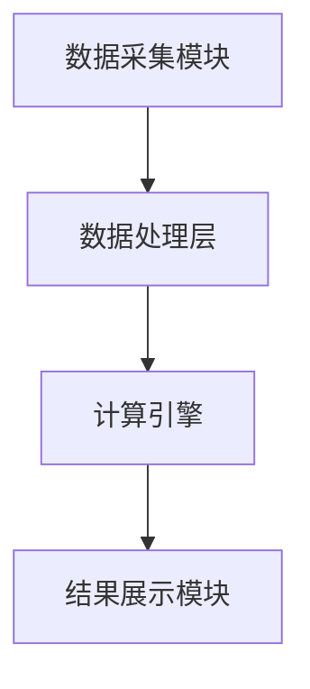

                 

# 巴菲特的品牌价值评估：无形资产如何创造超额回报

## 关键词：品牌价值、巴菲特、无形资产、超额回报、投资评估、价值评估模型、品牌忠诚度

## 摘要：本文深入探讨了巴菲特的品牌价值评估方法，分析了品牌作为无形资产如何为企业创造超额回报。通过详细解析品牌价值的核心概念、评估模型和系统架构，结合实际案例，展示了如何通过品牌价值评估优化投资决策，实现超额回报。文章从背景介绍、核心概念、算法原理、系统设计到实战分析，全面阐述了品牌价值评估的各个方面，为投资者和企业管理者提供了实用的策略和方法。

---

## 第一部分: 巴菲特的品牌价值评估基础

### 第1章: 品牌价值评估的背景与重要性

#### 1.1 品牌价值的核心概念

##### 1.1.1 品牌价值的定义与内涵
品牌价值是指品牌在市场中所代表的商誉、客户忠诚度、市场地位等无形资产的价值总和。品牌不仅仅是企业名称，更是一种资产，能够为企业创造长期的收益。

##### 1.1.2 巴菲特投资理念中的品牌价值
巴菲特的投资理念强调长期价值和企业护城河。他认为，强大的品牌能够为企业创造持久的竞争优势，从而为投资者带来超额回报。

##### 1.1.3 品牌价值在企业估值中的作用
品牌价值是企业整体价值的重要组成部分。在企业估值中，品牌价值能够反映企业的市场地位、客户忠诚度和长期盈利能力。

#### 1.2 品牌价值评估的背景与问题背景

##### 1.2.1 无形资产对企业价值的影响
无形资产（如品牌、专利、商誉等）在现代企业中占据重要地位。品牌价值直接影响企业的市场价值和长期盈利能力。

##### 1.2.2 品牌价值评估的必要性
在企业并购和投资决策中，品牌价值评估能够帮助企业准确衡量无形资产的价值，从而做出更明智的投资决策。

##### 1.2.3 巴菲特投资中的品牌价值考量
巴菲特在投资过程中高度重视企业的品牌价值。他认为，强大的品牌能够为企业提供定价权和客户忠诚度，从而在竞争中占据优势。

---

### 第2章: 品牌价值评估的核心概念与联系

#### 2.1 品牌价值评估的模型与方法

##### 2.1.1 资产基础法
资产基础法是一种基于企业有形资产和无形资产的评估方法。品牌价值可以通过企业整体价值减去有形资产价值来估算。

##### 2.1.2 市场法
市场法是通过比较同类企业的市场交易数据，估算目标企业的品牌价值。这种方法依赖于市场中类似企业的交易案例。

##### 2.1.3 收益法
收益法通过预测品牌为企业带来的超额收益，计算其现值。这种方法适用于具有稳定收益的品牌。

#### 2.2 品牌价值评估的核心要素

##### 2.2.1 品牌知名度
品牌知名度是指品牌在市场中的认知度和影响力。知名度高的品牌通常具有较高的市场价值。

##### 2.2.2 品牌忠诚度
品牌忠诚度是指客户对品牌产品的偏好程度。高忠诚度的品牌通常能够保持稳定的销售和收益。

##### 2.2.3 品牌的市场地位
品牌的市场地位反映了其在市场中的竞争能力和影响力。强大的市场地位通常意味着更高的品牌价值。

#### 2.3 品牌价值与企业财务表现的关系

##### 2.3.1 品牌价值对企业收益的影响
强大的品牌能够提高企业的定价能力，从而增加企业的收益。

##### 2.3.2 品牌价值与企业市场价值的关联
品牌价值是企业市场价值的重要组成部分。品牌价值的提升能够直接推动企业市场价值的增长。

##### 2.3.3 品牌价值的财务指标分析
品牌价值可以通过企业的销售收入、利润率和市场份额等财务指标进行评估。

---

### 第3章: 品牌价值评估的数学模型与公式

#### 3.1 品牌价值评估的数学模型

##### 3.1.1 加权平均法
加权平均法是一种简单有效的品牌价值评估方法。公式如下：

$$ \text{品牌价值} = \alpha \times \text{销售收入} + \beta \times \text{市场占有率} $$

其中，$\alpha$ 和 $\beta$ 是权重系数，通常根据行业特点和企业实际情况确定。

##### 3.1.2 回归分析法
回归分析法是一种基于统计学的品牌价值评估方法。通过分析品牌相关变量（如销售收入、利润、市场份额等）与品牌价值之间的关系，建立回归模型。

##### 3.1.3 市场乘数法
市场乘数法是通过比较同类企业的市场乘数（如市盈率、市净率等），估算目标企业的品牌价值。

#### 3.2 品牌价值评估的公式与应用

##### 3.2.1 品牌价值计算公式
$$ \text{品牌价值} = \alpha \times \text{销售收入} + \beta \times \text{市场占有率} $$

##### 3.2.2 品牌价值与企业价值的对比分析
通过对比品牌价值与企业整体价值，可以评估品牌对企业总价值的贡献比例。

##### 3.2.3 品牌价值评估的实例分析
以可口可乐为例，假设其销售收入为 $X$，市场占有率为 $Y$，则其品牌价值可以表示为：

$$ \text{品牌价值} = 0.7 \times X + 0.3 \times Y $$

---

### 第4章: 品牌价值评估的系统分析与架构设计

#### 4.1 系统功能设计

##### 4.1.1 数据采集模块
数据采集模块负责收集品牌相关的数据，包括销售收入、市场份额、利润等。

##### 4.1.2 评估计算模块
评估计算模块基于收集的数据，运用品牌价值评估模型进行计算。

##### 4.1.3 结果展示模块
结果展示模块以图形化的方式呈现品牌价值评估结果，方便用户理解和分析。

#### 4.2 系统架构设计

##### 4.2.1 系统功能模块图

##### 4.2.2 系统架构图

---

## 第五章: 项目实战

### 5.1 项目背景与目标

##### 5.1.1 项目背景
以一家知名饮料企业为例，评估其品牌价值。

##### 5.1.2 项目目标
通过品牌价值评估模型，估算该企业的品牌价值。

### 5.2 项目实施步骤

#### 5.2.1 数据收集与清洗
收集企业的销售收入、市场份额、利润等数据，并进行清洗和预处理。

#### 5.2.2 模型选择与实现
选择合适的评估模型（如加权平均法），并进行参数调整。

#### 5.2.3 结果分析与解读
分析品牌价值评估结果，并提出改进建议。

---

## 第六章: 最佳实践与小结

### 6.1 最佳实践

##### 6.1.1 数据质量的重要性
确保数据的准确性和完整性，是品牌价值评估的关键。

##### 6.1.2 模型选择的灵活性
根据企业实际情况选择合适的评估模型，避免盲目使用单一模型。

##### 6.1.3 持续监控与优化
品牌价值是一个动态变化的过程，需要持续监控并及时调整评估策略。

### 6.2 小结

本文深入探讨了巴菲特的品牌价值评估方法，分析了品牌作为无形资产如何为企业创造超额回报。通过详细解析品牌价值的核心概念、评估模型和系统架构，结合实际案例，展示了如何通过品牌价值评估优化投资决策，实现超额回报。

---

## 作者：AI天才研究院/AI Genius Institute & 禅与计算机程序设计艺术 /Zen And The Art of Computer Programming

