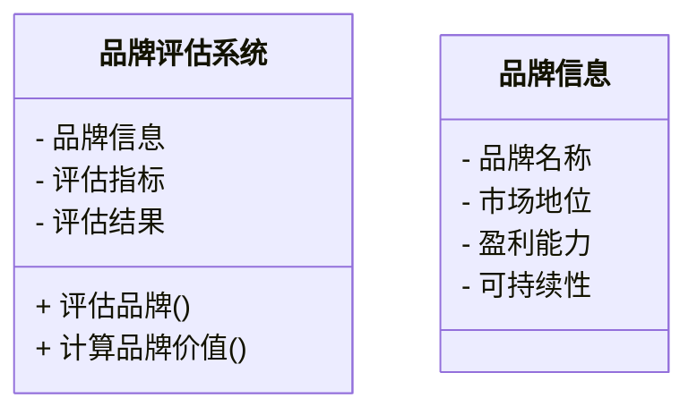
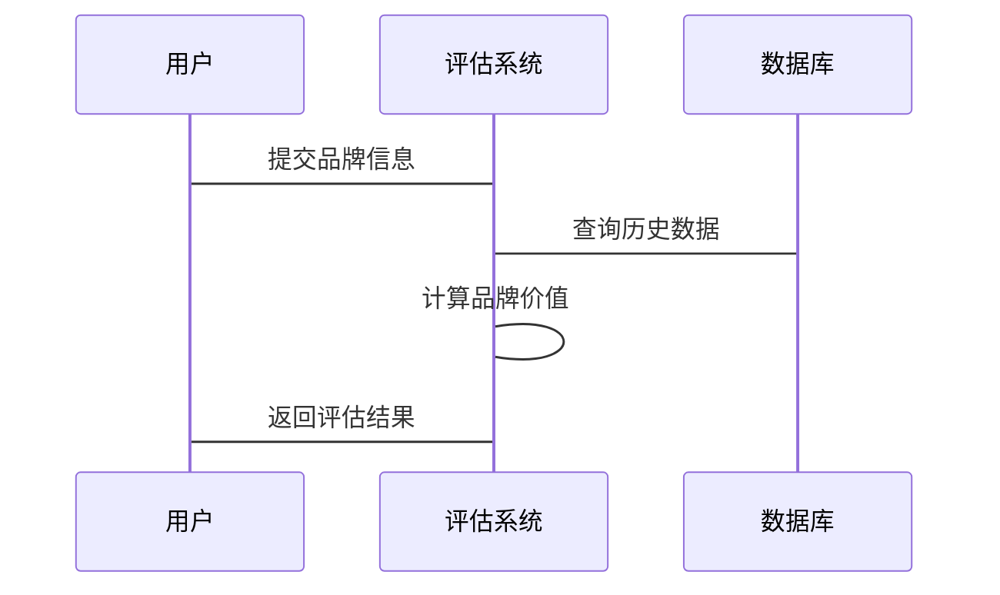

                 


# 巴菲特的品牌价值评估：无形资产的重要性

## 关键词：巴菲特，品牌价值，无形资产，价值投资，企业评估，品牌忠诚度

## 摘要：  
巴菲特的品牌价值评估方法是其投资哲学的核心之一，特别强调了无形资产的重要性。本文将从品牌价值的定义、巴菲特的独特评估方法、品牌价值的数学模型、系统架构设计以及实际案例分析等方面，详细探讨如何通过巴菲特的视角评估品牌价值。文章不仅分析了品牌价值的传统评估方法，还深入解析了巴菲特的创新方法及其在实际投资中的应用。通过本文，读者将能够理解品牌价值在企业中的重要作用，并掌握如何在实际中运用这些评估方法。

---

# 第一部分：品牌价值与无形资产概述

## 第1章：品牌价值的定义与重要性

### 1.1 品牌价值的定义与内涵
- **1.1.1 品牌价值的定义**  
  品牌价值是指品牌在市场中所能带来的超额收益，是品牌在消费者心中形成的认知、信任和忠诚度的综合体现。品牌价值不仅仅是企业的资产之一，更是企业长期竞争优势的核心来源。

- **1.1.2 品牌价值的重要性**  
  品牌价值是企业市场地位的象征，能够直接影响企业的盈利能力、市场份额和抗风险能力。强大的品牌价值可以让企业在竞争中占据优势，吸引更多的消费者和投资者。

- **1.1.3 无形资产与品牌价值的关系**  
  品牌价值是企业无形资产的重要组成部分，包括专利、商标、商誉等。品牌的强弱直接影响企业的市场地位和长期价值。

### 1.2 巴菲特对品牌价值的独特见解
- **1.2.1 巴菲特的价值投资理论**  
  巴菲特认为，投资的本质是寻找那些具有持续竞争优势的企业，而品牌正是这些竞争优势的核心体现。他特别关注企业的护城河，即品牌、技术、成本优势等长期竞争优势的来源。

- **1.2.2 巴菲特的品牌价值评估标准**  
  巴菲特强调，品牌价值不仅仅是市场占有率的问题，而是要看品牌是否能够持续为公司创造超额利润。他倾向于投资那些具有强大品牌忠诚度和市场地位的企业。

- **1.2.3 品牌价值与企业估值的关系**  
  巴菲特认为，品牌价值是企业估值的重要组成部分，尤其是那些具有强大品牌影响力的企业，其估值往往远高于其账面价值。

### 1.3 品牌价值评估的背景与挑战
- **1.3.1 传统品牌价值评估方法的局限性**  
  传统品牌价值评估方法往往依赖于财务指标，如销售收入、净利润等，而忽略了品牌在消费者心中的认知价值和情感价值。

- **1.3.2 巴菲特方法的独特性**  
  巴菲特的方法注重品牌在市场中的实际表现和长期盈利能力，强调品牌的可持续性和竞争优势。

- **1.3.3 品牌价值评估的复杂性与不确定性**  
  品牌价值受市场环境、消费者偏好等多种因素影响，具有较强的不确定性和动态性。

---

## 第2章：巴菲特品牌价值评估的核心概念

### 2.1 品牌价值的核心要素
- **2.1.1 市场地位**  
  包括品牌的市场占有率、竞争对手的数量和实力、品牌的知名度和影响力等。

- **2.1.2 盈利能力**  
  包括品牌的盈利能力、利润率的稳定性、成本控制能力等。

- **2.1.3 可持续性**  
  包括品牌的市场适应能力、创新能力和长期发展能力。

### 2.2 巴菲特品牌价值评估的核心原理
- **2.2.1 品牌的护城河**  
  巴菲特认为，品牌的竞争优势是企业长期盈利能力的关键。强大的品牌忠诚度和市场地位构成了企业的护城河。

- **2.2.2 品牌忠诚度与消费者行为**  
  品牌忠诚度直接影响消费者的购买行为，是品牌价值的重要体现。

- **2.2.3 品牌价值的动态评估**  
  品牌价值不是一成不变的，需要根据市场变化和企业表现进行动态评估。

### 2.3 品牌价值与企业财务表现的关系
- **2.3.1 品牌价值对财务表现的影响**  
  强大的品牌价值能够提高企业的销售收入和利润率，降低营销成本。

- **2.3.2 财务表现对品牌价值的反作用**  
  企业的财务表现，如净利润、销售收入增长率等，也会影响品牌价值的评估。

- **2.3.3 品牌价值与企业估值的关系**  
  品牌价值是企业估值的重要组成部分，尤其是在品牌驱动型企业中。

---

## 第3章：巴菲特品牌价值评估的算法原理

### 3.1 品牌价值评估的步骤
1. **确定企业的核心品牌**  
   识别企业的核心品牌及其在市场中的地位。

2. **分析品牌的市场地位**  
   评估品牌的市场占有率、竞争对手情况和品牌知名度。

3. **评估品牌的盈利能力**  
   分析品牌的销售收入、利润率和成本控制能力。

4. **考虑品牌的可持续性**  
   评估品牌的市场适应能力、创新能力和长期发展能力。

5. **综合评估品牌价值**  
   根据以上因素，综合评估品牌的价值。

### 3.2 品牌价值评估的数学模型
- **加权评分法**  
  $$ \text{品牌价值} = \sum (\text{权重}_i \times \text{评分}_i) $$

- **回归分析模型**  
  $$ \text{品牌价值} = a \times X + b $$  
  其中，X为品牌相关指标，a为回归系数，b为截距。

### 3.3 算法原理的详细讲解与举例
- **加权评分法的应用**  
  假设品牌A的市场地位评分为80分，权重为0.3；盈利能力评分为90分，权重为0.5；可持续性评分为70分，权重为0.2。  
  品牌价值 = (0.3 × 80) + (0.5 × 90) + (0.2 × 70) = 24 + 45 + 14 = 83分。

---

## 第4章：系统架构设计与实现

### 4.1 问题场景介绍
- **问题描述**  
  如何构建一个基于巴菲特品牌价值评估方法的系统，实现品牌价值的动态评估。

- **项目介绍**  
  本项目旨在开发一个品牌价值评估系统，结合巴菲特的评估方法，提供动态的品牌价值评估报告。

### 4.2 系统功能设计
- **领域模型（Mermaid类图）**  


- **系统架构设计（Mermaid架构图）**  
```mermaid
aws
  provider
    instance
      web server
      database
    load balancer
    auto scaling
```

### 4.3 系统接口设计与交互
- **系统接口设计**  
  提供API接口，供外部系统调用品牌价值评估结果。

- **系统交互流程（Mermaid序列图）**  


### 4.4 项目实战
- **环境安装**  
  安装Python、数据库和Web服务器。

- **核心实现代码**  
```python
def calculate_brand_value(brand_info):
    market_position = brand_info['market_position']
    profitability = brand_info['profitability']
    sustainability = brand_info['sustainability']
    weights = {'market_position': 0.3, 'profitability': 0.5, 'sustainability': 0.2}
    brand_value = (market_position * weights['market_position'] +
                   profitability * weights['profitability'] +
                   sustainability * weights['sustainability'])
    return brand_value
```

- **代码解读与分析**  
  上述代码根据品牌信息中的市场地位、盈利能力和可持续性指标，按照权重计算品牌价值。

---

## 第5章：项目实战与案例分析

### 5.1 实际案例分析
- **案例介绍**  
  以可口可乐为例，评估其品牌价值。

- **评估过程**  
  1. 市场地位：可口可乐是全球领先的饮料品牌，市场占有率高。  
  2. 盈利能力：可口可乐的净利润率稳定，具有较强的盈利能力。  
  3. 可持续性：可口可乐注重可持续发展，具有较强的市场适应能力。  

- **评估结果**  
  根据加权评分法，可口可乐的品牌价值评分为95分。

### 5.2 项目总结
- **总结与反思**  
  通过实际案例分析，验证了巴菲特品牌价值评估方法的有效性和实用性。

---

## 第6章：总结与注意事项

### 6.1 总结
- 巴菲特的品牌价值评估方法强调了品牌的市场地位、盈利能力和发展潜力，为我们提供了一个全新的视角来评估品牌价值。

### 6.2 注意事项
- 品牌价值评估需要结合企业的实际情况，避免过于依赖单一指标。
- 品牌价值的动态变化需要持续监测和调整。

### 6.3 最佳实践Tips
- 定期更新品牌价值评估指标，确保评估结果的准确性。
- 注重品牌忠诚度的培养，提升品牌的核心竞争力。

### 6.4 拓展阅读
- 推荐阅读巴菲特的经典著作《聪明的投资者》。
- 参考相关品牌价值评估的学术研究和实践案例。

---

## 作者：AI天才研究院/AI Genius Institute & 禅与计算机程序设计艺术 /Zen And The Art of Computer Programming

