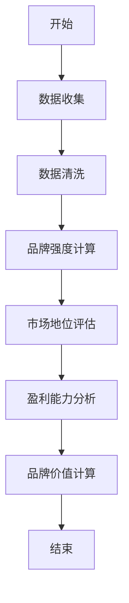
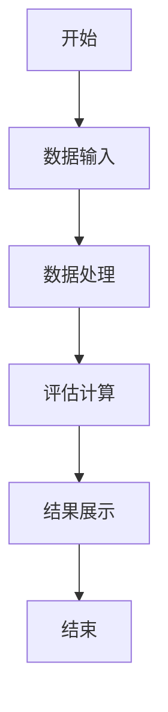

                 


# 巴菲特的品牌价值评估：无形资产的重要性

> 关键词：品牌价值、无形资产、巴菲特、投资评估、企业估值

> 摘要：本文深入探讨了巴菲特的品牌价值评估方法，分析了品牌价值与无形资产之间的关系，结合实际案例和数学模型，详细介绍了如何通过技术手段量化品牌价值，并提出了系统的评估框架和实现方案。

---

## 第一部分: 品牌价值与无形资产概述

### 第1章: 品牌价值的核心概念

#### 1.1 品牌价值的定义与内涵
品牌价值是企业核心竞争力的重要组成部分，是企业在市场中所具有的独特优势和客户认知的综合反映。品牌价值的高低直接影响企业的市场地位和盈利能力。

- **品牌定义**：品牌是企业的标识，包括名称、标志、声誉等，是消费者对企业产品或服务的信任和偏好。
- **品牌价值特征**：
  1. 持久性：品牌价值不会随着产品的生命周期结束而消失。
  2. 无形性：品牌价值主要体现在企业的声誉和客户关系上。
  3. 可持续性：品牌价值可以通过长期的市场策略进一步提升。

#### 1.2 无形资产的定义与分类
无形资产是企业的重要资产之一，主要包括品牌、专利、商标、客户关系等。

- **无形资产定义**：无形资产是指企业没有实物形态的资产，主要体现在企业的声誉、技术、管理和客户关系等方面。
- **无形资产分类**：
  1. 知识产权类：包括专利、商标、版权等。
  2. 品牌类：包括品牌价值、品牌声誉等。
  3. 客户关系类：包括客户忠诚度、客户数据库等。

#### 1.3 品牌价值的核心要素
品牌价值的核心要素包括品牌强度、市场地位、客户忠诚度和盈利能力。

| 核心要素 | 定义 | 影响因素 |
|----------|------|----------|
| 品牌强度 | 品牌在市场中的影响力 | 品牌知名度、品牌声誉 |
| 市场地位 | 品牌在市场中的位置 | 市场份额、竞争对手情况 |
| 客户忠诚度 | 客户对品牌的忠诚程度 | 品牌体验、客户满意度 |
| 盈利能力 | 品牌带来的收益能力 | 营收、利润、成本 |

---

### 第2章: 巴菲特的品牌价值评估方法

#### 2.1 巴菲特投资理念概述
巴菲特的投资理念以价值投资为核心，注重企业的长期稳定发展和品牌价值。

- **巴菲特投资哲学**：
  1. 长期投资：巴菲特定位于长期投资，注重企业的可持续发展。
  2. 安全边际：巴菲特别注重企业的安全边际，即企业价值与市场价格之间的差距。
  3. 优质企业：巴菲特倾向于投资具有强大品牌价值和市场地位的企业。

#### 2.2 巴菲特品牌价值评估的核心要素
巴菲特在评估品牌价值时，重点关注企业的品牌强度、市场地位和盈利能力。

- **品牌强度**：品牌强度是品牌在市场中的影响力，包括品牌知名度、品牌声誉和品牌忠诚度。
- **市场地位**：市场地位是品牌在市场中的位置，包括市场份额、竞争对手情况和市场增长潜力。
- **盈利能力**：盈利能力是品牌带来的收益能力，包括营业收入、净利润和成本控制能力。

---

## 第二部分: 品牌价值评估的数学模型与算法

### 第3章: 品牌价值评估的数学模型

#### 3.1 品牌价值评估的指标体系
品牌价值评估的指标体系包括品牌强度指数、品牌忠诚度和品牌知名度。

- **品牌强度指数**：品牌强度指数是衡量品牌在市场中的影响力的重要指标，包括品牌知名度、品牌声誉和品牌忠诚度。
- **品牌忠诚度**：品牌忠诚度是客户对品牌的忠诚程度，包括客户满意度和客户重复购买率。
- **品牌知名度**：品牌知名度是品牌在市场中的认知度，包括品牌认知率和品牌回想率。

#### 3.2 品牌价值的量化方法
品牌价值的量化方法包括品牌价值公式和品牌价值评估模型。

- **品牌价值公式**：
  $$ \text{品牌价值} = \text{品牌强度} \times \text{市场地位} \times \text{盈利能力} $$
  
- **品牌价值评估模型**：
  $$ V = k \times E \times P $$
  其中，\( V \) 表示品牌价值，\( k \) 表示品牌强度系数，\( E \) 表示市场地位，\( P \) 表示盈利能力。

---

### 第4章: 品牌价值评估的算法原理

#### 4.1 基于巴菲特理念的评估算法
基于巴菲特理念的评估算法包括数据收集与处理、品牌强度计算、市场地位评估和盈利能力分析。

- **数据收集与处理**：数据收集与处理是品牌价值评估的基础，包括市场数据、财务数据和客户数据的收集与清洗。
- **品牌强度计算**：品牌强度计算是基于品牌强度指数的计算，包括品牌知名度、品牌声誉和品牌忠诚度的计算。
- **市场地位评估**：市场地位评估是基于市场份额、竞争对手情况和市场增长潜力的评估。
- **盈利能力分析**：盈利能力分析是基于营业收入、净利润和成本控制能力的分析。

#### 4.2 品牌价值评估的流程图


---

### 第5章: 品牌价值评估的系统架构设计

#### 5.1 系统功能设计
品牌价值评估的系统功能设计包括数据输入模块、数据处理模块、评估计算模块和结果展示模块。

- **数据输入模块**：数据输入模块是系统的核心模块，包括市场数据、财务数据和客户数据的输入。
- **数据处理模块**：数据处理模块是数据清洗和预处理的模块，包括数据清洗、数据转换和数据存储。
- **评估计算模块**：评估计算模块是品牌价值评估的核心模块，包括品牌强度计算、市场地位评估和盈利能力分析。
- **结果展示模块**：结果展示模块是品牌价值评估结果的展示模块，包括品牌价值计算结果和品牌价值报告的生成。

#### 5.2 系统架构设计


---

## 第三部分: 项目实战

### 第6章: 品牌价值评估的Python实现

#### 6.1 环境安装
- **Python环境**：安装Python 3.x。
- **依赖库安装**：安装numpy、pandas和matplotlib。

#### 6.2 核心代码实现
```python
import numpy as np
import pandas as pd

# 假设我们有以下数据
data = {
    '品牌': ['A', 'B', 'C'],
    '品牌强度': [0.8, 0.7, 0.9],
    '市场地位': [0.85, 0.75, 0.9],
    '盈利能力': [0.9, 0.8, 0.85]
}

df = pd.DataFrame(data)

# 品牌价值计算
df['品牌价值'] = df['品牌强度'] * df['市场地位'] * df['盈利能力']

print(df)
```

#### 6.3 案例分析
假设我们有三家企业A、B、C，它们的品牌强度、市场地位和盈利能力分别为：

- A：品牌强度=0.8，市场地位=0.85，盈利能力=0.9
- B：品牌强度=0.7，市场地位=0.75，盈利能力=0.8
- C：品牌强度=0.9，市场地位=0.9，盈利能力=0.85

计算它们的品牌价值：

$$ \text{品牌价值} = \text{品牌强度} \times \text{市场地位} \times \text{盈利能力} $$

计算结果：

- A：品牌价值 = 0.8 × 0.85 × 0.9 = 0.612
- B：品牌价值 = 0.7 × 0.75 × 0.8 = 0.42
- C：品牌价值 = 0.9 × 0.9 × 0.85 = 0.6885

---

## 第四部分: 总结与展望

### 第7章: 总结与展望

#### 7.1 总结
本文深入探讨了巴菲特的品牌价值评估方法，分析了品牌价值与无形资产之间的关系，并结合实际案例和数学模型，详细介绍了如何通过技术手段量化品牌价值，并提出了系统的评估框架和实现方案。

#### 7.2 展望
未来，随着人工智能和大数据技术的不断发展，品牌价值评估将更加精准和智能化。企业可以通过实时数据监测和动态评估模型，进一步优化品牌价值的评估和管理。

---

## 附录

### 附录A: 常见问题解答

#### Q1: 什么是品牌价值？
品牌价值是企业核心竞争力的重要组成部分，是企业在市场中所具有的独特优势和客户认知的综合反映。

#### Q2: 品牌价值与企业价值的关系是什么？
品牌价值是企业价值的重要组成部分，品牌价值的高低直接影响企业的市场地位和盈利能力。

#### Q3: 如何量化品牌价值？
品牌价值可以通过品牌强度、市场地位和盈利能力的量化指标进行评估。

---

## 作者：AI天才研究院/AI Genius Institute & 禅与计算机程序设计艺术 /Zen And The Art of Computer Programming

